# Mermaid 官方文档

Mermaid 通过解析类 Markdown 的文本语法来实现图表的创建和动态修改。

**Mermaid 被提名并获得了 [JS Open Source Awards (2019)](https://osawards.com/javascript/2019) 的 "The most exciting use of technology" 奖项!!!**

**感谢所有参与进来提交 PR，解答疑问的人们! 🙏**

<a href="https://mermaid.js.org/landing/"></a>

## 关于 Mermaid

<!-- <Main description>   -->

Mermaid 是一个基于 Javascript 的图表绘制工具，通过解析类 Markdown 的文本语法来实现图表的创建和动态修改。Mermaid 诞生的主要目的是让文档的更新能够及时跟上开发进度。

> Doc-Rot 是 Mermaid 致力于解决的一个难题。

绘图和编写文档花费了开发者宝贵的开发时间，而且随着业务的变更，它很快就会过期。 但是如果缺少了图表或文档，对于生产力和团队新人的业务学习都会产生巨大的阻碍。 <br/>
Mermaid 通过允许用户创建便于修改的图表来解决这一难题，它也可以作为生产脚本（或其他代码）的一部分。<br/>
<br/>
Mermaid 甚至能让非程序员也能通过 [Mermaid Live Editor](https://mermaid.live/) 轻松创建详细的图表。<br/>
你可以访问 [教程](https://mermaid.js.org/ecosystem/tutorials.html) 来查看 Live Editor 的视频教程，也可以查看 [Mermaid 的集成和使用](https://mermaid.js.org/ecosystem/integrations-community.html) 这个清单来检查你的文档工具是否已经集成了 Mermaid 支持。

如果想要查看关于 Mermaid 更详细的介绍及基础使用方式，可以查看 [入门指引](https://mermaid.js.org/intro/getting-started.html), [用法](https://mermaid.js.org/config/usage.html) 和 [教程](https://mermaid.js.org/ecosystem/tutorials.html).

<!-- </Main description> -->

## 示例

**下面是一些可以使用 Mermaid 创建的图表示例。

点击 [语法](https://mermaid.js.org/intro/syntax-reference.html) 查看详情。**

### 流程图

```
flowchart LR
A[Hard] -->|Text| B(Round)
B --> C{Decision}
C -->|One| D[Result 1]
C -->|Two| E[Result 2]
```

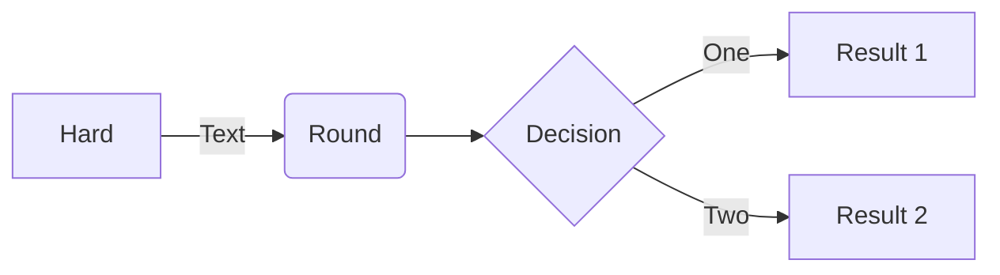

### 时序图


```
sequenceDiagram
Alice->>John: Hello John, how are you?
loop HealthCheck
    John->>John: Fight against hypochondria
end
Note right of John: Rational thoughts!
John-->>Alice: Great!
John->>Bob: How about you?
Bob-->>John: Jolly good!
```

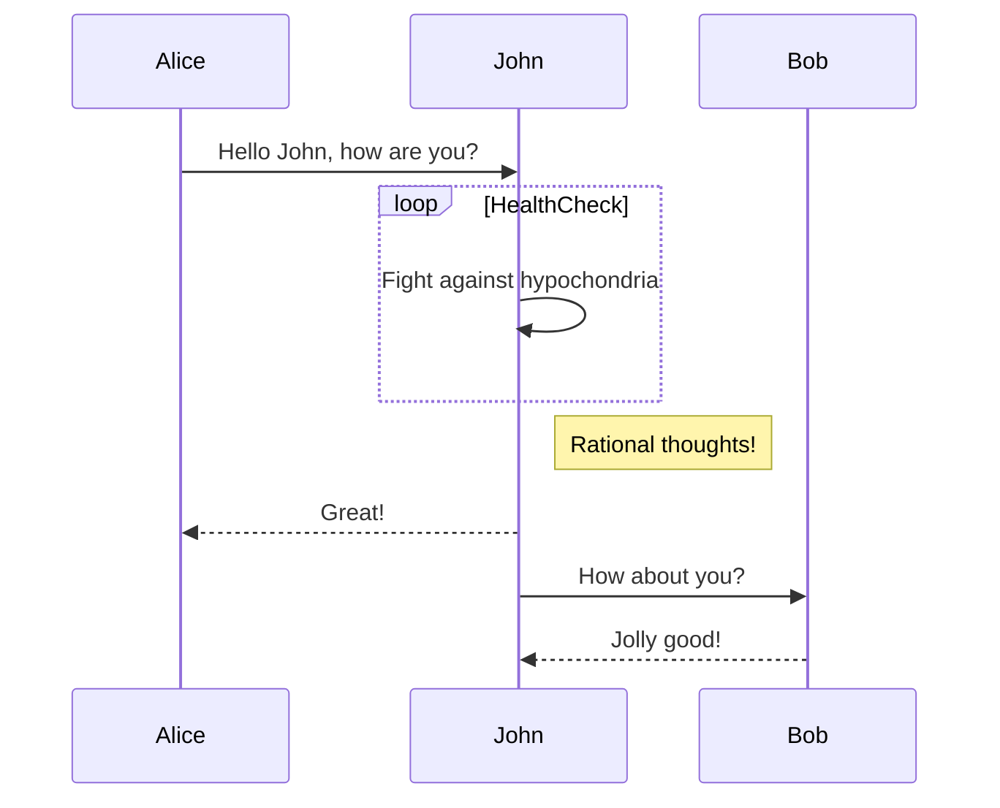

### 甘特图

```
gantt
    section Section
    Completed :done,    des1, 2014-01-06,2014-01-08
    Active        :active,  des2, 2014-01-07, 3d
    Parallel 1   :         des3, after des1, 1d
    Parallel 2   :         des4, after des1, 1d
    Parallel 3   :         des5, after des3, 1d
    Parallel 4   :         des6, after des4, 1d
```

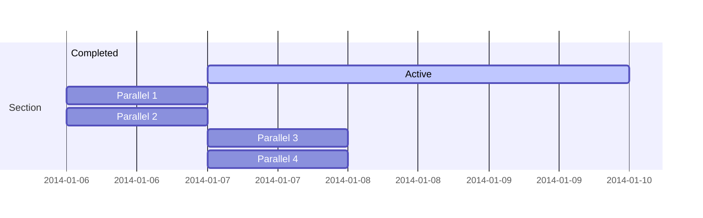

### 类图

```
classDiagram
Class01 <|-- AveryLongClass : Cool
<<Interface>> Class01
Class09 --> C2 : Where am I?
Class09 --* C3
Class09 --|> Class07
Class07 : equals()
Class07 : Object[] elementData
Class01 : size()
Class01 : int chimp
Class01 : int gorilla
class Class10 {
  <<service>>
  int id
  size()
}
```

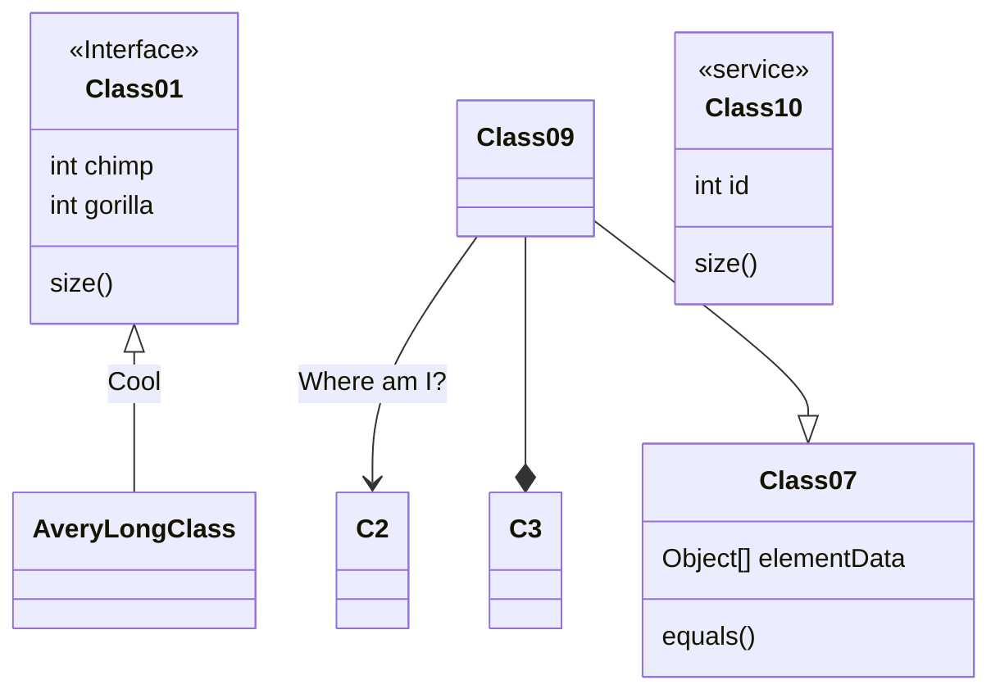

### 状态图


```
stateDiagram-v2
[*] --> Still
Still --> [*]
Still --> Moving
Moving --> Still
Moving --> Crash
Crash --> [*]
```

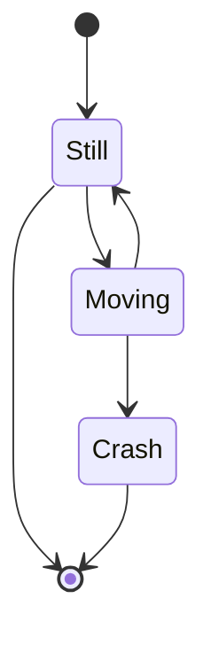

### 饼图 


```
pie
"Dogs" : 386
"Cats" : 85
"Rats" : 15
```

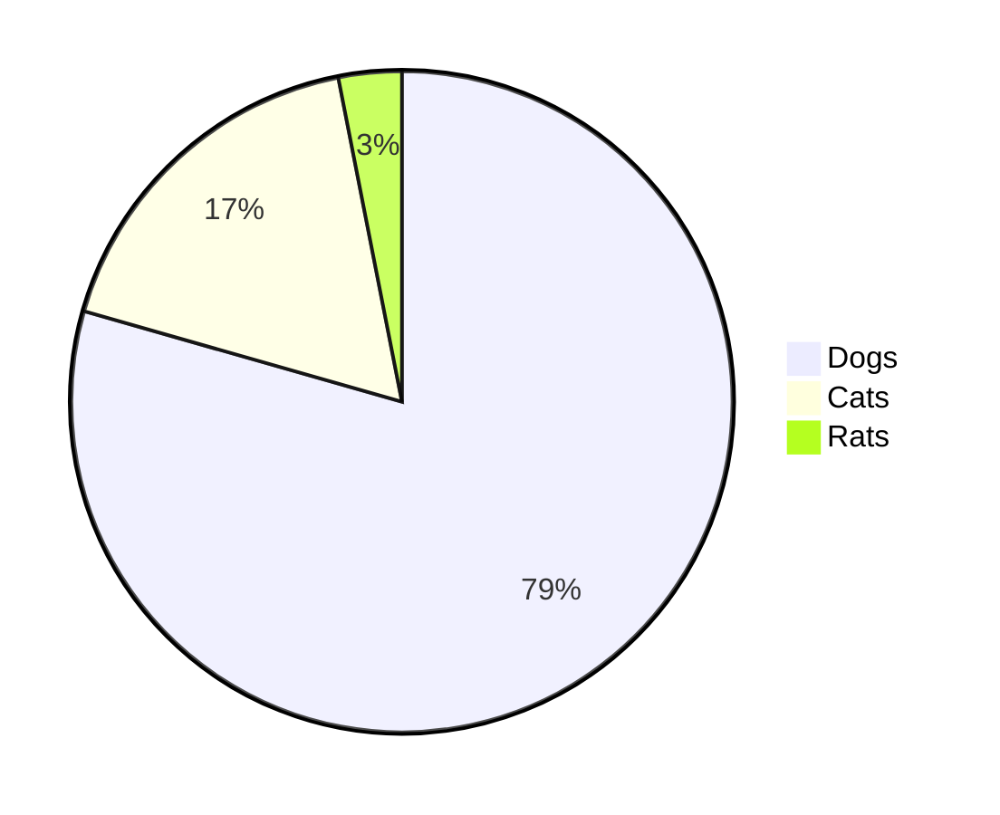

### Git 图


### 用户体验旅程图


```
  journey
    title My working day
    section Go to work
      Make tea: 5: Me
      Go upstairs: 3: Me
      Do work: 1: Me, Cat
    section Go home
      Go downstairs: 5: Me
      Sit down: 3: Me
```

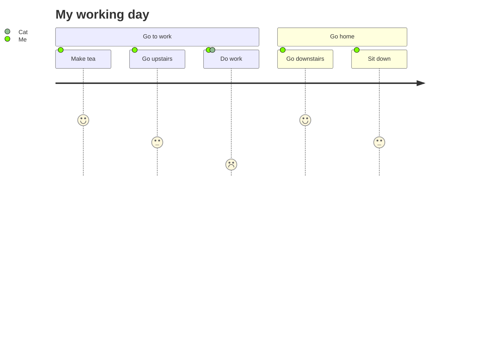

### C4 图

```
C4Context
title System Context diagram for Internet Banking System

Person(customerA, "Banking Customer A", "A customer of the bank, with personal bank accounts.")
Person(customerB, "Banking Customer B")
Person_Ext(customerC, "Banking Customer C")
System(SystemAA, "Internet Banking System", "Allows customers to view information about their bank accounts, and make payments.")

Person(customerD, "Banking Customer D", "A customer of the bank, <br/> with personal bank accounts.")

Enterprise_Boundary(b1, "BankBoundary") {

  SystemDb_Ext(SystemE, "Mainframe Banking System", "Stores all of the core banking information about customers, accounts, transactions, etc.")

  System_Boundary(b2, "BankBoundary2") {
    System(SystemA, "Banking System A")
    System(SystemB, "Banking System B", "A system of the bank, with personal bank accounts.")
  }

  System_Ext(SystemC, "E-mail system", "The internal Microsoft Exchange e-mail system.")
  SystemDb(SystemD, "Banking System D Database", "A system of the bank, with personal bank accounts.")

  Boundary(b3, "BankBoundary3", "boundary") {
    SystemQueue(SystemF, "Banking System F Queue", "A system of the bank, with personal bank accounts.")
    SystemQueue_Ext(SystemG, "Banking System G Queue", "A system of the bank, with personal bank accounts.")
  }
}

BiRel(customerA, SystemAA, "Uses")
BiRel(SystemAA, SystemE, "Uses")
Rel(SystemAA, SystemC, "Sends e-mails", "SMTP")
Rel(SystemC, customerA, "Sends e-mails to")
```

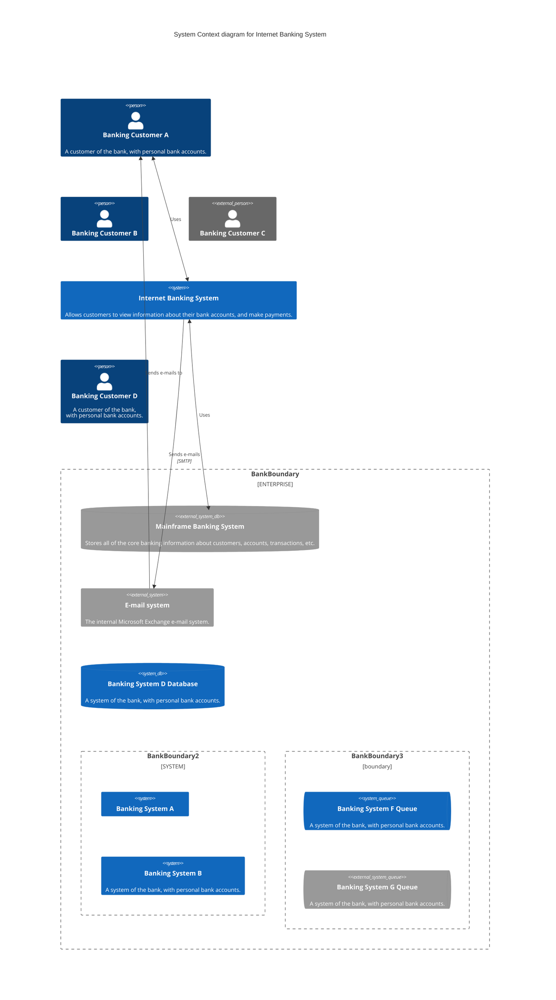

## 发布

对于有权限的同学来说，你可以通过以下步骤来完成发布操作：

更新 `package.json` 中的版本号，然后执行如下命令：

```sh
npm publish
```

以上的命令会将文件打包到 `dist` 目录并发布至 <https://www.npmjs.com>.

## 相关项目

- [Command Line Interface](https://github.com/mermaid-js/mermaid-cli)
- [Live Editor](https://github.com/mermaid-js/mermaid-live-editor)
- [HTTP Server](https://github.com/TomWright/mermaid-server)

## 贡献者 

Mermaid 是一个不断发展中的社区，并且还在接收新的贡献者。

有很多不同的方式可以参与进来，而且我们还在寻找额外的帮助。如果你想知道如何开始贡献，请查看 [这个 issue](https://github.com/mermaid-js/mermaid/issues/866)。

关于如何贡献的详细信息可以在 [贡献指南](https://mermaid.js.org/community/contributing.html) 中找到。

## 安全

对于公开网站来说，从互联网上的用户处检索文本、存储供后续在浏览器中展示的内容可能是不安全的，理由是用户的内容可能嵌入一些数据加载完成之后就会运行的恶意脚本，这些对于 Mermaid 来说毫无疑问是一个风险，尤其是 mermaid 图表还包含了许多在 html 中使用的字符，这意味着我们难以使用常规的手段来过滤不安全代码，因为这些常规手段会造成图表损坏。我们仍然在努力对获取到的代码进行安全过滤并不断完善我们的程序，但很难保证没有漏洞。

作为拥有外部用户的网站的额外安全级别，我们很高兴推出一个新的安全级别，其中的图表在沙盒 iframe 中渲染，防止代码中的 javascript 被执行，这是在安全性方面迈出的一大步。

_很不幸的是，鱼与熊掌不可兼得，在这个场景下它意味着在可能的恶意代码被阻止时，也会损失部分交互能力_。

## 报告漏洞

如果想要报告漏洞，请发送邮件到 security@mermaid.live, 并附上问题的描述、复现问题的步骤、受影响的版本，以及解决问题的方案（如果有的话）。

## 鸣谢

来自 Knut Sveidqvist:

> _特别感谢 [d3](https://d3js.org/) 和 [dagre-d3](https://github.com/cpettitt/dagre-d3) 这两个优秀的项目，它们提供了图形布局和绘图工具库！_ > _同样感谢 [js-sequence-diagram](https://bramp.github.io/js-sequence-diagrams) 提供了时序图语法的使用。 感谢 Jessica Peter 提供了甘特图渲染的灵感。_ > _感谢 [Tyler Long](https://github.com/tylerlong) 从 2017 年四月开始成为了项目的合作者。_
>
> _感谢越来越多的 [贡献者们](https://github.com/mermaid-js/mermaid/graphs/contributors)，没有你们，就没有这个项目的今天！_

---

_Mermaid 是由 Knut Sveidqvist 创建，它为了更简单的文档编写而生。_


# chat

## HTML 使用的例子

以下是在HTML中实现Mermaid图表渲染的完整解决方案，包含CDN引用、初始化配置和实时预览功能：

### 一、基础实现方案（自动渲染模式）

```html
<!DOCTYPE html>
<html>
<head>
    <!-- 引入Mermaid核心库（最新稳定版） -->
    <script src="https://cdn.jsdelivr.net/npm/mermaid@10.8.0/dist/mermaid.min.js"></script>
</head>
<body>
    <!-- Mermaid代码容器 -->
    <div class="mermaid">
        flowchart LR
        A[开始] --> B{条件判断}
        B -->|是| C[执行操作]
        B -->|否| D((结束))
    </div>

    <!-- 初始化脚本 -->
    <script>
        // 基础初始化配置 
        mermaid.initialize({
            startOnLoad: true,        // 页面加载自动渲染
            theme: 'default',         // 主题（可选dark/forest）
            flowchart: {
                htmlLabels: false,    // 禁用HTML标签解析
                curve: 'linear'       // 连接线样式
            },
            securityLevel: 'loose'    // 安全模式（允许外部资源）
        });
    </script>
</body>
</html>
```


### 二、进阶实现方案（手动控制渲染）
```html
<!DOCTYPE html>
<html>
<body>
    <!-- 动态内容容器 -->
    <div id="diagramContainer"></div>

    <!-- 引入Mermaid库 -->
    <script src="https://unpkg.com/mermaid@10.8.0/dist/mermaid.min.js"></script>
    
    <!-- 控制逻辑 -->
    <script>
        // 初始化配置 
        const config = {
            logLevel: 'warn',         // 日志级别
            gantt: {
                axisFormat: '%Y-%m-%d'// 甘特图日期格式
            }
        };
        mermaid.initialize(config);

        // 手动渲染函数
        function renderDiagram(code) {
            mermaid.parse(code); // 语法校验
            mermaid.render(
                'mermaidChart', 
                code,
                (svgCode) => {
                    document.getElementById('diagramContainer').innerHTML = svgCode;
                }
            );
        }

        // 示例调用
        const mermaidCode = `sequenceDiagram
            用户->>服务器: GET /api/data
            服务器-->>数据库: Query
            数据库-->>服务器: ResultSet
            服务器-->>用户: 200 OK`;
        renderDiagram(mermaidCode);
    </script>
</body>
</html>
```


---
### 三、实时编辑器实现方案
```html
<!DOCTYPE html>
<html>
<head>
    <script src="https://cdnjs.cloudflare.com/ajax/libs/mermaid/10.8.0/mermaid.min.js"></script>
    <style>
        #editor { width:45%; height:300px; float:left; }
        #preview { width:45%; border:1px solid #ccc; float:right; }
    </style>
</head>
<body>
    <textarea id="editor" placeholder="输入Mermaid代码...">
graph TD
A[客户端] -->|请求| B(服务器)
B -->|响应| A
    </textarea>
    <div id="preview"></div>

    <script>
        // 初始化渲染引擎 
        mermaid.initialize({ 
            securityLevel: 'loose',
            themeCSS: '.node rect { fill: #e1f5fe; }' // 自定义样式
        });

        // 实时渲染逻辑
        document.getElementById('editor').addEventListener('input', function() {
            try {
                mermaid.parse(this.value);
                mermaid.render('dynamicDiagram', this.value, svg => {
                    document.getElementById('preview').innerHTML = svg;
                });
            } catch(err) {
                document.getElementById('preview').innerHTML = 
                    `<div style="color:red">语法错误: ${err}</div>`;
            }
        }).dispatchEvent(new Event('input')); // 初始渲染
    </script>
</body>
</html>
```


---
### 四、关键配置参数说明

| 参数 | 类型 | 说明 | 默认值 | 参考来源 |
|------|------|------|--------|----------|
| `startOnLoad` | Boolean | 自动检测.mermaid类元素 | true |  |
| `theme` | String | 主题样式(default/dark/forest) | default |  |
| `fontFamily` | String | 全局字体设置 | '"trebuchet ms", verdana, arial' |  |
| `logLevel` | String | 控制台日志级别(debug/info/warn/error) | warn |  |
| `securityLevel` | String | 安全策略(strict/loose) | strict |  |
| `flowchart` | Object | 流程图布局配置(curve/width) | { curve: 'linear' } |  |


---
### 五、最佳实践建议
1. **版本锁定**：生产环境应指定确切版本（如`mermaid@10.8.0`），避免CDN更新导致兼容性问题 
2. **错误处理**：通过`try-catch`包裹渲染逻辑，防止脚本中断 
3. **性能优化**：
   ```javascript
   // 使用防抖函数控制实时渲染频率
   const debounceRender = _.debounce(render, 500);
   editor.addEventListener('input', debounceRender);
   ```

4. **主题扩展**：通过CSS定制样式（需设置`securityLevel: 'loose'）
   ```css
   .mermaid .label { font-family: "Consolas"; }
   .mermaid .edge-thickness-normal { stroke-width: 2px; }
   ```


---
### 六、跨平台集成方案
1. **Markdown混合使用**：
   ```html
   <div class="mermaid">
   ```
mermaid
   gantt
title 项目计划
section 阶段A
需求分析 :a1, 2025-03-20, 5d
系统设计 :after a1, 3d
   ```
   </div>
   ```


2. **框架集成示例（Vue）**：
   ```javascript
   // 组件化封装
   Vue.component('mermaid-diagram', {
       props: ['code'],
       template: `<div class="mermaid"></div>`,
       mounted() {
           mermaid.init({}, this.$el).then(() => 
               this.$el.innerHTML = this.code
           );
       }
   })
   ```


以上方案覆盖了从基础到高级的多种实现场景，开发者可根据具体需求选择合适的集成方式。

建议优先使用官方CDN服务，并通过初始化参数微调渲染效果。


## 基本介绍

以下是对Mermaid流程图的详细介绍，涵盖其定义、语法、图表类型、优势及实际应用场景等内容：

---

### 一、Mermaid的定义与核心特性

Mermaid是一款基于JavaScript的开源图表生成工具，允许用户通过类似Markdown的文本语法快速创建多种类型的图表，包括流程图、时序图、甘特图等。

其核心理念是“以代码生成图表”，使得图表的创建、修改和版本控制更加高效。

**核心特性**：
1. **文本驱动**：无需拖拽操作，直接通过纯文本定义图表结构和逻辑。
2. **多图表支持**：涵盖流程图、时序图、甘特图、类图等十余种类型。
3. **跨平台兼容**：可集成到Markdown文档、技术博客、项目管理工具（如GitHub、GitLab）中。
4. **动态渲染**：支持实时预览和自动布局，修改代码后图表即时更新。

---

### 二、Mermaid流程图的基本语法
Mermaid的语法简洁直观，以声明式代码描述图表元素和关系。以下是流程图的核心语法结构：

#### 1. **图表方向声明**
```mermaid
flowchart LR  // 从左到右（Left to Right）
A --> B
```

支持方向：
- `TD`/`TB`：从上到下（默认）
- `LR`：从左到右
- `RL`：从右到左
- `BT`：从下到上。

#### 2. **节点定义与形状**
- **方形节点**：`A[文本]`
- **圆角节点**：`B(文本)`
- **菱形节点**：`C{文本}`
- **圆形节点**：`D((文本))`
- **子图**：`subgraph 标题 ... end`。

#### 3. **连接线与箭头**
- 实线箭头：`A --> B`
- 虚线箭头：`A -.-> B`
- 粗线箭头：`A ==> B`
- 文本标签：`A -- 描述 --> B`。

**示例代码**：
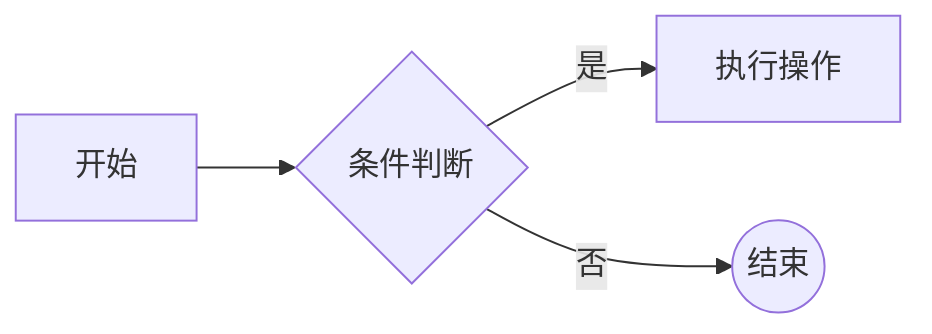


---

### 三、Mermaid支持的图表类型
除基础流程图外，Mermaid还支持以下常见图表类型：

#### 1. **时序图（Sequence Diagram）**
描述系统组件间的交互顺序：
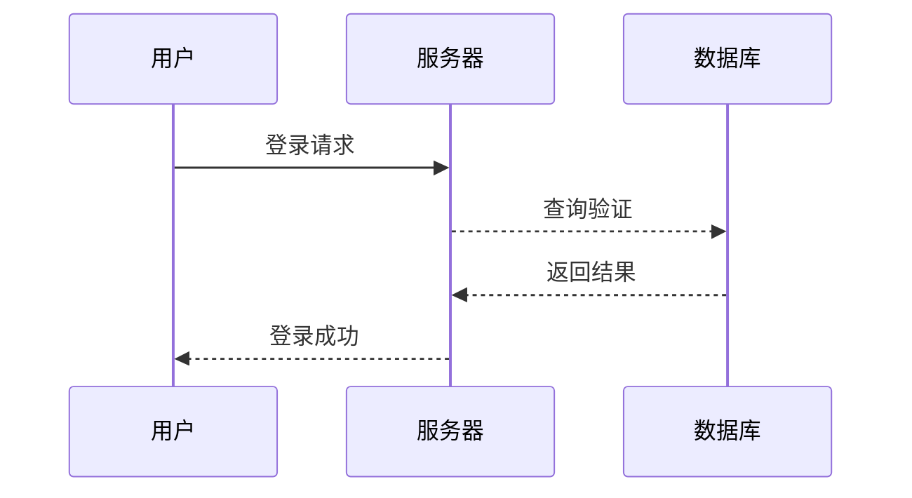

- **箭头类型**：实线（`->>`）、虚线（`-->>`）、异步箭头（`-）`）。

#### 2. **甘特图（Gantt Chart）**
用于项目管理，展示任务时间轴：
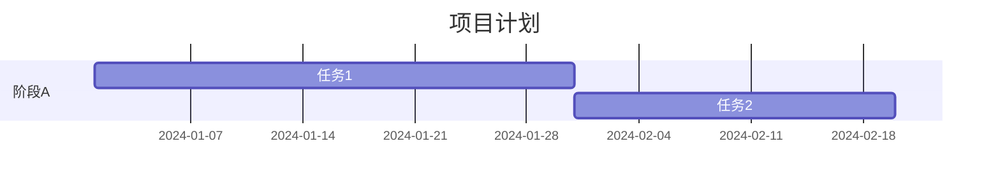

- 支持排除非工作日、任务依赖关系。

#### 3. **类图（Class Diagram）**
面向对象设计中的类结构：
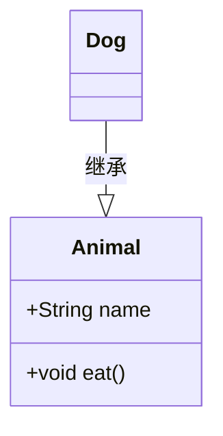

- 支持类属性、方法、继承和关联关系。

#### 4. **状态图（State Diagram）**
描述对象状态转换：
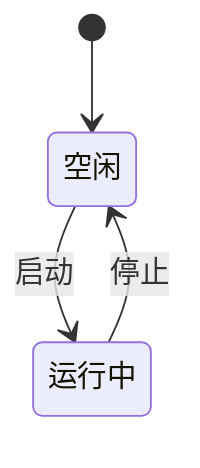

- 支持嵌套状态和并行分支。

---

### 四、Mermaid与传统流程图工具的区别

| **对比维度**       | **Mermaid**                                | **传统工具（如Visio、Draw.io）**       |
|---------------------|--------------------------------------------|----------------------------------------|
| **编辑方式**        | 文本代码驱动，适合开发者                   | 图形化拖拽，适合非技术人员             |
| **协作与版本控制**  | 代码可纳入Git管理，修改历史清晰            | 二进制文件难以追踪变更                 |
| **集成能力**        | 原生支持Markdown、GitHub、VS Code等        | 依赖导出图片或插件                     |
| **动态更新**        | 修改代码后图表实时渲染                     | 需手动调整布局                         |
| **学习成本**        | 低（类似Markdown语法）                     | 较高（需熟悉界面操作）                 |


---

### 五、Mermaid的应用场景

#### 1. **技术文档**
- 在API文档中嵌入时序图，直观展示调用流程。
- 在代码注释中使用流程图解释复杂逻辑。

#### 2. **项目管理**
- 用甘特图规划任务时间线，同步更新进度。
- 用流程图梳理业务流程，便于团队对齐。

#### 3. **教育与研究**
- 绘制类图讲解软件架构，或状态图模拟算法流程。
- 在学术论文中插入专业图表，提升可读性。

#### 4. **自动化工具链**
- 结合CI/CD生成动态图表，如测试覆盖率报告。
- 通过Mermaid CLI批量转换图表为PNG/SVG。

---

### 六、常用编辑器和集成工具

#### 1. **在线编辑器**
- **Mermaid Live Editor**：官方工具，支持实时预览和导出。
- **Kroki**：开源服务，支持Mermaid语法渲染为图片。

#### 2. **开发环境集成**
- **VS Code**：通过插件（如Markdown Preview Enhanced）直接渲染。
- **Typora**：Markdown编辑器内置Mermaid支持。

#### 3. **协作平台**
- **GitHub/GitLab**：原生支持在Markdown中嵌入Mermaid代码。
- **Confluence**：通过插件集成，便于团队文档协作。

---

### 七、可视化效果示例
Mermaid生成的图表默认采用简洁的矢量图形（SVG），可通过主题配置调整样式：
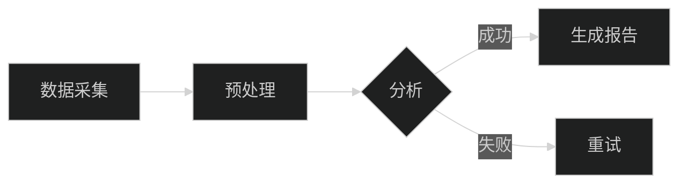

- **主题选项**：`default`、`forest`、`dark`等。

---

### 总结

Mermaid以其文本驱动、高度集成和多样化的图表支持，成为开发者和技术写作者的首选工具。

无论是简化文档维护、提升团队协作效率，还是实现自动化图表生成，Mermaid均展现出显著优势。

随着AI辅助代码生成的发展（如自动生成Mermaid脚本），其应用场景将进一步扩展。


* any list
{:toc}