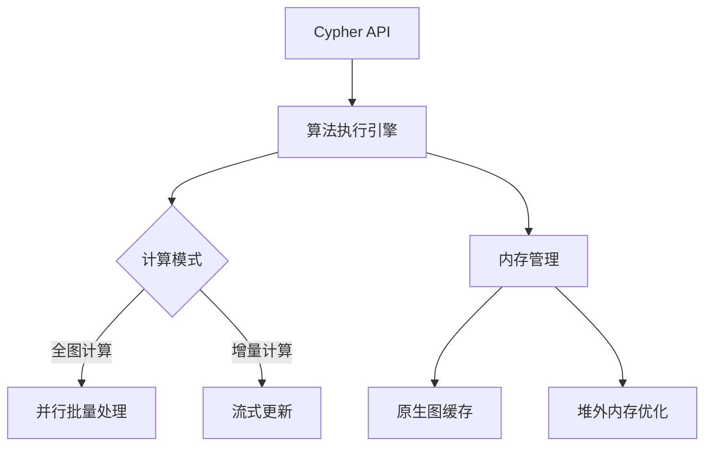

# neo4j apoc 系列

[Neo4j APOC-01-图数据库 apoc 插件介绍](https://houbb.github.io/2018/01/08/neo4j-plugins-apoc-01-intro)

[Neo4j APOC-01-图数据库 apoc 插件安装 neo4j on windows10](https://houbb.github.io/2018/01/08/neo4j-plugins-apoc-02-windows10-install-plugins)

[Neo4j APOC-03-图数据库 apoc 实战使用使用](https://houbb.github.io/2018/01/08/neo4j-plugins-apoc-03-basic-usage)

[Neo4j APOC-04-图数据库 apoc 实战使用使用 apoc.path.spanningTree 最小生成树](https://houbb.github.io/2018/01/08/neo4j-plugins-apoc-04-minist-tree)

[Neo4j APOC-05-图数据库 apoc 实战使用使用 labelFilter](https://houbb.github.io/2018/01/08/neo4j-plugins-apoc-05-label-filter)

[Neo4j GDS-01-graph-data-science 图数据科学插件库概览](https://houbb.github.io/2018/01/08/neo4j-plugins-gds-01-overview)

[Neo4j GDS-02-graph-data-science 插件库安装实战笔记](https://houbb.github.io/2018/01/08/neo4j-plugins-gds-02-install-inaction)

[Neo4j GDS-03-graph-data-science 简单聊一聊图数据科学插件库](https://houbb.github.io/2018/01/08/neo4j-plugins-gds-03-intro-chat)

[Neo4j GDS-04-图的中心性分析介绍](https://houbb.github.io/2018/01/08/neo4j-plugins-gds-04-chat-middle-analysis-intro)

[Neo4j GDS-05-neo4j中的中心性分析算法](https://houbb.github.io/2018/01/08/neo4j-plugins-gds-04-chat-middle-analysis-impl)

## 详细介绍一下 neo4j GDS 插件库

Neo4j 图数据科学（Graph Data Science, GDS） 是专为图分析设计的行业领先工具库，提供丰富的算法、机器学习能力与高性能计算框架。

以下从核心功能、技术架构、应用场景到实践指南全方位解析这一工具。

---

## 一、核心功能模块

### 1. 图算法库
覆盖 6大类60+种算法，支持从基础分析到复杂模型计算：

| 算法类型       | 代表算法                     | 应用场景                     |
|-------------------|----------------------------------|----------------------------------|
| 中心性分析         | PageRank, Betweenness           | 影响力节点识别、关键枢纽发现      |
| 社区检测           | Louvain, Label Propagation      | 社交网络群体划分、用户分群        |
| 路径搜索           | Dijkstra, A*                    | 最短路径规划、物流优化            |
| 相似度计算         | Jaccard, Cosine                 | 推荐系统、相似用户匹配            |
| 节点嵌入           | FastRP, GraphSAGE               | 特征工程、深度学习输入预处理      |
| 链接预测           | Adamic-Adar, Common Neighbors   | 关系预测、社交网络好友推荐        |

### 2. 机器学习管道
端到端图机器学习工作流：
```cypher
CALL gds.beta.pipeline.linkPrediction.create('fraud-pipeline')
YIELD pipelineName, pipelineType

// 添加特征工程步骤
CALL gds.beta.pipeline.linkPrediction.addNodeProperty(
  'fraud-pipeline', 
  'fastRP', 
  {embeddingDimension: 256}
)

// 配置模型训练参数
CALL gds.beta.pipeline.linkPrediction.addLogisticRegression(
  'fraud-pipeline', 
  {penalty: 0.1}
)

// 执行训练
CALL gds.beta.pipeline.linkPrediction.train(
  'fraud-graph',
  { pipeline: 'fraud-pipeline',... }
)
```

### 3. 图转换工具
- 投影优化：将原生图转换为内存优化格式，提升计算效率
- 子图抽取：基于属性/拓扑条件快速生成分析子图
- 特征标准化：Z-Score、Min-Max等标准化方法

---

## 二、技术架构解析

### 1. 分层架构设计



### 2. 性能优化技术
- 并行计算：利用多核CPU实现算法并行化（如Louvain并行版本提速5-8倍）
- 内存映射：通过`OFF_HEAP`模式处理十亿级节点图
- 近似算法：提供`epsilon`参数平衡精度与速度（如Approximate Betweenness）

### 3. 部署模式对比

| 模式       | 适用场景                     | 资源需求       |
|----------------|----------------------------|---------------|
| 单机模式        | 中小规模图（<1亿节点）       | 64GB+ RAM     |
| 分布式模式      | 超大规模图/实时分析          | Kubernetes集群|
| Neo4j AuraDS   | 全托管云服务                | 按需扩展       |

---

## 三、典型应用场景

### 1. 金融反欺诈
```cypher
// 构建资金流转图
CALL gds.graph.project(
  'money-flow',
  ['Account'],
  {TRANSFER: {orientation: 'NATURAL'}},
  {nodeProperties: ['riskScore'], relationshipProperties: ['amount']}
)

// 运行异构图算法检测异常模式
CALL gds.alpha.ml.linkPrediction.predict('money-flow', {
  modelName: 'fraud-model',
  relationshipTypes: ['TRANSFER'],
  topN: 100
})
```

技术亮点：
- 动态时序图分析
- 复合特征工程（拓扑+属性）
- 实时预测API

### 2. 智能推荐系统
```python
from graphdatascience import GraphDataScience

gds = GraphDataScience("bolt://localhost:7687", auth=("neo4j", "password"))

# 构建用户-商品二部图
gds.run_cypher("""
CALL gds.graph.project(
  'recommendation', 
  ['User', 'Product'], 
  {PURCHASED: {properties: ['weight']}}
)
""")

# 执行Personalized PageRank
result = gds.pageRank.stream(
  'recommendation',
  relationshipWeightProperty: 'weight',
  dampingFactor: 0.85
)

top_products = result.sort_values('score', ascending=False).head(10)
```

优势：
- 结合协同过滤与图拓扑特征
- 实时更新推荐结果
- 可解释性强

---

## 四、开发实践指南

### 1. 性能调优技巧
- 内存配置：
  ```properties
  # neo4j.conf
  dbms.memory.heap.initial_size=8G
  dbms.memory.heap.max_size=16G
  dbms.memory.pagecache.size=4G
  ```
  
- 投影优化：
  ```cypher
  CALL gds.graph.project(
    'optimized-graph',
    nodeQuery: 'MATCH (n) WHERE n.community = $community RETURN id(n) AS id',
    relationshipQuery: 'MATCH (a)-[r:INTERACTS]->(b) WHERE r.weight > $threshold RETURN id(a) AS source, id(b) AS target, r.weight AS weight',
    parameters: {community: 5, threshold: 0.7}
  )
  ```

### 2. 机器学习工作流
典型Pipeline：
1. 特征工程：节点嵌入+属性标准化
2. 数据分割：时间窗口划分（训练集/测试集）
3. 模型训练：XGBoost + 图神经网络
4. 模型部署：导出PMML或ONNX格式
5. 实时预测：通过Cypher API调用

### 3. 监控与调试
```cypher
// 查看内存使用
CALL gds.debug.systemMonitor()

// 算法执行分析
CALL gds.alpha.debug.procedure('gds.pageRank', 'stats')
YIELD name, time, rows
```

---

## 五、生态整合

### 1. 与AI框架集成
- PyTorch Geometric：直接加载GDS生成的图数据
- TensorFlow：通过Neo4j Connector导入嵌入向量
- Apache Spark：联合处理大规模属性数据

### 2. 可视化工具链
- Neo4j Bloom：交互式图探索
- Jupyter Notebook：`graphdatascience`库支持可视化分析
- Gephi：通过CSV导出实现高级可视化

---

## 六、资源推荐

1. 官方学习路径：
   - [GDS官方文档](https://neo4j.com/docs/graph-data-science/current/)
   - [Cypher for Graph Data Science](https://neo4j.com/online-training/graph-data-science-fundamentals/)

2. 实战案例库：
   - [GitHub示例项目](https://github.com/neo4j/graph-data-science-client/tree/main/examples)
   - [Kaggle金融风控数据集](https://www.kaggle.com/competitions/ieee-fraud-detection)

3. 性能白皮书：
   - [十亿级节点图处理方案](https://neo4j.com/whitepapers/neo4j-graph-data-science-scale/)
   - [GPU加速图算法研究](https://arxiv.org/abs/2203.09394)

---

通过深度集成图计算与机器学习，Neo4j GDS正在重新定义数据科学工作流。

无论是金融风控、社交网络分析，还是物联网时序数据处理，GDS都展现出独特的价值。

建议开发者结合具体业务场景，从试点项目开始逐步探索图智能的无限可能。


# 参考资料

https://github.com/neo4j/graph-data-science


* any list
{:toc}


