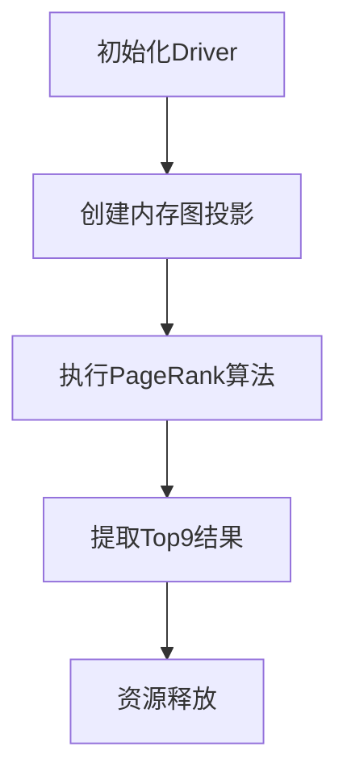

# neo4j apoc 系列

[Neo4j APOC-01-图数据库 apoc 插件介绍](https://houbb.github.io/2018/01/08/neo4j-plugins-apoc-01-intro)

[Neo4j APOC-01-图数据库 apoc 插件安装 neo4j on windows10](https://houbb.github.io/2018/01/08/neo4j-plugins-apoc-02-windows10-install-plugins)

[Neo4j APOC-03-图数据库 apoc 实战使用使用](https://houbb.github.io/2018/01/08/neo4j-plugins-apoc-03-basic-usage)

[Neo4j APOC-04-图数据库 apoc 实战使用使用 apoc.path.spanningTree 最小生成树](https://houbb.github.io/2018/01/08/neo4j-plugins-apoc-04-minist-tree)

[Neo4j APOC-05-图数据库 apoc 实战使用使用 labelFilter](https://houbb.github.io/2018/01/08/neo4j-plugins-apoc-05-label-filter)

[Neo4j GDS-01-graph-data-science 图数据科学插件库概览](https://houbb.github.io/2018/01/08/neo4j-plugins-gds-01-overview)

[Neo4j GDS-02-graph-data-science 插件库安装实战笔记](https://houbb.github.io/2018/01/08/neo4j-plugins-gds-02-install-inaction)

[Neo4j GDS-03-graph-data-science 简单聊一聊图数据科学插件库](https://houbb.github.io/2018/01/08/neo4j-plugins-gds-03-intro-chat)

[Neo4j GDS-04-图的中心性分析介绍](https://houbb.github.io/2018/01/08/neo4j-plugins-gds-04-chat-middle-analysis-intro)

[Neo4j GDS-05-neo4j中的中心性分析算法](https://houbb.github.io/2018/01/08/neo4j-plugins-gds-04-chat-middle-analysis-impl)


# 实际测试

## 数据初始化

i_app 节点，i_app 指向 i_vm，i_phy。

i_app 有 name 属性。

i_vm, i_phy 有 ip 属性。

创建 4 个 i_app 节点，分别指向 4 个 i_vm。2个 i_vm 一组，分别指向 i_phy 节点。

给出 cypher 初始化语句

```
CREATE (phy1:i_phy {ip: '192.168.1.1'}),
       (phy2:i_phy {ip: '192.168.1.2'}),

(vm1:i_vm {ip: '10.0.0.1'})-[:BELONGS_TO]->(phy1),
(vm2:i_vm {ip: '10.0.0.2'})-[:BELONGS_TO]->(phy1),
(vm3:i_vm {ip: '10.0.0.3'})-[:BELONGS_TO]->(phy2),
(vm4:i_vm {ip: '10.0.0.4'})-[:BELONGS_TO]->(phy2),

(app1:i_app {name: 'app1'})-[:POINTS_TO]->(vm1),
(app2:i_app {name: 'app2'})-[:POINTS_TO]->(vm2),
(app3:i_app {name: 'app3'})-[:POINTS_TO]->(vm3),
(app4:i_app {name: 'app4'})-[:POINTS_TO]->(vm4);

```

<svg xmlns="http://www.w3.org/2000/svg" width="645.1494140625" height="430.13616943359375" viewBox="-302.6226501464844 -264.75238037109375 645.1494140625 430.13616943359375"><title>Neo4j Graph Visualization</title><desc>Created using Neo4j (http://www.neo4j.com/)</desc><g class="layer relationships"><g class="relationship" transform="translate(63.732245518226115 130.73424519096707) rotate(301.704120370007)"><path class="b-outline" fill="#A5ABB6" stroke="none" d="M 25 0.5 L 47.709570730751636 0.5 L 47.709570730751636 -0.5 L 25 -0.5 Z M 104.83066448075164 0.5 L 127.54023521150327 0.5 L 127.54023521150327 3.5 L 134.54023521150327 0 L 127.54023521150327 -3.5 L 127.54023521150327 -0.5 L 104.83066448075164 -0.5 Z"/><text text-anchor="middle" pointer-events="none" font-size="8px" fill="#000000" x="76.27011760575164" y="3" font-family="Helvetica Neue, Helvetica, Arial, sans-serif">BELONGS_TO</text></g><g class="relationship" transform="translate(206.75889784282356 136.38376343206613) rotate(247.2856503161011)"><path class="b-outline" fill="#A5ABB6" stroke="none" d="M 25 0.5 L 44.574181328066956 0.5 L 44.574181328066956 -0.5 L 25 -0.5 Z M 101.69527507806696 0.5 L 121.26945640613391 0.5 L 121.26945640613391 3.5 L 128.2694564061339 0 L 121.26945640613391 -3.5 L 121.26945640613391 -0.5 L 101.69527507806696 -0.5 Z"/><text text-anchor="middle" pointer-events="none" font-size="8px" fill="#000000" x="73.13472820306696" y="3" transform="rotate(180 73.13472820306696 0)" font-family="Helvetica Neue, Helvetica, Arial, sans-serif">BELONGS_TO</text></g><g class="relationship" transform="translate(-152.55434594632288 -54.777440070040036) rotate(347.7080006612151)"><path class="b-outline" fill="#A5ABB6" stroke="none" d="M 25 0.5 L 39.76214870308658 0.5 L 39.76214870308658 -0.5 L 25 -0.5 Z M 96.88324245308658 0.5 L 111.64539115617316 0.5 L 111.64539115617316 3.5 L 118.64539115617316 0 L 111.64539115617316 -3.5 L 111.64539115617316 -0.5 L 96.88324245308658 -0.5 Z"/><text text-anchor="middle" pointer-events="none" font-size="8px" fill="#000000" x="68.32269557808658" y="3" font-family="Helvetica Neue, Helvetica, Arial, sans-serif">BELONGS_TO</text></g><g class="relationship" transform="translate(-273.62265237045773 -128.56128177038016) rotate(369.3839349009953)"><path class="b-outline" fill="#A5ABB6" stroke="none" d="M 25 0.5 L 100.4226906291218 0.5 L 100.4226906291218 -0.5 L 25 -0.5 Z M 157.5437843791218 0.5 L 232.9664750082436 0.5 L 232.9664750082436 3.5 L 239.9664750082436 0 L 232.9664750082436 -3.5 L 232.9664750082436 -0.5 L 157.5437843791218 -0.5 Z"/><text text-anchor="middle" pointer-events="none" font-size="8px" fill="#000000" x="128.9832375041218" y="3" font-family="Helvetica Neue, Helvetica, Arial, sans-serif">BELONGS_TO</text></g><g class="relationship" transform="translate(11.126711055774763 -16.122487068094273) rotate(430.29197349747244)"><path class="b-outline" fill="#A5ABB6" stroke="none" d="M 25 0.5 L 49.60851087202265 0.5 L 49.60851087202265 -0.5 L 25 -0.5 Z M 99.38585462202265 0.5 L 123.9943654940453 0.5 L 123.9943654940453 3.5 L 130.9943654940453 0 L 123.9943654940453 -3.5 L 123.9943654940453 -0.5 L 99.38585462202265 -0.5 Z"/><text text-anchor="middle" pointer-events="none" font-size="8px" fill="#000000" x="74.49718274702265" y="3" font-family="Helvetica Neue, Helvetica, Arial, sans-serif">POINTS_TO</text></g><g class="relationship" transform="translate(313.52674738758526 41.298459261290624) rotate(498.3123815404472)"><path class="b-outline" fill="#A5ABB6" stroke="none" d="M 25 0.5 L 43.09662165741436 0.5 L 43.09662165741436 -0.5 L 25 -0.5 Z M 92.87396540741436 0.5 L 110.97058706482872 0.5 L 110.97058706482872 3.5 L 117.97058706482872 0 L 110.97058706482872 -3.5 L 110.97058706482872 -0.5 L 92.87396540741436 -0.5 Z"/><text text-anchor="middle" pointer-events="none" font-size="8px" fill="#000000" x="67.98529353241436" y="3" transform="rotate(180 67.98529353241436 0)" font-family="Helvetica Neue, Helvetica, Arial, sans-serif">POINTS_TO</text></g><g class="relationship" transform="translate(-191.18744345449625 74.43980113888867) rotate(286.6455017328207)"><path class="b-outline" fill="#A5ABB6" stroke="none" d="M 25 0.5 L 39.04576229761409 0.5 L 39.04576229761409 -0.5 L 25 -0.5 Z M 88.82310604761409 0.5 L 102.86886834522818 0.5 L 102.86886834522818 3.5 L 109.86886834522818 0 L 102.86886834522818 -3.5 L 102.86886834522818 -0.5 L 88.82310604761409 -0.5 Z"/><text text-anchor="middle" pointer-events="none" font-size="8px" fill="#000000" x="63.93443417261409" y="3" font-family="Helvetica Neue, Helvetica, Arial, sans-serif">POINTS_TO</text></g><g class="relationship" transform="translate(-174.50487778276963 -235.75238620193252) rotate(492.75903087377344)"><path class="b-outline" fill="#A5ABB6" stroke="none" d="M 25 0.5 L 44.60835907227846 0.5 L 44.60835907227846 -0.5 L 25 -0.5 Z M 94.38570282227846 0.5 L 113.99406189455692 0.5 L 113.99406189455692 3.5 L 120.99406189455692 0 L 113.99406189455692 -3.5 L 113.99406189455692 -0.5 L 94.38570282227846 -0.5 Z"/><text text-anchor="middle" pointer-events="none" font-size="8px" fill="#000000" x="69.49703094727846" y="3" transform="rotate(180 69.49703094727846 0)" font-family="Helvetica Neue, Helvetica, Arial, sans-serif">POINTS_TO</text></g></g><g class="layer nodes"><g class="node" aria-label="graph-node0" transform="translate(147.57587761961588,-4.99833014520118)"><circle class="b-outline" cx="0" cy="0" r="25" fill="#C990C0" stroke="#b261a5" stroke-width="2px"/><text class="caption" text-anchor="middle" pointer-events="none" x="0" y="5" font-size="10px" fill="#FFFFFF" font-family="Helvetica Neue, Helvetica, Arial, sans-serif"> 192.168.…</text></g><g class="node" aria-label="graph-node1" transform="translate(-12.201980561994873,-85.35867502604003)"><circle class="b-outline" cx="0" cy="0" r="25" fill="#C990C0" stroke="#b261a5" stroke-width="2px"/><text class="caption" text-anchor="middle" pointer-events="none" x="0" y="5" font-size="10px" fill="#FFFFFF" font-family="Helvetica Neue, Helvetica, Arial, sans-serif"> 192.168.…</text></g><g class="node" aria-label="graph-node2" transform="translate(63.732245518226115,130.73424519096707)"><circle class="b-outline" cx="0" cy="0" r="25" fill="#F79767" stroke="#f36924" stroke-width="2px"/><text class="caption" text-anchor="middle" pointer-events="none" x="0" y="5" font-size="10px" fill="#FFFFFF" font-family="Helvetica Neue, Helvetica, Arial, sans-serif"> 10.0.0.1</text></g><g class="node" aria-label="graph-node3" transform="translate(206.75889784282356,136.38376343206613)"><circle class="b-outline" cx="0" cy="0" r="25" fill="#F79767" stroke="#f36924" stroke-width="2px"/><text class="caption" text-anchor="middle" pointer-events="none" x="0" y="5" font-size="10px" fill="#FFFFFF" font-family="Helvetica Neue, Helvetica, Arial, sans-serif"> 10.0.0.2</text></g><g class="node" aria-label="graph-node4" transform="translate(-152.55434594632288,-54.777440070040036)"><circle class="b-outline" cx="0" cy="0" r="25" fill="#F79767" stroke="#f36924" stroke-width="2px"/><text class="caption" text-anchor="middle" pointer-events="none" x="0" y="5" font-size="10px" fill="#FFFFFF" font-family="Helvetica Neue, Helvetica, Arial, sans-serif"> 10.0.0.3</text></g><g class="node" aria-label="graph-node5" transform="translate(-273.62265237045773,-128.56128177038016)"><circle class="b-outline" cx="0" cy="0" r="25" fill="#F79767" stroke="#f36924" stroke-width="2px"/><text class="caption" text-anchor="middle" pointer-events="none" x="0" y="5" font-size="10px" fill="#FFFFFF" font-family="Helvetica Neue, Helvetica, Arial, sans-serif"> 10.0.0.4</text></g><g class="node" aria-label="graph-node6" transform="translate(11.126711055774763,-16.122487068094273)"><circle class="b-outline" cx="0" cy="0" r="25" fill="#57C7E3" stroke="#23b3d7" stroke-width="2px"/><text class="caption" text-anchor="middle" pointer-events="none" x="0" y="5" font-size="10px" fill="#2A2C34" font-family="Helvetica Neue, Helvetica, Arial, sans-serif"> app1</text></g><g class="node" aria-label="graph-node7" transform="translate(313.52674738758526,41.298459261290624)"><circle class="b-outline" cx="0" cy="0" r="25" fill="#57C7E3" stroke="#23b3d7" stroke-width="2px"/><text class="caption" text-anchor="middle" pointer-events="none" x="0" y="5" font-size="10px" fill="#2A2C34" font-family="Helvetica Neue, Helvetica, Arial, sans-serif"> app2</text></g><g class="node" aria-label="graph-node8" transform="translate(-191.18744345449625,74.43980113888867)"><circle class="b-outline" cx="0" cy="0" r="25" fill="#57C7E3" stroke="#23b3d7" stroke-width="2px"/><text class="caption" text-anchor="middle" pointer-events="none" x="0" y="5" font-size="10px" fill="#2A2C34" font-family="Helvetica Neue, Helvetica, Arial, sans-serif"> app3</text></g><g class="node" aria-label="graph-node9" transform="translate(-174.50487778276963,-235.75238620193252)"><circle class="b-outline" cx="0" cy="0" r="25" fill="#57C7E3" stroke="#23b3d7" stroke-width="2px"/><text class="caption" text-anchor="middle" pointer-events="none" x="0" y="5" font-size="10px" fill="#2A2C34" font-family="Helvetica Neue, Helvetica, Arial, sans-serif"> app4</text></g></g></svg>

## 目标

希望达到的效果：

```
neo4j 中。如何实现一个从 i_app 节点，且 i_app 的 AppName 属性 在指定的列表中，比如 ['app1']，从 i_app 作为 start，i_vm 或者 i_phy 作为终止节点，最大2层。

任意关系。对应的图投影语句怎么写？我最终的目的是创建投影之后，通过 pageRank 找到关联节点比较多的元素返回。

所以你帮我拆分为3步：

1. apoc 找到符合条件的节点+关系 

2. gds 创建图投影

3. gds pageRank 找到score 比较高的元素 Top9 返回。 

先给我拆分具体的每一步的 cypher 语句
```


## 实现语句


// 步骤1：动态生成子图路径
MATCH (s:i_app { AppName: 'my-web' })
CALL apoc.path.expandConfig(s, {
    relationshipFilter: '>',      // 允许所有出边
    labelFilter: '/i_vm|i_phy',  // 终止节点标签过滤
    minLevel: 1,
    maxLevel: 2,
    bfs: false                   // 允许非BFS模式
}) YIELD path
WITH COLLECT(path) AS allPaths


```cypher
// 直接生成匿名图用于算法
MATCH (s:i_app { AppName: 'app1' })
CALL apoc.path.subgraphNodes(s, {
    relationshipFilter: '>',
    labelFilter: '>i_vm|i_phy',  // 正向过滤终止标签
    maxLevel: 2
}) YIELD node
WITH COLLECT(node) AS nodes
CALL apoc.algo.cover(nodes) YIELD rel
CALL gds.pageRank.stream({
    nodeProjection: nodes,
    relationshipProjection: rel
}) YIELD nodeId, score
RETURN *
```


# chat

## 目标场景

希望达到的效果：

```
如何实现一个从 i_app 节点，且 i_app 的 AppName 属性 在指定的列表中，比如 ['my-web']，从 i_app 作为 start，i_vm 或者 i_phy 作为终止节点，最大2层。任意关系。

对应的图投影语句怎么写？结合 apoc 的方式来实现
```

## 实现


### 分步实现说明

#### 步骤1：使用APOC找到符合条件的节点和关系
通过`apoc.path.expandConfig`动态获取起始节点为`i_app`（AppName在指定列表），终止节点为`i_vm`或`i_phy`，最大深度为2的路径。此步骤直接嵌入到后续的图投影中，无需单独存储中间结果。

```cypher
// 步骤1和步骤2合并：动态获取子图并创建投影
CALL gds.graph.project.cypher(
    'myGraph',
    // 节点查询：收集所有路径中的节点（包括i_app、中间节点、i_vm/i_phy）
    'MATCH (start:i_app) WHERE start.AppName IN $appNames
     CALL apoc.path.expandConfig(start, {
         relationshipFilter: ">",       // 允许所有关系类型和方向
         labelFilter: ">i_vm|i_phy",   // 终止节点必须是i_vm或i_phy
         minLevel: 1,                  // 最小深度1（避免仅包含i_app）
         maxLevel: 2,                  // 最大深度2
         uniqueness: "NODE_GLOBAL"     // 节点全局唯一，避免重复遍历
     }) YIELD path
     UNWIND nodes(path) AS node
     RETURN DISTINCT id(node) AS id, labels(node) AS labels',
    // 关系查询：收集所有路径中的关系
    'MATCH (start:i_app) WHERE start.AppName IN $appNames
     CALL apoc.path.expandConfig(start, {
         relationshipFilter: ">",
         labelFilter: ">i_vm|i_phy",
         minLevel: 1,
         maxLevel: 2,
         uniqueness: "NODE_GLOBAL"
     }) YIELD path
     UNWIND relationships(path) AS rel
     RETURN DISTINCT id(startNode(rel)) AS source, id(endNode(rel)) AS target, type(rel) AS type',
    { parameters: { appNames: ['my-web'] } }  // 指定应用名列表
)
YIELD graphName, nodeCount, relationshipCount;  // 返回投影信息
```


**关键点解析**：
- **路径过滤逻辑**：通过`labelFilter: ">i_vm|i_phy"`确保路径末端节点为目标类型，`minLevel:1`排除仅包含起始节点的情况。
- **性能优化**：`uniqueness: "NODE_GLOBAL"`减少重复遍历。

---

#### 步骤2：创建GDS图投影
使用Cypher投影方式动态构建子图，仅包含步骤1筛选出的节点和关系。此方法无需预先定义标签或关系类型，适合动态场景。

```cypher
// （已合并到步骤1的代码中）
```


**参数说明**：
- **节点投影**：返回所有路径节点的ID及标签。
- **关系投影**：返回所有路径关系的起点、终点及类型。
- **动态性优势**：无需预先知道涉及的标签或关系类型，直接通过路径扩展动态捕获。

---

#### 步骤3：运行PageRank算法并返回Top9结果
对投影后的图执行PageRank算法，按得分降序取前9名节点。

```cypher
// 步骤3：执行PageRank并返回高影响力节点
CALL gds.pageRank.stream('myGraph')
YIELD nodeId, score
RETURN gds.util.asNode(nodeId) AS node, score  // 将节点ID转换为实际节点对象
ORDER BY score DESC
LIMIT 9;
```


**算法配置**：
- **默认参数**：阻尼系数为0.85，迭代次数为20（未显式指定时使用默认值）。
- **结果解释**：PageRank分数反映节点在图中的连接重要性，高分节点通常是关键枢纽。

---

### 完整代码整合
```cypher
// 步骤1+2：动态创建子图投影
CALL gds.graph.project.cypher(
    'myGraph',
    'MATCH (start:i_app) WHERE start.AppName IN $appNames
     CALL apoc.path.expandConfig(start, {
         relationshipFilter: ">",
         labelFilter: ">i_vm|i_phy",
         minLevel: 1,
         maxLevel: 2,
         uniqueness: "NODE_GLOBAL"
     }) YIELD path
     UNWIND nodes(path) AS node
     RETURN DISTINCT id(node) AS id, labels(node) AS labels',
    'MATCH (start:i_app) WHERE start.AppName IN $appNames
     CALL apoc.path.expandConfig(start, {
         relationshipFilter: ">",
         labelFilter: ">i_vm|i_phy",
         minLevel: 1,
         maxLevel: 2,
         uniqueness: "NODE_GLOBAL"
     }) YIELD path
     UNWIND relationships(path) AS rel
     RETURN DISTINCT id(startNode(rel)) AS source, id(endNode(rel)) AS target, type(rel) AS type',
    { parameters: { appNames: ['app1'] } }
)
YIELD graphName, nodeCount, relationshipCount;

// 步骤3：PageRank计算
CALL gds.pageRank.stream('myGraph')
YIELD nodeId, score
RETURN gds.util.asNode(nodeId) AS node, score
ORDER BY score DESC
LIMIT 9;
```


### 常见问题及优化建议
1. **性能问题**：
   - **路径深度限制**：最大深度设为2层，避免大规模图遍历。
   - **索引优化**：为`i_app`节点的`AppName`属性创建索引，加速起始节点查询。
     ```cypher
     CREATE INDEX FOR (n:i_app) ON (n.AppName);
     ```


2. **结果准确性**：
   - **终止节点验证**：通过`labelFilter`确保终止节点类型正确，避免无关节点混入。
   - **权重调整**：若需考虑关系权重，可在关系查询中返回`weight`属性，并在PageRank配置中添加`relationshipWeightProperty`参数。

3. **扩展性**：
   - **动态参数**：将`appNames`设为变量，便于灵活调整目标应用。
   - **多算法对比**：可尝试其他中心性算法（如Betweenness）验证结果一致性。


## graph.cypher 参数说明

### 全面解析 `gds.graph.project.cypher` 方法的参数及核心逻辑

`gds.graph.project.cypher` 是 Neo4j Graph Data Science（GDS）库中用于动态构建内存图投影的核心方法，其参数设计直接决定了图的筛选逻辑、属性和性能表现。以下从参数结构、使用规范到实践策略进行深度剖析：

---

#### 一、参数构成与语法规范

| 参数名                | 是否必选 | 数据类型 | 描述                                                                               | 资料引用 |
|-----------------------|----------|----------|------------------------------------------------------------------------------------|----------|
| `graphName`           | 是       | String   | 内存图投影的唯一标识名，用于后续算法调用                                           |  |
| `nodeQuery`           | 是       | String   | 定义节点筛选逻辑的Cypher查询，需返回 `id` 列（节点ID）和可选的 `labels`（标签）列 |  |
| `relationshipQuery`   | 是       | String   | 定义关系筛选逻辑的Cypher查询，需返回 `source`（起点）、`target`（终点）列          |  |
| `configuration`       | 否       | Map      | 控制内存分配、并发等高级参数（如 `readConcurrency`、`parameters` 动态传参）        |  |


**语法原型**：
```cypher
CALL gds.graph.project.cypher(
    graphName: String,
    nodeQuery: String,
    relationshipQuery: String,
    configuration: Map
) YIELD graphName, nodeCount, relationshipCount
```


---

#### 二、核心参数详解

##### 1. **`nodeQuery`（节点查询）**
- **必选字段**：`id`（节点ID）
- **可选字段**：`labels`（节点标签）、自定义属性（如 `n.age AS age`）
- **作用**：通过Cypher查询动态筛选参与图计算的节点集合
- **示例**：
  ```cypher
  // 筛选年龄小于30且标签为Person的节点，携带属性
  'MATCH (n:Person) WHERE n.age < 30 RETURN id(n) AS id, labels(n) AS labels, n.age AS age'
  ```

- **特殊场景**：
  - **虚拟节点**：通过 `UNWIND` 生成虚拟节点（如 `RETURN 0 AS id`）
  - **动态传参**：通过 `$param` 语法注入外部参数（如 `WHERE n.name = $name`）

##### 2. **`relationshipQuery`（关系查询）**
- **必选字段**：`source`（起点ID）、`target`（终点ID）
- **可选字段**：`type`（关系类型）、自定义属性（如 `r.weight AS weight`）
- **作用**：定义节点间的连接关系及属性，支持聚合逻辑（如 `COUNT(*) AS count`）
- **示例**：
  ```cypher
  // 筛选KNOWS类型关系，聚合重复边并计算权重总和
  'MATCH (a)-[r:KNOWS]->(b) 
   RETURN id(a) AS source, id(b) AS target, 
          SUM(r.weight) AS totalWeight, 
          "KNOWS" AS type'
  ```

- **高级特性**：
  - **关系去重**：使用 `DISTINCT` 或 `COUNT()` 处理平行边
  - **方向控制**：通过 `[:REL_TYPE]` 或反向查询实现关系方向调整

##### 3. **`configuration`（配置参数）**
- **关键子参数**：

  | 参数名              | 作用                                                                 | 默认值 |
  |---------------------|----------------------------------------------------------------------|--------|
  | `parameters`        | 向查询中注入动态参数（如列表过滤）                                   | `{}`   |
  | `readConcurrency`   | 控制并发线程数（影响内存占用和性能）                                 | 4      |
  | `validateRelationships` | 验证关系两端节点是否存在于节点集合中（避免孤立边）           | true   |
- **示例**：
  ```cypher
  { 
      parameters: { appNames: ["my-web"] },
      readConcurrency: 8,
      validateRelationships: false
  }
  ```


---

#### 三、返回值与性能优化
**YIELD 字段**：
- `graphName`：投影图的名称（与输入参数一致）
- `nodeCount`：加载的节点总数
- `relationshipCount`：加载的关系总数

**优化策略**：
1. **索引加速**：为 `nodeQuery` 中的筛选条件（如 `AppName`）创建索引
2. **内存控制**：使用 `gds.graph.create.cypher.estimate` 预估算内存消耗（避免OOM）
3. **动态参数化**：通过 `parameters` 配置复用查询模板，提升灵活性
4. **批量写入**：在事务外执行投影操作，减少内存锁竞争

---

#### 四、典型错误与规避方案
1. **空图错误**：
   - **现象**：`Failed to load a relationship because...`
   - **根因**：`nodeQuery` 未覆盖关系的端点节点
   - **解决**：启用 `validateRelationships: false` 或调整节点查询逻辑

2. **版本兼容性**：
   - **Neo4j 4.1.1 异常**：升级到最新补丁版本
   - **Legacy Cypher 迁移**：使用新语法 `gds.graph.cypher.project`

3. **属性缺失**：
   - **处理技巧**：使用 `coalesce(r.weight, 1.0)` 设置默认值

---

#### 五、应用场景对比

| 场景特征               | 适用方法               | 优势                              | 局限                     |
|------------------------|------------------------|-----------------------------------|--------------------------|
| 动态子图筛选           | Cypher投影             | 灵活定义节点/关系逻辑             | 内存消耗较高        |
| 全图或固定模式         | 原生投影（Native）     | 加载速度快，适合生产环境          | 灵活性低      |
| 复杂属性处理           | 混合投影（Cypher+Native） | 结合两种优势（需GDS 2.0+）       | 配置复杂度高       |


---

#### 六、完整示例
```cypher
// 动态创建包含过滤条件的图投影
CALL gds.graph.project.cypher(
    'filteredGraph',
    // 节点查询：筛选AppName在列表中的i_app节点及其关联节点
    'MATCH (n:i_app) WHERE n.AppName IN $apps
     CALL apoc.path.expandConfig(n, {maxLevel:2}) 
     UNWIND nodes(path) AS node 
     RETURN DISTINCT id(node) AS id, labels(node) AS labels',
    // 关系查询：捕获所有关联关系（含方向）
    'MATCH (a)-[r]->(b) 
     WHERE a.AppName IN $apps AND b.AppName IN $apps 
     RETURN id(a) AS source, id(b) AS target, type(r) AS type',
    // 配置参数：动态传入应用名列表
    { parameters: { apps: ['my-web'] } }
)
YIELD nodeCount, relationshipCount;

// 执行PageRank算法
CALL gds.pageRank.stream('filteredGraph')
YIELD nodeId, score
RETURN gds.util.asNode(nodeId).id AS nodeId, score
ORDER BY score DESC LIMIT 10;
```

**设计要点**：
- 使用 `apoc.path.expandConfig` 实现深度控制
- 通过 `DISTINCT` 避免重复节点
- 参数化提升查询复用性

## 将刚才符合我要求 i_app 开始，pageRank 排序的 cypher 代码，调整为 neo4j driver java 代码实现方法，其中 appNames 作为方法的参数。

### 基于 Java Driver 的 PageRank 动态图计算实现方案

#### 一、需求解读
需将原有 Cypher 查询转换为 Java 代码，实现以下功能：
1. **动态参数传递**：`appNames` 作为方法参数传入
2. **内存图投影**：通过 Cypher 动态构建子图（i_app 起始，最大 2 层）
3. **算法执行**：运行 PageRank 并返回 Top9 结果
4. **资源管理**：符合 Driver API 规范（连接池、事务、异常处理）

---

#### 二、核心实现逻辑分解




---

#### 三、完整 Java 实现代码
```java
import org.neo4j.driver.*;
import java.util.List;
import java.util.Map;
import java.util.stream.Collectors;

public class PageRankService implements AutoCloseable {
    private final Driver driver;

    // 初始化Driver（建议使用连接池）
    public PageRankService(String uri, String user, String password) {
        driver = GraphDatabase.driver(uri, AuthTokens.basic(user, password));
    }

    // 主业务方法（appNames为动态参数）
    public List<Record> calculateTopPageRankNodes(List<String> appNames) {
        try (Session session = driver.session()) {
            // 步骤1：创建Cypher投影
            createGraphProjection(session, appNames);
            
            // 步骤2：执行PageRank算法
            return session.executeRead(tx -> {
                Result result = tx.run(
                    "CALL gds.pageRank.stream('myGraph') "
                    + "YIELD nodeId, score "
                    + "RETURN gds.util.asNode(nodeId) AS node, score "
                    + "ORDER BY score DESC LIMIT 9");
                
                return result.list();
            });
        }
    }

    // 创建动态图投影（私有方法封装）
    private void createGraphProjection(Session session, List<String> appNames) {
        String nodeQuery = 
            "MATCH (start:i_app) WHERE start.AppName IN $appNames " +
            "CALL apoc.path.expandConfig(start, { " +
            "    relationshipFilter: '>', " +
            "    labelFilter: '>i_vm|i_phy', " +
            "    minLevel: 1, " +
            "    maxLevel: 2, " +
            "    uniqueness: 'NODE_GLOBAL' " +
            "}) YIELD path " +
            "UNWIND nodes(path) AS node " +
            "RETURN DISTINCT id(node) AS id, labels(node) AS labels";

        String relQuery = 
            "MATCH (start:i_app) WHERE start.AppName IN $appNames " +
            "CALL apoc.path.expandConfig(start, { " +
            "    relationshipFilter: '>', " +
            "    labelFilter: '>i_vm|i_phy', " +
            "    minLevel: 1, " +
            "    maxLevel: 2, " +
            "    uniqueness: 'NODE_GLOBAL' " +
            "}) YIELD path " +
            "UNWIND relationships(path) AS rel " +
            "RETURN DISTINCT id(startNode(rel)) AS source, " +
            "id(endNode(rel)) AS target, type(rel) AS type";

        // 执行Cypher投影（带参数）
        session.run(
            "CALL gds.graph.project.cypher($graphName, $nodeQuery, $relQuery, {parameters: {appNames: $appNames}})",
            Values.parameters(
                "graphName", "myGraph",
                "nodeQuery", nodeQuery,
                "relQuery", relQuery,
                "appNames", appNames
            )
        ).consume(); // 显式消费结果确保执行
    }

    @Override
    public void close() throws Exception {
        driver.close();
    }

    // 示例用法
    public static void main(String[] args) {
        try (PageRankService service = new PageRankService("bolt://localhost:7687", "neo4j", "password")) {
            List<Record> topNodes = service.calculateTopPageRankNodes(List.of("my-web"));
            topNodes.forEach(record -> 
                System.out.println(record.get("node").asNode() + " Score: " + record.get("score")));
        }
    }
}
```


---

#### 四、关键实现细节解析

1. **参数化传递**：
   - 使用 `$appNames` 占位符注入参数（避免 SQL 注入）(#evidence1)
   - 通过 `Values.parameters()` 构建参数映射，支持 List/Map 等复杂类型

2. **资源管理**：
   - 实现 `AutoCloseable` 接口自动关闭 Driver(#evidence8)
   - 使用 `try-with-resources` 管理 Session 生命周期

3. **投影创建优化**：
   - 将节点/关系查询拆分为独立字符串，提高可维护性
   - `session.run().consume()` 确保操作原子性(#evidence15)

4. **结果处理**：
   - `executeRead` 用于只读操作，提升并发性能(#evidence3)
   - 使用 `gds.util.asNode()` 直接获取节点对象，减少二次查询

---

#### 五、性能优化建议

1. **索引加速**：
   ```java
   // 在应用启动时创建索引
   session.run("CREATE INDEX FOR (n:i_app) ON (n.AppName)").consume();
   ```


2. **批量处理**：
   ```java
   // 分批次处理大型appNames列表
   List<List<String>> batches = Lists.partition(appNames, 100);
   batches.forEach(batch -> calculateTopPageRankNodes(batch));
   ```


3. **内存控制**：
   ```java
   // 添加内存估算检查
   Result result = session.run(
       "CALL gds.graph.project.cypher.estimate($nodeQuery, $relQuery) " +
       "YIELD requiredMemory", params);
   String memory = result.single().get("requiredMemory").asString();
   ```


---

#### 六、异常处理策略

1. **超时机制**：
   ```java
   session.withConfig(QueryConfig.builder().withTimeout(Duration.ofSeconds(30)))
   ```


2. **重试逻辑**：
   ```java
   int retries = 3;
   while (retries-- > 0) {
       try {
           return calculateTopPageRankNodes(appNames);
       } catch (ServiceUnavailableException e) {
           Thread.sleep(1000);
       }
   }
   ```


---

#### 七、扩展性设计

1. **多算法支持**：
   ```java
   public enum Algorithm {
       PAGERANK("gds.pageRank.stream"), 
       BETWEENNESS("gds.betweenness.stream");

       private final String procedure;
   }
   ```


2. **动态结果映射**：
   ```java
   public <T> List<T> mapResult(Result result, Function<Record, T> mapper) {
       return result.stream().map(mapper).collect(Collectors.toList());
   }
   ```


---

#### 八、生产环境注意事项

1. **连接池配置**：
   ```java
   Config config = Config.builder()
       .withConnectionPoolSize(10)
       .withMaxConnectionLifetime(30, TimeUnit.MINUTES)
       .build();
   driver = GraphDatabase.driver(uri, AuthTokens.basic(user, password), config);
   ```


2. **监控集成**：
   ```java
   MetricsAdapter metrics = new MetricsAdapter();
   driver.metrics(metrics); // 对接Micrometer/Prometheus
   ```


---

以上实现方案充分利用了 Java Driver 的参数化查询、资源自动管理等特性(#evidence1)(#evidence8)，同时结合 GDS 库的内存图计算能力(#evidence4)，构建了一个高效、可维护的动态 PageRank 计算服务。通过方法参数化、异常重试、监控集成等设计，可满足生产环境复杂场景需求。

# 参考资料

https://github.com/neo4j/graph-data-science


* any list
{:toc}


