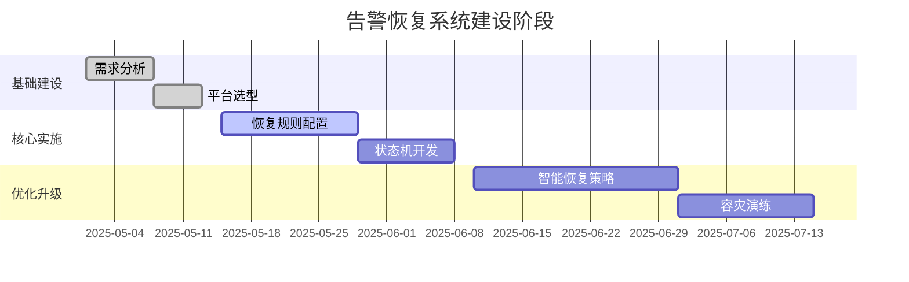

# chat

## 详细介绍一下监控系统中的自愈/自动恢复

在监控系统中，自愈（Self-healing）或自动恢复（Auto-recovery）是指系统在检测到故障或异常时，能够自动采取措施以恢复正常状态的能力。

这种机制旨在提高系统的可靠性和可用性，减少人工干预的需要。

以下是一些关键点：

### 1. 监控和检测
   - 实时监控：系统通过监控工具实时收集性能数据和状态信息。
   - 异常检测：使用阈值、模式识别或机器学习算法识别出异常情况，如高延迟、服务崩溃等。

### 2. 自愈机制
   - 自动重启：当监控到服务崩溃时，自动重启服务或进程。
   - 负载均衡：在多个实例中重新分配请求，以减轻某个实例的负担。
   - 实例替换：如果某个实例长时间不可用，自动替换为新的实例。

### 3. 故障恢复策略
   - 回滚：在部署新版本时，如果监测到故障，能够自动回滚到稳定版本。
   - 容错机制：设计冗余系统，确保即使某个组件失败，其他组件仍能提供服务。

### 4. 日志和告警
   - 日志记录：记录所有故障和自愈操作，以便后续分析和优化。
   - 告警机制：在发生故障或自动恢复时，及时通知运维团队。

### 5. 学习与优化
   - 后续分析：对故障和恢复事件进行分析，以识别根本原因，并改进监控和自愈策略。
   - 自动调优：根据历史数据自动调整系统配置，以优化性能和可靠性。

### 6. 实施工具和框架
   - 容器编排工具：如Kubernetes，提供自愈能力，通过监控Pod状态并自动重启或替换失败的Pod。
   - 云服务：许多云服务提供商（如AWS、Azure、GCP）都提供内置的自愈功能。

通过这些机制，监控系统能够在面对故障时更具韧性，从而提高系统的可用性和用户体验。

## 详细介绍一下 自动恢复（Auto-recovery）

自动恢复（Auto-recovery） 是指系统在检测到故障时，能够自动采取措施恢复到正常状态的能力，而无需人工干预。这种机制在现代分布式系统、云计算环境和高可用性系统中至关重要，目的是最大限度减少停机时间，提高系统的稳定性和可用性。下面是自动恢复机制的详细介绍：

### 1. 自动恢复的核心目标
   - 高可用性：通过快速修复故障，确保系统始终处于可用状态，减少停机时间。
   - 最小化人工干预：减少运维团队对故障的手动修复时间，将修复过程自动化。
   - 恢复业务连续性：当发生故障时，快速恢复关键业务功能，保证系统的服务质量。

### 2. 常见自动恢复场景
   - 服务重启：当某个服务或进程崩溃时，系统自动检测并重启该服务。这可以通过进程监控工具（如`systemd`、`supervisord`）实现。
   - 实例替换：在云环境中，当某个虚拟机、容器或节点出现不可恢复的故障时，系统可以自动创建并替换为新的实例。比如Kubernetes中的Pod自愈能力。
   - 数据库恢复：数据库发生主节点故障时，通过主备切换（failover），将读写请求自动切换到备份数据库，以确保数据库服务不中断。
   - 磁盘故障恢复：在存储系统中，如果磁盘或存储节点出现故障，可以通过冗余或自动数据迁移机制（如RAID、数据复制）恢复数据访问。

### 3. 自动恢复的典型流程
   1. 故障检测：通过监控系统实时检测服务状态，捕捉异常行为或故障。
      - 基于阈值（如CPU使用率过高、内存耗尽等）
      - 基于日志分析或监控指标
   2. 评估与决策：一旦检测到故障，系统会分析故障类型，并根据预先设定的策略确定是否进行自动恢复。
      - 判断是否是瞬时性故障
      - 确定需要采取的恢复操作
   3. 恢复操作：
      - 重启服务：对崩溃的服务或进程进行重启操作。
      - 切换实例：将请求或负载转移到健康的备份实例。
      - 重新调度资源：在Kubernetes等编排工具中，重新调度Pod或节点以保持系统健康。
      - 主备切换：数据库、存储系统中，自动进行主备节点的切换以保证数据服务不中断。
   4. 验证与监控：恢复操作完成后，系统会继续监控恢复后的状态，确保问题得到彻底解决，并防止复发。

### 4. 自动恢复的关键技术
   - 心跳检测：许多分布式系统通过心跳机制检测节点或服务的健康状况。如果某个节点未能在指定时间内发送心跳信号，系统就会触发自动恢复。
   - 冗余和容错：通过冗余设计（如多副本存储、主备节点、负载均衡），即使一个或多个组件发生故障，系统也能迅速恢复并继续提供服务。
   - 自动扩展与缩容：在云原生环境中，自动恢复还可以结合自动扩展机制。例如，在发生高负载时，系统可以自动扩展更多实例来处理请求，随后在负载减轻后自动缩容。
   - 编排工具：如Kubernetes、Docker Swarm等编排工具通过监控容器或服务状态，自动管理和修复故障服务的生命周期。
   - 灾难恢复计划（DRP）：自动恢复还可以应用于灾难恢复，尤其是跨数据中心的恢复计划。例如，在一个数据中心故障时，自动切换到备份数据中心。

### 5. 自动恢复的常用工具和技术
   - Kubernetes：提供内置的Pod自愈能力，当某个Pod崩溃或健康检查失败时，Kubernetes会自动重新调度该Pod。
   - AWS EC2 Auto-recovery：Amazon EC2实例支持自动恢复，当实例检测到系统健康检查失败时，EC2可以自动重启或替换实例。
   - Netflix Eureka：作为一种服务发现系统，Eureka支持自动剔除不可用实例，并动态调整服务的负载分发。
   - HAProxy/NGINX：负载均衡器可以监控后端服务的健康状态，自动将流量切换到健康的服务实例。
   - Database Replication：如MySQL的主备复制、PostgreSQL的流复制等，在主数据库故障时，自动将请求转移到备数据库。

### 6. 自动恢复的挑战
   - 误判与过度恢复：自动恢复系统有时可能误判健康状态，导致不必要的恢复操作，这可能进一步引发系统不稳定。
   - 故障恢复失败：某些复杂的故障可能无法通过自动恢复完全修复，尤其是涉及到硬件问题、重大系统漏洞或数据损坏。
   - 监控盲区：如果监控系统本身出现问题或无法全面覆盖所有服务，自动恢复可能无法被及时触发。

### 7. 自动恢复与DevOps文化
   自动恢复是DevOps实践中的关键组成部分，尤其在持续交付和持续部署的环境中，自动恢复能够帮助系统快速修复问题，减少人为干预和停机时间。结合监控和告警机制，自动恢复能够大大提高运维效率，帮助团队专注于系统优化和业务创新。

### 8. 最佳实践
   - 定义清晰的恢复策略：不同类型的故障应有不同的恢复策略，比如是重启服务还是替换实例。
   - 持续监控和优化：自动恢复机制需要定期测试和调整，确保能够处理新出现的故障类型。
   - 结合手动干预：对于无法完全自动解决的故障，应在自动恢复机制失败后及时通知运维人员进行干预。

总的来说，自动恢复机制是现代分布式系统不可或缺的一部分，它通过自动化的方式提升了系统的可靠性、可用性，帮助企业更好地应对故障并减少停机时间。

## 自动恢复有哪些成熟的开源组件？

在自动恢复（Auto-recovery）领域，有许多成熟的开源组件能够帮助系统在发生故障时自动恢复，并提高系统的可靠性和可用性。以下是一些常用的开源工具和框架，涵盖不同的系统层次和应用场景：

### 1. 容器编排和自愈
   这些工具用于管理容器化应用程序，具有自愈功能，例如在容器或节点故障时，自动恢复、重启或重新调度。

   - Kubernetes：广泛使用的容器编排平台，支持自动恢复功能。例如，当Pod宕机时，Kubernetes会自动调度新的Pod实例，并且自动检测和修复容器、节点等的故障。
     - 关键功能：
       - Pod 自愈：当Pod故障或健康检查失败时，自动重新启动或替换。
       - 节点自动恢复：如果节点不可用，自动将Pod重新调度到健康的节点。
   
   - Docker Swarm：内置在Docker中的容器编排工具，提供自动恢复功能。当服务实例或节点失败时，Swarm会自动重新调度和恢复容器。

   - Nomad：HashiCorp开发的轻量级容器和应用编排工具，支持多种运行时（Docker、虚拟机等），并提供自动恢复功能。

### 2. 负载均衡和服务发现
   这些工具通过监控后端服务的健康状态，自动将流量路由到健康的实例，并剔除故障实例。

   - Consul：由HashiCorp开发的服务发现和配置工具。它集成了健康检查功能，自动将故障节点从服务池中剔除，并重新分发请求到健康的节点上。
   
   - Netflix Eureka：Netflix的开源服务注册和发现工具。Eureka能够检测服务实例的状态，自动剔除不可用实例，并动态调整服务流量分配。

   - HAProxy：流行的开源负载均衡器和代理服务器，支持后端服务的健康检查，并能自动切换流量到健康的服务实例。
     - 关键功能：
       - 通过健康检查自动剔除不可用的后端服务实例。
       - 配合服务发现工具自动调整负载均衡池。

   - NGINX：作为负载均衡器和反向代理，NGINX同样支持健康检查功能，可以在服务故障时自动将流量切换到其他实例。

### 3. 高可用与故障转移
   这些工具用于确保高可用性，提供自动主备切换和故障转移功能，特别是在数据库、存储等关键领域。

   - Keepalived：通过VRRP（虚拟路由冗余协议）为服务提供高可用性，常用于构建具有自动恢复能力的双活或多活环境。它能够检测主节点故障并自动切换到备份节点。
   
   - Patroni：用于PostgreSQL数据库的高可用性和自动恢复解决方案。它利用分布式一致性工具（如Etcd或Consul）进行节点协调，自动处理PostgreSQL的故障转移和主备切换。

   - MySQL MHA（Master High Availability Manager）：提供MySQL主从复制的自动故障转移功能，在主数据库故障时自动切换到备份数据库。

### 4. 进程管理和自愈
   这些工具可以监控本地进程，并在检测到进程崩溃或不可用时自动重启进程。

   - systemd：现代Linux系统中的默认系统和服务管理工具。它提供进程监控功能，可以在服务崩溃后自动重启服务。
     - 关键功能：
       - 通过`Restart`策略配置服务自动重启。
       - 支持服务的依赖管理和并行启动。
   
   - supervisord：一个Python实现的进程管理工具，可以管理和监控本地的进程，自动重启已崩溃的进程。
     - 关键功能：
       - 自动监控进程状态并执行重启。
       - 可用于管理多个进程的生命周期。

   - Monit：轻量级的进程监控工具，支持自动检测和恢复系统上的服务和进程。
     - 关键功能：
       - 通过定期检查进程状态，在服务宕机时自动重启。
       - 提供监控进程、文件系统和网络的能力。

### 5. 分布式存储与自动恢复
   这些工具用于分布式存储系统，通过数据复制、冗余和故障检测来实现自动恢复和高可用性。

   - Ceph：分布式存储系统，提供块存储、文件存储和对象存储服务。Ceph具备自愈能力，能够在节点或磁盘故障时，自动重平衡数据并修复冗余数据。
     - 关键功能：
       - 数据自我修复：通过冗余副本或纠删码技术恢复损坏的数据。
       - 自动重新分配：节点或磁盘故障时，自动将数据重新分配到其他健康节点。

   - GlusterFS：一个开源的分布式文件系统，具备自愈能力。它能够自动检测和修复文件系统的故障，并确保数据冗余和一致性。
   
   - HDFS（Hadoop Distributed File System）：Hadoop生态系统中的分布式文件系统，支持数据自动复制和恢复机制。节点故障后，HDFS会自动复制丢失的数据块，以保持数据可用性。

### 6. 自动扩展与弹性恢复
   这些工具用于在负载变化时自动扩展或缩减服务实例，结合自动恢复机制提高系统的弹性。

   - Prometheus + Alertmanager：Prometheus是开源监控和告警工具，Alertmanager可以根据定义的告警规则触发恢复动作。例如，当服务响应时间超过阈值时，自动触发扩展或重启服务。

   - AutoScaler for Kubernetes：Kubernetes中的Horizontal Pod Autoscaler（HPA）可以根据应用负载自动扩展或缩减Pod的数量，确保在高负载情况下自动分配更多资源，并在负载降低时减少资源占用。

### 总结
自动恢复功能在现代系统中至关重要，许多开源工具为实现这一功能提供了坚实的基础。通过合理选择和配置这些工具，系统可以具备强大的故障自动检测与恢复能力，减少人为干预并确保高可用性。

这些工具的组合可以根据具体的应用场景和需求进行选择，例如Kubernetes可用于容器化的自愈和自动恢复，Patroni适用于PostgreSQL数据库的高可用性，而Ceph等分布式存储系统则提供数据的自动修复和恢复能力。


## 如果想实现告警 恢复逻辑，要怎么做

### 告警恢复逻辑实现全流程解析

告警恢复是监控系统实现闭环管理的关键环节，其核心目标是准确判定异常状态解除并及时通知相关人员。以下是基于行业实践的告警恢复逻辑实现方案：

---

#### 一、恢复逻辑的两种基础模式
1. **自动恢复机制**  
   - **触发条件**  
- **恢复表达式检测**：通过反向条件判断（如`last(metric) <= threshold`）验证指标是否恢复正常  

- **时序连续性验证**：需连续N个检测周期均满足恢复条件（避免抖动误判）  
- **关联数据源校验**：结合其他关联指标交叉验证（如网络恢复时需同时检测TCP连接数和丢包率）  

   - **技术实现**  
     ```promql
     # Prometheus恢复表达式示例（CPU使用率恢复）
     group_left() (avg_over_time(node_cpu_usage[5m]) < 80)
     ```
  
     ```yaml
     # Alertmanager恢复通知配置
     route:
       group_by: [alertname, cluster]
       group_wait: 30s
       group_interval: 5m
       repeat_interval: 3h 
       receiver: 'slack-notifications'
     ```


2. **手动恢复机制**  
   - **适用场景**  
- 无法通过指标自动判断的复杂故障（如业务逻辑错误）  
- 需要人工确认修复效果的场景（如硬件更换后）  

   - **实现流程**  
     ```mermaid
     graph TD
         A[登录管理控制台] --> B[进入告警记录页面]
         B --> C{状态筛选}
         C -->|告警中/已触发| D[点击手动恢复]
         D --> E[确认恢复操作]
         E --> F[状态变更为已恢复]
     ```
  
*注：华为云手动恢复需满足告警状态为"告警中"或"已触发"*

---

#### 二、核心实现技术方案
1. **表达式驱动型恢复**  
   - **双表达式模式**：  
- 问题表达式：`last(metric) > threshold`  
- 恢复表达式：`last(metric) <= recovery_threshold`  
   - **表达式优化策略**：  
- 引入滞后区间防止震荡（如`[当前值 < 阈值-Δ]`）  
- 采用滚动窗口计算（如过去3个周期均值恢复）


2. **时间驱动型恢复**  
   - **超时自动恢复**：  
- 设置最大告警持续时间（如12小时未恢复则强制关闭）  
   - **人工处理超时**：  
- 开始处理后设置倒计时（如30分钟未完成则重新触发告警）

3. **事件关联型恢复**  
   - **基于标签的强关联**：  
     ```sql
     -- Zabbix标签匹配恢复逻辑
     {{ITEM.VALUE}.regsub(".*Component=(\w+).*", \1)}
     ```
  
   - **多维度关联验证**：  
- 相同设备ID/服务实例的告警恢复需校验关联指标

---

#### 三、关键配置要点

| 配置维度        | 典型参数设置                                                                 | 技术文档参考       |
|-----------------|----------------------------------------------------------------------------|------------------|
| **恢复条件**    | 连续满足恢复条件的周期数（建议3-5次）                                       |      |
| **通知策略**    | 恢复通知与告警通知采用不同模板（包含恢复原因分析）                          |       |
| **状态转换**    | 设置中间状态（如"处理中"），避免恢复期间重复告警                             |      |
| **数据一致性**  | 恢复检测时间窗口需大于数据采集间隔（防止漏检）                              |      |
| **权限控制**    | 手动恢复操作需配置RBAC（如仅运维主管可执行）                                |      |

---

#### 四、特殊场景处理方案
1. **无数据恢复判定**  
   - 配置心跳检测机制：超过2个周期无数据上报视为服务不可用，需特殊恢复逻辑  
   - 数据断点补偿策略：使用`LAST_KNOWN_VALUE()`函数处理数据丢失场景

2. **级联告警恢复**  
   - 采用反向传播算法：底层服务恢复后自动触发上层服务状态重评估  
   - 示例：  
     ```python
     # 微服务级联恢复检测
     if all_subservices_healthy() and current_alert.exists():
         resolve_alert(current_alert)
     ```


3. **批量恢复优化**  
   - 标签选择器批量操作：`label_selector="environment=prod,severity=warning"`  
   - 自动恢复策略模板化：将常用恢复逻辑封装为可复用模板

---

#### 五、最佳实践建议
1. **恢复验证策略**  
   - 实施二次确认机制：自动恢复后执行健康检查脚本验证  
   - 设置恢复观察期（如恢复后持续监控15分钟）

2. **监控看板设计**  
   - 恢复成功率指标：  
     ```
     恢复成功率 = (自动恢复数 + 手动确认恢复数) / 总恢复数
     ```
  
   - 恢复耗时统计：  
     ```promql
     histogram_quantile(0.9, sum(alert_recovery_duration_seconds_bucket) by (le))
     ```


3. **智能优化方向**  
   - 基于机器学习的动态阈值调整：使用Prophet算法预测恢复基线  
   - 根因分析辅助恢复：通过拓扑图谱定位原始故障点

---

#### 六、主流平台实现对比

| 平台          | 恢复触发方式                    | 特色功能                          | 局限性                   |
|---------------|-------------------------------|---------------------------------|-------------------------|
| Prometheus    | 基于规则的表达式检测       | 支持多维标签关联恢复              | 需配合Alertmanager使用  |
| Zabbix        | 独立恢复表达式配置        | 部件级细粒度恢复关联              | 复杂事件处理需自定义脚本 |
| 华为云监控     | 手动+超时自动恢复     | 可视化状态机配置                  | 表达式编辑灵活性不足     |
| Grafana Alloy | 通知驱动的恢复检测         | 支持多通道恢复通知                | 需额外配置告警路由       |

---

#### 七、实施路线图



通过以上方案，可实现从基础阈值恢复到智能预测恢复的完整演进路径。建议优先实施表达式驱动的基础恢复逻辑（引用方案），再逐步扩展至基于AI的预测性恢复（参考研究成果）。

# 参考资料

https://forum.huawei.com/enterprise/zh/thread/580933924354408448


* any list
{:toc}