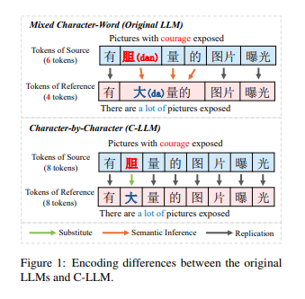
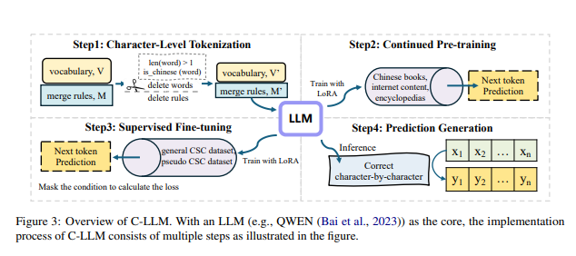
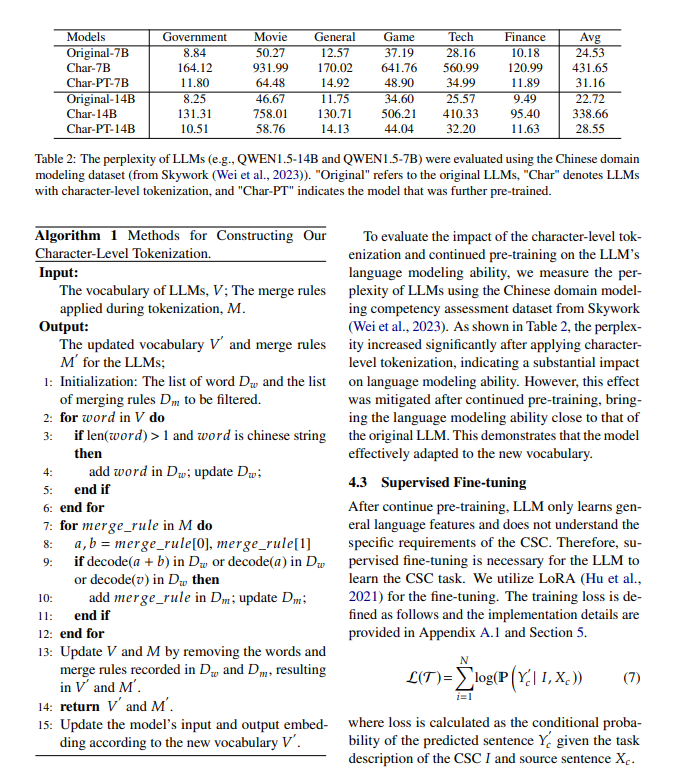
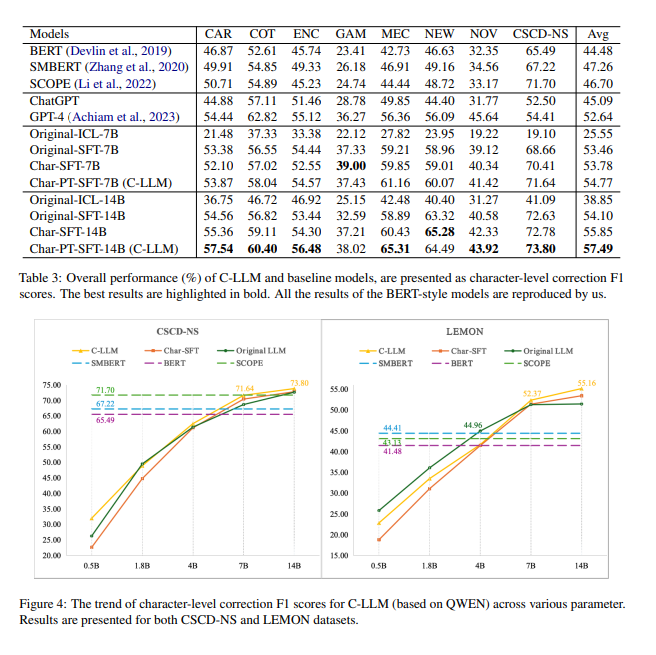

# 拼写纠正系列

[NLP 中文拼写检测实现思路](https://houbb.github.io/2020/01/20/nlp-chinese-spelling-correct-01-intro)

[NLP 中文拼写检测纠正算法整理](https://houbb.github.io/2020/01/20/nlp-chinese-spelling-correct-02)

[NLP 英文拼写算法，如果提升 100W 倍的性能？](https://houbb.github.io/2020/01/20/nlp-chinese-spelling-correct-03-100w-faster)

[NLP 中文拼写检测纠正 Paper](https://houbb.github.io/2020/01/20/nlp-chinese-spelling-correct-paper)

[java 实现中英文拼写检查和错误纠正？可我只会写 CRUD 啊！](https://houbb.github.io/2020/01/20/nlp-chinese-word-checker-01-intro)

[一个提升英文单词拼写检测性能 1000 倍的算法？](https://houbb.github.io/2020/01/20/nlp-chinese-word-checker-02-1000x)

[单词拼写纠正-03-leetcode edit-distance 72.力扣编辑距离](https://houbb.github.io/2020/01/20/nlp-chinese-word-checker-03-edit-distance-intro)

## 开源项目

[nlp-hanzi-similar 汉字相似度](https://github.com/houbb/nlp-hanzi-similar)

[pinyin 汉字拼音](https://github.com/houbb/pinyin)

[word-checker 拼写检测](https://github.com/houbb/word-checker)

[sensitive-word 敏感词](https://github.com/houbb/sensitive-word)

# 个人感受

大家好，我是老马。

下面学习整理一些其他优秀小伙伴的设计、论文和开源实现。

# 感受

这一篇和我的理念很类似，其实就是汉字的三个部分：音 形 义

字典是学习一个字符如何发音、书写和使用的参考书籍

其实本质上还是类似的。

TODO: 不过目前义（使用）这个部分我做的还比较弱，考虑添加一个关于单个字/词的解释词库。

# 论文+实现

论文地址: https://arxiv.org/pdf/2406.16536v2

源码地址：https://github.com/ktlktl/c-llm

# 摘要

中文拼写检查（CSC）旨在检测和纠正句子中的拼写错误。尽管大语言模型（LLMs）展现了强大的能力，并广泛应用于各种任务，但它们在CSC任务上的表现常常不尽如人意。我们发现，LLMs未能满足CSC任务的中文字符级约束，即字符数一致性和语音相似性，这导致了性能瓶颈。进一步分析表明，这个问题源于分词粒度的设置，因为当前的混合字符-词分词方式难以满足这些字符级约束。为了解决这个问题，我们提出了C-LLM，一种基于大语言模型的中文拼写检查方法，能够逐字符学习检查错误。字符级分词使得模型能够学习字符级对齐，有效缓解与字符级约束相关的问题。此外，CSC任务被简化为主要涉及复制和替换的任务。在两个CSC基准数据集上的实验表明，C-LLM比现有方法平均提高了10%的性能。具体来说，它在通用场景下提升了2.1%，在垂直领域场景下有显著的12%的提升，取得了当前的最佳表现。

源代码可以访问 [https://github.com/ktlKTL/C-LLM](https://github.com/ktlKTL/C-LLM)。

# 1 引言

中文拼写检查（CSC）涉及检测和纠正中文句子中的错误字符，在各类应用中起着重要作用（Gao et al., 2010; Yu and Li, 2014）。尽管大语言模型（LLMs）展现了强大的能力，并日益应用于各种任务（Wang et al., 2023; He and Garner, 2023; Wu et al., 2023a），以往的研究（Li and Shi, 2021）表明，生成模型如LLMs在CSC任务中的表现并不理想。

CSC任务本质上涉及字符级的长度和语音约束。字符级长度约束要求预测句子的字符数与源句子一致。此外，语音约束要求预测字符在语音上与源字符高度相似，因为大约83%的拼写错误与正确字符在语音上相同或相似（Liu et al., 2010）。我们发现，LLMs往往未能满足这些字符级长度和语音相似性的要求，导致CSC任务的表现瓶颈。

以GPT-4为例（Achiam et al., 2023），我们观察到，在少样本提示下，模型生成的句子中有10%没有与源句子匹配字符数。相比之下，BERT风格的模型完全没有这个问题。此外，35%的预测字符与源字符在语音上不相似，且由于非同音字的预测错误约占70%的错误。这些字符长度和语音相似性的问题导致了生成的输出未能满足任务需求，从而导致纠错性能不佳。

我们发现，根本问题在于LLM的分词粒度。当前的混合字符-词分词方式会导致字符到词的映射，这使得LLM难以学习字符级的对齐，通常会生成不符合字符级约束的预测。如图1所示，在混合字符-词分词的情况下，LLM需要推断出多个标记对应单一字符（例如，“胆(bold)”，“大(large)”，“的(of)”->“大 量的(large amount)）”），并推断出隐式的字符对齐（例如，“胆(bold)”->“大(large)”）。这些推理过程使得CSC任务变得复杂，因为大多数CSC案例涉及简单的字符复制。例如，正确的字符“量(amount)”是直接从源句子复制过来的。

尽管LLM在各种任务中取得了语义理解的进展，但不清晰的字符对齐仍然会导致错误和过度纠正。因此，建立明确的字符级对齐至关重要。基于这一概念，我们提出了C-LLM，一种基于大语言模型的中文拼写检查方法，它逐字符学习检查错误。我们的动机是进行字符级编码，并建立字符级对齐来训练句子对，从而缓解字符级约束相关问题。如图1所示，该方法确保句子对的标记数保持一致，从而使得LLM更容易学习中文字符之间的语音映射。此外，CSC任务被简化为复制正确字符和替换错误字符的任务，而不涉及复杂的推理。

具体来说，我们构建了字符级分词，确保标记根据单个中文字符进行编码。为了适应新的词汇，我们在大型数据集上进行继续训练。此外，为了使LLM能够学习CSC任务，我们对CSC数据集进行监督微调。在通用数据集CSCD-NS（Hu et al., 2022）和多领域数据集LEMON（Wu et al., 2023b）上的实验表明，C-LLM在通用和垂直领域场景中均超越了现有方法，达到了当前的最佳表现。

本文的贡献可以总结为三个方面：

（1）我们发现混合字符-词分词妨碍了LLM有效理解CSC中的字符级约束。

（2）我们提出了C-LLM，该方法逐字符学习并能够检查错误。

（3）通过在通用和多领域数据集上的测试，我们发现C-LLM取得了当前最佳表现，为未来的错误纠正模型设计提供了见解。

# 2 相关工作

## BERT风格的CSC模型

随着预训练语言模型的兴起，中文拼写检查（CSC）的主流方法转向了BERT风格的模型（Devlin et al., 2019），这些模型将CSC视为序列标注任务。

这些模型将句子中的每个字符映射到其正确的对应字符，并在源句子和参考句子的对上进行微调。

此外，一些研究还集成了语音学和形态学知识，以提高标注过程的效果（Cheng et al., 2020; Guo et al., 2021; Huang et al., 2021; Zhang et al., 2021）。然而，由于参数限制，这些模型在低频和复杂语义场景中的表现不如大语言模型（LLMs）。

## 自回归CSC模型

与BERT风格的模型可以并行推断每个标记不同，自回归CSC模型是按顺序处理标记的。

以往的研究（Li and Shi, 2021）表明，自回归模型如GPT-2（Radford et al., 2019）在CSC任务上可能表现不佳。

随着LLMs的进步，已有若干研究探讨了它们在文本修正方面的能力。

研究（Li et al., 2023b）发现，尽管ChatGPT知道中文字符的语音，但它无法理解如何发音，这使得语音错误修正变得困难。

其他研究（Fang et al., 2023; Wu et al., 2023a）指出，ChatGPT往往能够生成流畅的修正，但也会引入更多的过度修正。

这些发现与我们的观察一致，强调了提升LLMs在CSC任务中的表现的必要性。

# 3 动机

## 3.1 问题表述

中文拼写检查（CSC）任务的目标是检测和修正中文句子中的所有错误字符。

假设源句子为 \( X_c = \{x_{c1}, x_{c2}, \dots, x_{cn}\} \)，包含 \( n \) 个字符，这些字符可能包含拼写错误。对应的参考句子为 \( Y_c = \{y_{c1}, y_{c2}, \dots, y_{cn}\} \)，它包含与 \( X_c \) 相同数量的字符，并且所有错误都已被修正。值得注意的是，大部分被修正的字符 \( y_{ci} \) 在语音上与错误字符 \( x_{ci} \) 相同或相似。CSC 模型识别输入句子 \( X_c \) 中的字符级拼写错误，并生成预测句子 \( Y'_c = \{y'_{c1}, y'_{c2}, \dots, y'_{cm}\} \)，其中 \( y'_{ci} \) 是为 \( x_{ci} \) 预测的字符，且根据 CSC 任务，\( m \) 应等于 \( n \)。在这个过程中，源句子和参考句子在分词后可以表示为 \( X_t = \{x_{t1}, x_{t2}, \dots, x_{tn}\} \) 和 \( Y_t = \{y_{t1}, y_{t2}, \dots, y_{tm}\} \)。

## 3.2 LLM 在 CSC 中的分析

大语言模型（LLMs）目前展现了强大的语言处理能力，并广泛应用于各种任务（Zhao 等，2023）。

与之前的研究（Wang 等，2023；Wu 等，2023a）类似，我们对 LLM 在 CSC 上的表现进行了初步分析，使用 GPT-4（Achiam 等，2023）并结合上下文学习（Brown 等，2020）。我们的实验利用 GPT-4 API，并在 CSCD-NS（Hu 等，2022）测试集上进行拼写修正的少样本提示（具体示例见附录 A.3）。

该提示包含了从 CSCD-NS 训练集中随机选择的五个正例和五个负例。

如表 1 所示，GPT-4 在拼写修正方面的表现不如 BERT 样式的模型。

### 表 1 性能评估

GPT-4 和 BERT 样式模型（Devlin 等，2019；Zhang 等，2020；Li 等，2022）在 CSCD-NS 测试集上的性能评估

该表展示了 GPT-4 和 BERT 样式模型在句子级别和字符级别的表现，分别针对检测（Detection）和修正（Correction）任务报告了精确度（P）、召回率（R）和 F1 值（F1）百分比。

| 模型         | 句子级别（%）                         | 字符级别（%）                         |
|--------------|--------------------------------------|--------------------------------------|
|              | 检测 (P) | 检测 (R) | 检测 (F1) | 修正 (P) | 修正 (R) | 修正 (F1) | 检测 (P) | 检测 (R) | 检测 (F1) | 修正 (P) | 修正 (R) | 修正 (F1) |
| **GPT-4**    | 58.50    | 60.23    | 59.35     | 53.35    | 54.93    | 54.13     | 58.52    | 65.78    | 61.94     | 51.41    | 57.79    | 54.41     |
| **BERT**     | 75.54    | 60.88    | 67.42     | 71.34    | 57.49    | 63.67     | 79.65    | 61.79    | 69.59     | 74.96    | 58.15    | 65.49     |
| **SMBERT**   | 75.68    | 62.96    | 68.74     | 71.45    | 59.44    | 64.90     | 79.97    | 64.12    | 71.17     | 75.53    | 60.56    | 67.22     |
| **SCOPE**    | 79.49    | 66.96    | 72.69     | 76.39    | 64.35    | 69.86     | 83.30    | 68.08    | 74.92     | 79.72    | 65.15    | 71.70     |

注释

- **P**（Precision，精确度）表示正确检测或修正的字符占所有检测或修正字符的比例。
- **R**（Recall，召回率）表示正确检测或修正的字符占所有应检测或修正字符的比例。
- **F1** 是精确度和召回率的调和平均数，提供综合性能指标。

我们的分析表明，GPT-4 在满足 CSC 任务的两个关键约束上存在困难：字符级长度和语音相似性。这种不一致导致了相当一部分预测结果不符合任务要求，从而导致修正性能不佳。统计数据显示，GPT-4 预测的句子中有 10% 未能满足字符级长度约束，影响了精确度和召回率。

此外，如图 2 所示，GPT-4 生成了 35% 的字符，这些字符与源句子中的字符在语音上不相似。值得注意的是，其中 97% 是错误的，这些语音不相似的错误字符占所有预测错误的 70%，严重影响了模型的性能。因此，识别 LLM 无法满足字符级长度和语音约束的根本原因，对提高其性能至关重要。

## 3.3 混合字符-词标记化

通过分析 LLM 在 CSC 任务中使用的标记化方式，我们发现当前的混合字符-词标记化是 LLM 难以满足字符级长度和语音相似性约束的主要原因。

在这种标记化方式下，带有拼写错误的句子会导致字符与词之间的映射关系，进而使 LLM 无法建立清晰的字符级对齐。

我们通过以下两个场景分析这一问题（具体案例见附录 A.2），其中 𝑥𝑐𝑒 和 𝑦𝑐𝑒 分别表示错误字符和相应的参考字符，"⇒" 表示标记和字符之间的对应关系：

1. 𝑥𝑡𝑖 ⇒ {𝑥𝑐𝑒−1} ，𝑥𝑡𝑖+1 ⇒ {𝑥𝑐𝑒 , 𝑥𝑐𝑒+1}  (1)  
   𝑦𝑡𝑖 ⇒ {𝑦𝑐𝑒−1 , 𝑦𝑐𝑒 , 𝑦𝑐𝑒+1}  (2)  

通过比较公式 (1) 和 (2)，源句子中的标记数与参考句子不匹配，导致多个标记对应一个字符标记。

2. 𝑥𝑡𝑖 ⇒ {𝑥𝑐𝑒−1} ，𝑥𝑡𝑖+1 ⇒ {𝑥𝑐𝑒 , 𝑥𝑐𝑒+1}  (3)  
   𝑦𝑡𝑖 ⇒ {𝑦𝑐𝑒−1 , 𝑦𝑐𝑒} ，𝑦𝑡𝑖+1 ⇒ {𝑦𝑐𝑒+1}  (4)  

在公式 (3) 和 (4) 中，即使标记的数量一致，由于错误字符和参考字符被放置在不匹配的标记中，字符的对齐依然不清晰。

在这两种情况下，LLM 无法直接将字符进行映射（例如，𝑥𝑐𝑒 -> 𝑦𝑐𝑒）。

这会导致三个问题：

1. 句子对之间标记数的不一致使得 LLM 无法学习字符长度相等的约束。

2. 不清晰的字符对应关系阻碍了 LLM 学习字符发音相似性的约束。

3. CSC 任务变得更加复杂，涉及到多个推理场景，而不仅仅是字符的复制和替换。

然而，在 CSC 任务中，源句子中的大部分正确字符在预测时可以直接复制，只有少部分拼写错误的字符需要替换。

因此，为该任务建立字符之间的清晰对齐关系至关重要。

- F3

# 4 方法论

CSC 任务要求进行字符级的映射，需要逐字符的纠错，而不是逐标记的纠错。

由于当前的 LLM 处理句子时是基于标记级别的，因此将每个字符映射到一个标记可以直观地降低 CSC 对 LLM 的复杂性。

基于这一概念，我们提出了 C-LLM（如图 3 所示），一种基于大语言模型的中文拼写检查方法，学习逐字符地进行错误检查。该方法包含三个主要步骤，具体如下。

## 4.1 字符级标记化

LLM 的词汇通常是多语言的。然而，由于 CSC 主要处理中文中的错误，我们只关注词汇中的中文部分。

如公式 1~4 所示，LLM 在标记化过程中通常将多个字符映射为一个单一的标记，这使得 CSC 任务变得更加复杂，因为它阻止了字符之间的直接对齐。

为了解决这个问题，我们构建了字符级标记化，确保每个汉字映射为一个单独的标记。这种方法有助于标记化句子中字符之间的清晰对齐，表示为以下公式：

\[
𝑥𝑡𝑖 ⇒ \{𝑥𝑐𝑒−1\}, 𝑥𝑡𝑖+1 ⇒ \{𝑥𝑐𝑒\}, 𝑥𝑡𝑖+2 ⇒ \{𝑥𝑐𝑒+1\} \quad (5)
\]

\[
𝑦𝑡𝑖 ⇒ \{𝑦𝑐𝑒−1\}, 𝑦𝑡𝑖+1 ⇒ \{𝑦𝑐𝑒\}, 𝑦𝑡𝑖+2 ⇒ \{𝑦𝑐𝑒+1\} \quad (6)
\]

具体来说，构建 LLM 字符级标记化的方法（例如 QWEN（Bai et al., 2023））在算法 1 中进行了详细介绍。

对于 BPE（Gage, 1994）标记化，我们精细化了词汇和合并规则。在新的词汇下，模型无法识别由多个汉字组成的词，导致每个汉字根据修订后的合并规则被映射为单独的标记。实验结果表明，新的词汇大小已缩小至原始词汇的 89.2%。

## 4.2 持续预训练

为了缓解词汇约束对 LLM 语言建模能力的潜在影响，我们对 LLM（基于 QWEN（Bai et al., 2023））进行了持续预训练，使其适应新的词汇。

具体而言，我们使用 LoRA（Hu et al., 2021）在 Tigerbot（Chen et al., 2023b）提供的中文开源预训练数据集上进行持续预训练，该数据集包括中文书籍、互联网内容和百科全书。

训练数据包含约 190 亿个标记，但我们训练了 30,000 步，覆盖了大约 20 亿个标记。更多实现细节见附录 A.1。

为了评估字符级标记化和持续预训练对 LLM 语言建模能力的影响，我们使用来自 Skywork（Wei et al., 2023）的中文领域建模能力评估数据集，测量 LLM 的困惑度（Perplexity）。

如表 2 所示，在应用字符级标记化后，困惑度显著增加，表明对语言建模能力产生了较大影。

然而，经过持续预训练后，这一影响得到了缓解，语言建模能力接近原始 LLM 的水平。这表明模型成功适应了新的词汇。

#### 4.3 有监督微调

在持续预训练之后，LLM 仅学习了一般的语言特征，而没有理解 CSC 任务的具体需求。

因此，有监督微调是 LLM 学习 CSC 任务所必需的。我们使用 LoRA（Hu et al., 2021）进行微调。训练损失定义如下，实施细节见附录 A.1 和第 5 节：

\[
ℒ(𝒯) = \sum_{𝑖=1}^{𝑁} \log(\mathcal{P}(Y′_𝑐 | 𝐼, 𝑋𝑐)) \quad (7)
\]

其中，损失是根据 CSC 任务描述 𝐼 和源句子 𝑋𝑐 计算的预测句子 𝑌′_𝑐 的条件概率。

# 5 实验

在本节中，我们将展示微调的详细过程以及模型在两个 CSC 基准上的评估结果：通用数据集 CSCD-NS 和多领域数据集 LEMON。

## 5.1 微调数据集与评估指标

**数据集**

之前的研究（Liu et al., 2021；Xu et al., 2021）选择了 SIGHAN（Wu et al., 2013；Yu et al., 2014；Tseng et al., 2015）作为基准数据集。然而，越来越多的研究（Hu et al., 2022；Yin and Wan, 2023；Li et al., 2022）发现该数据集存在许多问题，例如语义不一致和标注错误。因此，在本研究中，我们选择了两个新的 CSC 基准数据集，分别是 CSCD-NS 和 LEMON：

1. **CSCD-NS**（Hu et al., 2022）：CSCD-NS 的质量优于 SIGHAN，是第一个 CSC 数据集，其主要来源于拼音输入法中的字符错误，包含大量同音字和词汇级别的错误。
2. **LEMON**（Wu et al., 2023b）：LEMON 是一个新颖的大规模多领域 CSC 数据集，包含了各种现实世界中的拼写错误，覆盖了七个不同的子领域，包括游戏（GAM）、百科（ENC）、合同（COT）、医疗（MEC）、汽车（CAR）、小说（NOV）和新闻（NEW）。该数据集主要考察模型在零-shot 设置下的领域纠错能力。

附录 A.4 给出了数据统计。

根据前人的微调方法（Li et al., 2022；Liang et al., 2023），我们将 CSCD-NS 的训练数据与 271K 个通过 ASR 或 OCR 生成的伪数据（称为 Wang271K）（Wang et al., 2018）结合，作为我们的训练集。CSCD-NS 的验证数据用于验证集，我们分别在 CSCD-NS 测试数据和 LEMON 数据集上进行模型测试。

**评估指标**

我们报告句子级别和字符级别的精确度、召回率和 F1 值，以评估不同模型的性能。这些指标分别用于检测和纠正任务。我们使用 CSCD-NS 提供的脚本来计算这些指标。对于 LLM 的预测结果，如果与源句子的长度不匹配，我们首先使用 ChERRANT（Zhang et al., 2022）提取不匹配的操作，然后将其替换为源句子，最后计算指标。

## 5.2 基准模型

我们使用以下 CSC 模型进行比较：

**BERT 风格模型**

1. **BERT**（Devlin et al., 2019）：BERT 将 CSC 视为一个序列标注任务，编码输入句子并使用分类器从词汇中选择合适的字符。
2. **软掩码 BERT（SMBERT）**（Zhang et al., 2020）：SMBERT 由一个检测和纠正网络组成，增强了 BERT 的错误检测能力。
3. **SCOPE**（Li et al., 2022）：SCOPE 在 CSC 任务中引入了辅助发音预测任务，并采用了自适应任务加权方案，以提高 CSC 性能。

**LLM 模型**

我们通过一系列实验使用了 QWEN1.5（Bai et al., 2023）。作为中国最强大的开源 LLM 之一，QWEN 展现了强大的中文处理能力，并且已经发布了多个规模的模型参数。我们在以下两种设置下评估了 LLM 的性能，LLM 的提示方式在附录 A.3 中进行了详细介绍：

- **微调 LLM（LLM-SFT）**：原始 LLM（Original）、字符级标记化的 LLM（Char）以及经过持续预训练的字符级 LLM（Char-PT）均在上述数据集上进行微调。
- **LLM 内部学习（LLM-ICL）**：原始 LLM（Original）、ChatGPT 和 GPT-4 通过提示进行 CSC 任务适应。

## 5.3 主要结果

表 3 展示了在 CSCD-NS 和 LEMON 测试集上的主要结果，揭示了以下几点观察：

1. **提示方法下模型的错误纠正表现不佳**。即使是 GPT-4，获得满意的结果也具有挑战性。然而，经过有监督的微调后，模型的性能显著提高，强调了微调的重要性。

2. **与 C-LLM 相比，没有经过持续预训练的 LLM（Char-SFT）在平均性能上有所下降**，这突出了持续预训练对于更好地适应新词汇和提高性能的必要性。这一点也可以在 4.2 节的困惑度比较中看到。

3. **在领域特定数据上，新闻语言简洁的 NEW 数据集和游戏数据集中的惯用语使得经过持续预训练的模型更容易犯错**。

4. **原始 LLM 在错误纠正方面优于 BERT 风格的模型**，这表明 LLM 在 CSC 任务上，尤其是在垂直领域，具有相较于 BERT 风格模型的优势，与第 2 节的见解一致。

5. **C-LLM 在通用和垂直领域中表现出色**，相较于 BERT 风格的模型和原始 LLM，取得了最先进的性能。这确认了字符级错误纠正的有效性。

# 6 分析与讨论

在本节中，我们将从定量和定性两个角度进一步分析和讨论我们的模型。

## 6.1 模型规模趋势

为了进一步探讨模型规模对 LLM 错误纠正性能的影响，我们还在 4B、1.8B 和 0.5B 参数规模下进行了实验，同时保持微调数据集和训练超参数一致。

如图 4 所示，随着参数规模的减小，LLM 在两个测试集上的纠错性能都有所下降。

**C-LLM 与 BERT 风格模型的比较：**  
C-LLM 在 CSCD-NS 和 LEMON 数据集上，尤其在垂直领域任务中，表现出色，超过了 BERT 风格的模型（在 14B 和 7B 参数规模下）。然而，较小的模型表现较弱。我们推测，尽管通过字符级标记化简化了 CSC 任务，较小的模型仍然难以充分理解任务，导致性能不佳。

**C-LLM 与原始 LLM 的比较：**  
在 CSCD-NS 数据集上，C-LLM 在各种参数规模下始终优于原始 LLM，尽管在 1.8B 参数规模下性能差距有所缩小。这表明 C-LLM 在错误纠正能力上优于原始 LLM。然而，在 LEMON 数据集上，C-LLM 在 4B 及更小规模下的表现逊色于原始 LLM。我们认为这是因为原始 LLM 在预训练过程中包含了大量领域特定数据（Bai et al., 2023），而 C-LLM 的持续预训练仅包含了通用中文数据。这可能导致 LLM 忘记了一些领域知识。较大的 C-LLM 模型（14B 和 7B）由于参数规模较大，受到遗忘的影响较小。尽管部分领域知识被遗忘，字符级纠正方法仍然使得较大的 C-LLM 模型能取得更好的表现，而较小的模型则更容易受到知识遗忘的影响，导致性能较差。

**C-LLM 与 Char-SFT 的比较：**  
C-LLM 在所有模型规模和两个数据集上始终优于 Char-SFT。这突显了持续预训练的重要性，它使得模型能够更好地适应新词汇并提高性能。

## 6.2 长度和语音模型分析

表 4 显示了基于长度和语音角度的统计结果，以 14B 模型为例。表中的 "Target" 表示测试集中参考句子的标准，"Ratio" 表示错误预测中非同音字符的比例。

| Model                  | Equal-length (%) | Non-homophone (%) | Ratio (%) |
|------------------------|------------------|-------------------|-----------|
| **Original-ICL-14B**    | 22.86%           | 53.70%            | 84.42%    |
| **Original-SFT-14B**    | 96.92%           | 8.63%             | 38.52%    |
| **Char-PT-SFT-14B**     | 99.78%           | 3.83%             | 18.43%    |
| **Target**              | 100%             | 1.74%             | -         |

结果分析：

- **Equal-length**: 在错误预测中，**Original-ICL-14B** 的等长比例仅为 22.86%，而 **Original-SFT-14B** 显著提高至 96.92%。这表明，经过微调的模型（Original-SFT-14B）能够更好地保持源句子和目标句子在长度上的一致性。相比之下，**Char-PT-SFT-14B** 在等长保持上几乎达到了 100%，表明字符级的预训练能够大幅提升模型对字符对齐的处理能力。

- **Non-homophone**: 从非同音字符的比例来看，**Original-ICL-14B** 在这方面表现较差，达到 53.70%。这可能是因为模型在应用提示（prompt）时无法准确地识别和处理语音上的异同。**Original-SFT-14B** 和 **Char-PT-SFT-14B** 则在非同音字符的处理上有了显著提升，尤其是 **Char-PT-SFT-14B**，其非同音字符错误的比例降到了 3.83%。

- **Ratio**: 错误预测中的比例变化表明，经过字符级预训练（Char-PT-SFT-14B）的模型在长度对齐和语音一致性方面都取得了更好的表现，而这正是 C-LLM 模型通过字符级纠正方法所能解决的关键问题。

这些结果进一步证明了 C-LLM 在字符级对齐方面的优势，并且表明通过字符级标记化和持续预训练，模型能够显著减少由于语音差异导致的错误，从而提升 CSC 任务的性能。

## 6.3 推理速度分析

使用字符级标记化器会影响模型的推理速度。在这项研究中，我们通过使用**推测解码**（speculative decoding）来定量分析这种影响。

推测解码是一种提高推理效率的技术，可以在多个模型之间快速切换，并利用低参数模型加速推理过程。

我们的评估使用来自 CSCD-NS 测试集的带有拼写错误的样本。

目标模型为 7B 参数，而草稿模型为 1.8B 参数，草稿标记设置为 4。

具体而言，我们使用 **Original-SFT-7B** 作为目标模型，并使用 **Original-SFT-1.8B** 作为草稿模型来测试推测解码的能力；对于 **Char-PT-SFT-7B**，我们使用 **Char-PT-SFT-1.8B** 作为草稿模型。

| Model                   | #Tokens | #Characters | AR (%)   | Time (s) |
|-------------------------|---------|-------------|----------|----------|
| **Original-SFT-7B**      | 83,530  | 128,676     | 86.50%   | 2028.77  |
| **Char-PT-SFT-7B**       | 127,057 | 128,801     | 93.88%   | 2481.97  |

### 结果分析：

- **推理速度和接受率**：从表 5 中可以看到，**Char-PT-SFT-7B** 的标记数比 **Original-SFT-7B** 增加了 52%。尽管标记数增加，整体的推理时间仅增加了 22.33%。这一点表明，虽然字符级标记化导致了标记数量的增加，但通过使用推测解码技术，模型的复杂度减少，导致推理效率有所提升，尤其是在较小的草稿模型（1.8B 参数）下。

- **接受率**：**Char-PT-SFT-7B** 的接受率为 93.88%，比 **Original-SFT-7B** 的 86.50% 高出 7.38%。这表明，字符级的预训练和微调使得推测解码能够更高效地进行，模型生成更为精确的预测，减少了解码时的不必要计算和错误。

C-LLM 在减少推理时间和提高解码效率方面表现良好，尤其是在推测解码的辅助下，尽管其字符级标记化使得推理的标记数量有所增加，但整体性能和速度的提升证明了字符级模型在处理拼写纠正任务中的优势。这表明，C-LLM 在实际应用中能在不显著增加计算开销的情况下，提供更加精确的纠错结果。

# 7. 结论

本文表明，现有的大型语言模型（LLMs）未能满足中文拼写纠错任务（CSC）的字符级约束条件，具体表现为字符长度一致性和语音相似性，这严重影响了它们的纠错性能。我们发现，这一问题的根本原因在于标记化粒度的设置，当前模型将字符和词语混合处理，难以有效满足字符级约束。为了解决这一问题，我们提出了 **C-LLM**，该模型建立了中文字符之间的映射关系，使模型能够学习字符之间的纠错关系和语音相似性。通过这种方法，CSC 任务被简化为字符复制和替换问题。实验结果表明，C-LLM 在通用基准和多领域基准上都优于以往的方法，并且达到了最先进的性能。

# 8. 局限性

我们的工作存在三个主要局限性：

1. **语言适应性**：我们的方法专门针对中文拼写检查任务设计，可能无法有效处理包含英语错误的句子，因为我们的词汇中并未包含英文单词的处理。
   
2. **新词处理能力**：我们的模型在处理新兴和流行词汇时仍存在一定的不足，这可能需要通过集成诸如 **RAG**（retrieval-augmented generation）等方法来进一步提升模型的表现。

3. **推理时间**：与原始模型相比，我们的模型推理时间较长，这表明在实际应用中还需要进一步的优化，以提高效率。

# 致谢

我们感谢 **国家科技重大专项**（2022ZD0115801）的慷慨资助。

# 参考资料

https://arxiv.org/pdf/2406.16536v2

* any list
{:toc}