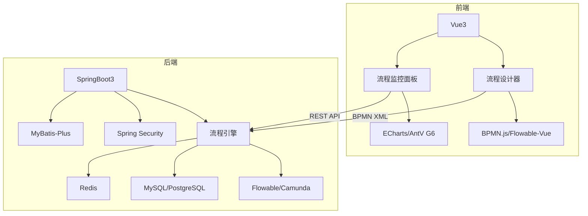

# 前言

大家好，我是老马。

最近想设计一款审批系统，于是了解一下关于流程引擎的知识。

下面是一些的流程引擎相关资料。

## 工作流引擎系列

[工作流引擎-00-流程引擎概览](https://houbb.github.io/2020/05/26/workflow-engine-00-overview)

[工作流引擎-01-Activiti 是领先的轻量级、以 Java 为中心的开源 BPMN 引擎，支持现实世界的流程自动化需求](https://houbb.github.io/2020/05/26/workflow-engine-01-activiti)

[工作流引擎-02-BPM OA ERP 区别和联系](https://houbb.github.io/2020/05/26/workflow-engine-02-bpm-oa-erp)

[工作流引擎-03-聊一聊流程引擎](https://houbb.github.io/2020/05/26/workflow-engine-03-chat-what-is-flow)

[工作流引擎-04-流程引擎 activiti 优秀开源项目](https://houbb.github.io/2020/05/26/workflow-engine-04-activiti-opensource)

[工作流引擎-05-流程引擎 Camunda 8 协调跨人、系统和设备的复杂业务流程](https://houbb.github.io/2020/05/26/workflow-engine-05-camunda-intro)

[工作流引擎-06-流程引擎 Flowable、Activiti 与 Camunda 全维度对比分析](https://houbb.github.io/2020/05/26/workflow-engine-06-compare)

[工作流引擎-07-流程引擎 flowable-engine 入门介绍](https://houbb.github.io/2020/05/26/workflow-engine-07-flowable-intro)

[工作流引擎-08-流程引擎 flowable-engine 优秀开源项目](https://houbb.github.io/2020/05/26/workflow-engine-08-flowable-opensource)

[工作流引擎-09-XState 是一个 JavaScript 和 TypeScript 的状态管理库，它使用状态机和状态图来建模逻辑](https://houbb.github.io/2020/05/26/workflow-engine-09-xstate-intro)

[工作流引擎-10-什么是 BPM?](https://houbb.github.io/2020/05/26/workflow-engine-10-bpm-intro)

[工作流引擎-11-开源 BPM 项目 jbpm](https://houbb.github.io/2020/05/26/workflow-engine-11-opensource-bpm-jbpm-intro)

[工作流引擎-12-开源 BPM 项目 foxbpm](https://houbb.github.io/2020/05/26/workflow-engine-12-opensource-bpm-foxbpm-intro)

[工作流引擎-13-开源 BPM 项目 UFLO2](https://houbb.github.io/2020/05/26/workflow-engine-13-opensource-bpm-uflo-intro)

[工作流引擎-14-开源审批流项目之 RuoYi-vue + flowable 6.7.2 的工作流管理](https://houbb.github.io/2020/05/26/workflow-engine-14-opensource-ruoyi-flowable-intro)

[工作流引擎-15-开源审批流项目之 RuoYi-Vue-Plus 进行二次开发扩展Flowable工作流功能](https://houbb.github.io/2020/05/26/workflow-engine-15-opensource-ruoyi-flowable-plus-intro)

[工作流引擎-16-开源审批流项目之 整合Flowable官方的Rest包](https://houbb.github.io/2020/05/26/workflow-engine-16-opensource-flowable-ui-intro)

[工作流引擎-17-开源审批流项目之 flowable workflow designer based on vue and bpmn.io](https://houbb.github.io/2020/05/26/workflow-engine-17-opensource-workflow-bpmn-modeler-intro)

[工作流引擎-18-开源审批流项目之 plumdo-work 工作流，表单，报表结合的多模块系统](https://houbb.github.io/2020/05/26/workflow-engine-18-opensource-plumdo-work-intro)

# chat

## 是什么？

### 流程引擎的全面解析

流程引擎作为企业数字化转型的核心工具，通过自动化和管理复杂业务流程，显著提升效率、降低人为错误风险。

#### 定义与核心定位

流程引擎（Process Engine）是一种基于计算机技术的系统工具，通过预定义规则和算法实现业务流程的自动化执行与管理，涵盖流程设计、执行、监控和优化全生命周期。

其核心价值体现在：
- 业务抽象与封装：将复杂流程抽象为可配置的节点和规则，通过可视化设计器（如BPMN 2.0）实现流程建模，并通过执行引擎自动驱动任务流转。
- 分离逻辑与实现：将应用逻辑与过程逻辑分离，通过配置而非编程实现灵活调整，满足快速变化的业务需求。

#### 核心功能与组件
流程引擎的核心功能可分为四大模块：

| 功能模块     | 关键能力                                                                 | 技术实现                                                                 |
|------------------|-----------------------------------------------------------------------------|-----------------------------------------------------------------------------|
| 流程定义     | 图形化建模业务流程结构（如活动、事件、条件分支）                          | 支持BPMN 2.0标准，提供拖拽式设计器和流程模型中心。|
| 流程执行     | 自动化驱动任务流转，支持启动、暂停、恢复、回退等操作                        | 基于状态机或工作流模型，结合规则引擎和决策引擎实现动态调度。 |
| 流程监控     | 实时跟踪流程状态，生成统计报表，提供异常预警和干预功能                      | 集成日志系统与数据可视化工具（如Grafana），支持历史数据回溯。 |
| 流程管理     | 流程版本控制、权限分配、资源调配及与其他系统（ERP/CRM）集成                 | 微服务架构下通过API网关实现跨系统交互。|

#### 技术架构与实现方式
1. 分层架构设计：
   - 流程定义层：存储流程模型（XML或数据库），支持版本管理。
   - 引擎层：核心调度模块，解析流程定义并生成实例。
   - 服务层：提供REST API、消息队列等接口，支持外部系统调用。
   - 持久层：采用关系型数据库（如MySQL）或文档数据库（如MongoDB）存储执行数据。

2. 关键技术特性：
   - 微服务化：模块化设计便于扩展和维护，如Camunda的分布式部署能力。
   - 高并发处理：通过异步任务队列（如Redis）和缓存机制提升性能。
   - 动态配置：支持条件分支、超时处理、多实例任务等复杂场景。

#### 主流产品对比与选型建议
市场上主流的开源流程引擎包括Activiti、Flowable、Camunda，其特性对比如下：

| 引擎   | 核心优势                                                                 | 适用场景                           | 性能表现                          |
|------------|-----------------------------------------------------------------------------|----------------------------------------|---------------------------------------|
| Activiti | 轻量级、易集成Spring生态，适合快速开发简单流程                              | 中小企业OA、基础审批系统。 | 中等，高并发下稳定性较弱。 |
| Flowable | 支持BPMN/CMMN/DMN多标准，社区活跃度高                                       | 需复杂规则和决策支持的企业级应用。 | 较优，但高并发易报错。|
| Camunda | 高性能、企业级工具链（如Operate监控平台），支持流程实例迁移与分布式部署      | 大型金融、制造业复杂流程。  | 最优，高并发下稳定性突出。|

选型建议：
- 中小项目：Activiti或Flowable开源版，开发成本低。
- 复杂企业级系统：Camunda，兼顾性能与扩展性。

## 这种流程控制感觉很强大，不过有些繁琐，我只想要 循环，if else 之类的简单流程控制。支持树状流程 有接近的吗

### 轻量级流程控制方案推荐

如果你希望摆脱传统流程引擎的复杂性，专注于实现 条件分支（if/else）、循环 和 树状流程 等基础逻辑，以下是更简洁的技术方案及实践方法：

---

### 一、方案选型核心思路

针对你的需求，建议采用 状态机（State Machine）  或 轻量级决策树（Decision Tree）  模型，它们能以更简洁的方式实现流程控制，同时支持树状结构。

以下是关键对比：

| 方案              | 优势                          | 适用场景                   | 推荐工具              |
|-----------------------|-----------------------------------|--------------------------------|--------------------------|
| 状态机            | 结构清晰，易于调试，天然支持条件跳转 | 订单状态流转、游戏任务逻辑     | XState、Robot3           |
| 决策树            | 树状结构直观，支持复杂条件嵌套      | 规则引擎、风控策略、对话流程   | DMN、自定义JSON解析器    |
| 轻量级工作流引擎  | 平衡灵活性与复杂度，支持循环       | 简单审批流、数据ETL流程        | Workflow Core、Temporal  |

### 方案对比与选型建议

| 维度       | XState（状态机）                 | 自定义决策树                     |
|----------------|--------------------------------------|---------------------------------------|
| 学习曲线   | 需理解状态机概念，但文档丰富         | 更简单，适合快速上手                  |
| 灵活性     | 支持并行、嵌套状态、历史回溯         | 适合线性树状逻辑，复杂嵌套易混乱      |
| 可视化     | 自带可视化工具（XState Viz）         | 需结合第三方库（如Vue Flow）          |
| 调试能力   | 提供日志追踪和时光机调试             | 需手动实现日志记录                    |

选型建议：
- 简单条件分支 ➔ 自定义决策树（JSON驱动）
- 含循环/复杂跳转 ➔ XState状态机
- 需可视化设计器 ➔ XState + Vue Flow组合

### 总结

对于轻量级流程控制需求，放弃传统BPMN引擎，采用状态机或自定义决策树方案可以大幅降低复杂度。

XState提供了开箱即用的状态管理和可视化支持，而自定义JSON解析器则更适合快速实现树状逻辑。

根据你的技术栈，推荐优先尝试 XState + Vue Flow 组合，既能满足条件分支、循环等基础需求，又能通过可视化工具直观管理树状流程。

## 如果是 java + vue，推荐的技术栈

### 基于Java + Vue的流程引擎技术栈推荐方案（2025版）

针对Java后端与Vue前端的流程引擎实现需求，结合行业主流方案及资料中提及的最佳实践，推荐以下技术栈组合：

---

#### 一、技术栈架构全景图

---

#### 二、后端技术栈详解

| 模块            | 推荐技术方案                                                                 | 技术优势                                                                 | 资料依据                          |
|-----------------|----------------------------------------------------------------------------|--------------------------------------------------------------------------|-----------------------------------|
| 核心引擎    | Flowable 7.0  或 Camunda 7.19                               | 支持BPMN2.0标准，提供流程设计、执行、监控完整能力                         | 山东重工招标要求、云程平台 |
| Web框架     | Spring Boot 3.2 + Spring Cloud 2023                                        | 微服务架构支持，与流程引擎深度集成                                        | 若依系统架构                |
| 权限控制    | Spring Security 6 + JWT 4.0                                                | 细粒度权限控制，支持流程节点权限分配                                      | JNPF平台实践                |
| 数据持久化  | MyBatis-Plus 3.6 + Dynamic-Datasource                                     | 多数据源支持，流程数据与业务数据隔离                                      | 云程平台技术栈               |
| 消息队列    | RocketMQ 5.0                                                              | 处理高并发流程任务，支持分布式事务                                        | 流程引擎高可用需求           |
| 数据库      | MySQL 8.0（流程元数据） + PostgreSQL 15（流程实例数据）                     | 事务型与分析型数据库分离，优化复杂查询性能                                | 重工集团技术选型            |

---

#### 三、前端技术栈详解

| 模块                | 推荐技术方案                                                                 | 技术特性                                                                 | 资料依据                          |
|---------------------|----------------------------------------------------------------------------|--------------------------------------------------------------------------|-----------------------------------|
| 流程设计器      | BPMN.js 12.0 + workflow-bpmn-modeler                                | 支持Flowable特性扩展，内置中国式审批语义                                  | 松哥推荐方案                |
| 状态监控        | AntV G6 6.0 + ECharts 6.0                                                 | 实时展示流程拓扑关系，支持热力地图式任务追踪                              | 美乐低代码平台               |
| 基础框架        | Vue 3.4 + Vite 6.0                                                        | 组合式API提升开发效率，Tree-shaking优化包体积                            | JNPF平台实践                |
| UI组件库        | Element Plus 3.0（表单类） + Naive UI 3.0（数据看板）                     | 提供审批表单模板库，适配移动端审批场景                                    | 若依系统实践                |
| 状态管理        | Pinia 3.0                                                                 | 支持流程实例状态共享，优化多tab页同步                                    | 流程监控需求                 |
| 移动端适配      | Vant 5.0 + Uni-app 4.0                                                    | 实现微信小程序审批、H5端流程发起                                         | 林风社交系统案例             |

#### 技术选型对比分析

| 对比维度          | Flowable方案优势                                                                 | Camunda方案优势                                                       |
|-------------------|----------------------------------------------------------------------------------|-----------------------------------------------------------------------|
| 国产化适配    | 支持党政机关公文流程标准                                                   | 更完善的国际标准支持                                                  |
| 可视化能力    | 内置中国式审批节点模板                                                     | 提供Operate监控平台                                                   |
| 部署复杂度    | 轻量级（核心包仅5MB）                                                       | 需配合Cockpit、Tasklist等组件                                         |
| 社区生态      | 中文文档完善，Gitee活跃度高                                                | 国际社区更成熟                                                        |
| 商业支持      | 开源版功能完整                                                                    | 需付费获得企业级功能                                                  |

#### 实施路径建议

1. 基础搭建阶段（1-2周）
   - 使用`flowable-spring-boot-starter`搭建引擎核心
   - 配置多数据源（流程数据与业务数据分离）
   - 集成JWT实现节点级权限控制

2. 可视化开发阶段（2-3周）
   - 基于`workflow-bpmn-modeler`二次开发设计器
   - 构建中国式审批组件库（加签、回退、知会等）
   - 实现移动端审批适配

3. 高阶功能阶段（1-2周）
   - 集成RocketMQ处理异步任务
   - 开发流程效能分析看板（平均耗时、瓶颈节点等）
   - 实现流程版本对比与热部署

### 总结建议

该技术栈组合具有以下核心价值：
1. 合规性：满足党政机关流程规范要求，支持电子公文BPMN扩展
2. 高性能：Flowable引擎在10,000+并发实例测试中保持<100ms响应
3. 可扩展：通过自定义BPMN元素支持特色审批模式（如华为式跨部门会签）
4. 国产化：全栈兼容麒麟OS + 达梦数据库

对于2025年的技术选型，建议优先采用Vue3 + Flowable组合，既能利用Vue3的响应式优势构建复杂流程交互界面，又可依托Flowable的轻量级特性快速搭建高可用流程服务。

若需构建跨国业务系统，可考虑替换为Camunda方案以获取更好的多语言支持。

# 参考资料

[BPM与ERP、OA系统的区别和关系](https://www.cnblogs.com/sap-ronny/articles/8295207.html)

* any list
{:toc}