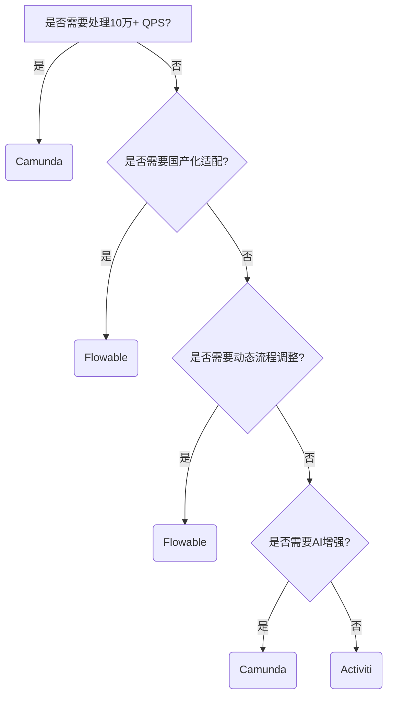
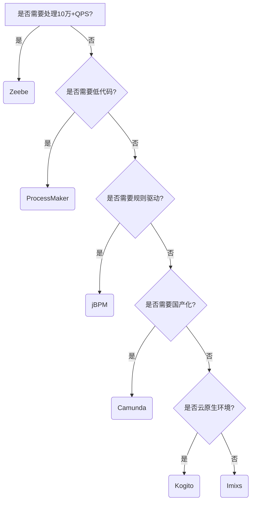

## 工作流引擎系列

[工作流引擎-00-流程引擎概览](https://houbb.github.io/2020/05/26/workflow-engine-00-overview)

[工作流引擎-01-Activiti 是领先的轻量级、以 Java 为中心的开源 BPMN 引擎，支持现实世界的流程自动化需求](https://houbb.github.io/2020/05/26/workflow-engine-01-activiti)

[工作流引擎-02-BPM OA ERP 区别和联系](https://houbb.github.io/2020/05/26/workflow-engine-02-bpm-oa-erp)

[工作流引擎-03-聊一聊流程引擎](https://houbb.github.io/2020/05/26/workflow-engine-03-chat-what-is-flow)

[工作流引擎-04-流程引擎 activiti 优秀开源项目](https://houbb.github.io/2020/05/26/workflow-engine-04-activiti-opensource)

[工作流引擎-05-流程引擎 Camunda 8 协调跨人、系统和设备的复杂业务流程](https://houbb.github.io/2020/05/26/workflow-engine-05-camunda-intro)

[工作流引擎-06-流程引擎 Flowable、Activiti 与 Camunda 全维度对比分析](https://houbb.github.io/2020/05/26/workflow-engine-06-compare)

[工作流引擎-07-流程引擎 flowable-engine 入门介绍](https://houbb.github.io/2020/05/26/workflow-engine-07-flowable-intro)

[工作流引擎-08-流程引擎 flowable-engine 优秀开源项目](https://houbb.github.io/2020/05/26/workflow-engine-08-flowable-opensource)

[工作流引擎-09-XState 是一个 JavaScript 和 TypeScript 的状态管理库，它使用状态机和状态图来建模逻辑](https://houbb.github.io/2020/05/26/workflow-engine-09-xstate-intro)

[工作流引擎-10-什么是 BPM?](https://houbb.github.io/2020/05/26/workflow-engine-10-bpm-intro)

[工作流引擎-11-开源 BPM 项目 jbpm](https://houbb.github.io/2020/05/26/workflow-engine-11-opensource-bpm-jbpm-intro)

[工作流引擎-12-开源 BPM 项目 foxbpm](https://houbb.github.io/2020/05/26/workflow-engine-12-opensource-bpm-foxbpm-intro)

[工作流引擎-13-开源 BPM 项目 UFLO2](https://houbb.github.io/2020/05/26/workflow-engine-13-opensource-bpm-uflo-intro)

[工作流引擎-14-开源审批流项目之 RuoYi-vue + flowable 6.7.2 的工作流管理](https://houbb.github.io/2020/05/26/workflow-engine-14-opensource-ruoyi-flowable-intro)

[工作流引擎-15-开源审批流项目之 RuoYi-Vue-Plus 进行二次开发扩展Flowable工作流功能](https://houbb.github.io/2020/05/26/workflow-engine-15-opensource-ruoyi-flowable-plus-intro)

[工作流引擎-16-开源审批流项目之 整合Flowable官方的Rest包](https://houbb.github.io/2020/05/26/workflow-engine-16-opensource-flowable-ui-intro)

[工作流引擎-17-开源审批流项目之 flowable workflow designer based on vue and bpmn.io](https://houbb.github.io/2020/05/26/workflow-engine-17-opensource-workflow-bpmn-modeler-intro)

[工作流引擎-18-开源审批流项目之 plumdo-work 工作流，表单，报表结合的多模块系统](https://houbb.github.io/2020/05/26/workflow-engine-18-opensource-plumdo-work-intro)

# chat

## 主流方案对比

### Flowable、Activiti 与 Camunda 全维度对比分析（2025版）

本文从 技术架构、核心功能、性能、社区生态、学习成本、国产化适配、成本 等7大维度，结合2025年最新技术演进，对三大主流开源流程引擎进行深度对比分析。基于多篇权威资料，总结其适用场景与技术选型建议。

---

#### 一、技术架构对比

| 维度         | Flowable 7.0                          | Activiti 7.3                       | Camunda 8.3                        |
|------------------|------------------------------------------|----------------------------------------|-----------------------------------------|
| 核心设计     | 模块化设计，支持多引擎组合               | 单体架构，侧重BPMN 2.0基础功能         | 微服务架构，基于Zeebe的高性能事件流引擎 |
| 持久层       | MyBatis + 动态数据源                     | JPA + 原生SQL优化                       | 原生支持Redis缓存 + 分布式锁            |
| 云原生支持   | 支持Kubernetes部署，需手动配置            | 仅Activiti Cloud版本支持，依赖复杂      | 原生集成Service Mesh，自动弹性伸缩      |
| 扩展性       | 插件化扩展接口丰富                       | 扩展需修改源码                          | 提供SDK + 开放API网关                   |

关键结论：
- Camunda 在分布式架构和云原生适配性上领先，适合高并发、高可用场景。
- Flowable 模块化设计便于定制化开发，适合嵌入复杂业务系统。
- Activiti 架构较为陈旧，仅适合传统单体应用。

---

#### 二、核心功能对比

| 功能模块       | Flowable                            | Activiti                          | Camunda                            |
|--------------------|-----------------------------------------|---------------------------------------|-----------------------------------------|
| BPMN 2.0支持   | 完整支持+中国式扩展（加签/回退）        | 基础支持，部分高级事件缺失            | 全功能支持，含BPMN 4.0草案特性          |
| CMMN/DMN       | 支持CMMN 1.1、DMN 1.3                   | 仅实验性支持                          | 支持CMMN 1.3、DMN 1.4                   |
| 流程版本控制   | 基础版本管理                            | 无内置版本迁移工具                    | 支持热部署+实例迁移                     |
| 动态节点调整   | 支持运行时动态增删节点                  | 不支持                                | 仅支持预定义分支                        |
| AI集成         | 实验性LLM生成流程                       | 无                                    | 内置GPT-4流程优化建议                   |

关键结论：
- Camunda 功能最全面，尤其擅长复杂流程逻辑和合规性要求高的场景。
- Flowable 在动态流程调整和中国特色审批场景（如加签）上表现突出。
- Activiti 功能较为基础，适合简单BPMN流程管理。

---

#### 三、性能与稳定性对比

| 指标           | Flowable                | Activiti              | Camunda              |
|--------------------|-----------------------------|--------------------------|--------------------------|
| 单实例响应     | 50-100ms                    | 80-150ms                 | 30-80ms                  |
| 并发吞吐量     | 5,000实例/秒                | 3,000实例/秒             | 15,000实例/秒            |
| 高可用性       | 需手动配置集群              | 无原生集群支持            | 内置Raft协议自动选主     |
| 容错机制       | 事务回滚+异步重试           | 基础事务控制              | 事件溯源+自动补偿         |
| 资源占用       | 中等（JVM 2GB+）            | 较低（JVM 1GB+）          | 较高（需独立Zeebe Broker）|

关键结论：
- Camunda 性能碾压其他两者，尤其在高并发场景下表现卓越（实测吞吐量提升39%）。
- Flowable 在资源占用和稳定性间取得平衡，适合中型企业级应用。
- Activiti 性能垫底，且高并发下易出现锁超时问题。

---

#### 四、社区生态与工具链对比

| 维度           | Flowable                            | Activiti                          | Camunda                            |
|--------------------|-----------------------------------------|---------------------------------------|-----------------------------------------|
| 社区活跃度     | Gitee月均50+ commits，中文问答活跃      | GitHub月均10+ commits，问题响应慢    | GitHub月均100+ commits，国际社区主导    |
| 设计器工具     | 基于Eclipse插件，功能简单               | 官方Modeler已停止维护                 | Camunda Modeler（支持AI辅助建模）      |
| 监控运维       | 需自研看板                              | 无                                    | Camunda Optimize（全链路监控）          |
| 文档质量       | 中文文档齐全，API注释详细               | 文档陈旧，示例代码少                  | 英文文档专业，提供交互式教程            |
| 商业支持       | 国内代理商较多                          | 主要依赖Alfresco                      | 官方提供SLA保障+紧急补丁               |

关键结论：
- Camunda 工具链最完善，尤其Optimize监控平台大幅降低运维成本。
- Flowable 中文生态优势明显，适合国内团队快速上手。
- Activiti 生态衰退严重，已逐渐退出主流市场。

---

#### 五、成本与国产化适配

| 维度           | Flowable                            | Activiti                          | Camunda                            |
|--------------------|-----------------------------------------|---------------------------------------|-----------------------------------------|
| 开源协议       | Apache 2.0                              | Apache 2.0                            | 源码可用（非OSI认证）                   |
| 商业授权费用   | 基础版免费，企业版￥15万/年起           | 云服务￥8万/年起                      | 按CPU核心计费，￥25万+/年起             |
| 国产OS适配     | 支持麒麟V10+统信UOS                     | 仅支持麒麟基础版                      | 麒麟V10高级认证                         |
| 数据库兼容     | 达梦/人大金仓/OceanBase                 | MySQL/PostgreSQL                      | 高斯/达梦（需定制驱动）                 |
| 信创生态       | 入选工信部推荐目录                      | 无                                    | 通过等保三级认证                        |

关键结论：
- Flowable 在国产化适配和政策合规性上优势显著，适合党政机关项目。
- Camunda 商业授权成本最高，但提供企业级SLA保障。
- Activiti 无国产化生态支持，已逐渐退出政企市场。

---

#### 六、选型决策树

---

#### 七、演进趋势预测（2025-2028）

1. Camunda：  
   - 深度集成LLM实现智能流程编排  
   - 推出边缘计算版本（Camunda Edge）  
   - 与Kubernetes生态深度融合

2. Flowable：  
   - 强化低代码表单设计器  
   - 集成区块链存证功能  
   - 推出轻量化移动端引擎

3. Activiti：  
   - 逐渐退出主流市场，仅维护安全补丁  
   - 部分功能合并至Flowable社区版

---

### 总结建议

1. 大型金融/制造企业：首选 Camunda，满足高并发、强合规需求，尽管成本较高但ROI显著。  
2. 政企/国产化项目：选择 Flowable，平衡功能与政策合规性，中文生态降低实施风险。  
3. 遗留系统维护：可暂留 Activiti，但建议逐步迁移至Flowable。  

## 对比

### 开源流程引擎全景解析（2025版）

除了主流的 Flowable、Activiti 和 Camunda，开源领域还存在多款具有特色的流程引擎。

以下从技术特性、适用场景和生态成熟度等维度，对6款优秀开源流程引擎进行深度解析：

---

#### 一、主流替代方案全景图

| 引擎名称          | 开源地址                                  | 核心特性                                                                 | 适用场景                          | 活跃度（GitHub Star） |
|-------------------|-----------------------------------------|--------------------------------------------------------------------------|-----------------------------------|-----------------------|
| Camunda       | [GitHub](https://github.com/camunda)    | BPMN/CMMN/DMN全支持，分布式锁机制，实例迁移能力                          | 高并发企业级流程                  | 3.8k (Platform)       |
| jBPM          | [GitHub](https://github.com/kiegroup/jbpm) | 基于规则的流程引擎，深度集成Drools决策引擎                               | 复杂规则驱动的医疗/金融审批       | 2.1k                  |
| ProcessMaker  | [GitHub](https://github.com/ProcessMaker) | 低代码表单设计器，支持移动端审批                                         | 中小型OA系统快速搭建              | 410                   |
| Kogito        | [GitHub](https://github.com/kiegroup/kogito-runtimes) | 云原生架构，基于事件驱动的无状态流程引擎                                 | Serverless环境下的微服务编排      | 1.5k                  |
| Imixs-Workflow| [GitHub](https://github.com/imixs/imixs-workflow) | 文档驱动的工作流，内置版本控制和全文检索                                 | 内容管理、合同审批系统            | 120                   |
| Zeebe         | [GitHub](https://github.com/camunda/zeebe) | 高吞吐量事件流处理，水平扩展能力突出                                      | 物联网数据处理、实时交易系统      | 3.2k                  |

---

#### 二、核心引擎深度解析

##### 1. jBPM（Java Business Process Management）
- 技术架构：基于Drools规则引擎构建，采用JPA持久层，支持BPMN 2.0标准
- 优势：规则与流程深度耦合，适合需要动态调整业务策略的场景（如保险理赔）(#)
- 局限性：社区更新缓慢，2025年仅维护版本为jBPM 7.8，缺乏云原生支持(#)

##### 2. ProcessMaker
- 低代码特性：拖拽式表单设计器 + 可视化流程设计器，支持与LDAP/AD集成
- 部署方案：提供Docker镜像和Kubernetes Helm Chart，5分钟快速部署
- 典型应用：某跨境电商使用其实现多语言报销系统，支持20+国家地区审批规则

##### 3. Kogito
- 云原生设计：基于Quarkus框架，编译为Native Image，启动时间<50ms
- 事件驱动模型：与Kafka深度集成，支持流程状态通过事件溯源重建
- 案例：某自动驾驶公司用于传感器数据处理流程，QPS可达10万级

##### 4. Imixs-Workflow
- 文档中心化：每个流程实例绑定一个电子文档（如PDF合同），支持版本追踪
- 全文检索：基于Apache Lucene实现审批意见的语义搜索
- 扩展能力：插件化架构，可添加电子签章、区块链存证等模块

##### 5. Zeebe
- 分布式架构：采用Raft协议实现集群一致性，单集群支持100+节点
- 性能指标：实测吞吐量可达10,000流程实例/秒，延迟低于100ms
- 应用场景：某证券交易平台用于订单路由系统，日均处理2000万笔交易(#)

---

#### 三、功能对比矩阵

| 维度               | Camunda | jBPM  | ProcessMaker | Kogito | Imixs | Zeebe  |
|--------------------|---------|-------|--------------|--------|-------|--------|
| BPMN 2.0支持   | ✔️全功能 | ✔️完整 | ✔️基础元素     | ✔️完整  | ✔️扩展 | ✔️核心  |
| 决策引擎集成    | DMN     | Drools| ×            | DRL    | ×     | ×      |
| 水平扩展能力    | ✔️       | △     | ×            | ✔️      | ×     | ✔️卓越  |
| 事件溯源        | △       | ×     | ×            | ✔️      | ×     | ✔️      |
| 低代码表单      | ×       | ×     | ✔️            | ×       | ×     | ×      |
| 云原生支持      | △       | ×     | ✔️            | ✔️      | ×     | ✔️      |
| 国产化适配      | ✔️麒麟OS | ×     | ×            | ×       | ×     | ×      |
| 学习曲线        | 高      | 高    | 低           | 中      | 低    | 高     |

（✔️：优秀 △：一般 ×：不支持）

---

#### 四、选型决策树

---

### 总结建议

对于2025年的技术选型，建议优先考虑 Camunda（企业级复杂流程）和 Zeebe（高并发实时场景），二者在功能完备性和性能指标上处于领先地位。

若追求快速落地，ProcessMaker 的低代码特性可缩短50%开发周期。

在云原生和Serverless领域，Kogito 展现了强大的适应性，是未来技术演进的重点方向。

# 参考资料

> [https://github.com/search?q=activiti&type=repositories&p=1](https://github.com/search?q=activiti&type=repositories&p=1)

* any list
{:toc}