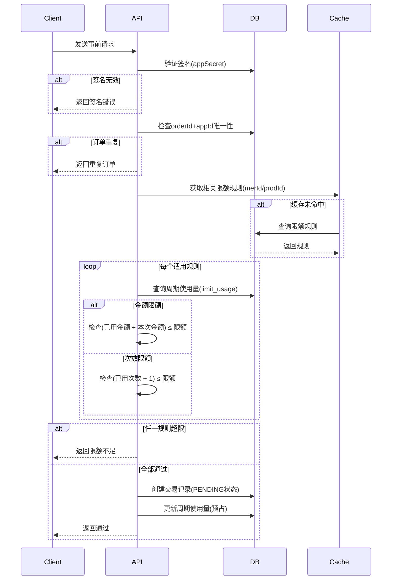
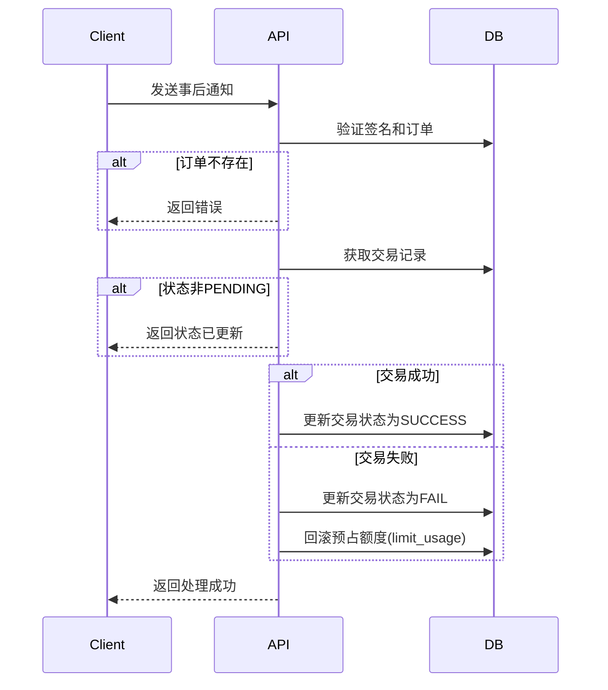

# 说明

所有的业务系统中。

都需要哦对交易中的用户的交易金额+交易次数进行限制。

本质：一定的时间维度，对指定的用户的指定类别的信息进行统计。如果超过一定的次数，则进行拦截（处罚）。


# chat

## 表结构的拓展

如果让你来设计限额限次，你会设计哪些表？为什么

# 限额限次系统数据库设计

针对交易限额限次需求，我会设计以下核心表结构，确保系统的灵活性、扩展性和高性能：

## 核心表设计

### 1. 交易记录表 (`transaction_records`)
```sql
CREATE TABLE transaction_records (
    id BIGINT AUTO_INCREMENT PRIMARY KEY,
    app_id VARCHAR(32) NOT NULL COMMENT '应用标识',
    order_id VARCHAR(64) NOT NULL COMMENT '业务订单号',
    trace_id VARCHAR(64) NOT NULL COMMENT '跟踪号',
    trans_amt DECIMAL(18,2) NOT NULL COMMENT '交易金额',
    trans_type VARCHAR(20) NOT NULL COMMENT '交易类型',
    prod_id VARCHAR(32) COMMENT '产品号',
    mer_id VARCHAR(32) NOT NULL COMMENT '商户号',
    trans_time CHAR(17) NOT NULL COMMENT '交易时间(yyyyMMddHHmmssSSS)',
    trans_date CHAR(8) NOT NULL COMMENT '交易日期(yyyyMMdd)',
    extra_map JSON COMMENT '额外信息',
    trans_status ENUM('PENDING','SUCCESS','FAIL') DEFAULT 'PENDING' COMMENT '交易状态',
    created_at DATETIME NOT NULL DEFAULT CURRENT_TIMESTAMP,
    updated_at DATETIME NOT NULL DEFAULT CURRENT_TIMESTAMP ON UPDATE CURRENT_TIMESTAMP,
    UNIQUE KEY uniq_app_order (app_id, order_id),
    INDEX idx_mer_date (mer_id, trans_date),
    INDEX idx_mer_type (mer_id, trans_type)
) ENGINE=InnoDB COMMENT='交易记录表';
```

### 2. 限额规则表 (`limit_rules`)
```sql
CREATE TABLE limit_rules (
    id BIGINT AUTO_INCREMENT PRIMARY KEY,
    rule_name VARCHAR(100) NOT NULL COMMENT '规则名称',
    target_type ENUM('MERCHANT','PRODUCT','USER') NOT NULL COMMENT '应用对象',
    target_id VARCHAR(32) NOT NULL COMMENT '目标ID(商户/产品/用户)',
    limit_type ENUM('AMOUNT','COUNT') NOT NULL COMMENT '限额类型:金额/次数',
    period_type ENUM('REAL_TIME','DAILY','WEEKLY','MONTHLY','YEARLY') NOT NULL COMMENT '周期类型',
    limit_value DECIMAL(18,2) NOT NULL COMMENT '限制值',
    currency CHAR(3) DEFAULT 'CNY' COMMENT '币种',
    start_time DATETIME NOT NULL COMMENT '生效时间',
    end_time DATETIME COMMENT '失效时间',
    status TINYINT(1) NOT NULL DEFAULT 1 COMMENT '状态:0-禁用,1-启用',
    created_at DATETIME NOT NULL DEFAULT CURRENT_TIMESTAMP,
    updated_at DATETIME NOT NULL DEFAULT CURRENT_TIMESTAMP ON UPDATE CURRENT_TIMESTAMP,
    UNIQUE KEY uniq_target_rule (target_type, target_id, limit_type, period_type),
    INDEX idx_target (target_type, target_id)
) ENGINE=InnoDB COMMENT='限额规则表';
```

### 3. 额度使用记录表 (`limit_usage`)
```sql
CREATE TABLE limit_usage (
    id BIGINT AUTO_INCREMENT PRIMARY KEY,
    rule_id BIGINT NOT NULL COMMENT '规则ID',
    target_type ENUM('MERCHANT','PRODUCT','USER') NOT NULL COMMENT '应用对象',
    target_id VARCHAR(32) NOT NULL COMMENT '目标ID',
    period_key VARCHAR(20) NOT NULL COMMENT '周期标识(如202306)',
    used_amount DECIMAL(18,2) NOT NULL DEFAULT 0 COMMENT '已用金额',
    used_count INT NOT NULL DEFAULT 0 COMMENT '已用次数',
    last_trans_id BIGINT COMMENT '最后交易ID',
    last_trans_time DATETIME COMMENT '最后交易时间',
    created_at DATETIME NOT NULL DEFAULT CURRENT_TIMESTAMP,
    updated_at DATETIME NOT NULL DEFAULT CURRENT_TIMESTAMP ON UPDATE CURRENT_TIMESTAMP,
    UNIQUE KEY uniq_rule_period (rule_id, period_key),
    INDEX idx_target_period (target_type, target_id, period_key),
    FOREIGN KEY (rule_id) REFERENCES limit_rules(id) ON DELETE CASCADE
) ENGINE=InnoDB COMMENT='额度使用记录表';
```

### 4. 应用配置表 (`app_configs`)
```sql
CREATE TABLE app_configs (
    id BIGINT AUTO_INCREMENT PRIMARY KEY,
    app_id VARCHAR(32) NOT NULL COMMENT '应用ID',
    app_secret VARCHAR(64) NOT NULL COMMENT '应用密钥',
    app_name VARCHAR(100) NOT NULL COMMENT '应用名称',
    status TINYINT(1) NOT NULL DEFAULT 1 COMMENT '状态:0-禁用,1-启用',
    created_at DATETIME NOT NULL DEFAULT CURRENT_TIMESTAMP,
    updated_at DATETIME NOT NULL DEFAULT CURRENT_TIMESTAMP ON UPDATE CURRENT_TIMESTAMP,
    UNIQUE KEY uniq_app_id (app_id)
) ENGINE=InnoDB COMMENT='应用配置表';
```

### 5. 规则-产品关联表 (`rule_product_mappings`)
```sql
CREATE TABLE rule_product_mappings (
    id BIGINT AUTO_INCREMENT PRIMARY KEY,
    rule_id BIGINT NOT NULL COMMENT '规则ID',
    prod_id VARCHAR(32) NOT NULL COMMENT '产品ID',
    created_at DATETIME NOT NULL DEFAULT CURRENT_TIMESTAMP,
    UNIQUE KEY uniq_rule_product (rule_id, prod_id),
    INDEX idx_prod (prod_id),
    FOREIGN KEY (rule_id) REFERENCES limit_rules(id) ON DELETE CASCADE
) ENGINE=InnoDB COMMENT='规则产品关联表';
```

## 设计理由与关键考虑

### 1. 灵活的多维度限额设计
- 多对象支持：通过`target_type`支持商户、产品、用户等多维度限额
- 多周期类型：实时、日、周、月、年等多周期限额
- 混合类型：支持金额限额和次数限额并存

### 2. 高性能统计方案
- 预聚合设计：`limit_usage`表按周期预聚合使用量，避免实时统计交易表
- 增量更新：每次交易只需更新对应周期的使用量
- 周期标识：`period_key`字段快速定位周期数据（如202306表示2023年6月）

### 3. 扩展性与可配置性
- 规则热配置：限额规则可动态调整，无需修改代码
- 规则关联：通过关联表实现规则与产品的多对多关系
- 币种支持：为国际化预留扩展空间

### 4. 数据一致性保障
- 唯一约束：`app_id + order_id`唯一索引防止重复交易
- 外键约束：保证关联数据完整性
- 状态追踪：交易状态机管理（PENDING->SUCCESS/FAIL）

### 5. 安全与审计
- 应用密钥管理：独立存储应用密钥
- 操作日志：所有表包含创建/更新时间
- 额外信息：JSON格式存储扩展字段

## 限额检查流程

### 事前请求处理逻辑


### 事后通知处理逻辑


## 优势总结

1. 灵活配置：支持多维度、多周期、多类型的限额规则
2. 高性能：预聚合数据+增量更新，避免全表扫描
3. 扩展性强：JSON字段+关联表支持业务扩展
4. 数据一致：事务处理+状态机保证数据完整性
5. 安全可靠：签名验证+密钥独立存储
6. 易于维护：清晰的表结构+索引优化

这个设计可以满足高并发交易场景下的限额限次需求，同时提供了良好的扩展性和可维护性。


# 参考资料

[多线程使用redis进行累加结果不对，不能保证原子性解决方案](https://blog.csdn.net/cucgyfjklx/article/details/124338511)

[redis 对单个key进行大数据量incr](https://blog.csdn.net/qq_44112474/article/details/115543832)

* any list
{:toc}
