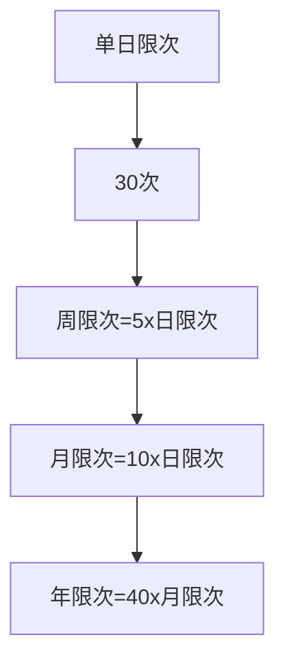
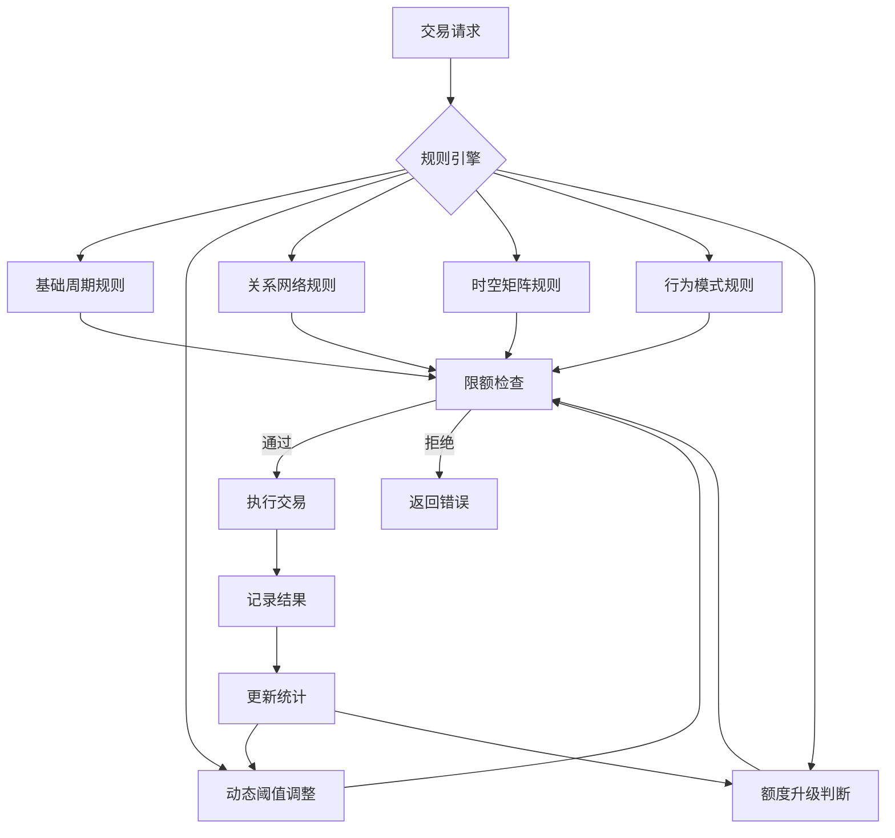

# 说明

所有的业务系统中。

都需要哦对交易中的用户的交易金额+交易次数进行限制。

本质：一定的时间维度，对指定的用户的指定类别的信息进行统计。

如果超过一定的次数，则进行拦截（处罚）。

# chat

## 表结构的拓展

如果让你来设计限额限次，默认的日、周、月、年限额、限次规则你会如何设计？

阈值会如何设计？为什么？

你还会添加哪些有价值的规则？

# 限额限次规则体系设计

## 默认周期规则设计

我会设计一个多层次的周期规则体系，兼顾灵活性和实用性：

### 1. 时间周期规则
| 周期类型 | 限额示例 | 限次示例 | 计算方式 | 适用场景 |
|---------|---------|---------|---------|---------|
| 实时 | 单笔≤5,000 | 1分钟内≤5次 | 滑动窗口 | 高风险交易防护 |
| 日(Daily) | ≤50,000 | ≤30次 | 自然日(00:00-24:00) | 日常交易控制 |
| 周(Weekly) | ≤200,000 | ≤100次 | 自然周(周一至周日) | 中等周期控制 |
| 月(Monthly) | ≤500,000 | ≤300次 | 自然月(1日至月末) | 长期消费管理 |
| 年(Yearly) | ≤5,000,000 | ≤1,000次 | 自然年(1月1日至12月31日) | 年度预算控制 |

### 2. 阈值设计原则

金额阈值：


次数阈值：


设计依据：
1. 风险分层：遵循"短周期小额度，长周期大额度"原则
2. 指数增长：周期每扩大一级，限额增加5-10倍
3. 业务适配：
   - 电商：侧重日/月限额
   - 金融：侧重实时/日限额
   - 订阅服务：侧重月/年限额
4. 帕累托法则：覆盖80%用户正常需求，剩余20%可定制

## 高级规则扩展

### 1. 智能动态阈值
```sql
ALTER TABLE limit_rules ADD COLUMN dynamic_params JSON COMMENT '动态参数';

-- 示例值：
{
  "base_value": 5000.00,       -- 基础阈值
  "adjustment_factor": 0.3,    -- 调整系数
  "metrics": [                 -- 参考指标
    {"type": "success_rate", "weight": 0.6},
    {"type": "avg_amount", "weight": 0.4}
  ],
  "max_adjustment": 2.0        -- 最大调整倍数
}
```

运作逻辑：
`实际阈值 = 基础值 × (1 + 调整系数 × 综合评分)`
- 交易成功率高 → 提升限额
- 平均金额稳定 → 提升限额
- 异常行为多 → 降低限额

### 2. 关系网络规则
```sql
CREATE TABLE relation_limits (
  id BIGINT AUTO_INCREMENT PRIMARY KEY,
  relation_type ENUM('SAME_DEVICE','SAME_IP','SAME_CARD') NOT NULL,
  max_amount DECIMAL(18,2) NOT NULL,
  max_count INT NOT NULL,
  period_type ENUM('HOUR','DAY') NOT NULL
);
```

应用场景：
1. 同设备多账户：∑限额≤50,000/日
2. 同IP多商户：∑交易≤100次/小时
3. 同银行卡多应用：∑金额≤100,000/日

### 3. 时空规则矩阵
```sql
ALTER TABLE limit_rules ADD COLUMN time_bands JSON COMMENT '时段配置';
ALTER TABLE limit_rules ADD COLUMN geo_fences JSON COMMENT '地理围栏';

-- 时段配置示例：
[
  {"start": "00:00", "end": "06:00", "factor": 0.3},  -- 凌晨限额30%
  {"start": "06:00", "end": "09:00", "factor": 0.8},  -- 早高峰80%
  {"start": "09:00", "end": "18:00", "factor": 1.0},  -- 日间100%
  {"start": "18:00", "end": "24:00", "factor": 1.2}   -- 晚间120%
]

-- 地理围栏示例：
[
  {"type": "COUNTRY", "code": "CN", "factor": 1.0},
  {"type": "PROVINCE", "code": "GD", "factor": 1.5},  -- 广东省+50%
  {"type": "CITY", "code": "440300", "factor": 0.7},  -- 深圳市-30%
  {"type": "IP", "range": "192.168.0.0/16", "factor": 0.1} -- 内网10%
]
```

### 4. 行为模式规则
```sql
CREATE TABLE behavior_rules (
  id BIGINT AUTO_INCREMENT PRIMARY KEY,
  pattern_type ENUM('FREQUENCY','AMOUNT_SEQUENCE','TIME_INTERVAL') NOT NULL,
  condition JSON NOT NULL,
  action ENUM('BLOCK','LIMIT_REDUCE','VERIFY') NOT NULL,
  reduce_factor DECIMAL(3,2) DEFAULT 0.5
);

-- 示例条件：
{
  "type": "FREQUENCY",
  "threshold": {              -- 10分钟内
    "count": 10,              -- 10次交易
    "window_minutes": 10
  }
}
```

检测模式：
1. 高频小额：防洗钱/盗刷
2. 金额递增：测试支付上限
3. 固定间隔：机器行为特征

### 5. 分级额度体系
```sql
CREATE TABLE limit_tiers (
  id BIGINT AUTO_INCREMENT PRIMARY KEY,
  tier_name VARCHAR(50) NOT NULL,
  min_success_count INT NOT NULL COMMENT '升级所需成功交易数',
  daily_limit DECIMAL(18,2) NOT NULL,
  monthly_limit DECIMAL(18,2) NOT NULL,
  annual_limit DECIMAL(18,2) NOT NULL
);

INSERT INTO limit_tiers VALUES
(1, '青铜', 0, 5000.00, 50000.00, 200000.00),
(2, '白银', 10, 20000.00, 200000.00, 1000000.00),
(3, '黄金', 50, 50000.00, 500000.00, 5000000.00),
(4, '铂金', 200, 100000.00, 1000000.00, 10000000.00);
```

## 规则引擎架构设计



## 阈值设定最佳实践

1. 黄金比例法则
   - 日限额 = 月预期收入 ÷ 22（工作日）
   - 单笔最大 = 日限额 ÷ 5
   - 年限额 = 月限额 × 15（非12，考虑季节性波动）

2. 风险加权模型
   ```
   实际限额 = 基础限额 × 风险系数
   风险系数 = 0.3×A + 0.4×B + 0.3×C
   A = 身份验证强度（0.5-2.0）
   B = 设备安全评分（0.8-1.5）
   C = 历史行为评分（0.5-1.8）
   ```

3. 流动性保护
   - 设置商户级储备金阈值
   - 当∑待结算金额 > 储备金的80%时：
     ```python
     def adjust_limit(reserve_ratio):
         if reserve_ratio > 0.8:
             return 0.7  # 降至70%
         elif reserve_ratio > 0.9:
             return 0.5  # 降至50%
         else:
             return 1.0
     ```

## 为什么这样设计？

1. 纵深防御体系
   - 基础周期规则：第一道防线
   - 行为模式规则：实时风险拦截
   - 关系网络规则：对抗团伙欺诈

2. 动态适应性
   - 自动学习用户行为模式
   - 根据风险态势动态调整
   - 兼顾安全与用户体验

3. 场景化覆盖
   - 时空规则：解决地域盗刷问题
   - 分级体系：激励良好用户行为
   - 关系网络：防范协同攻击

4. 经济性考量
   - 分级额度降低风控成本
   - 动态阈值优化资金利用率
   - 流动性保护避免挤兑风险

5. 可解释性
   - 每项拒绝都有明确规则依据
   - 用户可见的额度升级路径
   - 商户可配置的规则权重

这套设计不仅满足基础限额需求，还通过动态调整、行为分析、关系网络等多维规则，构建了智能化的风险防控体系，在保障安全的同时最大化业务灵活性。

# 参考资料


* any list
{:toc}
