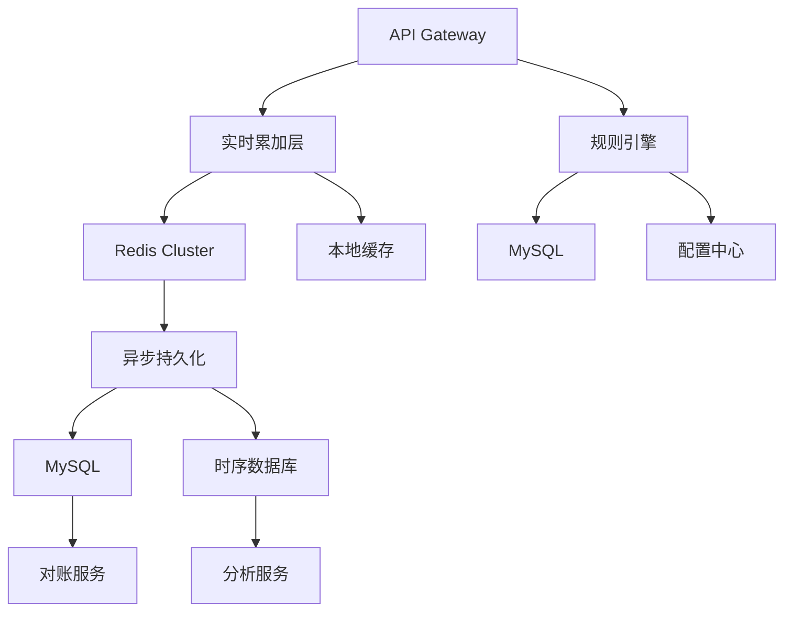
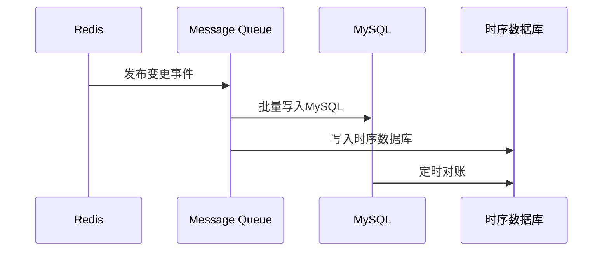
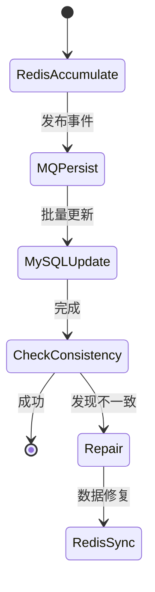

# 说明

所有的业务系统中。

都需要哦对交易中的用户的交易金额+交易次数进行限制。

本质：一定的时间维度，对指定的用户的指定类别的信息进行统计。如果超过一定的次数，则进行拦截（处罚）。


# chat

## 表结构的拓展

分布式系统中，如何实现限额限次信息的累加？

你会选择那种数据库？

mysql redis mongodb 还是时序数据库 vm 之类的，为什么？

在分布式系统中实现交易风控的限额限次信息累加，需要结合高并发处理能力、数据一致性和扩展性需求。

以下是具体实现方法及数据库选型的详细分析：

---

### 一、交易风控限额限次信息累加的常见实现方法
#### 1. 计数器模式
- 固定窗口计数  
  通过Redis的`INCR`命令和`TTL`特性，对每个用户或交易类型的请求次数进行累加。当时间窗口（如1分钟）结束时自动重置。  
  示例代码片段：  
  ```java
  // 使用Redis的原子性INCR和EXPIRE命令
  Long count = redisTemplate.opsForValue().increment(key);
  if (count == 1) {
      redisTemplate.expire(key, windowSeconds, TimeUnit.SECONDS);
  }
  if (count > maxCount) return false; // 拒绝请求
  ```
  
  引用资料指出，此方法简单但存在窗口边界流量突增问题（如最后一秒集中请求）。

- 滑动窗口计数  
  利用Redis的`ZSET`结构存储请求时间戳，通过`ZREMRANGEBYSCORE`和`ZCARD`动态维护窗口内的请求数。  
  示例流程：  
  1. 将当前时间戳加入有序集合；
  2. 删除窗口外的旧时间戳；
  3. 统计剩余元素数量，若超过阈值则限流。  
  此方法更精确但复杂度较高，适用于对实时性要求极高的场景。

#### 2. 漏桶与令牌桶算法
- 令牌桶算法  
  通过Redis的`Lua脚本`实现原子化操作：每个请求需获取令牌，令牌按固定速率生成。若令牌不足则拒绝请求。  
  优势：平滑流量，避免突发流量冲击。示例代码：  
  ```lua
  local tokens = tonumber(redis.call('get', KEYS[1]) or "0")
  if tokens >= 1 then
      redis.call('decr', KEYS[1])
      return true
  else
      return false
  end
  ```
  
  资料显示，Lua脚本保证操作的原子性，适合分布式环境。

#### 3. 分布式锁与一致性保障
- 使用`Redisson`或`Etcd`实现分布式锁，确保对同一用户的风控校验串行化，避免并发导致计数错误。  
- 例如，在金融交易场景中，通过锁机制保证余额更新和订单处理的唯一性。

---

### 二、数据库选型对比分析
#### 1. Redis
- 优势  
  - 高性能：内存操作达到微秒级响应，适合高并发场景。每秒可处理百万级请求。  
  - 原子性支持：通过`INCR`、`Lua脚本`等保证计数逻辑的准确性。  
  - 灵活数据结构：`STRING`（计数器）、`ZSET`（滑动窗口）、`HASH`（多维度限流）满足多种需求。  
  - 分布式特性：支持集群部署，实现全局统一的限流策略。  
- 适用场景  
  实时限流、短时间窗口的计数（如秒级/分钟级风控）、高频读写操作。  
- 局限性  
  数据持久化依赖RDB/AOF，不适合长期存储；复杂查询能力较弱。

#### 2. MySQL
- 优势  
  - 事务支持：通过ACID特性保证数据一致性，适合需强一致性的场景（如账户余额校验）。  
  - 复杂查询：支持多表联查和聚合，适合生成风控报表或历史数据分析。  
- 局限性  
  - 高并发性能瓶颈：默认连接模型导致线程竞争，需通过连接池、读写分离优化。  
  - 写入延迟：行级锁在高并发写入时可能升级为表锁，影响吞吐量。  
- 适用场景  
  低频但需复杂事务或持久化存储的场景（如风控规则配置、审计日志）。

#### 3. MongoDB
- 优势  
  - 时序集合优化：自动创建时间索引、支持数据压缩和过期策略，适合存储交易流水。  
  - 聚合框架：通过`$match`、`$group`等管道操作实现复杂时间窗口分析（如日累计限额）。  
- 局限性  
  - 实时性不足：写入性能低于Redis，不适合毫秒级限流。  
  - 内存消耗：大数据集下索引占用较多资源。  
- 适用场景  
  长期存储交易流水、多维度的历史数据分析（如用户行为模式挖掘）。

#### 4. 时序数据库（如VictoriaMetrics）
- 优势  
  - 高效存储与查询：针对时间序列数据优化压缩算法，存储成本仅为传统数据库的1/10。  
  - 高扩展性：支持水平分片和自动负载均衡，适合海量数据（如每秒百万级交易）。  
  - 实时监控集成：与Grafana等工具无缝对接，支持风控预警和可视化。  
- 局限性  
  - 功能单一：专注于时序数据，缺乏事务和复杂查询能力。  
  - 学习成本：需熟悉PromQL类查询语言。  
- 适用场景  
  长期存储交易时序数据、实时监控异常模式（如高频交易检测）。

---

### 三、综合选型建议
1. 实时限流与高频计数  
   首选Redis：利用其原子性、低延迟和分布式特性，结合Lua脚本实现滑动窗口或令牌桶算法。  
   示例架构：Redis集群 + 哨兵模式（高可用） + 本地缓存（二级降级）。

2. 持久化存储与复杂分析  
   - 短期数据：Redis + MySQL（持久化备份）。  
   - 长期时序数据：VictoriaMetrics + MongoDB（多维分析）。

3. 混合方案  
   - 实时计数：Redis处理限流；  
   - 流水存储：VictoriaMetrics记录时间序列；  
   - 规则配置与报表：MySQL/MongoDB管理。

---

### 四、性能对比表

| 数据库       | 写入性能       | 查询性能       | 一致性   | 扩展性   | 适用场景               |
|--------------|----------------|----------------|----------|----------|------------------------|
| Redis    | 极高（微秒级） | 高（简单查询） | 最终一致 | 水平扩展 | 实时限流、高频计数     |
| MySQL    | 中（毫秒级）   | 中（复杂查询） | 强一致   | 垂直扩展 | 事务处理、报表生成     |
| MongoDB  | 高（毫秒级）   | 高（聚合分析） | 最终一致 | 水平扩展 | 时序数据存储、多维分析 |
| Victoria | 极高（亚毫秒） | 极高（时序查询）| 最终一致 | 水平扩展 | 海量时序数据监控       |


---

### 五、总结
- Redis是实时风控限流的首选，兼顾性能与原子性。  
- 时序数据库（如VictoriaMetrics）和MongoDB适合长期存储与分析。  
- MySQL在事务和复杂查询场景仍有价值，但需通过架构优化（如分库分表）弥补高并发短板。  
- 混合架构（Redis + VictoriaMetrics + MySQL）可平衡实时性、持久化和分析需求。

## 混合架构模型

# 分布式系统限额限次累加方案设计与数据库选型

## 核心挑战分析

在分布式系统中实现限额限次累加，面临三大核心挑战：
1. 原子性：高并发下的精确累加
2. 一致性：跨节点数据同步
3. 实时性：毫秒级响应要求

## 数据库选型对比

| 数据库       | 原子累加能力 | 分布式支持 | 实时性能 | 适用场景                 | 局限性               |
|--------------|--------------|------------|----------|--------------------------|----------------------|
| Redis    | ⭐⭐⭐⭐⭐       | ⭐⭐⭐⭐      | ⭐⭐⭐⭐⭐    | 实时计数、滑动窗口限流   | 持久化弱、内存限制   |
| MySQL    | ⭐⭐           | ⭐⭐         | ⭐⭐       | 最终一致性存储、核心数据 | 高并发下性能瓶颈     |
| MongoDB  | ⭐⭐⭐          | ⭐⭐⭐⭐      | ⭐⭐⭐      | 文档存储、灵活扩展       | 事务支持有限         |
| 时序数据库| ⭐⭐⭐⭐         | ⭐⭐⭐       | ⭐⭐⭐⭐     | 时间窗口聚合分析         | 实时更新能力弱       |

## 混合架构设计方案



### 1. 实时累加层（Redis核心方案）

选择原因：
- 原子操作：`INCRBY`/`HINCRBY` 实现无锁累加
- 高性能：10万+ OPS 处理能力
- 丰富数据结构：满足各类限额场景

数据结构设计：

#### a) 基础计数器（日/月限额）
```redis
# 键设计：LIMIT:{周期}:{目标}:{周期标识}
HINCRBY LIMIT:DAILY:MER001 20240610 used_amount 150.00
HINCRBY LIMIT:DAILY:MER001 20240610 used_count 1
```

#### b) 滑动窗口限流（实时限次）
```redis
# 使用Sorted Set实现滑动窗口
ZADD RATE_LIMIT:MER001 1717315200000 "TRACE-001"
ZREMRANGEBYSCORE RATE_LIMIT:MER001 -inf (1717315200000-60000) # 移除60秒外数据
ZCARD RATE_LIMIT:MER001 # 获取当前计数
```

#### c) 分布式锁实现
```lua
-- Lua脚本保证原子性
local key = KEYS[1]
local limit = tonumber(ARGV[1])
local current = redis.call('GET', key) or 0
if current + 1 > limit then
    return 0
else
    redis.call('INCRBY', key, 1)
    redis.call('EXPIRE', key, 60)
    return 1
end
```

### 2. 持久化层（MySQL核心存储）

选择原因：
- ACID事务保障
- 成熟的分库分表方案
- 强大的查询分析能力

分片策略：
```sql
-- 按商户ID分片
CREATE TABLE limit_usage (
    id BIGINT AUTO_INCREMENT,
    target_id VARCHAR(32) NOT NULL, -- 商户/用户ID
    period_type ENUM('DAY','MONTH') NOT NULL,
    period_key CHAR(8) NOT NULL, -- 20240610
    used_amount DECIMAL(18,2) DEFAULT 0.00,
    used_count INT DEFAULT 0,
    last_updated TIMESTAMP DEFAULT CURRENT_TIMESTAMP,
    PRIMARY KEY (id),
    UNIQUE KEY idx_target_period (target_id, period_type, period_key)
) ENGINE=InnoDB 
PARTITION BY HASH(MOD(target_id, 64)) 
PARTITIONS 64;
```

### 3. 异步同步机制



补偿设计：
1. 每小时全量快照：`BGSAVE` + S3存储
2. 双写日志：所有操作写入Kafka
3. 每日对账：Redis vs MySQL vs 时序数据库

### 4. 时序数据库（VictoriaMetrics）辅助

适用场景：
- 历史趋势分析
- 动态阈值计算
- 异常检测

数据模型：
```promql
limit_usage{target="MER001", period="daily"} 150.00
limit_usage{target="MER001", period="monthly"} 4500.00
```

价值：
- 动态调整限额：`max(avg_over_time(usage[7d]) * 1.5, base_limit)`
- 预测性限制：基于时间序列预测未来峰值

## 关键问题解决方案

### 1. 精确累加问题
- Redis方案：Lua脚本原子执行
- MySQL方案：`UPDATE ... SET used = used + ? WHERE id = ? AND used + ? <= limit`
- 混合方案：Redis累加 + MySQL乐观锁重试

### 2. 分布式一致性


### 3. 热点Key处理
- 分片策略：
  ```java
  // 商户ID分片
  int shard = Math.abs(merId.hashCode() % 1024);
  String redisKey = "LIMIT:" + shard + ":" + merId;
  ```
- 本地缓存：Guava Cache + 短时失效（1秒）
- 延迟加载：首次访问时初始化

### 4. 容灾设计
- 多级降级：
  1. Redis集群主从切换
  2. 本地缓存限流
  3. MySQL直接操作（性能降级）
- 数据恢复：
  ```bash
  # 从RDB恢复后增量回放
  redis-cli --pipe < increment_ops.txt
  ```

## 性能优化方案

### 1. 批量处理
```java
// 使用Redis Pipeline批量提交
try (Pipeline p = jedis.pipelined()) {
    for (Transaction tx : transactions) {
        p.hincrBy(tx.getKey(), "used_amount", tx.getAmount());
        p.hincrBy(tx.getKey(), "used_count", 1);
    }
    p.sync();
}
```

### 2. 分层存储架构
```
       ┌────────────┐
       │ 本地缓存   │ <─ 10万+ TPS
       └─────┬──────┘
             ↓
       ┌────────────┐
       │ Redis集群  │ <─ 5万+ TPS (原子累加)
       └─────┬──────┘
             ↓
       ┌────────────┐
       │ MySQL      │ <─ 1万+ TPS (持久化)
       └─────┬──────┘
             ↓
       ┌────────────┐
       │ 时序数据库  │ <─ 分析查询
       └────────────┘
```

### 3. 写优化策略
- 缓冲写入：累计Δ值批量更新
- 异步更新：先返结果后持久化
- 合并操作：相同Key操作合并

## 选型总结

1. Redis作为核心：处理实时累加
   - 使用Lua脚本保证原子性
   - 集群模式实现水平扩展
   - 丰富数据结构满足各类场景

2. MySQL作为基础：保障数据安全
   - 分库分表解决扩展问题
   - 事务特性保障最终一致
   - 成熟生态便于维护

3. 时序数据库补充：赋能智能限额
   - 历史数据分析
   - 动态阈值调整
   - 异常行为检测

4. 混合架构优势：
   - 实时累加：Redis 处理 >99% 请求
   - 持久化：MySQL 保障数据安全
   - 智能分析：时序数据库优化规则

典型性能指标：
- 请求延迟：<5ms (P99)
- 吞吐量：10万+ TPS
- 数据一致性：秒级最终一致

该方案结合了各数据库优势，通过分层架构解决了分布式环境下限额累加的三大核心挑战，同时为智能限额提供了数据分析基础。

# 参考资料


* any list
{:toc}
