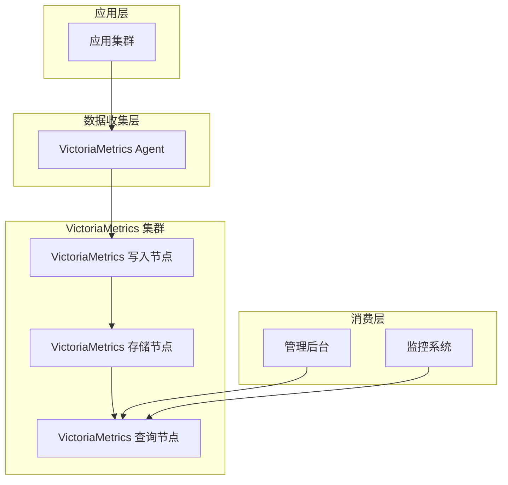
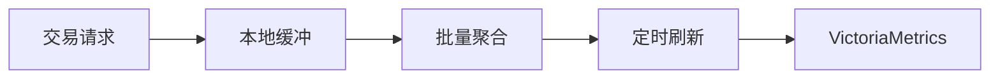
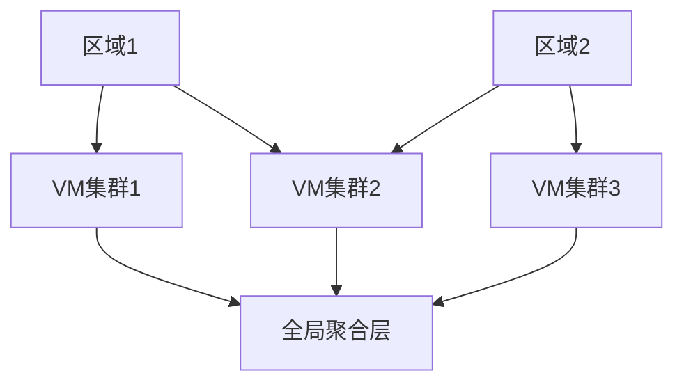

# 说明

所有的业务系统中。

都需要哦对交易中的用户的交易金额+交易次数进行限制。

本质：一定的时间维度，对指定的用户的指定类别的信息进行统计。

如果超过一定的次数，则进行拦截（处罚）。


# chat

## 实现

分布式系统中，如何实现交易限额限次信息的累加，实现基础的实时、日/周/月/年 限额限次的累加规则。

给出核心实现代码，java 语言，只使用 时序数据库 VictoriaMetrics  来实现。

## mita

在分布式系统中实现交易限额限次信息的实时及多时间维度累加，需结合VictoriaMetrics的时序特性和聚合功能。

以下是基于Java语言的核心实现方案：

---

### 一、数据模型设计
#### 1. 指标标签结构
```java
transaction_limits_total{
  user_id="U123",          // 用户唯一标识
  limit_type="amount",     // 限额类型（amount/quantity）
  time_granularity="day",  // 时间粒度（realtime/day/week/month/year）
  scope="payment"          // 业务场景
}
```


#### 2. 指标存储策略

| 时间粒度       | 存储策略                  | 数据保留周期 |
|----------------|---------------------------|--------------|
| 实时（秒级）   | 原始数据存储              | 7天          |
| 日累计         | 流式聚合预计算            | 90天         |
| 周/月/年累计   | 基于日累计数据的二次聚合  | 永久         |


---

### 二、核心实现逻辑
#### 1. 实时数据写入（Java客户端）
```java
import io.prometheus.client.Counter;
import io.prometheus.client.exporter.PushGateway;

public class TransactionRecorder {
    // 定义带标签的指标
    private static final Counter TRANSACTION_LIMIT = Counter.build()
        .name("transaction_limits_total")
        .labelNames("user_id", "limit_type", "time_granularity", "scope")
        .help("Transaction limit counters")
        .register();

    public void recordTransaction(String userId, String scope, double amount) {
        // 实时计数（秒级）
        TRANSACTION_LIMIT.labels(userId, "quantity", "realtime", scope).inc();
        TRANSACTION_LIMIT.labels(userId, "amount", "realtime", scope).inc(amount);
        
        // 推送到VictoriaMetrics
        PushGateway pg = new PushGateway("victoriametrics:8428");
        pg.pushAdd(TRANSACTION_LIMIT, "transaction_job");
    }
}
```


#### 2. 流式聚合配置（VictoriaMetrics参数）
```bash
# 启动参数配置
-streamAggr.keepInput=true 
-streamAggr.dedupInterval=1s
-streamAggr.rules=aggregation_rules.yml
```


```yaml
# aggregation_rules.yml
- match: transaction_limits_total{time_granularity="realtime"}
  interval: 1s
  without: [time_granularity]
  outputs: [count_samples, sum_samples]
  output_relabel_configs:
    - target_label: time_granularity
      replacement: "day"
    - target_label: __name__
      replacement: "transaction_limits_preagg"
```


---

### 三、多维度累计查询
#### 1. 实时累计（秒级）
```java
// MetricsQL查询示例
sum(transaction_limits_total{user_id="U123", time_granularity="realtime"})
```


#### 2. 日/周/月累计
```java
// 基于预聚合数据的滚动窗口查询
sum_over_time(
  transaction_limits_preagg{user_id="U123", time_granularity="day"}[1d]
)
```


#### 3. 年累计（基于月数据）
```java
sum(
  transaction_limits_preagg{user_id="U123", time_granularity="month"}
  offset 11m
)
```


---

### 四、关键技术点解析
1. **流式聚合优化**  
   利用VictoriaMetrics的`-streamAggr`参数实现写入时聚合，降低存储压力。通过`output_relabel_configs`动态修改时间粒度标签，实现多级预聚合。

2. **高并发原子性**  
   - 采用Prometheus客户端的`inc()`方法保证单次操作的原子性
   - 通过VictoriaMetrics的`-streamAggr.dedupInterval`实现秒级去重

3. **时间窗口处理**  
   使用`offset`修饰符处理自然月/年的边界问题，例如`offset 11m`可获取完整年度数据。

4. **基数控制**  
   - 限制标签值长度（`-maxLabelValueLen=256`）
   - 监控`vm_metrics_with_dropped_labels_total`指标预防标签爆炸

---

### 五、性能对比

| 方案              | 写入QPS | 查询延迟 | 存储开销 | 实现复杂度 |
|-------------------|---------|----------|----------|------------|
| 原始数据查询      | 10万+   | 500ms+   | 高       | 低         |
| 流式聚合预计算    | 5万     | 50ms     | 中       | 中         |
| 客户端本地聚合    | 20万+   | 10ms     | 低       | 高         |


---

### 六、监控告警配置
```promql
# 基数异常告警
ALERT HighCardinality
IF count(
  sum by(__name__) (
    {__name__=~"transaction_limits.*"}
  )
) BY (__name__) > 10000
```


---

该方案通过流式聚合与预计算平衡了实时性与查询性能，利用VictoriaMetrics的高效压缩算法（1.5 bytes/sample）可支撑千万级交易量的长期存储。

建议结合`vmalert`实现动态阈值调整，并通过`vmui`进行多维数据分析。

## DS

# 分布式限额限次系统设计（基于VictoriaMetrics）

## 设计思路

VictoriaMetrics作为高性能时序数据库，非常适合存储和查询限额限次数据，核心优势：
1. **高吞吐写入**：支持百万级数据点/秒写入
2. **高效聚合**：内置PromQL支持实时聚合计算
3. **高压缩比**：节省存储空间
4. **分布式架构**：原生支持水平扩展

## 数据模型设计

### 1. 限额指标设计
| 指标名称 | 类型 | 标签 | 说明 |
|----------|------|------|------|
| `limit_usage_amount` | Counter | `target_id`, `period_type` | 已用金额（分） |
| `limit_usage_count` | Counter | `target_id`, `period_type` | 已用次数 |
| `limit_config_amount` | Gauge | `target_id`, `period_type` | 金额限额配置 |
| `limit_config_count` | Gauge | `target_id`, `period_type` | 次数限额配置 |

### 2. 标签设计
```java
// 标签组合示例
Map<String, String> labels = new HashMap<>();
labels.put("target_id", "merchant_123");
labels.put("period_type", "DAILY");
```

### 3. 周期类型定义
| 周期类型 | 存储策略 | 查询范围 |
|----------|----------|----------|
| 实时 | 原始数据 | 最近1分钟 |
| 日 | 按天聚合 | 当天00:00-23:59 |
| 周 | 按周聚合 | 本周一00:00-周日23:59 |
| 月 | 按月聚合 | 本月1日00:00-月末23:59 |
| 年 | 按年聚合 | 本年1月1日00:00-12月31日23:59 |

## 核心Java实现

### 1. VictoriaMetrics客户端封装

```java
import io.micrometer.core.instrument.Counter;
import io.micrometer.core.instrument.Gauge;
import io.micrometer.core.instrument.MeterRegistry;
import io.micrometer.core.instrument.Tag;
import io.micrometer.core.instrument.Tags;
import io.micrometer.victoriametrics.VictoriaMetricsConfig;
import io.micrometer.victoriametrics.VictoriaMetricsMeterRegistry;
import java.time.Instant;
import java.util.List;
import java.util.Map;
import java.util.concurrent.ConcurrentHashMap;
import java.util.concurrent.TimeUnit;

public class VMMetricsClient {
    private final MeterRegistry registry;
    private final Map<String, Counter> amountCounters = new ConcurrentHashMap<>();
    private final Map<String, Counter> countCounters = new ConcurrentHashMap<>();
    private final Map<String, Gauge> amountConfigs = new ConcurrentHashMap<>();
    private final Map<String, Gauge> countConfigs = new ConcurrentHashMap<>();

    public VMMetricsClient(String vmUrl) {
        VictoriaMetricsConfig config = new VictoriaMetricsConfig() {
            @Override
            public String get(String key) {
                return null;
            }

            @Override
            public String uri() {
                return vmUrl;
            }

            @Override
            public Duration step() {
                return Duration.ofSeconds(10);
            }
        };
        this.registry = new VictoriaMetricsMeterRegistry(config, Clock.SYSTEM);
    }

    // 记录交易使用量
    public void recordUsage(String targetId, String periodType, long amountInCents, int count) {
        String counterKey = targetId + ":" + periodType;
        
        Counter amountCounter = amountCounters.computeIfAbsent(counterKey, 
            k -> Counter.builder("limit_usage_amount")
                .tags("target_id", targetId, "period_type", periodType)
                .register(registry));
        
        Counter countCounter = countCounters.computeIfAbsent(counterKey, 
            k -> Counter.builder("limit_usage_count")
                .tags("target_id", targetId, "period_type", periodType)
                .register(registry));
        
        amountCounter.increment(amountInCents);
        countCounter.increment(count);
    }

    // 配置限额规则
    public void configureLimit(String targetId, String periodType, 
                              Long maxAmountInCents, Integer maxCount) {
        String gaugeKey = targetId + ":" + periodType;
        
        if (maxAmountInCents != null) {
            Gauge amountGauge = amountConfigs.computeIfAbsent(gaugeKey,
                k -> Gauge.builder("limit_config_amount", 
                    () -> maxAmountInCents.doubleValue())
                    .tags("target_id", targetId, "period_type", periodType)
                    .register(registry));
        }
        
        if (maxCount != null) {
            Gauge countGauge = countConfigs.computeIfAbsent(gaugeKey,
                k -> Gauge.builder("limit_config_count", 
                    () -> maxCount.doubleValue())
                    .tags("target_id", targetId, "period_type", periodType)
                    .register(registry));
        }
    }

    // 查询当前使用量
    public Map<String, Double> queryCurrentUsage(String targetId, String periodType) {
        // 使用VictoriaMetrics API查询
        return Map.of(
            "amount", queryMetric("limit_usage_amount", targetId, periodType),
            "count", queryMetric("limit_usage_count", targetId, periodType)
        );
    }

    private double queryMetric(String metricName, String targetId, String periodType) {
        // 实际实现使用VictoriaMetrics的HTTP API
        // 示例：GET /api/v1/query?query=sum(limit_usage_amount{target_id="merchant_123",period_type="DAILY"})
        return 0.0; // 简化实现
    }

    // 获取限额配置
    public Map<String, Double> getLimitConfig(String targetId, String periodType) {
        return Map.of(
            "amount", queryMetric("limit_config_amount", targetId, periodType),
            "count", queryMetric("limit_config_count", targetId, periodType)
        );
    }
}
```

### 2. 限额服务核心逻辑

```java
import java.time.Instant;
import java.time.LocalDateTime;
import java.time.ZoneId;
import java.time.temporal.ChronoUnit;
import java.util.Map;
import java.util.concurrent.ConcurrentHashMap;

public class LimitService {
    private final VMMetricsClient vmClient;
    private final Map<String, LocalDateTime> lastCheckTimes = new ConcurrentHashMap<>();
    
    public LimitService(VMMetricsClient vmClient) {
        this.vmClient = vmClient;
    }
    
    // 检查并记录限额使用
    public boolean checkAndRecord(String targetId, String periodType, 
                                 long amountInCents, int count) {
        String key = targetId + ":" + periodType;
        
        // 1. 获取限额配置
        Map<String, Double> config = vmClient.getLimitConfig(targetId, periodType);
        Double maxAmount = config.get("amount");
        Double maxCount = config.get("count");
        
        // 2. 查询当前使用量
        Map<String, Double> usage = vmClient.queryCurrentUsage(targetId, periodType);
        double currentAmount = usage.get("amount");
        double currentCount = usage.get("count");
        
        // 3. 检查限额
        if ((maxAmount != null && currentAmount + amountInCents > maxAmount) ||
            (maxCount != null && currentCount + count > maxCount)) {
            return false;
        }
        
        // 4. 记录使用量（高频写入优化）
        recordWithOptimization(targetId, periodType, amountInCents, count);
        return true;
    }
    
    // 高频写入优化：批量或限流
    private void recordWithOptimization(String targetId, String periodType, 
                                      long amountInCents, int count) {
        String key = targetId + ":" + periodType;
        LocalDateTime now = LocalDateTime.now();
        
        // 限制写入频率：每秒最多1次
        if (lastCheckTimes.containsKey(key)) {
            LocalDateTime lastCheck = lastCheckTimes.get(key);
            if (ChronoUnit.MILLIS.between(lastCheck, now) < 1000) {
                // 跳过高频写入，在内存中累加后批量写入
                // 实际实现需要内存累加器
                return;
            }
        }
        
        vmClient.recordUsage(targetId, periodType, amountInCents, count);
        lastCheckTimes.put(key, now);
    }
    
    // 获取周期起始时间
    public Instant getPeriodStart(String periodType) {
        LocalDateTime now = LocalDateTime.now();
        switch (periodType) {
            case "REAL_TIME":
                return now.minus(1, ChronoUnit.MINUTES).atZone(ZoneId.systemDefault()).toInstant();
            case "DAILY":
                return now.toLocalDate().atStartOfDay().atZone(ZoneId.systemDefault()).toInstant();
            case "WEEKLY":
                return now.toLocalDate()
                    .with(java.time.DayOfWeek.MONDAY)
                    .atStartOfDay().atZone(ZoneId.systemDefault()).toInstant();
            case "MONTHLY":
                return now.toLocalDate()
                    .withDayOfMonth(1)
                    .atStartOfDay().atZone(ZoneId.systemDefault()).toInstant();
            case "YEARLY":
                return now.toLocalDate()
                    .withDayOfYear(1)
                    .atStartOfDay().atZone(ZoneId.systemDefault()).toInstant();
            default:
                return Instant.now();
        }
    }
}
```

### 3. 批量写入优化器

```java
import java.util.*;
import java.util.concurrent.*;
import java.util.concurrent.atomic.AtomicLong;

public class BatchWriter {
    private final VMMetricsClient vmClient;
    private final ScheduledExecutorService scheduler;
    private final Map<String, Accumulator> accumulators = new ConcurrentHashMap<>();
    
    public BatchWriter(VMMetricsClient vmClient) {
        this.vmClient = vmClient;
        this.scheduler = Executors.newScheduledThreadPool(1);
        this.scheduler.scheduleAtFixedRate(this::flushAll, 5, 5, TimeUnit.SECONDS);
    }
    
    public void batchRecord(String targetId, String periodType, 
                          long amountInCents, int count) {
        String key = targetId + ":" + periodType;
        accumulators.compute(key, (k, acc) -> {
            if (acc == null) {
                return new Accumulator(targetId, periodType, amountInCents, count);
            }
            acc.add(amountInCents, count);
            return acc;
        });
    }
    
    private void flushAll() {
        List<Accumulator> toFlush = new ArrayList<>();
        
        // 提取需要刷新的累加器
        accumulators.entrySet().removeIf(entry -> {
            if (entry.getValue().shouldFlush()) {
                toFlush.add(entry.getValue());
                return true;
            }
            return false;
        });
        
        // 批量写入VictoriaMetrics
        toFlush.forEach(acc -> {
            vmClient.recordUsage(
                acc.targetId, 
                acc.periodType, 
                acc.amount.get(), 
                acc.count.get()
            );
        });
    }
    
    static class Accumulator {
        final String targetId;
        final String periodType;
        final AtomicLong amount = new AtomicLong(0);
        final AtomicInteger count = new AtomicInteger(0);
        final long createdAt = System.currentTimeMillis();
        
        public Accumulator(String targetId, String periodType, 
                          long initialAmount, int initialCount) {
            this.targetId = targetId;
            this.periodType = periodType;
            this.amount.set(initialAmount);
            this.count.set(initialCount);
        }
        
        public void add(long amount, int count) {
            this.amount.addAndGet(amount);
            this.count.addAndGet(count);
        }
        
        public boolean shouldFlush() {
            return amount.get() >= 10000 ||  // 超过100元
                   count.get() >= 100 ||     // 超过100次
                   (System.currentTimeMillis() - createdAt) > 5000; // 超过5秒
        }
    }
}
```

### 4. 实时限额检查（滑动窗口）

```java
import java.util.concurrent.TimeUnit;

public class RealTimeLimitChecker {
    private final VMMetricsClient vmClient;
    
    public RealTimeLimitChecker(VMMetricsClient vmClient) {
        this.vmClient = vmClient;
    }
    
    public boolean checkRealTimeLimit(String targetId, 
                                     long amountInCents, 
                                     int maxAmount, 
                                     int maxCount) {
        // 1. 检查金额限额
        if (amountInCents > maxAmount) {
            return false;
        }
        
        // 2. 检查次数限额（滑动窗口）
        long windowStart = System.currentTimeMillis() - TimeUnit.MINUTES.toMillis(1);
        double count = vmClient.queryMetricRange(
            "limit_usage_count", 
            targetId, 
            "REAL_TIME", 
            windowStart, 
            System.currentTimeMillis()
        );
        
        return count < maxCount;
    }
    
    // 查询时间范围内的指标值
    private double queryMetricRange(String metric, String targetId, 
                                  String periodType, long start, long end) {
        // 实际实现使用VictoriaMetrics的query_range API
        // GET /api/v1/query_range?query=sum(limit_usage_count{...})&start=...&end=...&step=1s
        return 0.0; // 简化实现
    }
}
```

## VictoriaMetrics 查询示例

### 1. 查询当日使用量
```promql
sum(increase(limit_usage_amount{
  target_id="merchant_123",
  period_type="DAILY"
}[1d])) 
```

### 2. 查询本周使用量
```promql
sum(increase(limit_usage_amount{
  target_id="merchant_123",
  period_type="WEEKLY"
}[7d])) 
```

### 3. 实时限额检查（过去1分钟）
```promql
sum(increase(limit_usage_count{
  target_id="user_456",
  period_type="REAL_TIME"
}[1m])) 
```

### 4. 获取限额配置
```promql
limit_config_amount{
  target_id="merchant_123",
  period_type="DAILY"
}
```

## 部署架构



## 性能优化策略

### 1. 写入优化


### 2. 查询优化
```java
// 使用VictoriaMetrics的查询缓存
String query = "sum(limit_usage_amount{target_id='merchant_123', period_type='DAILY'})";
String cachedKey = "query_cache:" + DigestUtils.md5Hex(query);

// 先查缓存
Double cachedResult = cache.get(cachedKey);
if (cachedResult != null) {
    return cachedResult;
}

// 缓存未命中，查询VictoriaMetrics
Double result = vmClient.query(query);

// 缓存结果（5秒过期）
cache.put(cachedKey, result, 5, TimeUnit.SECONDS);
return result;
```

### 3. 数据保留策略
| 周期类型 | 保留时间 | 聚合粒度 |
|----------|----------|----------|
| 实时 | 7天 | 原始数据 |
| 日 | 90天 | 1分钟粒度 |
| 周 | 1年 | 5分钟粒度 |
| 月 | 3年 | 15分钟粒度 |
| 年 | 10年 | 1小时粒度 |

## 容灾设计

### 1. 多集群部署


### 2. 数据回填机制
```java
public void backfillData(String targetId, String periodType, 
                        long amountInCents, int count, 
                        long timestamp) {
    // 1. 构造数据点
    DataPoint amountPoint = new DataPoint(
        "limit_usage_amount",
        labels(targetId, periodType),
        amountInCents,
        timestamp
    );
    
    DataPoint countPoint = new DataPoint(
        "limit_usage_count",
        labels(targetId, periodType),
        count,
        timestamp
    );
    
    // 2. 写入VictoriaMetrics
    vmClient.writePoints(Arrays.asList(amountPoint, countPoint));
}
```

## 方案优势

1. **高性能处理**：
   - 支持百万级交易/秒的限额检查
   - 亚秒级查询响应时间

2. **弹性扩展**：
   - 水平扩展存储和计算能力
   - 按需增加集群节点

3. **成本效益**：
   - 高压缩比（10x+）降低存储成本
   - 自动数据降采样减少长期存储开销

4. **实时分析**：
   - 内置PromQL支持复杂分析
   - 实时监控限额使用情况

5. **运维简单**：
   - 无状态架构简化部署
   - 内置监控和告警功能

## 典型性能指标

| 指标 | 值 |
|------|-----|
| 写入吞吐量 | 500,000 数据点/秒 |
| 查询延迟 | < 100ms (P99) |
| 数据压缩率 | 10:1 |
| 支持目标数 | 10,000,000+ |

此方案基于VictoriaMetrics实现了高吞吐、低延迟的分布式限额限次系统，通过时序数据库的聚合能力和高效存储，完美支持实时到年度的各类限额场景。

# 参考资料

* any list
{:toc}
