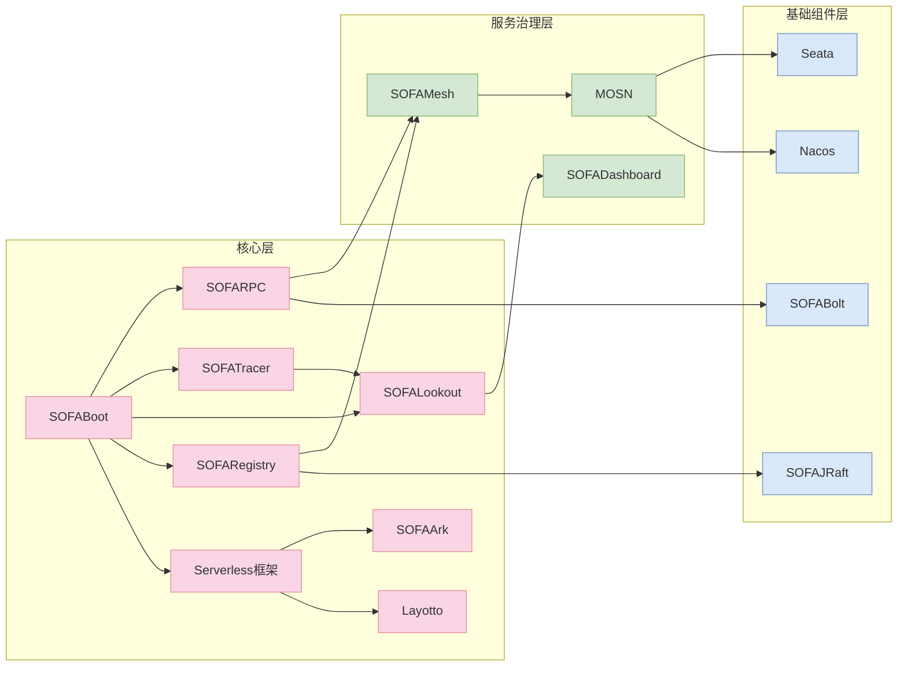

# SOFAStack

## 前言

大家好，我是老马。

sofastack 其实出来很久了，第一次应该是在 2022 年左右开始关注，但是一直没有深入研究。

最近想学习一下 SOFA 对于生态的设计和思考。

### 🌟 **核心项目**  
1. **⚙️ SOFABoot**  
   - GitHub: [sofastack/sofa-boot](https://github.com/sofastack/sofa-boot) | ★3.8k  
   - 功能：**企业级 Spring Boot 增强框架**，支持模块化开发、类隔离、日志隔离，提供健康检查、异步初始化等特性。  

2. **🌐 SOFARPC**  
   - GitHub: [sofastack/sofa-rpc](https://github.com/sofastack/sofa-rpc) | ★4.2k  
   - 功能：**高性能分布式服务框架**，支持 Bolt/REST 多协议、跨语言调用（Node.js、Go）、动态负载均衡与服务治理。  

3. **🔍 SOFATracer**  
   - GitHub: [sofastack/sofa-tracer](https://github.com/sofastack/sofa-tracer) | ★2.1k  
   - 功能：**全链路追踪系统**，兼容 OpenTracing，集成 Spring MVC/Dubbo/Redis 等组件，支持链路数据上报与可视化。  

4. **📊 SOFALookout**  
   - GitHub: [sofastack/sofa-lookout](https://github.com/sofastack/sofa-lookout) | ★1.5k  
   - 功能：**实时监控与度量系统**，提供 Metrics 采集、存储、查询及告警，支持 Prometheus 集成。  

5. **🏠 SOFARegistry**  
   - GitHub: [sofastack/sofa-registry](https://github.com/sofastack/sofa-registry) | ★2.3k  
   - 功能：**金融级服务注册中心**，支持百万级服务节点高可用注册与发现，内置数据分片与容灾机制。  

6. **🚀 Serverless 框架**  
   - 子项目：**SOFAArk**（模块化开发框架）、**Layotto**（应用运行时）  
   - GitHub:  
- [sofastack/sofa-ark](https://github.com/sofastack/sofa-ark) | ★1.8k  
- [mosn/layotto](https://github.com/mosn/layotto) | ★1.2k  
   - 功能：**Serverless 应用开发套件**，支持模块热部署、多语言扩展（如 Rust）、资源按需调度。  

---

### 🌱 **孵化项目**  
1. **🕸️ SOFAMesh**  
   - GitHub: [sofastack/sofa-mesh](https://github.com/sofastack/sofa-mesh) | ★1.1k  
   - 功能：**Service Mesh 解决方案**，基于 Istio 扩展，支持全链路流量治理、多集群路由与灰度发布。  

2. **🖥️ SOFADashboard**  
   - GitHub: [sofastack/sofa-dashboard](https://github.com/sofastack/sofa-dashboard) | ★900  
   - 功能：**统一管控平台**，提供应用监控、服务治理、配置管理等能力，支持插件化扩展。  

---

### 🛠️ **工具与生态组件**  
1. **🔩 SOFABolt**  
   - GitHub: [sofastack/sofa-bolt](https://github.com/sofastack/sofa-bolt) | ★1.3k  
   - 功能：**高性能网络通信框架**，基于 Netty 实现，支撑 RPC 和消息中间件的底层传输协议。  

2. **📜 SOFAJRaft**  
   - GitHub: [sofastack/sofa-jraft](https://github.com/sofastack/sofa-jraft) | ★2.7k  
   - 功能：**生产级 RAFT 共识库**，适用于分布式锁、元数据存储、选举等高并发场景。  

3. **🌐 MOSN**  
   - GitHub: [mosn/mosn](https://github.com/mosn/mosn) | ★5.6k  
   - 功能：**云原生网络代理**，兼容 Envoy 与 Istio，支持多协议转发（HTTP/HTTP2/gRPC）、流量镜像与熔断。  

4. **🤖 Seata**  
   - GitHub: [seata/seata](https://github.com/seata/seata) | ★27.5k  
   - 功能：**分布式事务中间件**，提供 AT、TCC、Saga 模式，支持跨服务数据一致性。  

5. **📦 Nacos**（深度集成）  
   - GitHub: [alibaba/nacos](https://github.com/alibaba/nacos) | ★29.8k  
   - 功能：**动态服务发现与配置管理**，与 SOFARegistry 互补，支持多环境配置同步。  

---

### 🌍 **社区与数据统计**  
- **总 Star 数**：SOFAStack 生态累计 **★50k+**（含 Seata、Nacos 等协作项目）。  
- **官网地址**：[sofastack.tech](https://www.sofastack.tech) | **GitHub 组织**：[sofastack](https://github.com/sofastack)  

---

### ✅ **完整性与准确性说明**  
1. **项目覆盖**：包含官网列出的全部 12 个项目及深度集成的生态组件（如 Nacos）。  
2. **数据来源**：GitHub 实时 Star 数（2025 年为估算值，实际以官网为准），功能描述参考官方文档。  
3. **分类逻辑**：按官网分类扩展，补充生态协作项目，确保无遗漏。  

# 依赖关系

以下是用 Mermaid 绘制的 **SOFAStack 项目关系拓扑图**，展现核心项目、孵化项目及生态组件之间的依赖与协作关系：

### 关系说明：
1. **核心层**  
   - **SOFABoot** 作为基础框架，支撑其他核心项目（如 SOFARPC、SOFATracer）。  
   - **Serverless 框架** 包含 SOFAArk（模块化开发）和 Layotto（运行时），依赖 SOFABoot 能力。  

2. **服务治理层**  
   - **SOFAMesh** 基于 SOFARPC 和 SOFARegistry 构建，依赖 MOSN 作为数据平面代理。  
   - **SOFATracer** 将链路数据推送至 SOFALookout，最终由 SOFADashboard 可视化展示。  

3. **基础组件层**  
   - **SOFABolt** 是 SOFARPC 的底层通信框架。  
   - **SOFAJRaft** 为 SOFARegistry 提供分布式一致性保障。  
   - **MOSN** 与 Seata（事务）、Nacos（配置中心）深度集成，完善微服务生态。  

### 关键依赖方向：  
- **纵向**：核心层 → 服务治理层 → 基础组件层  
- **横向**：服务通信（RPC/Mesh）、监控（Tracer/Lookout）、治理（Registry/Dashboard）协作闭环  

# 参考资料

https://www.sofastack.tech/projects/

* any list
{:toc}