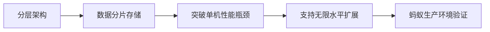
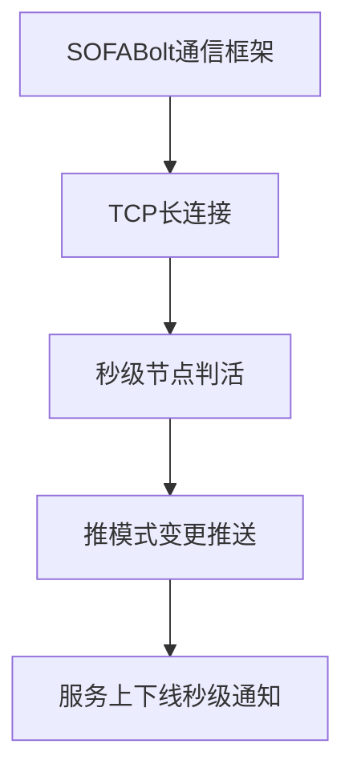
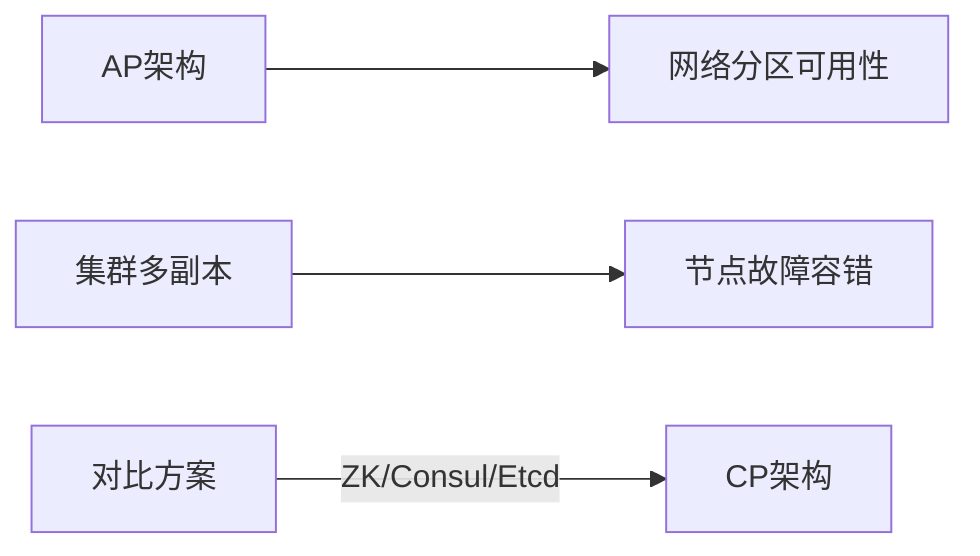
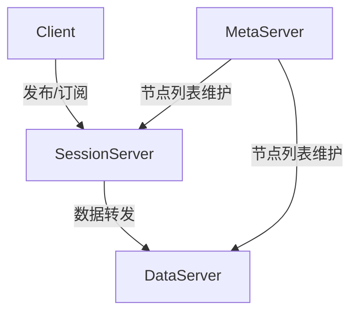

# SOFARegistry 项目简介

SOFARegistry 是蚂蚁集团开源的一个**生产级、高时效、高可用的服务注册中心**。核心亮点：
- 源自淘宝 ConfigServer，历经6代架构演进
- 支撑蚂蚁集团自有业务及合作伙伴的金融科技服务
- 兼容开源生态
- 采用 AP 架构实现秒级推送
- 分层架构支持无限水平扩展

## 产品特点

### 高可扩展性

### 高时效性

### 高可用性

## 系统架构

### Client
- 提供基础 API 接入能力
- 通过 JAR 包编程式调用
- 支持服务发布/订阅功能

### SessionServer
- 客户端接入层
- 处理发布/订阅请求
- 数据转发 DataServer
- 支持海量客户端连接

### DataServer
- 数据存储层
- 一致性 Hash 分片存储
- 多副本数据备份
- 支持 PB 级数据存储

### MetaServer
- 集群元数据管理
- 维护节点一致性列表
- 基于 SOFAJRaft 实现高可用
- 实时节点变更通知

# 术语对照表

## 业界通用术语
| 术语                      | 说明                                                                                                                                 |
|---------------------------|--------------------------------------------------------------------------------------------------------------------------------------|
| 服务（Service）           | 通过网络提供的、具有特定业务逻辑处理能力的软件功能                                                                                 |
| 服务提供者（Service Provider） | 通过网络提供服务的计算机节点                                                                                                         |
| 服务消费者（Service Consumer） | 通过网络调用服务的计算机节点。一个计算机节点可以既作为一些服务的提供者，又作为一些服务的消费者                                       |
| 服务发现（Service Discovery） | 服务消费者获取服务提供者的网络地址的过程                                                                                             |
| 服务注册中心（Service Registry） | 一种提供服务发现功能的软件系统，帮助服务消费者获取服务提供者的网络地址                                                             |
| 数据中心（Data Center）   | 物理位置、供电、网络具备一定独立性的物理区域，通常作为高可用设计的重要考量粒度。同一数据中心内网络质量较高，不同数据中心间网络质量较低 |

## SOFARegistry 约定术语
| 术语                      | 说明                                                                                                                                 |
|---------------------------|--------------------------------------------------------------------------------------------------------------------------------------|
| SOFARegistry              | 蚂蚁金服开源的服务注册中心产品，基于"发布-订阅"模式实现服务发现功能，也可用于其他"发布-订阅"场景                                      |
| 数据（Data）              | 在服务发现场景下特指服务提供者的网络地址及其它附加信息，也可表示任意发布到 SOFARegistry 的信息                                       |
| 单元（Zone）              | 单元化架构关键概念，一组发布与订阅的集合，更多内容参考异地多活单元化架构解决方案                                                     |
| 发布者（Publisher）       | 发布数据到 SOFARegistry 的节点。服务提供者是"服务提供者的网络地址及其它附加信息"的发布者                                             |
| 订阅者（Subscriber）      | 从 SOFARegistry 订阅数据的节点。服务消费者是"服务提供者的网络地址及其它附加信息"的订阅者                                             |
| 数据标识（DataId）        | 标识数据的字符串，服务发现场景通常由服务接口名、协议、版本号等信息组成                                                             |
| 分组标识（GroupId）       | 数据分类字符串，作为 DataId 的命名空间，需 DataId、GroupId、InstanceId 相同才视为同一服务                                           |
| 实例 ID（InstanceId）     | 实例 ID，作为数据标识的命名空间，需 DataId、GroupId、InstanceId 相同才视为同一服务                                                  |
| 会话服务器（SessionServer） | 负责与客户端建立 TCP 长连接、进行数据交互的服务器角色                                                                               |
| 数据服务器（DataServer）  | 负责数据存储的服务器角色，采用一致性 Hash 分片存储和多副本备份                                                                       |
| 元信息服务器（MetaServer） | 基于 Raft 协议负责集群一致性协调的服务器角色                                                                                        |

# 参考资料

https://www.sofastack.tech/projects/sofa-tracer/configuration/

* any list
{:toc}