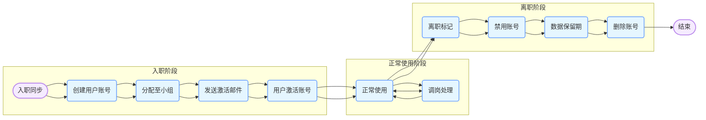

# 生命周期

真实用户的生命周期包括入职同步、激活、正常使用、调岗处理、离职回收等步骤。

可能的流程如下：

1. 入职同步（从HR系统同步）

2. 创建用户账号

3. 分配至小组

4. 发送激活邮件

5. 用户激活账号

6. 正常使用

7. 调岗处理（更新部门/小组）

8. 离职标记（HR系统触发）

9. 禁用账号

10. 数据保留期

11. 删除账号

## 状态流转流程图

以下是使用 mermaid 语法绘制的状态流转流程图：



### 流程图解释

1. **入职阶段**：从 `入职同步` 开始，依次经过 `创建用户账号`、`分配至小组`、`发送激活邮件`，最终用户 `激活账号` 进入正常使用阶段。
2. **正常使用阶段**：用户可以正常使用系统，期间可能会进行 `调岗处理`，调岗完成后继续正常使用。
3. **离职阶段**：当收到 `离职标记` 后，依次进行 `禁用账号`、`数据保留期`，最后 `删除账号`。

这个流程图清晰地展示了用户从入职到离职的整个生命周期中状态的流转过程。 

# 状态流转

我们需要添加一个 UserStatusController 控制处理用户的状态变化，控制每一层的状态流转。

原来的用户 userService insert 默认状态为 ACCOUNT_CREATED。

每一种的用户状态流转添加对应的 controller 和 service 方法实现。

其中账号的激活，需要给用户发送一封激活邮件，用户点击验证后才能激活。

需要给出对应的表设计+实现

## 状态枚举类

```java
public enum UserStatus {
    // 账号已创建但未分配到小组
    ACCOUNT_CREATED,
    // 待激活
    WAIT_ACTIVE,
    // 已激活，可正常使用系统
    ACTIVATED,
    // 正在进行调岗操作
    TRANSFERRING,
    // 已标记为离职
    MARKED_FOR_TERMINATION,
    // 账号已禁用
    DISABLED,
    // 处于数据保留期
    DATA_RETENTION,
    // 账号已删除
    DELETED
}
```

## 状态更新管理类

```java
@RestController
@RequestMapping("/api/user-status")
public class UserStatusController {

    @Autowired
    private UserStatusService userStatusService;

    @Autowired
    private UserService userService;

    @ApiOperation("发送激活码")
    @PostMapping("/send-activation/{userId}")
    public void sendActivationEmail(@PathVariable Long userId) {
        userStatusService.handleStatusTransition(userId, UserStatus.ACCOUNT_CREATED, UserStatus.WAIT_ACTIVE);
    }

    @ApiOperation("激活验证")
    @GetMapping("/activate/{token}")
    public void verifyActivation(@PathVariable String token) {
        userStatusService.verifyActivationToken(token);
    }

    @ApiOperation("正在进行调岗操作")
    @PostMapping("/transfer/{userId}")
    public void initiateTransfer(@PathVariable Long userId) {
        userStatusService.handleStatusTransition(userId, UserStatus.ACTIVATED, UserStatus.TRANSFERRING);
    }

    @ApiOperation("已标记为离职")
    @PostMapping("/mark-termination/{userId}")
    public void markForTermination(@PathVariable Long userId) {
        userStatusService.handleStatusTransition(userId, UserStatus.ACTIVATED, UserStatus.MARKED_FOR_TERMINATION);
    }

    @ApiOperation("处于数据保留期")
    @PostMapping("/data-retention/{userId}")
    public void dataRetention(@PathVariable Long userId) {
        userStatusService.handleStatusTransition(userId, UserStatus.MARKED_FOR_TERMINATION, UserStatus.DATA_RETENTION);
    }

    //-------------------- 无状态限制
    @ApiOperation("账号已禁用")
    @PostMapping("/disable/{userId}")
    public void disable(@PathVariable Long userId) {
        userService.updateStatus(userId, UserStatus.DISABLED);
    }

    @ApiOperation("删除用户")
    @PostMapping("/delete/{userId}")
    public void delete(@PathVariable Long userId) {
        userService.updateStatus(userId, UserStatus.DELETED);
    }

}
```

## 测试验证

### 创建一个基础的用户

```
curl -X POST "http://localhost:8080/api/users/create" -H "accept: */*" -H "Content-Type: application/json" -d "{ \"email\": \"1@qq.com\", \"id\": 1, \"teamId\": 1, \"userType\": \"NORMAL\", \"username\": \"john_doe\"}"
```

验证数据库

```
mysql> select * from user limit 1 \G;
*************************** 1. row ***************************
         id: 1
   username: john_doe
  user_type: NORMAL
user_status: ACCOUNT_CREATED
      email: 1@qq.com
   password: NULL
    team_id: 1
create_time: 2025-03-10 17:32:17
update_time: 2025-03-10 17:32:17
```

### 禁用

```
curl -X POST "http://localhost:8080/api/user-status/disable/1" -H "accept: */*" -d ""
```

验证数据库

```
mysql> select * from user limit 1 \G;
*************************** 1. row ***************************
         id: 1
   username: john_doe
  user_type: NORMAL
user_status: DISABLED
      email: 1@qq.com
   password: NULL
    team_id: 1
create_time: 2025-03-10 17:32:17
update_time: 2025-03-10 17:39:20
1 row in set (0.00 sec)
```


# 遇到的问题

默认原来生成的是 mybatis 的注解写法

```java
@Select("SELECT * FROM user WHERE id=#{id}")
User selectById(Long id);
```

发现对应的字段映射不到，需要修正为下面的方式：

```java
@Results({
            @Result(property = "userType", column = "user_type"),
            @Result(property = "userStatus", column = "user_status"),
            @Result(property = "teamId", column = "team_id"),
            @Result(property = "createTime", column = "create_time"),
            @Result(property = "updateTime", column = "update_time"),
            // 若还有其他不一致的字段，可在此继续添加映射
    })
@Select("SELECT * FROM user WHERE id=#{id}")
User selectById(Long id);
```

这样的话，可能还是 xml 的方式更加直观一些。

# 小结

我们只需要关注一下状态的流转，做好对应的实现即可。

我们下一篇就看如何根据 email 实现对应的发送验证邮件+验证。

# 流程图

```html
<!DOCTYPE html>
<html lang="zh">

<head>
    <meta charset="UTF-8">
    <meta name="viewport" content="width=device-width, initial-scale=1.0">
    <title>Mermaid 流程图展示</title>
    <!-- 引入 Mermaid 库 -->
    <script src="https://cdn.jsdelivr.net/npm/mermaid@10.6.1/dist/mermaid.min.js"></script>
    <script>
        // 初始化 Mermaid
        mermaid.initialize({ startOnLoad: true });
    </script>
</head>

<body>
    <!-- 放置 Mermaid 代码 -->
    <div class="mermaid">
        graph LR
            classDef startend fill:#F5EBFF,stroke:#BE8FED,stroke-width:2px;
            classDef process fill:#E5F6FF,stroke:#73A6FF,stroke-width:2px;

            A([入职同步]):::startend --> B(创建用户账号):::process
            B --> C(分配至小组):::process
            C --> D(发送激活邮件):::process
            D --> E(用户激活账号):::process
            E --> F(正常使用):::process
            F --> G(调岗处理):::process
            G --> F
            F --> H(离职标记):::process
            H --> I(禁用账号):::process
            I --> J(数据保留期):::process
            J --> K(删除账号):::process
            K --> L([结束]):::startend

            subgraph 入职阶段
            A --> B --> C --> D --> E
            end
            subgraph 正常使用阶段
            E --> F
            F <--> G
            end
            subgraph 离职阶段
            F --> H --> I --> J --> K
            end
    </div>
</body>

</html>
```

效果如下：

<!DOCTYPE html>
<html lang="zh">

<head>
    <meta charset="UTF-8">
    <meta name="viewport" content="width=device-width, initial-scale=1.0">
    <title>Mermaid 流程图展示</title>
    <!-- 引入 Mermaid 库 -->
    <script src="https://cdn.jsdelivr.net/npm/mermaid@10.6.1/dist/mermaid.min.js"></script>
    <script>
        // 初始化 Mermaid
        mermaid.initialize({ startOnLoad: true });
    </script>
</head>

<body>
    <!-- 放置 Mermaid 代码 -->
    <div class="mermaid">
        graph LR
            classDef startend fill:#F5EBFF,stroke:#BE8FED,stroke-width:2px;
            classDef process fill:#E5F6FF,stroke:#73A6FF,stroke-width:2px;

            A([入职同步]):::startend --> B(创建用户账号):::process
            B --> C(分配至小组):::process
            C --> D(发送激活邮件):::process
            D --> E(用户激活账号):::process
            E --> F(正常使用):::process
            F --> G(调岗处理):::process
            G --> F
            F --> H(离职标记):::process
            H --> I(禁用账号):::process
            I --> J(数据保留期):::process
            J --> K(删除账号):::process
            K --> L([结束]):::startend

            subgraph 入职阶段
            A --> B --> C --> D --> E
            end
            subgraph 正常使用阶段
            E --> F
            F <--> G
            end
            subgraph 离职阶段
            F --> H --> I --> J --> K
            end
    </div>
</body>

</html>


# 参考资料

* any list
{:toc}