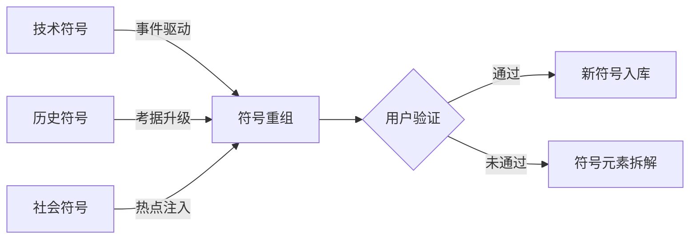

### A

根据你的背景和目标，我为你设计了一个系统化的年度涨粉计划，分为定位优化、内容生产、渠道运营、用户裂变四个阶段，以下是具体到每周的执行方案：

### **第一阶段：定位优化（第1-4周）**
**核心目标**：建立差异化账号标签
1. **用户画像分析（第1周）**
   - 导出公众号后台数据，分析现有粉丝的性别、年龄、地域、阅读偏好
   - 创建10人核心读者群，进行深度访谈（每人30分钟，赠送技术电子书）
2. **竞品矩阵拆解（第2周）**
   - 建立竞品库（10个技术号+10个历史号+5个跨界号）
   - 使用Notion制作内容分析表：爆款标题结构/内容框架/互动方式
3. **超级符号打造（第3周）**
   - 设计记忆点组合：程序员视角+跨界解读（如「用SQL分析三国战役」「用Git原理解读戊戌变法」）
   - 制作固定栏目：每周二「代码里的历史」、每周五「Bug与文明」
4. **视觉体系升级（第4周）**
   - 设计系列封面模板（历史类用敦煌色系+科技感线条，技术类用极客风）
   - 开发专属SVG交互组件（时间轴/战争地图动态演示）


## Q: 如何打造？

前面你提到超级符号打造，给出相关的核心理念+最佳实践。

你认为如果是程序员技术+历史文化爱好+实事社会热点，应该怎么切入解读，可以更好的打造对应的超级富豪？

### A

以下是针对「技术+历史+社会」跨界账号打造超级符号的系统化方案，包含核心逻辑、实践路径及具体案例：

---

### **一、超级符号核心构建逻辑**
#### **1. 认知压缩法则**
**公式**：`技术隐喻 × 历史原型 × 现实映射 = 记忆晶体`
- **技术隐喻**：用编程概念重构认知框架（如用Git分支解释朝代更迭）
- **历史原型**：挖掘集体潜意识的符号（长城→防火墙，大运河→数据管道）
- **现实映射**：连接热点事件的认知接口（芯片战→合纵连横策略）

#### **2. 符号生成矩阵**
```markdown
| 维度         | 技术侧                | 历史侧                | 社会侧                |
|--------------|-----------------------|-----------------------|-----------------------|
| **视觉符号** | 代码瀑布流            | 活字印刷术            | 社会关系拓扑图        |  
| **听觉符号** | 键盘敲击节奏          | 编钟音阶              | 城市环境音采样        |
| **交互符号** | CLI命令行交互         | 科举答题机制          | 社会实验模拟器        |
```

#### **3. 符号价值锚点**
- **技术可信度**：GitHub开源项目背书+专利级技术解析
- **历史纵深感**：国家级档案引用+专业学者认证
- **社会锐度**：热点事件48小时响应+数据可视化论证

---

### **二、三维跨界实践路径**

#### **1. 技术切入：建立认知范式**
**案例实践**：
- **数据库原理解构社会**：
  ```python
  # 用SQL类比社会阶层流动（示例）
  SELECT 上升通道 
  FROM 社会结构 
  WHERE 教育投入 > (SELECT AVG(教育投入) FROM 全民数据)
  GROUP BY 政策红利
  HAVING 资源继承率 < 30%;
  ```
  - 可视化呈现：社会流动ER图+索引优化建议
- **算法解史**：
  - 用K-Means聚类分析唐宋诗人流派
  - 实现《资治通鉴》事件相似度计算器

**符号载体**：
- 固定栏目《社会数据库周刊》
- 交互式H5「你的社会SQL查询力」

#### **2. 历史切入：构建意义网络**
**案例实践**：
- **技术考古**：
  - 逆向工程郑和宝船导航系统（对比GPS原理）
  - 用TDD模式还原《天工开物》技术验证流程
- **文明系统对比**：
  ```markdown
  | 古代系统       | 现代等效技术    | 社会启示              |
  |----------------|----------------|-----------------------|
  | 烽火台        | 网络告警系统   | 信息压缩与失真        |
  | 漕运体系      | 物流调度算法   | 资源时空平衡术        |
  ```

**符号载体**：
- 系列短视频《穿越debugger》
- 实体周边「技术文物盲盒」（含芯片残片+青铜器纹样）

#### **3. 社会切入：制造认知震荡**
**案例实践**：
- **社会系统模拟**：
  ```java
  // 用多线程模拟阶层流动（代码片段）
  class SocialMobility implements Runnable {
      public void run() {
          while(!Thread.interrupted()) {
              double education = getEducationInvestment();
              if (education > systemThreshold) {
                  upgradeSocialLayer();
              }
          }
      }
  }
  ```
- **热点镜像分析**：
  - 用RESTful API架构解构政府工作报告
  - 将房地产政策转化为技术方案评审会（PM/架构师/QA角色代入）

**符号载体**：
- 定期直播《需求评审会：社会版》
- 交互文档《GitHub社会问题Issues》

---

### **三、超级符号养成计划**

#### **1. 符号植入策略**
- **高频强化**：
  - 每篇文章嵌入「技术史三棱镜」水印（含当期技术/历史/社会符号）
  - 文末固定出现「符号解码挑战」（如破译技术密文获取历史坐标）
- **跨维触发**：
  - 当用户阅读技术文时，推送相关历史事件的Git提交记录
  - 社会热点发生时，自动生成对应历史技术解决方案报告

#### **2. 符号进化机制**


#### **3. 符号价值验证**
- **记忆度测试**：
  - 30天后随机抽样用户绘制账号印象图
  - 合格标准：70%用户能画出「代码+古纹样+社会关系线」组合
- **传播度指标**：
  - 符号相关内容分享率需≥普通内容1.8倍
  - 用户自发创作的二创符号占比＞15%

---

### **四、可持续创新保障**

#### **1. 符号生产流水线**
- **灵感采集**：
  - 开发Chrome插件「三棱镜采集器」（一键保存技术/历史/社会关联点）
  - 每月举办「跨界符号黑客松」（72小时极限创作）
- **敏捷试错**：
  ```markdown
  | 阶段   | 方法论                | 交付物                  |
  |--------|-----------------------|-------------------------|
  | 概念   | 符号可行性画布        | 三维价值定位图          |
  | 原型   | 最小符号单元测试      | A/B测试对比报告         |
  | 迭代   | 符号元素重组矩阵      | 用户认知热力图          |
  ```

#### **2. 技术赋能体系**
- **符号生成AI**：
  ```python
  # 使用GPT-4生成符号关联（示例）
  def generate_symbol(tech, history, society):
      prompt = f"技术:{tech} 历史:{history} 社会:{society}→符号:"
      return gpt4.generate(prompt)
  ```
- **自动化验证**：
  - 用CNN识别用户上传内容中的符号元素
  - 实时监测符号相关话题的社交传播链

---

### **五、阶段攻坚重点**

#### **1. 冷启动期（1-3月）**
- **符号爆破点**：打造3个「技术考古」标志性案例
- **数据验证**：符号相关内容打开率需达35%以上

#### **2. 增长期（4-6月）**
- **符号延伸**：开发「社会系统API文档」视觉体系
- **用户共创**：发起「编写人类文明SDK」开源项目

#### **3. 破圈期（7-12月）**
- **符号升维**：与博物馆合作推出「数字文物修复」认证体系
- **生态构建**：建立「跨界符号标准委员会」专家网络

---

**执行建议**：
1. 优先开发「技术-历史-社会」符号转换器（网页工具），让用户自主生成内容
2. 每季度发布《文明系统白皮书》，将技术方案、历史案例、社会问题系统化关联
3. 关键战役：在Github建立「Social Code History」组织，用代码提交记录人类文明进程

通过将TCP三次握手对应三顾茅庐、用区块链解析银票防伪技术、以微服务架构解构唐宋变革，你的账号将形成独特的认知印记。

当用户看到「docker」「青铜器」「房价」三个关键词时，能立即联想到你的内容体系，超级符号即告成功。


* any list
{:toc}