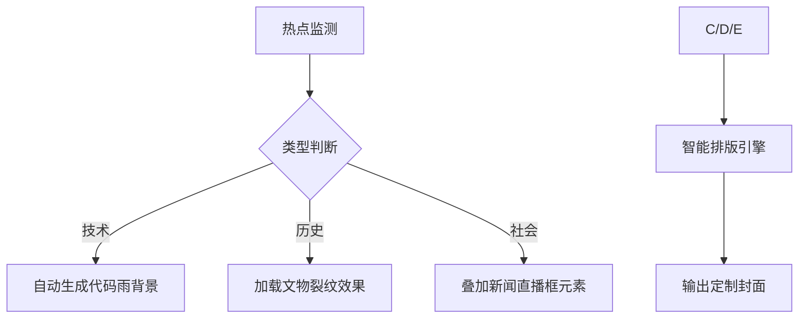

### A

根据你的背景和目标，我为你设计了一个系统化的年度涨粉计划，分为定位优化、内容生产、渠道运营、用户裂变四个阶段，以下是具体到每周的执行方案：

### **第一阶段：定位优化（第1-4周）**
**核心目标**：建立差异化账号标签
1. **用户画像分析（第1周）**
   - 导出公众号后台数据，分析现有粉丝的性别、年龄、地域、阅读偏好
   - 创建10人核心读者群，进行深度访谈（每人30分钟，赠送技术电子书）
2. **竞品矩阵拆解（第2周）**
   - 建立竞品库（10个技术号+10个历史号+5个跨界号）
   - 使用Notion制作内容分析表：爆款标题结构/内容框架/互动方式
3. **超级符号打造（第3周）**
   - 设计记忆点组合：程序员视角+跨界解读（如「用SQL分析三国战役」「用Git原理解读戊戌变法」）
   - 制作固定栏目：每周二「代码里的历史」、每周五「Bug与文明」
4. **视觉体系升级（第4周）**
   - 设计系列封面模板（历史类用敦煌色系+科技感线条，技术类用极客风）
   - 开发专属SVG交互组件（时间轴/战争地图动态演示）


## 视觉体系升级

### Q:

前面你提到视觉体系升级，给出相关的核心理念+最佳实践。

你认为如果是程序员技术+历史文化爱好+实事社会热点，应该设计封面更加有辨识度。

我的公众号昵称是：老马啸西风

### A

以下是专为「老马啸西风」公众号定制的视觉体系升级方案，融合技术、历史、社会三要素，打造具有强识别度的视觉语言系统：

---

### **一、视觉超级符号核心理念**
**1. 三原力融合公式**  
`科技未来感 × 历史厚重感 × 社会锐度 = 认知引力场`  
- **科技感**：参数化设计/光效/数据流  
- **历史感**：文物肌理/传统色系/典籍结构  
- **社会感**：热点符号/冲突对比/现实映射  

**2. 品牌基因解码**  
- **名称意象**：  
  - "老马" → 技术老兵视角/驿路文化符号  
  - "啸西风" → 数据洪流/文明变迁/社会洞察  
- **视觉转化**：  
  ```markdown
  | 关键词   | 视觉元素                    | 动态表达                |
  |----------|----------------------------|-------------------------|
  | 老马     | 青铜马首+芯片纹路           | 数据粒子重组为马形      |  
  | 啸       | 声波纹+代码流               | 音波触发文字显隐        |
  | 西风     | 敦煌飞天飘带+网络拓扑       | 飘带随滚动方向流动      |
  ```

---

### **二、封面设计系统**
#### **1. 基础网格体系**


#### **2. 三级封面模板**
**▶ 技术类封面（示例：用Redis解读丝绸之路）**  
- **结构**：  
  ```mermaid
  graph LR
    A[左侧30%] --> B(青铜器铭文底纹)
    C[右侧70%] --> D(Redis数据结构3D模型)
    E[顶部通栏] --> F("老马眼"品牌符号)
    F --> G(放射状光效连接东西元素)
  ```
- **配色**：  
  - 主色：敦煌朱砂红 (#9A3334) + 科技蓝 (#007BFF)  
  - 辅色：数据流荧光 (#00FF88)  

**▶ 历史类封面（示例：Git原理解构史记）**  
- **视觉焦点**：  
  - 竹简纹理承载Git分支图  
  - commit记录用篆刻印章呈现  
- **动态效果**：  
  - Hover时竹简展开显示代码  
  - 点击印章跳转GitHub仓库  

**▶ 社会类封面（示例：用K8s调度解读春运）**  
- **冲突设计**：  
  - 左侧：古代驿站驿马雕塑  
  - 右侧：高铁网络数据可视化  
  - 连接处：调度算法公式烫金效果  

#### **3. 品牌符号系统**
**▶ 超级符号「老马眼」**  
  
- **构成要素**：  
  - 外圈：甲骨文"目"字变形  
  - 虹膜：电路板纹路+敦煌藻井  
  - 瞳孔：实时热点关键词轮播  

**▶ 辅助图形「西风纹」**  
- **生成逻辑**：  
  ```python
  # 用L-system生成风纹（示例）
  def draw_wind_pattern(iterations):
      axiom = "F--F--F"
      rules = {"F": "F+F--F+F"}
      pattern = generate_Lsystem(iterations, axiom, rules)
      add_texture(huoyanwen)  # 火焰纹肌理
      return pattern
  ```
- **应用场景**：分隔线/背景纹/动态边框  

---

### **三、动态视觉增强**
#### **1. SVG交互封面**
- **技术实现**：  
  ```html
  <!-- 可交互的丝路数据流封面 -->
  <svg>
    <path class="silk-road" d="..."/>
    <g class="data-points">
      <circle cx="..." cy="..." data-city="长安"/>
    </g>
    <animate attributeName="opacity" values="0;1;0" dur="3s" repeatCount="indefinite"/>
  </svg>
  ```
- **用户行为触发**：  
  - 点击城市节点显示当代技术数据  
  - 鼠标滑动唤醒驿马奔腾动画  

#### **2. 热点响应式设计**
**实时生成系统**：  


---

### **四、实操工具流**
#### **1. 设计生产力组合**
- **参数化设计**：Processing生成基础图形  
- **历史纹样处理**：Adobe Illustrator+文物色板插件  
- **动态效果实现**：After Effects+Lottie导出JSON  

#### **2. 自动化素材库**
```markdown
| 类别       | 资源示例                     | 更新机制               |
|------------|-----------------------------|------------------------|
| 技术元素   | 数据可视化模板/开源3D模型    | 每月同步GitHub趋势     |
| 历史元素   | 高清文物拓片/典籍版式        | 季度购买博物馆授权     |
| 社会元素   | 热点图标库/城市剪影          | 实时监测百度风云榜     |
```

---

### **五、测试验证方案**
#### **1. 视觉认知度测试**
```markdown
| 测试项           | 合格标准                     | 测量工具               |
|------------------|-----------------------------|------------------------|
| 3秒品牌识别      | 90%用户能说出"老马"相关意象  | 眼动仪+快速闪现测试    |
| 内容类型判断     | 85%用户正确区分技术/历史/社会| 封面AB分类测试         |
| 符号记忆度       | 70%用户手绘包含西风纹+老马眼 | 一周后回忆测试         |
```

#### **2. 数据化评估指标**
- **传播系数** = (分享率/1.8) × (完读率/0.6)  
- **视觉效能值** = 封面点击率 × 热区停留时长  

---

### **六、阶段执行计划**
**1. 品牌符号攻坚（第1月）**  
- 完成「老马眼」符号的10版迭代测试  
- 建立西风纹参数化生成系统  

**2. 动态体系搭建（第2月）**  
- 开发3套SVG交互模板  
- 实现热点封面实时生成API  

**3. 生态扩展（第3月）**  
- 发布开源设计组件库  
- 上线用户自定义封面工具  

---

**执行建议**：  
1. 在Canva建立品牌专属模板库，设置：  
   - 字体：阿里巴巴普惠体+方正清刻本悦宋  
   - 颜色：主色3组+辅助色7组+应急色5组  
2. 制作《视觉手册》开源PDF，包含：  
   - 封面网格系统使用规范  
   - 动态元素交互逻辑说明  
   - 品牌符号禁用案例展示  

通过将青铜器上的云雷纹转化为数据流纹样，让每张封面都成为「技术考古现场」。

当用户看到朱砂红与荧光蓝的碰撞，配合若隐若现的驿马剪影，即可瞬间识别「老马啸西风」的内容气质。

## 每一篇文章的封面如何保持风格统一+体现内容+引用用户？每次都重新做会浪费大量的时间，而且风格不统一

------------------------------------------------------------------------------------------------------

# kimi

## 核心理念

一致性 ：确保所有的视觉元素，包括颜色、字体、图像风格等，在不同的应用场景下保持一致，这样可以增强品牌的辨识度和记忆点，让用户在看到这些视觉元素时能够迅速联想到你的公众号。

独特性 ：视觉体系需要有独特的设计，能够与同类公众号区分开来。这可以通过独特的色彩搭配、创新的图像设计或者别具一格的排版方式来实现，让用户对你的公众号产生深刻的印象。

传达品牌价值 ：视觉体系不仅仅是外观上的设计，还应该能够传达出公众号的品牌价值和定位。例如，如果你的公众号注重技术深度和历史文化底蕴，那么视觉体系可以体现出专业、稳重和文化气息。

适应性 ：随着时代的发展和用户审美的变化，视觉体系需要具有一定的适应性，能够根据不同的平台和设备进行优化和调整，同时也要能够适时地进行更新和升级，以保持新鲜感和吸引力。

## 最佳实践

色彩搭配 ：选择 2 - 3 种主色调，并搭配一些辅助色彩。主色调应该能够体现公众号的定位和风格，例如，技术类公众号可以使用蓝色、灰色等冷色调来传达专业和严谨的感觉；历史文化类公众号可以使用棕色、黄色等暖色调来营造古老和厚重的氛围。辅助色彩可以用于强调重要信息或者增加视觉层次感。

字体选择 ：使用简洁、易读的字体，并确保在不同的字号下都能保持清晰。可以为公众号选择一种专属的字体，或者对常用字体进行一些个性化的调整，如加粗、倾斜等，以增强品牌的独特性。同时，要注意字体的版权问题，避免使用未经授权的字体。

图像设计 ：根据公众号的内容主题，设计或选择具有代表性的图像。例如，对于技术文章，可以使用代码、电路板等与技术相关的图像；对于历史文化文章，可以使用古代文物、历史建筑等图像；对于实事社会热点文章，可以使用相关的新闻图片或者具有象征意义的图像。图像的设计风格要保持一致，可以采用插画、摄影、图标等形式，但要确保整体风格的统一。

排版布局 ：合理的排版布局能够让用户更轻松地阅读和浏览公众号的内容。要遵循简洁、清晰的原则，避免过于复杂和拥挤的排版。可以使用网格系统来规范文字和图像的排列，确保页面的整洁和有序。同时，要注意留白的运用，适当的留白能够让页面看起来更加舒适和美观。

品牌标识 ：设计一个简洁而富有创意的品牌标识，放置在公众号的显眼位置，如头像、封面等。品牌标识可以是公众号的昵称、logo 或者其他具有代表性的符号，要能够让人一眼就记住。品牌标识的设计要与整体视觉体系相协调，形成一个统一的品牌形象。

## 封面设计建议

结合元素 ：将程序员技术、历史文化、实事社会热点这三个元素进行巧妙的结合。例如，可以使用一个古代的马（与昵称 “老马啸西风” 相呼应）作为主要图像，马的身上可以装饰一些代码或者电路板的图案，代表着技术元素；在马的周围可以环绕一些与历史文化相关的符号，如古代的书籍、文物等；同时，在封面的某个角落可以放置一些与实事社会热点相关的图标或者文字，如新闻标题、热点事件的关键词等。

色彩运用 ：选择一种具有复古感的色彩作为主色调，如深棕色或者暗红色，来体现历史文化底蕴；再搭配一些明亮的色彩，如蓝色或者黄色，用于突出技术元素和热点事件，增加封面的活力和吸引力。同时，要注意色彩之间的搭配和过渡，避免过于刺眼或者不协调。

字体设计 ：使用一种具有艺术感的字体来书写公众号昵称 “老马啸西风”，可以对字体进行一些变形或者装饰，使其更具个性和特色。在昵称的下方或者旁边，可以使用简洁的字体标注公众号的定位，如 “技术 + 历史 + 热点”，让用户能够快速了解公众号的内容主题。

图像风格 ：采用插画风格来设计封面图像，插画风格具有较强的可塑性和艺术表现力，能够将不同的元素进行有机的融合，营造出独特的视觉效果。同时，插画风格也具有一定的亲和力和趣味性，能够吸引用户的注意力。

通过以上的核心理念和最佳实践，以及针对你的公众号情况设计的封面建议，可以帮助你打造一个具有辨识度和吸引力的公众号视觉体系，提升公众号的品牌形象和影响力。


## 我见过一个公众号，纯黑色背景+明星帅哥美女。比较醒目，但是这样不侵犯肖像权吗？

如果一个公众号使用明星的肖像（如帅哥美女的照片）作为封面或内容，而没有获得明星本人的同意，这种行为很可能侵犯了肖像权。根据《中华人民共和国民法典》的规定，未经肖像权人同意，不得制作、使用、公开肖像权人的肖像，法律另有规定的除外。

在实际案例中，有公众号因未经明星同意使用其肖像而被起诉并被判侵权。例如，某公众号未经明星同意使用其照片作为配图，被认定为侵犯肖像权，需承担法律责任。此外，还有案例显示，即使公众号使用的是明星的剧照或公开发布的照片，如果没有获得授权，也可能构成侵权。

因此，如果该公众号未经明星本人同意使用其肖像，尤其是以营利为目的（如吸引用户关注、提升公众号知名度等），则可能构成侵权。这种行为不仅可能面临法律诉讼，还可能需要承担相应的赔偿责任。

## 如何设计文章封面？


为了让每一篇文章的封面保持风格统一、体现内容、引用用户，同时提高设计效率，避免每次都浪费大量时间，以下是一些建议：

### 保持风格统一

确定主色调 ：选择 1 - 2 种与公众号定位相符的主色调，如技术类可选蓝色、灰色，历史文化类可选棕色、黄色等，并在所有封面上保持一致。

统一字体 ：使用简洁、易读且具有特色的字体，确保标题和正文文字风格统一。

固定模板 ：设计一个固定的封面模板，包括布局、装饰元素等，如在图片周围添加边框、在固定位置放置公众号 logo 等。

### 体现内容

图片选择 ：根据文章主题选择与之相关的高质量图片，确保图片与内容契合。例如，技术文章可使用代码、电路板等图片；历史文化文章可使用古代文物、历史建筑图片；社会热点文章可使用相关新闻图片。

标题设计 ：在封面上突出文章标题，标题字数控制在 20 字内，放置在图片的显眼位置，如中央或上方。

### 引用用户

用户评论或反馈 ：在封面上引用用户的精彩评论或反馈，如 “粉丝热评：XXX” ，增加用户参与感和互动性。

用户生成内容 ：使用用户提供的图片或内容作为封面元素，如用户拍摄的相关照片、用户创作的与文章主题相关的绘画等，但需确保获得用户授权。

### 提高设计效率

使用设计工具 ：利用壹伴助手、稿定设计等设计工具，这些工具提供丰富的模板和设计元素，可快速制作封面。

创建模板 ：在设计工具中创建自己的专属模板，将固定元素如公众号 logo、边框、字体等设置好，每次制作封面时直接套用模板，只需更换图片和标题即可。

批量制作 ：如果有多篇文章需要制作封面，可以批量选择图片和标题，一次性生成多个封面，提高效率。

* any list
{:toc}