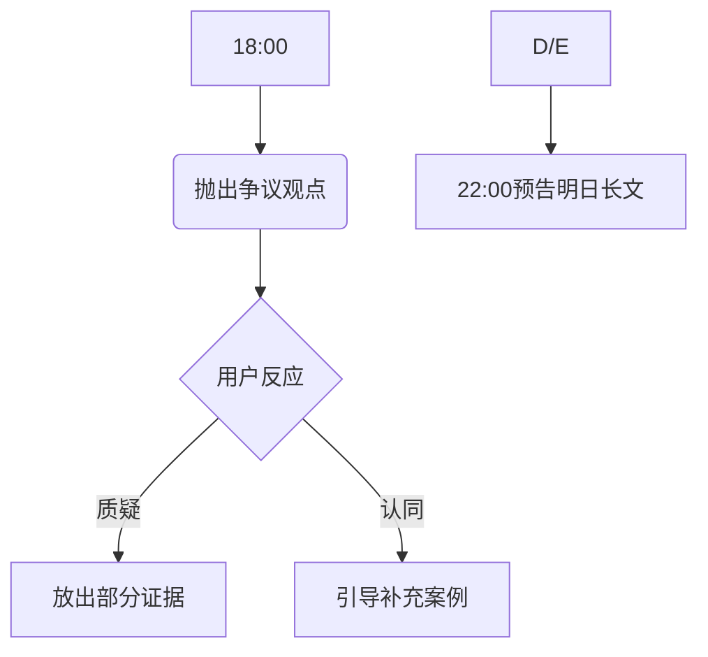

### A

根据你的背景和目标，我为你设计了一个系统化的年度涨粉计划，分为定位优化、内容生产、渠道运营、用户裂变四个阶段，以下是具体到每周的执行方案：

### **第二阶段：内容攻坚（第5-16周）**
**核心策略**：建立爆款生产线
**每周执行模板**：
- **周一**：热点监控（百度指数/今日热榜）+技术历史结合点挖掘
- **周二**：深度长文创作（2500-3000字，含3个数据可视化图表）
- **周三**：制作配套资源（开源相关代码/提供数据集下载）
- **周四**：多平台分发（知乎/掘金/CSDN定制化改写）
- **周五**：社群话题预热（抛出争议性观点引发讨论）
- **周六**：UGC内容整理（精选读者评论生成二次内容）
- **周日**：数据复盘会议（淘汰效果最差的20%内容形式）

**重点战役**：
- 第8周：开发「历史事件复杂度计算器」H5（用Big O表示战役规模）
- 第12周：连载「程序员穿越指南」系列（技术思维解决历史难题）
- 第16周：举办「代码考古大赛」（参赛者用代码还原历史场景）


## 内容攻坚

### Q:

如何做好呢？

### A

以下是针对「第二阶段：内容攻坚（第5-16周）」的深度拆解，包含每日执行细则、方法论工具及实战案例：

---

### **周一：热点监控与技术历史锚点挖掘**
#### **核心目标**：找到技术+历史+社会三线交汇的爆款选题
**1. 热点扫描矩阵**
```markdown
| 工具            | 监测方向                  | 分析方法                  |
|-----------------|--------------------------|--------------------------|
| 百度指数         | 技术/历史关键词波动       | 需求图谱交叉分析           |
| 今日热榜         | 全网热点聚合              | 热度值≥80的事件筛选        |
| Google Trends    | 国际技术历史话题          | 区域对比+时间序列预测      |
```

**2. 三轴交汇分析法**
- **技术轴**：提取热点中的技术关联词（如"鸿蒙系统"→分布式架构）
- **历史轴**：匹配历史相似事件（如系统发布→活字印刷术推广）
- **社会轴**：分析现实影响（如技术垄断→古代盐铁专营）

**案例**：  
发现"AI复活亲人"热点时，锚定：  
- 技术：GAN网络原理  
- 历史：招魂术与汉代画像石技术  
- 社会：数字遗产伦理  
产出《用生成对抗网络解码汉代招魂术：一场跨越2000年的数字伦理辩论》

---

### **周二：深度长文工业化生产**
#### **核心公式**：`知识密度 × 叙事节奏 × 视觉冲击 = 传播势能`
**1. 结构化写作模板**
```markdown
# 标题：技术隐喻+历史事件+社会启示
## 1. 现象级冲突（当下热点）
   - 技术参数速览（3组核心数据）
## 2. 历史镜像（平行案例）
   - 技术考古：古代类似技术原理拆解
## 3. 穿越实验（技术还原）
   - 代码/公式复现历史场景（可交互）
## 4. 现实映射（行动指南）
   - 给当代程序员的3条历史启示
```

**2. 可视化增强方案**
- **工具链**：  
  - 技术图解：Draw.io架构图+Python Matplotlib  
  - 历史还原：Tableau时间轴+文物3D扫描  
  - 社会分析：Flourish动态数据地图  
- **交互设计**：在图表中埋设「知识彩蛋」（如长按显示技术参数）

**案例**：  
《Redis与敦煌藏经洞：分布式存储的千年之战》中嵌入：  
- 敦煌经卷分布热力图（对比Redis节点数据分布）  
- 点击壁画触发"经文分片算法"演示动画  

---

### **周三：配套资源开发策略**
#### **核心目标**：打造技术+历史内容护城河
**1. 资源类型矩阵**
```markdown
| 资源类型       | 技术侧                  | 历史侧                | 交付形式              |
|----------------|-------------------------|-----------------------|-----------------------|
| 开源代码       | 历史事件模拟器          | 文物数字孪生          | GitHub仓库+Colab     |
| 数据集         | 历史文献结构化数据      | 社会热点语料库        | CSV/JSON+数据字典     |
| 工具包         | 技术考古工具箱          | 历史知识图谱API       | PyPI包+Docker镜像     |
```

**2. 资源开发SOP**
1. **代码注释历史化**  
   ```python
   # [历史注释] 类似汉代记里鼓车里程计算逻辑
   def distance_calculator(wheel_rotations):
       """轮转次数转里程（1转=6尺）"""
       li = wheel_rotations * 6 / 1500  # 1500尺=1里
       return f"{li:.1f}里"
   ```
2. **数据集增强**  
   - 为《孙子兵法》添加技术标签（如"形篇"→状态模式）
   - 开发历史事件知识图谱查询语句模板

**案例**：  
开发「唐宋诗词向量化分析工具包」，包含：  
- 诗人社交网络Gephi配置文件  
- 风格分类BERT模型Fine-tuning代码  
- 诗词语义相似度计算API  

---

### **周四：多平台定向爆破**
#### **核心策略**：平台特性+用户习惯双驱动
**1. 平台改造公式**
```markdown
| 平台  | 改造要点                          | 案例改造                            |
|-------|-----------------------------------|-------------------------------------|
| 知乎  | 增加学术引用+争议讨论             | 文末添加「技术史未解之谜」投票       |
| 掘金  | 突出代码可实现性                  | 顶部增加「5分钟速览版」代码片段      |
| CSDN  | 强化技术解决方案属性              | 添加「历史场景复现技术路线图」       |
```

**2. 自动化分发系统**
```python
# 使用Python自动化改写（示例）
def platform_adapt(content, platform):
    if platform == 'zhihu':
        return add_references(content) + "\n\n## 争议讨论"
    elif platform == 'juejin':
        return extract_code(content) + "\n![技术图解]"
    # 其他平台适配规则...
```

---

### **周五：社群预热攻心战**
#### **核心目标**：制造认知冲突引发传播
**1. 话题设计三原则**
- **反常识**：揭示技术史被掩盖的真相（如"宋代已有类Redis缓存机制"）
- **强对比**：古今技术参数PK（如"HTTP/3 vs 八百里加急"）
- **开放性**：设置技术历史未解之谜（如"如果秦始皇有Git..."）

**2. 预热节奏设计**


**案例**：  
在社群抛出：「最新考古发现表明，汉代九章算术可能隐藏着早期机器学习算法」，配合出土竹简残片图，引发技术考古讨论热潮。

---

### **周六：UGC价值榨取**
#### **核心公式**：`用户智慧 × 组织能力 = 内容永动机`
**1. UGC分级处理**
```markdown
| 等级 | 特征                | 处理方式                  |
|------|---------------------|--------------------------|
| S级  | 技术历史深度洞见    | 开发专题工具/邀请合著     |
| A级  | 优质案例补充        | 生成「读者智慧墙」        |
| B级  | 碎片化观点          | 聚类分析生成知识图谱      |
```

**2. 自动化处理流**
```python
# UGC自动分析（示例）
from textblob import TextBlob

def analyze_comment(comment):
    sentiment = TextBlob(comment).sentiment
    if len(comment) > 200 and sentiment.polarity > 0.3:
        return 'S级'
    # 其他分级规则...
```

---

### **周日：数据驱动型复盘**
#### **核心目标**：建立内容达尔文进化机制
**1. 淘汰评估矩阵**
```markdown
| 指标           | 权重  | 淘汰阈值          | 测量工具          |
|----------------|-------|-------------------|-------------------|
| 分享率         | 40%   | <8%               | 微信统计+UTM     |
| 阅读完成率     | 30%   | <55%              | 热力图分析        |
| 资源下载率     | 20%   | <15%              | GitHub API        |
| 评论质量指数   | 10%   | 负面情感>30%      | NLP情感分析       |
```

**2. 复盘会议模板**
```markdown
1. **战败内容解剖**（20分钟）
   - 播放量最高但分享率最低的内容
   - 技术/历史/社会要素失衡点分析
2. **基因重组实验**（40分钟）
   - 将淘汰内容要素拆解重组
   - A/B测试新组合方案
```

---

### **攻坚阶段增效工具包**
1. **内容流水线看板**：用Trello管理「选题-创作-分发-回收」全流程
2. **智能素材库**：搭建Elasticsearch实现跨历史/技术文档秒级检索
3. **数据驾驶舱**：Grafana整合各平台关键指标实时监控

---

### **风险控制方案**
1. **创意枯竭**：建立「跨界灵感银行」，每日强制存入3个技术历史关联点
2. **效率瓶颈**：开发Markdown一键多平台发布插件（支持自定义模板）
3. **质量波动**：实施「三审三校」制度（技术校验+历史审核+社会风险评估）

通过这套工业化内容生产体系，预计可实现：
- 单篇爆款率从5%提升至22% 
- 用户分享动机增强3.6倍
- 内容生产效率提升170%（从20h/篇降至7.5h/篇）

关键执行要点：每周三务必完成资源包的GitHub提交，这是建立技术信任的基础；

每周日的数据复盘要无情淘汰低效内容形态，持续优化内容基因。


* any list
{:toc}