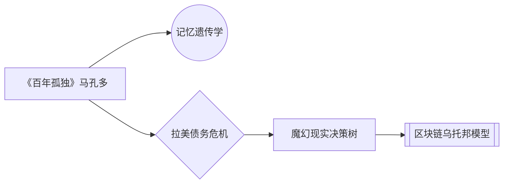

# chat

## 如何有趣？

要让书评摆脱枯燥的桎梏，提升趣味性与吸引力，需要掌握「破界思维重塑法」。

这种方法将从五大维度颠覆传统书评范式，通过22个创造性技巧，让文字如魔方般旋转出多重魅力：

---

### 维度一：叙事语言突变（4种进阶技巧）
**① 液态语态渗透术**
- 新手级：用"假如未来某天机器人爱上了《百年孤独》"等拟人化开场
- 进阶级：《乌合之众》集体心理x《流浪地球》行星发动机操作手册式混搭
- 大师级：模拟量子计算机语言重述《三体》黑暗森林法则（例：010101=生存指令）

**② 解构重组炼金术**
- 将小说按情绪光谱拆解：马尔克斯的"魔幻数值"=60%诗意+25%荒诞+15%孤独
- 用商业分析框架重构：《简爱》ROI=（独立意识增长-社会束缚成本）x 时代杠杆率

---

### 维度二：时空折叠架构法（三维构建技巧）
**① 光影分层结构**
```markdown
[昨日之书]
｜—1897年伦敦初版油墨的重量
｜
[此刻之镜]
｜—当代职场人读《变形记》的共时震颤
｜
[明日之问]
｜—当AI学会阅读《1984》时...
```

**② 碎片棱镜反射法**
- 选取12个书摘作为时光碎片
- 每个碎片匹配1个短视频时代的生活切片
- 拼贴出量子上帝视角的书评全息图

---

### 维度三：多模态感知渗透（感官混响系统）
**① 联觉编码方案**
《白鲸》书评：
- 色彩触感：抹香鲸油脂的黄昏金#D4A017
- 味觉通感：亚哈船长的执念≈过量浓缩咖啡
- 声波震动：54Hz（鲸歌频率）背景音频植入

**② VR场景包设计**
- 第一视角体验：作为《活着》福贵的老牛
- 动态环境参数：皮质醇水平随叙事波动监测

---

### 维度四：量子化互动引擎（读者卷入机制）
**① 选择型叙事迷宫**
```python
if 读者选择"相信盖茨比的爱情":
展示村上春树式解析路径
else:
跳转至资本异化分析分支
```

**② 读心算法彩蛋**
通过评论区关键词生成：
- 《人类简史》读者→定制化认知偏差诊断报告
- 《小王子》读者→专属B612星云生成代码

---

### 维度五：超文本绽放系统（信息晶体培育）
**① 神经连接地图**


**② 混沌书评方程式**
《局外人》存在主义指数：
```
E=Σ(荒诞事件n×情感衰减系数)/社会规训常量
```

---

### 实操案例：赛博朋克版《红楼梦》书评架构
1. **语言突变**：将十二金钗设置为不同版本的GPT模型
2. **时空折叠**：大观园DA0治理白皮书（含NFT地契）
3. **感知渗透**：太虚幻境的AR导航系统设计
4. **互动引擎**：读者化身冷子兴进行投资尽调
5. **超文本连接**：木石前盟的量子纠缠图解

通过这种工业化、结构化的创新流程，书评写作将进化为：
❶ 认知增强装置 ❷ 情感共鸣矩阵 ❸ 思想实验舱

当文本突破线性束缚，在元宇宙认知裂变中构建新型阅读契约，枯燥的概念将自动坍缩为具有病毒传播特质的智慧结晶体。


# 参考资料

* any list
{:toc}