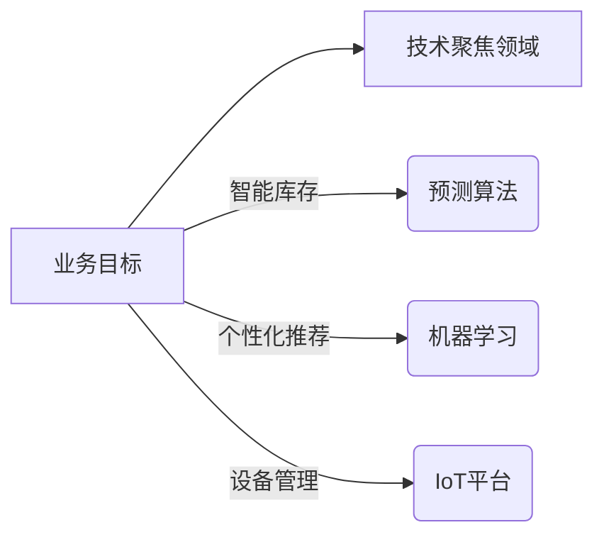

# chat

困境：新技术应该如何学习？为什么别人全新的技术可以很快学习，并且出书+教程，有哪些技巧

## 详细展开一下技术雷达构建法


### 技术雷达构建法详解

#### 一、技术雷达的定义与核心价值
技术雷达是一种动态化的技术管理工具，通过可视化方式追踪、评估和分类新兴技术趋势，为企业提供技术战略决策支持。

其核心价值在于：

1. **前瞻性洞察**：识别可能颠覆行业的新兴技术（如AI驱动的分析平台、全极化相控阵雷达技术等），并评估其成熟度。
2. **风险管控**：通过成熟度分类（如采纳/试验/评估/暂缓）平衡技术采用风险，避免盲目投入。
3. **资源优化**：将技术投资与业务战略对齐，例如纳睿雷达通过技术雷达实现军用技术民用化转型。

#### 二、核心架构设计
技术雷达的架构包含两个核心维度：
1. **四象限分类**  
   - **工具**：开发运维工具链（如Helm、Buildkite）  
   - **平台**：云原生基础设施（如Kong API Gateway）  
   - **技术**：架构方法（如零信任架构、数据网格）  
   - **语言与框架**：编程范式（如CVXPY数学建模语言）  
   象限划分可根据行业特性调整，如3D雷达行业增加"传感器技术"象限。

2. **五环成熟度评估**  

   | 环层 | 定义 | 典型应用案例 |
   |---|---|---|
   | 采纳 | 已验证价值的技术 | Apollo Federation在微服务治理中的应用 |
   | 试验 | 小范围验证的技术 | GraphQL在分布式系统的试用 |
   | 评估 | 需深入研究的潜力技术 | 激光雷达在自动驾驶中的可行性验证 |
   | 暂缓 | 暂不推荐的技术 | 企业服务总线在云原生场景的衰退 |
   | 移出 | 不再跟踪的技术 | 日志聚合工具被云原生方案取代 |


#### 三、构建方法论
**步骤1：战略对齐**  
- 定义技术战略时间跨度（3年/5年），如气象雷达系统要求1小时更新频率的实时数据处理能力  
- 确定核心评估维度：对金融行业侧重合规性，对制造业侧重生产效率提升  

**步骤2：数据采集体系搭建**  
- **多源数据整合**：  
  ```mermaid
  graph LR
  A[内部数据] --> C[技术雷达数据库]
  B[外部数据] --> C
  A -->|研发日志| A1[技术债务分析]
  B -->|Gartner报告| B1[趋势预测]
  B -->|专利数据| B2[创新密度评估]
  ```

- **智能采集工具**：采用SCOUT平台实现100倍速率的自动化技术扫描  

**步骤3：动态评估模型**  
- **量化评估指标**：  
  ```python
  # 技术评分模型示例
  def tech_score(maturity, business_impact, risk):
      return 0.4*maturity + 0.5*business_impact - 0.1*risk
  ```

- **专家评审机制**：ThoughtWorks技术委员会每季度召开全球技术战略会议  

**步骤4：可视化实现**  
- **开源工具链**：  
  - 基于D3.js的交互式雷达图  
  - Brett Dargan开发的JSON配置化工具  
- **企业级解决方案**：Tableau集成ArchiMate建模语言，展示技术架构依赖  

**步骤5：更新维护机制**  
- **更新频率**：  

  | 类型 | 更新周期 | 典型案例 |
  |---|---|---|
  | 基础架构层 | 季度更新 | X波段雷达的固件升级 |
  | 应用技术层 | 半年更新 | ThoughtWorks技术雷达发布周期 |
  | 战略新兴层 | 实时监控 | AI技术发展趋势跟踪  
- **异常处理流程**：  
  ```mermaid
  graph TD
  A[技术预警] --> B{影响评估}
  B -->|高优先级| C[专家紧急会议]
  B -->|常规更新| D[纳入季度评审]
  C --> E[制定应对方案]
  ```


#### 四、行业实践案例
1. **气象监测领域**：  
   - 北京城市气象研究院研发的SA天气雷达系统，通过1小时更新频率的循环同化预报，提升强对流天气预警精度  
   - 采用Delaunay三角剖分算法处理激光雷达数据，消除地形干扰  

2. **智能制造领域**：  
   - 纳睿雷达建立"技术可行性-产业化路径"双维度评估模型，实现相控阵雷达技术民用转化  
   - 在设备维护中引入预测性维护（PdM），通过振动分析降低30%停机时间  

3. **金融科技领域**：  
   - 某银行技术雷达设立"监管科技"专项象限，重点评估隐私计算技术的合规应用  
   - 采用CVXPY构建风险控制模型，优化投资组合  

#### 五、进阶发展方向
1. **AI增强分析**：  
   - 使用Transformer模型预测技术成熟曲线  
   - 知识图谱技术建立技术关联网络，识别协同创新机会  

2. **实时决策支持**：  
   - 边缘计算与5G结合，实现制造现场的技术决策闭环（如激光雷达数据实时处理）  

3. **生态化扩展**：  
   - 构建跨企业技术雷达联盟，共享技术评估结果（如汽车行业ADAS技术标准共建）  

#### 六、关键成功要素
1. **组织能力建设**：  
   - ThoughtWorks建立全球技术顾问委员会(TAB)，确保技术判断的专业性  
   - 培养"技术战略分析师"新型岗位，要求兼备技术深度与商业洞察  

2. **动态调整机制**：  
   - ITP公司建立技术升降级评审制度，季度更新技术定位  
   - 设置技术观测窗口期（如12个月无进展则移出雷达）  

技术雷达的构建是一个持续迭代的过程，需要结合企业战略目标、技术生态特征和组织能力基础进行定制化设计。随着AI、大数据分析等技术的深度融合，技术雷达正在从静态报告进化为智能决策系统，成为数字化时代技术管理的核心基础设施。

## 给我一个具体实际的例子，用方便理解的方式给我解释一遍

让我们通过一个 **咖啡连锁企业数字化转型** 的具体案例，用通俗易懂的方式说明技术雷达的构建和应用过程：

---

### 场景设定
**公司背景**：某拥有500家门店的连锁咖啡品牌，计划通过技术升级实现以下目标：
- 智能库存管理（减少30%原料浪费）
- 个性化推荐（提升会员客单价20%）
- 门店设备IoT化（降低15%运维成本）

---

### 技术雷达构建过程演示

#### 第一步：战略对齐（设定技术方向）
**核心问题**：  
_"我们需要哪些技术既能提升运营效率，又能增强顾客体验？"_

**决策输出**：  



---

#### 第二步：技术扫描与分类（四象限应用）
**发现的技术清单**：  

| 象限 | 技术选项 | 说明 |  
|---|---|---|  
| **工具** | Azure Machine Learning | 微软的机器学习平台 |  
| **平台** | AWS IoT Core | 设备连接管理服务 |  
| **技术** | LSTM时间序列预测 | 库存预测算法 |  
| **语言** | Python+TensorFlow | 推荐系统开发框架 |  


**筛选标准**：  
- 已有供应商合作关系（如已用AWS）  
- 社区活跃度（TensorFlow比PyTorch有更多教程）  
- 实施成本（IoT Core按设备数量收费）  

---

#### 第三步：成熟度评估（五环定位）

| 技术 | 评估结果 | 具体原因 |  
|---|---|---|  
| **AWS IoT Core** → **采纳环** | ✅ 已用于3家试点门店，设备故障率下降40% | 验证过设备状态监控功能 |  
| **LSTM预测模型** → **试验环** | 🔍 在中央厨房测试中，预测准确率85% | 需验证不同气候区的适用性 |  
| **强化学习推荐** → **评估环** | ⚠️ 技术论文显示可行，但需要数据支持 | 顾客隐私数据获取存在合规风险 |  
| **区块链溯源** → **暂缓环** | ⏸️ 供应商无法提供成熟解决方案 | 技术复杂度与ROI不匹配 |  


---

#### 第四步：实施路线图（可视化呈现）
```python
# 技术落地优先级计算模型（简化版）
def priority_score(impact, cost, risk):
    return (impact*0.6) - (cost*0.3) - (risk*0.1)

# 各技术得分示例
print(priority_score(9, 2, 1))  # IoT平台 → 得分5.3（最高优先级）
print(priority_score(7, 5, 3))  # 推荐系统 → 得分3.0（第二优先级）
```


**实施计划**：  
1. **第1季度**：在50家门店部署IoT设备监控（使用AWS IoT Core）  
2. **第2季度**：在华东区20家店运行LSTM库存预测模型  
3. **第3季度**：开发基于会员数据的轻量级推荐系统（先用规则引擎，再过渡到机器学习）  

---

#### 第五步：动态调优（现实中的调整案例）
**遇到的实际问题**：  
试点中发现 **LSTM模型在雨季预测误差增加15%**  

**技术雷达调整**：  
1. 将LSTM模型从"试验环"降级到"评估环"  
2. 新增 **Transformer时间序列模型** 进入试验环  
3. 增加气象API数据接入作为技术依赖项  

**调整结果**：  
- 新模型在雨季测试准确率提升至89%  
- 技术雷达中增加"外部数据集成"评估维度  

---

### 关键理解点总结
1. **技术雷达不是一次性报告**：  
   - 像咖啡品控一样需要持续调整，最初选择的LSTM模型在实际气候条件下暴露缺陷  

2. **业务价值导向**：  
   - 优先部署IoT设备监控（直接降低运维成本），而非急于上马高风险推荐系统  

3. **风险可视化**：  
   - 用五环图明确标出区块链技术"暂缓"的原因，避免团队在不可行方向浪费时间  

4. **动态演进能力**：  
   - 当发现气象因素影响预测时，快速引入新的数据源和技术方案  

---

通过这个例子可以看到，技术雷达就像咖啡师的 **"冲煮参数控制手册"**  ：  
- **四象限** = 选择咖啡豆、水温水质、冲煮手法、器具组合  
- **五环评估** = 根据顾客反馈调整研磨度（采纳）、测试新产区的豆子（试验）、研究冷萃工艺（评估）  
- **动态更新** = 每月根据销量数据更新推荐豆单  

最终目标都是：用系统化的方法，做出更好（且可持续优化）的技术决策。


# 参考资料

* any list
{:toc}