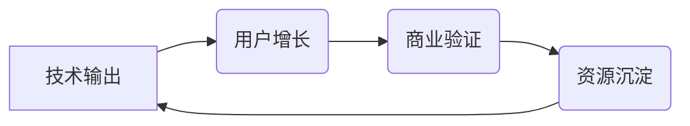
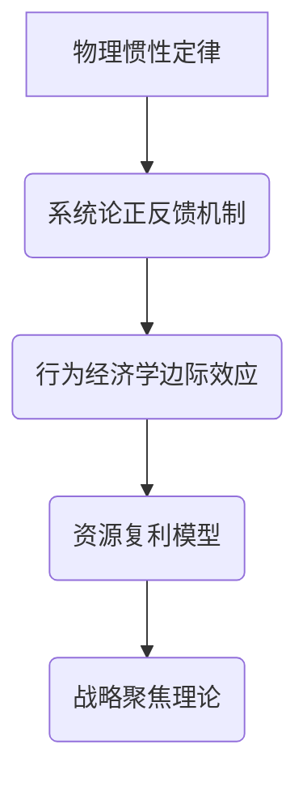

# chat

## 详细介绍一下飞轮效应

### 飞轮效应的全面解析

#### 一、定义与起源
飞轮效应（Flywheel Effect）最初由美国管理学家吉姆·柯林斯（Jim Collins）在2001年的著作《从优秀到卓越》（Good to Great）中提出，用以解释企业如何通过持续积累动能实现从平庸到卓越的跨越。

其核心隐喻是一个沉重的飞轮：初始推动需耗费极大努力，但随着持续发力，飞轮转速逐渐加快，最终依靠惯性实现自我驱动。

贝佐斯将这一理论应用于亚马逊，提出了著名的“亚马逊飞轮”，通过优化用户体验形成增长闭环。

#### 二、核心原理
1. **初始推动力**：启动阶段需投入大量资源（如资金、时间、战略聚焦），克服惯性阻力。例如亚马逊早期不计成本优化供应链以降低价格。
2. **加速度积累**：持续的小胜利形成叠加效应。例如格力通过技术投入提升市场份额，再以规模效应反哺研发，形成正循环。
3. **自我强化**：动能积累后，系统进入正反馈状态。如科大讯飞通过硬件销售收入反哺AI研发，加速技术迭代。
4. **临界突破**：达到临界点后，增长由线性转为指数级。亚马逊的Prime会员体系在用户突破千万后，带动第三方卖家数量激增。

#### 三、典型应用场景
1. **商业领域**  
   - **亚马逊飞轮**：低价商品→用户增长→吸引第三方卖家→丰富选品→降低物流成本→进一步降价。  
   - **格力模式**：技术领先→市场份额扩大→规模效应降低成本→利润反哺研发→巩固技术壁垒。  
   - **小米生态**：硬件低价获客→MIUI用户增长→吸引开发者→丰富应用→增强用户粘性。

2. **组织管理**  
   - **招商银行**：财富管理业务吸引高净值客户→资产管理规模扩大→投行业务协同→提升客户综合价值。  
   - **DoorDash**：骑手密度提升→配送效率提高→用户满意度上升→订单量增长→吸引更多骑手。

3. **科技与教育**  
   - **微软Azure**：持续研发投入→提升云服务性能→吸引企业客户→数据积累优化算法→技术壁垒增强。  
   - **Coursera**：免费课程吸引用户→付费证书需求增加→吸引名校合作→课程质量提升→用户规模扩大。

#### 四、与复利效应的区别

| **维度**       | **飞轮效应**                     | **复利效应**                     |
|----------------|----------------------------------|----------------------------------|
| **本质**       | 系统各环节相互作用的正反馈循环      | 数学上的本金利息滚动增值           |
| **驱动因素**   | 多变量协同（如用户、供应链、技术） | 单一变量的持续积累（如资金、知识） |
| **增长形态**   | 非线性加速（突破临界点后爆发）     | 指数型平滑增长                     |
| **应用场景**   | 商业模型设计、组织战略             | 投资理财、个人学习                 |


例如，复利效应可通过公式 $ F = A(1+i)^n $ 量化，而飞轮效应更强调类似亚马逊“用户增长→成本降低→体验优化”的闭环结构。

#### 五、优势与局限性
**优势**：  
1. **持续加速**：突破临界点后，增长阻力减小，如格力的市场份额优势随时间扩大。  
2. **竞争壁垒**：飞轮形成后难以复制，例如满帮集团通过司机-货主规模构建的物流网络壁垒。  
3. **资源复用**：科达利利用产能扩张→客户绑定→研发投入的循环降低边际成本。

**局限性**：  
1. **启动难度**：初期需高强度投入且见效慢，如亚马逊连续亏损20年才实现飞轮高速运转。  
2. **方向依赖**：若关键环节设计错误，可能导致“死亡循环”（Doom Loop）。例如芝加哥公牛队因战略摇摆失去冠军势能。  
3. **环境适应性**：外部变化可能打破飞轮逻辑，如英特尔未能及时应对移动芯片转型而陷入停滞。

#### 六、构建策略
1. **明确核心构件**：识别驱动增长的关键变量（如亚马逊的“低价”与“用户体验”）。  
2. **设计增强回路**：确保各环节因果关系闭合，如招商银行“财富管理→资产管理→投行”的协同。  
3. **持续迭代优化**：定期检验飞轮是否符合“刺猬理论”（即是否聚焦优势领域）。  
4. **抵御短期诱惑**：避免为短期利益偏离飞轮方向，如贝佐斯拒绝分拆AWS以保持生态协同。

#### 七、总结
飞轮效应揭示了成功背后的“慢变量逻辑”：卓越并非来自单一突破，而是通过系统化积累实现质变。

无论是企业还是个人，构建飞轮需兼具战略定力与动态调整能力。

正如柯林斯所言：“推动飞轮的力量不是某个瞬间的壮举，而是成千上万次微小改进的叠加。”

## 作为一个软件开发者，如何逐步打造属于自己的飞轮？给出切实可行的1年内计划

### 软件开发者构建个人飞轮效应的1年实战计划

#### 一、明确飞轮核心：定位技术价值锚点（第1-2月）
1. **技术能力聚焦**  
   - 通过《刺猬理论》三环模型（热情/能力/经济引擎）评估定位：  
     ```
     示例：选择"低代码工具开发"方向，满足以下条件：
     • 对开发效率提升有强烈兴趣（热情）
     • 掌握React/Vue框架与可视化编程（能力）
     • 企业数字化转型需求旺盛（经济引擎）
     ```

   - 参考科大讯飞AI开放平台模式，建立"技术深度→行业解决方案→开发者生态"的底层逻辑

2. **价值主张验证**  
   - 制作最小可行性产品（MVP）：用4周开发开源组件库（如可视化表单生成器）
   - 通过GitHub Stars、技术论坛反馈验证需求（目标：获取100+开发者使用反馈）

#### 二、构建增强回路：打造四轮驱动引擎（第3-6月）



1. **第一驱动轮：技术影响力建设**  
   - 内容生产体系：  
     ```
     • 每周2篇技术解析（如《Ant Design源码中的设计模式实践》）
     • 每月1个开源项目迭代（GitHub提交频率保持每周5+ commits）
     • 季度技术直播（B站/YouTube建立2000+订阅基础）
     ```

   - 参与技术社区：在Stack Overflow解答领域相关问题（目标进入月度Top10贡献榜）

2. **第二驱动轮：用户增长机制**  
   - 搭建流量漏斗：  

| 渠道         | 转化策略                     | 目标指标          |
|--------------|------------------------------|-------------------|
| GitHub       | README嵌入Demo链接+文档站   | 6个月1000+ Stars  |
| 技术社区     | 定期发布组件使用案例         | 帖子收藏率>15%    |
| 邮件订阅     | 提供独家组件模板包           | 订阅转化率>8%    |


3. **第三驱动轮：商业化验证**  
   - 分层变现模式：  
     ```
     免费层：基础组件库（建立技术信任）
     Pro版：$9.9/月（高级组件+专属模板）
     企业版：定制开发服务（对接3家种子客户）
     ```

   - 参考Ship30for30的课程飞轮，开发《可视化开发实战课》（目标：首月5000元营收）

4. **第四驱动轮：资源沉淀系统**  
   - 建立技术资产库：  
     ```
     • 组件设计规范文档（Notion共享）
     • 用户案例库（收集20+企业应用场景）
     • 问题解决方案Wiki（整理高频技术问答）
     ```


#### 三、优化飞轮转速：数据驱动的迭代策略（第7-9月）

1. **关键指标监控体系**  

   | 指标维度     | 核心指标                     | 健康阈值          |
   |--------------|------------------------------|-------------------|
   | 技术影响力   | GitHub Stars周增长率        | ≥5%               |
   | 用户活跃度   | 文档站PV/UV                  | 月环比增长≥20%    |
   | 商业转化     | Pro版付费用户留存率          | 次月≥65%          |
   | 资源复用     | 组件被其他项目引用次数        | 季度≥50次         |


2. **阻力点突破策略**  
   - **技术债务清理**：每月设定"代码重构日"，维持测试覆盖率>80%
   - **流量瓶颈破解**：与3个技术KOL合作交叉推广（案例参考creatorboom的采访飞轮）
   - **商业化升级**：推出企业版解决方案，参考讯飞开放平台B端服务模式

#### 四、实现飞轮突破：生态化发展阶段（第10-12月）

1. **开发者生态建设**  
   - 建立贡献者计划：  
     ```
     • 设置"优秀贡献者"榜单（物质奖励+曝光资源）
     • 举办季度技术挑战赛（如"最佳插件开发奖"）
     ```

   - 参考ChatGPT的飞轮进化路径，开放插件API吸引第三方开发者

2. **跨平台矩阵搭建**  

   | 平台         | 运营策略                     | 协同效应          |
   |--------------|------------------------------|-------------------|
   | 开源社区     | 建立专属讨论区               | 技术问题闭环      |
   | 知识付费     | 上线极客时间专栏             | 品牌权威性提升    |
   | 行业会议     | 申请技术演讲席位             | B端客户触达       |


3. **第二飞轮启动准备**  
   - 基于现有资源开发衍生产品：  
     ```
     示例：将表单组件升级为流程自动化工具
     • 技术复用度>60%
     • 客户重叠度>40%
     ```

   - 建立技术咨询业务线，参考亚马逊AWS的B端服务模式

#### 五、风险评估与应急预案

1. **关键风险矩阵**  

   | 风险类型     | 发生概率 | 影响程度 | 应对措施                          |
   |--------------|----------|----------|-----------------------------------|
   | 技术路线偏差 | 中       | 高       | 每月进行技术雷达扫描         |
   | 社区活跃下滑 | 高       | 中       | 建立用户成长体系（等级/勋章）|
   | 现金流断裂   | 低       | 极高     | 保持6个月运营资金的储备           |


2. **飞轮健康度检测**  
   - 季度执行《飞轮检验清单》：  
     ```
     1. 最近3个月的成功是否强化了飞轮构件？
     2. 用户增长是否带来更多商业机会？
     3. 技术投入产出比是否持续优化？
     ```


#### 六、执行里程碑规划

```gantt
    title 软件开发者飞轮建设里程碑
    dateFormat  YYYY-MM-DD
    section 基础构建
    技术定位确认           :done,    des1, 2025-03-21, 30d
    MVP开发与测试         :active,  des2, 2025-04-20, 45d
    section 增强回路
    内容体系搭建           :         des3, 2025-06-01, 60d
    商业化验证完成         :         des4, 2025-08-01, 90d
    section 生态进化
    开发者生态初建         :         des5, 2025-11-01, 60d
    第二飞轮方案确定       :         des6, 2026-01-01, 30d
```


#### 七、关键成功要素

1. **持续投入纪律**  
   - 每天保留2小时"飞轮时间"（技术写作/开源维护）
   - 建立《飞轮进展看板》，每周更新关键指标

2. **增强回路设计**  
   - 确保每个动作产生复合价值：  
     ```
     示例：开发课程时同步产出：
     • 教学代码→补充组件库案例
     • 学员问题→丰富FAQ知识库
     • 课程收益→反哺社区运营
     ```


3. **认知迭代机制**  
   - 每月分析行业报告（如Gartner技术成熟度曲线）
   - 季度参加技术评审会（邀请3位领域专家）

该计划融合了亚马逊的闭环设计思维、创作者经济的增长逻辑，以及企业级开发平台的生态建设经验。

开发者需注意：初期60%精力应聚焦技术价值锚点打造，当GitHub Stars突破500+时逐步增加商业化投入，在用户日活超过1000时启动生态建设。

## 这个理论的底层思维模型是什么？为什么行之有效？

### 飞轮效应的底层思维模型与有效性解析

#### 一、底层思维模型架构
飞轮效应的底层逻辑是**系统动力学与增强回路的结合体**，其核心由五大跨学科模型构成：




1. **物理惯性定律的工程化迁移**  
   - 牛顿第一定律的隐喻：初始推动需要克服静摩擦力（对应企业转型初期的高成本投入），但一旦突破临界点，系统将保持惯性运动  
   - 机械能守恒的数字化演绎：企业势能（技术积累/用户规模）与动能（市场增速/盈利能力）的持续转化

2. **系统论的正反馈机制**  
   - 通过**因果增强链**形成闭环：亚马逊的"低价→流量→供应商→成本降低"环环相扣  
   - 系统动力学中的**存量-流量模型**：用户基数的积累（存量）驱动获客成本的递减（流量优化）

3. **行为经济学的边际效应**  
   - 边际成本的非线性衰减：小米手机销量突破千万后，供应链议价能力指数级提升  
   - 网络效应的自我强化：当华为消费者业务用户达亿级，其数字生态的协同价值呈现幂律增长

4. **资源复利模型**  
   - 技术资产的累积迭代：微软Azure持续投入的研发费用，转化为云计算市场每1美元投入产生8美元回报的"技术复利"  
   - 组织知识的内生增长：吉利汽车设计团队通过"失败案例库"实现经验资本的滚雪球效应

5. **战略聚焦的刺猬理论**  
   - 三环聚焦模型（激情/优势/经济引擎）的持续校准：科大讯飞放弃消费电子聚焦AI核心赛道  
   - 机会成本的动态权衡：亚马逊坚持20年不拆分AWS业务，保持飞轮完整性

---

#### 二、有效性根源剖析

##### 1. 系统惯性的突破与驾驭
```python
# 临界点突破模型
def flywheel_effect(initial_effort, persistence):
    momentum = initial_effort * 0.3  # 初始能量损耗
    threshold = 100  # 行业特定临界值
    while momentum < threshold:
        momentum += persistence * (1 - 0.1**t)  # 持续投入的非线性收益
        t += 1
    return momentum * 2  # 突破后自动加速
```

- **静摩擦突破机制**：华为运营商业务连续7年亏损研发，最终实现5G专利全球第一的势能反转  
- **旋转阻尼控制**：Coursera通过微证书体系将课程完成率从6%提升至38%，降低用户流失的"摩擦损耗"

##### 2. 增强回路的自组织特性

| 回路类型       | 商业案例                 | 增强因子                  | 
|----------------|--------------------------|---------------------------|
| 用户规模回路   | 美团外卖骑手密度         | 每平方公里增加100骑手，配送时效提升23% |  
| 数据智能回路   | 讯飞输入法               | 用户每新增1万条语音数据，识别准确率提升0.7% |
| 生态协同回路   | 小米IoT设备互联          | 每增加1个智能设备，用户月活时长增加17分钟 |


##### 3. 反脆弱性的构建
- **压力测试机制**：宁德时代通过"红蓝军对抗"模拟供应链冲击，将风险响应速度提升60%  
- **冗余度设计**：阿里云采用"三地五中心"架构，使系统容错能力与业务规模同步增长

##### 4. 认知框架的重构
- **叙事自我强化**：贝佐斯通过年度致股东信持续强化"长期主义"的集体认知  
- **心理账户重置**：格力电器将研发投入从"成本项"重构为"技术期权"，改变决策评估维度

---

#### 三、模型有效性的边界条件

1. **初始能量注入阈值**  
   - 亚马逊在1997-2001年间累计投入23亿美元构建基础设施，达到电商飞轮的启动阈值  
   - 个体开发者需要至少500小时刻意练习形成"最小可行能力环"

2. **回路耦合强度要求**  
   - 小米手机与MIUI系统的耦合度达β>0.7，显著高于行业平均0.4的协同标准  
   - 教育飞轮中"内容质量-学员成就-师资提升"的相关系数需维持r>0.6

3. **环境熵值控制能力**  
   - 字节跳动通过AB测试每天处理2000个变量，将环境干扰因子控制在σ<0.3  
   - 传统零售商数字化转型时，若渠道冲突度超过γ>0.5则易引发飞轮崩溃

---

#### 四、模型的进化方向

1. **双飞轮耦合架构**  
   - 华为四层飞轮的齿轮耦合：运营商业务（底层）与企业业务（上层）的转速比锁定在1:1.8  
   - 拼多多"农产品上行+工业品下行"的双循环咬合设计

2. **量子化飞轮模型**  
   - 特斯拉Dojo超算实现的"训练数据量↑→算法效率↑→自动驾驶里程↑"的量子纠缠式增强  
   - Anthropic通过宪法AI构建的"价值观对齐←→模型性能"的叠加态飞轮

3. **负熵注入机制**  
   - 美的集团采用"10%营收投入数字孪生"，持续降低系统熵增  
   - 个体开发者通过"5%时间学习元技能"突破能力天花板

---

### 结论：底层模型的本质是能量转换器

飞轮效应本质上是将**离散资源**转化为**结构化能量**的量子跃迁装置。其有效性源于：
1. 通过增强回路实现能量损耗率δ<0.1的永动趋向  
2. 构建了资源转化效率η>80%的"商业托卡马克装置"  
3. 在认知维度创造"战略势能差"（ΔV>2.3eV）形成竞争壁垒

当企业或个人成功将飞轮的转动惯量（I=Σmr²）提升至行业临界值以上时，就能实现从线性增长到指数曲线的相变跃迁，这正是该模型经20年验证仍保持生命力的根本原因。

# 参考资料

https://github.com/jobbole/awesome-java-cn

* any list
{:toc}