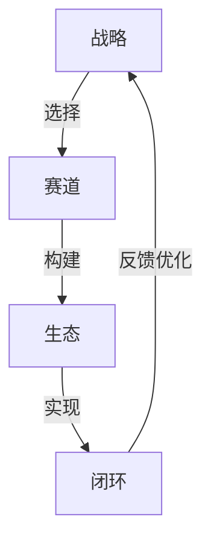

# chat


## 公司中的战略、赛道、生态、闭环


以下基于我搜索到的资料，对公司战略、赛道、生态与闭环四大核心概念进行系统性解析，涵盖定义、要素、实践逻辑及相互关系：

---

### 一、公司战略：顶层设计与竞争蓝图
定义：企业为实现长期目标制定的行动计划与资源配置方案，是整合愿景、市场定位、竞争策略的顶层框架。  
核心要素：  
1. 愿景与使命  
   - 愿景：企业未来理想状态（如“成为行业领导者”），提供方向性指引。  

   - 使命：企业存在的根本理由（如“解决某类社会问题”），定义业务边界与社会价值。  
2. 目标体系  
   - 将愿景转化为可量化目标（如市场份额、营收增长率），分短期（1-3年）与长期（5年以上）。  
3. 市场定位与竞争策略  
   - 明确目标客户、差异化优势（如成本领先或技术独特性），并分析竞争对手。  

4. 资源配置与风险管理  
   - 优化人力、资金、技术等资源分配，预判政策、技术变革等风险并制定预案。  
战略层次：  
- 总体战略（公司层）：决定业务组合与投资方向。  
- 业务单位战略（事业部层）：针对细分市场的竞争策略。  
- 职能战略（部门层）：支持业务落地的具体计划（如营销、研发）。  

> 案例：特斯拉以“加速全球向可持续能源转型”为使命，通过电动车（业务战略）+ 能源存储（业务扩展）实现战略协同。

---

### 二、赛道：竞争空间的精准选择
定义：企业选择的特定市场竞争领域，反映行业规模、发展阶段与竞争格局。  
三维评估模型：  

1. 宽度（市场规模）  
   - 取决于解决的社会问题广度（如咖啡厅行业可定位“饮品销售”或“第三空间服务”，后者市场规模更大）。  
2. 长度（发展阶段）  
   - 遵循“M型曲线”：萌芽期→爆发期→低谷期→成熟期（如共享单车2016-2023年周期）。  
3. 崎岖度（竞争格局）  
   - 受市场规模与阶段影响：规模越大、竞争越激烈；爆发期以速度取胜，成熟期靠精细化运营。  
赛道选择方法论：  
- 用户效用视角：按满足的需求类型划分赛道（如“即时通讯”满足社交需求，与社交产品属同一赛道）。  
- 产业细分视角：行业>赛道>品类（如新能源行业→电动车赛道→豪华电动SUV品类）。  
- 数据分析工具：SWOT分析、波特五力模型评估赛道吸引力。  

> 案例：小米选择“智能硬件生态链”赛道，通过手机（高频入口）+ IoT设备（长尾覆盖）组合拓宽市场宽度。

---

### 三、生态：协同网络的价值共生
定义：企业与客户、合作伙伴、竞争者等主体形成的动态价值网络，通过资源互补实现共生。  
构成要素：  

| 主体       | 角色                  | 关键互动                     |
|----------------|--------------------------|----------------------------------|
| 企业自身       | 核心能力载体              | 制定规则、整合资源               |
| 客户           | 需求来源与反馈方          | 参与产品迭代、社群运营           |
| 合作伙伴       | 价值链协同者              | 技术互补、渠道共享（如供应商）   |
| 竞争者         | 竞合关系动态体            | 共同教育市场、技术标准合作       |
| 政府/政策      | 规则制定者                | 合规性约束、补贴政策利用         |
| 社会环境       | 文化价值观影响者          | ESG（环境、社会、治理）责任履行  |


成功生态特征：  
- 开放性：吸引多元主体加入（如苹果App Store开放开发者接口）。  
- 正反馈循环：用户增长→开发者收益→生态丰富度提升→用户留存。  
- 核心枢纽作用：企业需掌控关键节点（如阿里掌控支付、物流基础设施）。  

---

### 四、闭环：自我强化的增长引擎
定义：从用户触达到价值回流的完整业务循环，实现资源自我增殖与模式可持续。  
构建四要素：  
1. 价值主张  
   - 明确解决的用户痛点（如Netflix解决“碎片化娱乐需求”）。  
2. 用户旅程闭环  
   ```mermaid
   graph LR
   A[吸引] --> B[转化] --> C[交付] --> D[使用] 
   D --> E[反馈] --> F[留存] --> G[推荐] --> A
   ```

3. 资源-现金流闭环  
   - 资源端：合作伙伴（供应链）、核心资源（技术/人才）支撑服务交付。  
   - 收入端：多元变现模式（订阅制、交易佣金等）反哺资源投入。  
4. 数据驱动优化  
   - 用户行为数据→改进产品→提升体验→增强留存。  

典型模式案例：  
- 电商闭环：消费者购物→商家销售分成→平台投流获客→新消费者进入。  
- 订阅制闭环：用户付费→产品升级→体验优化→续费率提升（如Adobe Creative Cloud）。  

---

### 五、四者关系：从战略到可持续增长


- 战略决定赛道：企业愿景（如“数字化服务商”）导向科技赛道而非传统制造。  
- 赛道塑造生态：电动车赛道需整合电池供应商（合作伙伴）、充电网络（基础设施）构建生态。  
- 生态依赖闭环：苹果生态通过App Store分成（闭环现金流）维持开发者生态繁荣。  
- 闭环反哺战略：用户使用数据→发现新需求→调整战略目标（如特斯拉从造车转向能源网络）。  

> 终极逻辑：企业需以战略锚定方向，在优质赛道聚集资源，通过开放生态放大价值，最终以闭环实现可持续增长，形成动态护城河。


# 参考资料


* any list
{:toc}