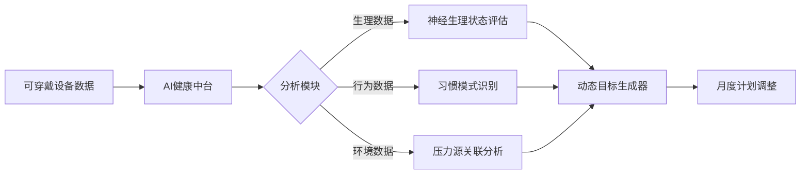
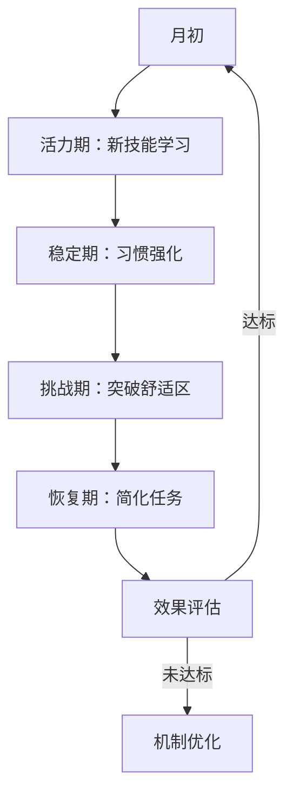

# 前言

大家好，我是老马。  

今天是「方舟计划」中年人 1000 天自救计划系列的第 6 天。

昨天，咱们聊了如何提升自己的身体健康。

如今社会，大家的精神压力也比较大，如何保障身心的愉悦？维持一个积极乐观的心态？

咱掏心窝子说，现在这日子，谁心里不揣着几块沉甸甸的“大石头”？

工作、家庭、票子、孩子教育、父母养老... 压得喘不过气太正常了！

想活得“松快”点，真不是喊口号“乐观！积极！”就能行的。

得有点接地气的“生存智慧”，咱唠点实在的：

# 1. 认清现实：压力它甩不掉，但能“盘”它！  

别跟压力死磕“清零”： 指望一点压力没有？那不可能，也不现实。咱的目标是 “不被它压垮” ，是学会跟它和平共处，甚至偶尔让它“推”咱一把。

给压力“上户口”： 心里堵得慌？别闷着！拿张纸（或手机备忘录），把让你烦、让你怕、让你睡不着觉的事儿，一条条写下来。写出来，它就具象化了，不再是脑子里一团乱麻的“怪兽”。你会发现，有些事儿其实没那么可怕，有些事儿暂时无解，那就先放放。

# 2. 给心找个“泄洪口”：别让情绪憋炸了！  

“说出来”是硬道理： 别死要面子活受罪！找信得过的哥们儿/姐们儿、家里人，哪怕就对着树洞APP（现在很多这种软件）吼两嗓子。倾诉不是为了找答案，就是为了“倒垃圾”！ 说出来，胸口那股闷气就能散一半。

“哭吧哭吧不是罪”： 大老爷们儿也一样！难受极了，关上门，看个催泪电影，或者干脆啥也不为，想哭就哭一场。哭完真能轻松不少，这是身体自带的解压阀，别硬憋着。

“动手”解千愁： 情绪上头时，别光琢磨。去干点不用动脑的体力活：收拾屋子（使劲擦地！）、做顿饭（狠狠剁肉馅！）、侍弄花草、拼乐高、甚至就是下楼快走/跑两圈... 让身体动起来，脑子反而能歇会儿，情绪也跟着平复。

# 3. 学会“偷懒”和“耍赖”：给心灵放假！  

“关我屁事”和“关你屁事”是护身符： 不是教你冷漠，是分清界限。不该你操的心，别往身上揽；别人对你指指点点？只要不违法乱纪，爱说说去！ 脸皮厚点，活得自在。

“五分钟摆烂法”： 实在扛不住了，感觉要崩？给自己一个合法“摆烂”时间（比如5分钟、10分钟）。啥也不干，就瘫着发呆、望天、听点白噪音。告诉自己：“就这五分钟，天王老子来了我也不管！” 短暂抽离，能救命。

培养点“无用”的爱好： 钓鱼、养多肉、听相声、临帖、打游戏（适度！）、甚至研究哪家煎饼果子好吃... 不图赚钱，不图出名，就图自己乐呵。 这是属于你自己的“心灵充电桩”。

# 4. 主动“找乐子”：给生活加点甜！  

留意身边“小确幸”： 早上出门看见好天气？买的咖啡拉花很漂亮？孩子画了幅丑萌的画？同事说了句暖心话？... 有意识地去捕捉这些微小但真实的“好瞬间”，像攒糖纸一样记在心里。日子苦，但这点点甜能撑着你。

“演”着演着就成真了： 心情低落时，故意对着镜子咧开嘴，做个超夸张的笑脸（哪怕很假），或者挺直腰板大步走... 身体姿态会影响情绪，“装”积极久了，大脑有时真会上当，感觉好一点。

定期“犒赏”自己： 完成一个小目标（哪怕只是今天没跟老板顶嘴），给自己点物质或精神奖励：买本一直想看的书、吃顿好的（别太罪恶）、看场电影、或者就心安理得刷一小时手机（定好时！）。对自己好点，不亏心！

# 5. 修炼“钝感力”：别太敏感！  

别过度解读： 老板今天脸色不好？同事那句话啥意思？... 很多时候，真不是针对你！ 别人可能只是自己烦着呢。少点“内心戏”，别自己吓自己。

“完成”比“完美”重要： 工作上、生活里，别事事追求100分。尽力了，做到七八十分，能交差、不影响大局，就放过自己。 死磕完美，最累心。

少刷点“焦虑源”： 朋友圈里人均富豪？短视频里个个成功？少看！少比！ 那都是别人想让你看的“精修片”。过好自己的日子，关注自己的进步，哪怕慢点。

# 尾声

咱中年人，上有老下有小，是家里的顶梁柱。咱的心不能先垮了。 

学会给自己“松绑”，不是不负责任，恰恰是为了 更长久、更有质量地扛起责任。 

从今天起，试试上面哪怕一条小方法，慢慢来，咱一起把日子过“松快”点儿！

我是老马，期待我们重逢于1000天后的方舟之上！


# chat

### 一、马斯洛需求层次与个人提升维度的对应关系

| 需求层次 | 对应的个人提升维度 | 实现难度 | 说明 |
|----------|---------------------|----------|------|
| 生理需求 | 健康管理、基本生活保障 | 低 | 保障基本生存条件，是个人发展的前提 |
| 安全需求 | 财务安全、职业稳定性 | 中 | 提供安全感，减少焦虑，为更高层次需求打基础 |
| 社交需求 | 人际关系、团队合作 | 中 | 通过社交获得支持，增强归属感 |
| 尊重需求 | 职业成就、社会认可 | 中高 | 通过努力获得他人的尊重和认可 |
| 自我实现 | 个人成长、创造力、自我价值实现 | 高 | 实现个人潜能，追求意义和价值 |

## 给出三年内，如何提升个心灵健康度，如何保持轻松、愉悦、乐观？需求的详细可行性方案，精确到月。


## 2025-2027年心灵健康提升三年期精确解决方案

### 一、计划总体框架与设计原则
本方案基于生理-心理-社会-技术整合模型，融合可穿戴设备监测、AI个性化干预、行为科学和神经可塑性理论。三年分三阶段实施：
- 2025奠基期：建立基础习惯与监测系统
- 2026深化期：强化神经可塑性训练
- 2027自主期：形成自我调节生态系统

> 技术支撑：华为WatchGT4 Pro等设备实时监测HRV（心率变异性）、睡眠质量、压力指数；AI平台（如Woebot Health）提供认知行为训练

### 二、月度详细实施方案（2025-2027）
#### 第一年（2025）：基础建设期

| 月份 | 核心目标                  | 具体活动                                                                                                | 技术整合                                                                 |
|------|---------------------------|---------------------------------------------------------------------------------------------------------|--------------------------------------------------------------------------|
| 1月  | 运动系统激活          | 每天30分钟快走+10分钟晨间瑜伽<br>每周运动达标率≥80%                                      | 可穿戴设备设置运动提醒，AI分析最佳运动时段                               |
| 2月  | 膳食神经优化          | 执行"地中海-轻断食"饮食法<br>每日摄入5种颜色果蔬，补充Omega-3                             | AI营养师APP定制食谱，肠道菌群检测工具应用                 |
| 3月  | 正念神经重构          | 每日早/晚10分钟正念呼吸练习（Headspace APP）<br>周末参加森林浴（Shinrin-yoku）                          | VR冥想系统提供沉浸式训练                                  |
| 4月  | 社交网络强化          | 每周2次深度社交互动<br>加入志愿服务组织                                                  | 社交活动追踪APP，AI推送兴趣社群信息                                     |
| 5月  | 睡眠神经修复          | 建立22:30-6:30固定睡眠周期<br>睡前1小时禁用电子设备                                       | 可穿戴设备监测睡眠阶段，智能床垫调节温度                                |
| 6月  | 数字排毒实践          | 每日屏幕时间≤3小时<br>每周日"无数码日"                                                  | 屏幕使用时间监控，AI自动生成周度报告                                    |
| 7月  | 情绪认知训练          | 每日记录情绪日志<br>学习认知重构技术                                                    | AI情感识别工具分析日志，推送干预方案                      |
| 8月  | 创造神经激活          | 学习新技能（乐器/语言）<br>每月完成1项创意作品                                          | Coursera课程匹配，VR创意工具体验                                      |
| 9月  | 自我关怀深化          | 每日3条积极自我对话<br>接受身体扫描练习                                                  | 生物反馈设备训练放松反应                                              |
| 10月 | 肠道-脑轴优化         | 增加益生元食物摄入<br>每日腹部按摩                                                      | 肠道微生物检测，个性化益生菌方案                                      |
| 11月 | 光照节律调控          | 早晨30分钟自然光照<br>使用模拟日照灯                                                    | 可穿戴设备追踪光照暴露，智能照明系统联动                                |
| 12月 | 年度整合评估          | 完成心理韧性测评<br>制定2026年优化方案                                                                  | AI健康教练生成年度报告，预测未来风险                     |


#### 第二年（2026）：神经可塑性深化期
- 技术升级：整合EEG头戴设备监测脑波，应用曲马多神经重塑疗法
- 季度焦点：
  1. Q1：前额叶皮层强化（决策训练）
  2. Q2：边缘系统调节（情绪管理）
  3. Q3：默认模式网络抑制（反刍思维干预）
  4. Q4：镜像神经元激活（共情训练）

> 月度活动范例（4月）：  
> - 自然暴露疗法：VR模拟高山/海洋场景  
> - 心率变异性训练：通过呼吸法维持HRV＞70ms  
> - 神经反馈训练：每日15分钟α波强化（Muse设备）  

#### 第三年（2027）：自主生态系统期
- 技术融合：接入智慧城市心理健康平台，应用脑机接口情绪调节技术
- 创新实践：
  - 社区心理健康大使认证
  - 微生物组定制营养计划
  - 数字孪生心理模拟训练

### 三、动态目标调整机制
#### 1. 数据驱动的算法规则
基于HRV的压力-恢复模型：
```math
调整系数K = 0.5 × (HRVₜ/HRVₛ) + 0.3 × (Sₘₐₓ - Sₜ)/Sₘₐₓ + 0.2 × (Tᵣ - Tₘᵢₙ)/Tᵣ
```

其中：  
- HRVₜ：当日平均HRV  
- HRVₛ：个人基线HRV  
- Sₜ：主观压力评分（1-10分）  
- Sₘₐₓ：历史最高压力分  
- Tᵣ：实际睡眠时长  
- Tₘᵢₙ：最小睡眠需求阈值  

动态阈值设定：

| 指标          | 干预阈值              | 调整规则                             |
|---------------|-----------------------|--------------------------------------|
| HRV          | ≤基线值15%            | 自动启动"减压协议"（呼吸训练+森林浴）|
| 睡眠深度时长  | <1.5小时/晚          | 触发睡眠优化方案      |
| 连续压力日数  | ≥3天                 | 降低任务难度50%       |


#### 2. AI优化路径



### 四、防倦怠融合机制
#### 1. 循环设计框架



#### 2. 三年实施方案

| 干预层级    | 2025                      | 2026                          | 2027                  |
|-------------|---------------------------|-------------------------------|-----------------------|
| 生理防倦| 肌肉放松训练              | HRV生物反馈   | 神经调节技术          |
| 认知防倦| 思维切换训练 | 认知灵活性提升                | 元认知监控            |
| 行为防倦| 任务分段法                | 心流状态诱导                  | 自主目标设定          |
| 组织防倦| 社群互助                  | 专业督导小组                  | 社区支持网络 |


月度活动融合范例（9月防倦焦点）：
- 第一周：正念行走（户外5公里+感官觉察）  
- 第二周：创造挑战（VR艺术创作工坊）  
- 第三周：社会连接（志愿活动+感恩实践）  
- 第四周：恢复简化（任务量减少40%）  

### 五、评估与持续优化
#### 1. 四级评估指标体系

| 维度       | 关键指标                          | 测量方法                               |
|------------|-----------------------------------|----------------------------------------|
| 生理健康   | HRV均值、深度睡眠时长             | 可穿戴设备连续监测      |
| 心理健康   | PERMA量表得分、抑郁焦虑筛查       | 手机APP月度测评         |
| 行为效能   | 习惯坚持率、目标达成度             | AI行为分析系统          |
| 社会功能   | 社会支持网络密度、共情能力         | 社交数据分析+情境测试   |


#### 2. 智能优化机制
- 季度校准：AI比对计划与实际轨迹，修正预测模型参数
- 年度升级：神经可塑性评估（fNIRS检测）+肠道菌群分析
- 危机干预：当连续3天压力指数>8分时，自动启动 VR放松舱+专业咨询

> 可持续策略：建立"心灵健康银行"积分系统，每月达标积累点数可兑换健康服务，形成正向循环机制。

此方案通过精准监测-智能分析-动态干预-循环强化的系统，实现心灵健康从被动管理到主动创造的转变。2027年末目标：PERMA综合幸福指数提升35%，压力相关生理指标改善50%，建立终身可持续的心灵健康生态系统。


# 参考资料


* any list
{:toc}