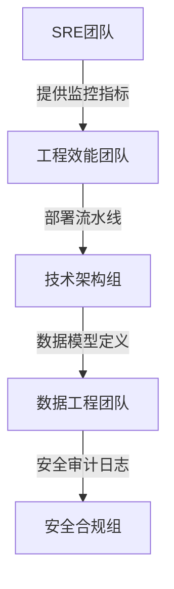

# chat

## 初创公司应该有哪些部门支撑软件系统？像 CTO 一样思考，为什么

作为初创公司的CTO，设计技术支撑部门的核心原则是：**用最小化团队实现最大化工程效能，同时为规模化预留架构弹性**。

以下是从技术决策者视角构建的关键部门及设计逻辑：

---

### **一、生死线部门：没有它们系统会崩塌**
#### **1. 工程效能团队（Engineering Productivity）**
- **核心职责**：
  - **CI/CD流水线**：5分钟内完成代码提交到预发环境的自动化（如GitLab CI+Argo CD）
  - **开发者体验优化**：本地开发环境容器化（Dev Containers），减少“在我机器上是好的”问题
  - **质量门禁**：在流水线嵌入自动化测试（单元/接口测试>80%覆盖率）+安全扫描（SAST/DAST）
- **CTO思考**：
  > “**初创公司每浪费1小时在低效部署上，就少一次产品迭代验证机会**”  
  > → 用自动化释放工程师生产力，让团队聚焦业务逻辑而非运维琐事

#### **2. SRE团队（Site Reliability Engineering）**
- **核心职责**：
  - **可观测性体系**：业务链路级监控（Prometheus+Loki+Tempo替代传统Zabbix）
  - **混沌工程**：每月1次故障注入演练（如模拟云数据库宕机）
  - **容量规划**：根据业务增长曲线自动扩缩容（HPA+VPA）
- **CTO思考**：
  > “**用户能容忍功能缺失，但无法接受持续宕机**”  
  > → 早期投入SRE的ROI远超故障损失（每次线上事故平均损失≈$10k+客户信任）

---

### **二、业务赋能部门：没有它们产品会偏离航道**
#### **3. 技术架构组（Architecture Guild）**
- **核心职责**：
  - **技术选型仲裁**：禁用“网红技术”，坚守如 **“PostgreSQL > MongoDB for OLTP”** 的理性决策
  - **架构治理**：通过ADR（架构决策记录）管理技术债务
  - **关键代码审查**：核心模块必须由架构师亲自Review（如支付清结算逻辑）
- **CTO思考**：
  > “**初创公司死于过度架构的比死于架构不足的更多**”  
  > → 在扩展性（如分库分表能力）与交付速度间做平衡，**预留演进路径而非一步到位**

#### **4. 数据工程团队（Data Platform）**
- **核心职责**：
  - **实时数据管道**：用Flink替代传统ETL，实现秒级数据可见性
  - **指标中台建设**：统一业务指标口径（如DAU定义避免各团队分歧）
  - **A/B测试平台**：支持产品决策数据化（如按钮颜色转化率实验）
- **CTO思考**：
  > “**没有数据驱动的增长是蒙眼狂奔**”  
  > → 避免沦为“报表开发团队”，聚焦构建 **决策支持系统（DSS）**

---

### **三、成本中心部门：没有它们会埋下致命隐患**
#### **5. 安全与合规组（Security & Compliance）**
- **核心职责**：
  - **左移安全**：在CI阶段阻断高危漏洞（Semgrep+Trivy）
  - **隐私合规**：自动化数据审计（OpenGDPR+定制脚本）
  - **攻防演练**：每年2次渗透测试（尤其金融/医疗行业）
- **CTO思考**：
  > “**安全投入的性价比=风险发生概率×潜在损失**”  
  > → 早期聚焦 **基础安全三件套**：权限最小化、数据加密、漏洞扫描

---

### **四、部门协作的CTO级设计**
#### **用工程方法打破部门墙**

#### **关键效能指标（CTO仪表盘）**
| 部门             | 北极星指标                     | 健康阈值               |
|------------------|------------------------------|-----------------------|
| 工程效能         | CI流水线平均耗时             | <5分钟               |
| SRE              | 服务可用性（SLA）            | >99.5%               |
| 技术架构组       | 技术债务解决率               | >70%/季度           |
| 数据工程         | 关键报表数据延时             | <1分钟              |
| 安全合规         | 高危漏洞修复时效             | <24小时             |

---

### **五、血泪教训：CTO必须阻止的团队建设错误**
1. **独立QA团队**：  
   → 测试应内嵌到开发流程（开发自测+自动化覆盖），否则造成责任割裂  
2. **按技术栈划分团队**（如前端组/Java组）：  
   → 导致功能交付跨多团队协作，采用 **垂直功能小队制**（含前后端+测试）  
3. **运维与开发对立**：  
   → 推行SRE文化：开发轮值Oncall，承担代码运维责任  

---

### **六、像CTO一样行动：规模化前的关键决策**
1. **技术栈收敛**：  
   - 禁用非必要语言（如初创公司同时用Java/Go/Node.js）  
   - 统一框架（如Spring Boot全栈）  
2. **云原生优先**：  
   - 直接用托管服务（DBaaS/K8s托管）避免自建Redis集群等运维黑洞  
3. **工程师文化设计**：  
   - 推行 **“20%时间修复技术债”** 制度  
   - 代码贡献度＞工作时长的考核机制  

> 🔑 **CTO核心洞察**：技术组织的终极目标不是“零故障”，而是 **用可控风险换取最大业务价值**。

所有部门设计必须服务于两个数字：**产品迭代速度（TTM）与系统可用性（SLA）的帕累托最优**。

# 参考资料

* any list
{:toc}