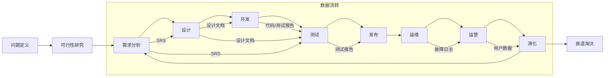

# chat

## 对于一家初创公司，以上的各个阶段，需要引入哪些平台服务来支撑？从小公司、中、到大型公司循序渐进给出+原因

基于我搜索到的资料及软件产品生命周期管理（PLM）实践，以下分阶段为初创公司至大型企业推荐平台服务演进路径，结合成本、效率、扩展性三维度设计渐进式方案：

---

### 一、初创公司（0-50人，年营收<1000万）
核心目标：最小成本验证产品，快速迭代  
推荐平台服务：  

| 阶段       | 推荐平台/工具                                                                 | 原因与资料支撑                                                                 |
|----------------|---------------------------------------------------------------------------------|---------------------------------------------------------------------------------|
| 需求管理   | 轻量问卷工具（问卷星）+ 白板工具（Miro）                                           | 零成本收集用户反馈，支持敏捷需求梳理（初创期赋能理念）                 |
| 设计开发   | Figma（UI设计）+ GitHub Free（代码库）+ VS Code（IDE）                           | 免费基础版满足协作开发，GitHub提供基础CI/CD（轻量云原生方案理念）       |
| 测试运维   | Postman API测试 + Sentry免费版（错误监控）                                        | 快速接口验证与基础故障追踪（区块链平台轻量化运维思想）                 |
| 发布运营   | 微信小程序（低成本发布）+ Google Analytics（基础数据分析）                       | 触达用户成本最低，基础运营反馈（健康管理平台的轻运营模式）             |


关键整合点：  
- 工具链成本：全免费或年费<5000元  
- 数据贯通：手动导出数据+Excel整合（避免工具孤岛）  
- 风险提示：避免过早引入重型PLM（：PLM需匹配业务复杂度）  

---

### 二、成长型公司（50-200人，年营收1000万-1亿）
核心目标：建立标准化流程，支撑多项目并行  
推荐平台服务：  

| 阶段         | 推荐平台/工具                                                                 | 原因与资料支撑                                                                 |
|------------------|---------------------------------------------------------------------------------|---------------------------------------------------------------------------------|
| 全周期管理   | 华腾PLM基础版或OnChain PLM                   | 提供需求→设计→BOM基础管理，支持多项目协同（的xBOM管理能力）          |
| 开发测试     | GitLab SaaS（代码+CI/CD）+ Jira Cloud（敏捷管理）+ Selenium（自动化测试）         | 自动化构建部署，提升迭代速度（的PLM整合CAE/CAD理念）                |
| 运维监控     | ELK Stack（日志分析）+ Prometheus（性能监控）                                     | 开源方案降低运维成本，支持千级节点（的PB级数据管理扩展性）           |
| 数据运营     | Metabase（BI可视化）+ 企业微信SCRM                                               | 用户行为分析驱动需求优化（大数据生命周期服务平台雏形）               |


关键升级：  
- PLM核心价值：实现需求-设计-物料清单（BOM）贯通（东方雨虹PLM实施目标）  
- 成本控制：年工具投入10-30万，优先SaaS化（的OnChain PLM免硬件投入特性）  
- 效率指标：发布周期从月→周级  

---

### 三、扩张期公司（200-500人，年营收1亿-10亿）
核心目标：全生命周期数字化，支撑多产品线协同  
推荐平台服务：  

| 阶段         | 推荐平台/工具                                                                 | 原因与资料支撑                                                                 |
|------------------|---------------------------------------------------------------------------------|---------------------------------------------------------------------------------|
| PLM平台      | Teamcenter或开目eCOL PLM                     | 支持复杂产品构型管理、跨领域数据整合（的PLM-ERP-CAD全链路集成）      |
| 智能开发     | GitLab Ultimate（安全扫描）+ Jenkins+K8s（云原生部署）                           | 容器化提升资源利用率，安全左移（分布式数据管理要求）                 |
| 测试运维     | Dynatrace（AI运维）+ 混沌工程平台（故障演练）                                    | 保障高可用性，MTTR降低50%（金融设备全生命周期管理需求）              |
| 数据驱动     | 自建大数据全生命周期平台+ 用户画像系统                         | 深度挖掘运营数据反哺研发（商品数字化管理闭环）                       |


关键能力建设：  
1. PLM深度整合：  
   - 实现需求→设计→工艺→制造数据流贯通（的eCOL PLM多领域协同）  
   - 构建单一产品数据源（Single Source of Truth）  
2. DevOps工厂：自动化流水线覆盖开发→生产发布  
3. 成本结构：年投入100-300万，20%用于定制开发  

---

### 四、大型企业（500人以上，年营收>10亿）
核心目标：全球化协同，生态化创新  
推荐平台服务：  

| 模块           | 平台方案                                                                     | 原因与资料支撑                                                                 |
|--------------------|---------------------------------------------------------------------------------|---------------------------------------------------------------------------------|
| PLM生态底座    | 定制化PLM平台（如Teamcenter+自研模块，）                           | 支持千万级BOM管理，满足航空/汽车级合规（的构型管理37原则）           |
| 智能研发       | 低代码平台 + AI辅助设计（集成CAD/CAE）                                           | 缩短复杂产品设计周期（的CAE仿真集成）                               |
| 全周期数据湖   | 搭建数据全生命周期管理平台                                | PB级数据治理，支撑预测性维护（航天级数据管理要求）                  |
| 生态协同       | 供应链云平台 + 开放API市场                                                       | 连接供应商/客户生态（超级码云平台的多角色接入）                     |


高阶能力扩展：  
- 数字孪生集成：将PLM数据映射至物理资产（航天智能运维理念）  
- 全球化部署：多地容灾架构 + 合规审计（多品牌设备管理需求）  
- 成本与效益：年投入>500万，ROI体现在产品上市速度提升30%+运维成本下降20%  

---

### 五、演进路径核心逻辑
1. 成本适配性：  
   - 初创期：免费工具+手动流程 → 成长期：SaaS化PLM → 成熟期：混合云定制PLM  
   - （的OnChain PLM无需硬件投入 → 的Teamcenter企业级定制）  

2. 扩展性设计：  

   | 规模   | 数据量级       | 平台扩展要求                          |
   |------------|-------------------|-----------------------------------------|
   | 初创       | GB级              | 单机部署/公有云                          |
   | 成长       | TB级              | 分布式架构雏形                           |
   | 大型       | PB级              | 多数据中心+边缘计算       |


3. 能力进阶：  
   ```mermaid
   graph LR
     A[单点工具] --> B[流程自动化]
     B --> C[全链路数据贯通]
     C --> D[AI驱动智能决策]
   ```

   - 的eCOL PLM展示从xBOM管理→MBE（Model-Based Enterprise）演进  

4. 风险规避：  
   - 避免初创公司引入重型PLM（：PLM需匹配组织成熟度）  
   - 大型企业防止“烟囱式系统”（通过数据全生命周期平台破除孤岛）  

---

### 六、总结：选择平台的黄金法则
1. 初创公司：用90%免费工具+10%关键付费服务（如GitHub+华腾PLM基础版）聚焦MVP验证。  
2. 成长企业：构建PLM+DevOps双引擎，确保研发数据流与代码流水线双向贯通。  
3. 大型集团：以PLM为数字主线，整合ERP/MES/CRM形成企业级数字孪生（的Teamcenter生态定位）。  

> 最终目标：通过阶梯式平台演进，实现产品生命周期数据从断裂到闭环（华腾PLM的“端到端流程”理念），让数据资产成为核心竞争力（东方雨虹的知识积累目标）。


## 对于一家软件技术公司而言。产品从调研、设计、开发、测试、QA、发布、运维、运营，每个阶段都会有不同的输出，和对应的平台支持。

比如开发阶段，一定会有对应的代码，也就需要代码库管理，帮我尽可能拓展每一个阶段有哪些，然后列出每一个阶段的输出+对应的平台+互相间的关系

以下是针对软件技术公司产品全生命周期的详细解析，涵盖各阶段的输出物、支持平台及阶段间关系。

依据行业标准（如GB8566、ISO/IEC/IEEE 12207）及实践案例，将生命周期划分为 11个核心阶段，并整合多维度资料形成完整框架：

---

### 一、生命周期阶段划分与核心输出物
#### 1. 问题定义（Problem Definition）
- 输出物：  
  《问题定义报告》（明确业务痛点、项目目标、范围边界）  
- 平台支持：  
  协作白板（Miro）、文档工具（Confluence）、会议系统（Zoom/MS Teams）  
- 关键关系：  
  本阶段输出是后续可行性研究的输入，确保目标与业务对齐。

#### 2. 可行性研究（Feasibility Study）
- 输出物：  
  《可行性分析报告》（技术/经济/操作可行性评估）  
- 平台支持：  
  数据分析工具（Excel, Tableau）、项目管理工具（Jira）  
- 关键关系：  
  结论决定项目是否进入需求阶段，规避无效投入。

#### 3. 需求分析（Requirements Analysis）
- 输出物：  
  《用户需求说明书》（User Requirements）  
  《软件需求规格书》（SRS，含功能/非功能需求）  

- 平台支持：  
  需求管理工具（Jira, RequisitePro）、原型工具（Axure RP, Figma）  
- 关键关系：  
  SRS是设计与测试的基准文档，需通过评审冻结需求。

#### 4. 设计阶段（Design）
- 输出物：  
  - 概要设计：《系统架构设计书》（模块划分、接口定义）  
  - 详细设计：《数据库设计》《类图/时序图》《UI设计稿》  

- 平台支持：  
  设计工具（UML工具：Enterprise Architect, Lucidchart）、版本控制（Git）  
- 关键关系：  
  设计文档指导开发编码，测试计划依据设计编写。


#### 5. 开发与单元测试（Coding & Unit Testing）
- 输出物：  
  源代码、单元测试用例、代码审查报告、《开发文档说明书》  
- 平台支持：  
  IDE（VS Code, IntelliJ）、版本库（GitLab, GitHub）、构建工具（Maven/Gradle）  

- 关键关系：  
  代码需通过单元测试方可进入集成阶段，版本库管理代码基线。


#### 6. 测试阶段（Testing）
- 输出物：  

  | 测试类型       | 输出文档                          |
  |--------------------|---------------------------------------|
  | 集成测试           | 《集成测试方案/报告》《接口测试用例》 |
  | 系统测试           | 《系统测试报告》《性能测试报告》      |
  | 用户验收测试（UAT）| 《UAT测试报告》《用户手册》            
- 平台支持：  
  自动化测试工具（Selenium, JUnit）、缺陷管理（Jira, Bugzilla）  
- 关键关系：  
  测试报告决定发布资格，缺陷需回归至开发阶段修复。


#### 7. 发布阶段（Release）
- 输出物：  
  《产品交付说明书》《安装包/镜像》《版本发布说明》  
- 平台支持：  
  持续部署工具（Jenkins, GitLab CI）、容器化平台（Docker, Kubernetes）  
- 关键关系：  
  发布包由运维部署至生产环境，版本信息同步至配置库。

#### 8. 运维阶段（Operations）
- 输出物：  
  监控日志、故障报告、《运维巡检记录》《备份策略》  
- 平台支持：  
  监控工具（Prometheus, Datadog）、日志分析（ELK Stack）  
- 关键关系：  
  运维数据反馈至运营阶段，驱动产品优化。


#### 9. 运营阶段（Operation & Optimization）
- 输出物：  
  《用户行为分析报告》《功能使用率统计》《A/B测试结论》  
- 平台支持：  
  数据分析平台（Google Analytics, Mixpanel）、CRM系统  
- 关键关系：  
  运营数据驱动需求迭代，形成闭环反馈。


#### 10. 演化阶段（Evolution）
- 输出物：  
  《功能增强需求》《重构方案》《技术债清理计划》  
- 平台支持：  
  需求管理工具（Jira）、代码质量平台（SonarQube）  
- 关键关系：  
  基于运营反馈启动新需求分析，回归生命周期起点。

#### 11. 衰退与淘汰（Decline & Retirement）
- 输出物：  
  《产品终止公告》《数据迁移方案》《归档文档》  

- 平台支持：  
  归档系统（NAS）、合规审计工具  
- 关键关系：  
  正式结束生命周期，释放资源至新产品。

---

### 二、阶段间关系与数据流转图谱


- 核心逻辑：  
  1. 瀑布式主干：前序阶段输出是后续阶段的输入（如SRS驱动设计）。  
  2. 敏捷迭代环：运营/演化阶段反馈至需求分析，形成持续优化闭环。  
  3. 数据协同：通过PLM/ALM平台（如Polarion）实现文档跨阶段追溯。  
<mt type='videos' data='[138]'></mt>


---

### 三、平台工具链整合关系

| 阶段          | 代表性工具                     | 集成关系                                  |
|--------------------|-------------------------------------|---------------------------------------------|
| 需求与设计        | Jira, Figma, Axure                  | 需求条目关联设计稿，变更自动同步       |
| 开发与测试        | GitLab, Jenkins, Selenium           | 代码提交触发CI/CD流水线，自动化测试    |
| 发布与运维        | Docker, Kubernetes, Datadog         | 容器化部署与监控告警联动         |
| 运营与演化        | Mixpanel, SonarQube                 | 用户行为数据驱动技术债清理             |
| 全生命周期管理    | Polarion, Azure DevOps              | 端到端追溯需求→代码→缺陷→版本    |


> 关键整合点：  
> - DevOps工具链：Jenkins集成GitLab（构建）→ Docker（打包）→ Kubernetes（部署）→ Datadog（监控）。  
> - 数据孤岛破解：通过API网关实现工具间数据互通（如Jira缺陷数据流入SonarQube）。  

---

### 四、总结：生命周期管理核心原则
1. 阶段门禁控制：每阶段输出物需评审通过（如设计评审→代码开发）。  
2. 工具链自动化：减少人工传递，75%流程由工具自动触发。  
3. 反馈驱动演化：运营数据必须反哺需求迭代，避免“僵尸产品”。  
4. 合规性贯穿：文档/代码/镜像需符合ISO 12207标准归档。  

此框架覆盖全生命周期核心节点，企业可根据敏捷/瀑布模型灵活裁剪，但需确保阶段输出物完整性和工具链集成性，以实现高效协同与质量可控。


# 参考资料

* any list
{:toc}