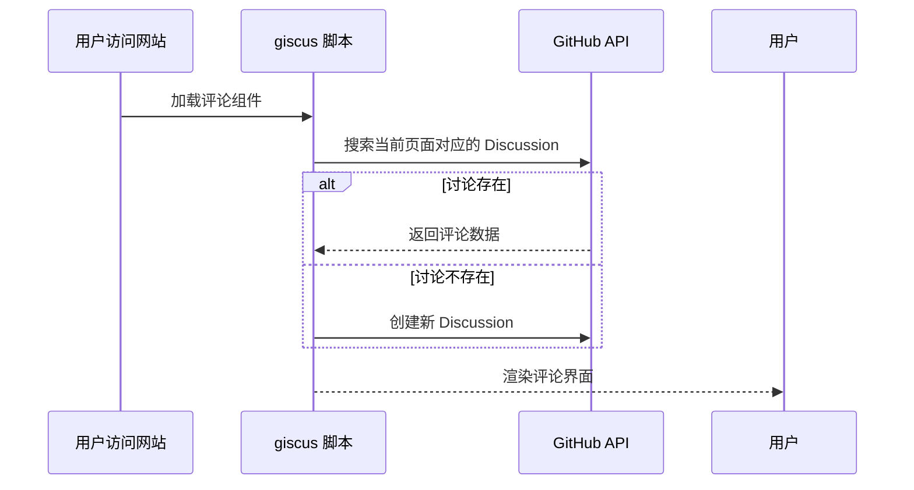

# 快速接入

选择 giscus 连接到的仓库。请确保：

1. 该仓库是公开的，否则访客将无法查看 discussion。

2. [giscus app 已安装](https://github.com/apps/giscus)，否则访客将无法评论和回应。

3. Discussions [功能已在你的仓库中启用。](https://docs.github.com/en/repositories/managing-your-repositorys-settings-and-features/enabling-features-for-your-repository/enabling-or-disabling-github-discussions-for-a-repository)

## 1、创建仓库

github 创建一个公开的仓库

> [https://github.com/houbb/my-discussion](https://github.com/houbb/my-discussion)

## 2、安装 app

[https://github.com/apps/giscus/installations](https://github.com/apps/giscus/installations) 可以选择刚才的仓库，安装。

## 3、启动 Discussions

第三个，就是到项目的【Setting】=>【General】=>Features 下，勾选上 [√]Discussions 

## 验证

可以到 [https://giscus.app/zh-CN](https://giscus.app/zh-CN) 这个页面验证一下。


# 配置使用

根据页面提示，选择一下主题、分类。

可以生成对应的脚本，这里是简单的 github light 主题。

## 脚本

```js
<script src="https://giscus.app/client.js"
        data-repo="houbb/my-discussion"
        data-repo-id="R_kgDOPLJ4lA"
        data-category="General"
        data-category-id="DIC_kwDOPLJ4lM4Cs15z"
        data-mapping="pathname"
        data-strict="0"
        data-reactions-enabled="1"
        data-emit-metadata="0"
        data-input-position="bottom"
        data-theme="light"
        data-lang="zh-CN"
        crossorigin="anonymous"
        async>
</script>
```

直接引用到自己的网站上。

## 提交看效果

类似于 github 讨论组，比较简洁。


# chat

## 简单介绍


以下是对 **giscus** 的详细介绍，涵盖其定义、核心功能、技术原理、安装配置、适用场景及用户评价等内容，结合资料提供多角度分析：

---

### 一、giscus 的定义与核心定位  
giscus 是一个**基于 GitHub Discussions 构建的开源评论系统**，允许网站访客通过 GitHub 账户在页面上发表评论、点赞或参与讨论 。其设计灵感源于 utterances，但在功能扩展性和用户体验上进行了优化 。核心定位包括：  
1. **隐私保护**：不追踪用户数据，无需个人信息 。  
2. **轻量化集成**：无需独立数据库或后端服务，数据直接存储于 GitHub Discussions 。  
3. **社区驱动**：通过 GitHub 账户体系实现身份验证，提升评论可信度 。  

---

### 二、核心功能与特点  
#### 1. **基础特性**  

| **特性**          | **说明**                                                                 |
|--------------------|--------------------------------------------------------------------------|
| **开源免费**       | MIT 许可协议，永久免费 。|
| **无追踪/无广告**  | 不收集用户数据，无商业广告 。|
| **无需数据库**     | 所有评论数据存储在 GitHub Discussions 。|
| **自动同步**       | 实时拉取 GitHub 上的新评论和编辑 。|
| **主题多样化**     | 支持明/暗主题（如 `light`/`dark`），可自定义 CSS 适配网站设计 。 |
| **多语言支持**     | 支持中、英、阿拉伯语等 20+ 语言 。|


#### 2. **高级功能**  
- **评论管理**：  
  - 访客需通过 GitHub OAuth 授权或直接在 Discussions 页面评论 。  
  - 支持评论排序（按时间/热度）、回复嵌套、表情反应（Reactions）。  
- **自动化流程**：  
  - 首次评论时自动创建关联的 Discussion 。  
  - 支持页面与 Discussion 的灵活映射（URL/路径/标题等）。  
- **安全控制**：  
  - 可限制评论来源域名，防止滥用 。  
- **迁移兼容性**：  
  - 支持从 utterances、gitalk 等系统迁移，保留历史评论 。  

#### 3. **性能表现**  
- 脚本体积仅 **~40KB**，支持懒加载优化页面性能 。  
- 依托 GitHub 基础设施，服务稳定性高 。  

---

### 三、技术原理与工作流程  
#### 1. **运行机制**  

  
- **关联逻辑**：通过 `URL`/`pathname`/`title` 等参数匹配 Discussion 。  
- **身份验证**：用户需授权 giscus GitHub App 或直接登录 GitHub 评论 。  

#### 2. **数据存储结构**  
- 每篇网站文章 → 一个 GitHub Discussion 话题。  
- 用户评论 → 话题下的回复帖子 。  

---

### 四、安装与配置指南  
#### 1. **前提条件**  
- 一个 **公开的 GitHub 仓库**（需启用 Discussions 功能）。  
- 安装 **[giscus GitHub App](https://github.com/apps/giscus)**  并授权访问仓库 。  

#### 2. **通用集成步骤**  
1. **生成配置**：  
   - 访问 [giscus.app](https://giscus.app)，填写仓库名、分类等参数，生成脚本代码 。  
   - 关键参数示例：  
     ```javascript
     data-repo="username/repo-name"
     data-repo-id="R_kgDOG..."
     data-category="Announcements"
     data-category-id="DIC_kwDOG..."
     ```
  
2. **嵌入网站**：  
   - **静态网站**：将生成的 `<script>` 标签插入页面底部 。  
   - **框架集成**：  
     - **React/Vue/Svelte**：使用官方组件库 `@giscus/react`/`@giscus/vue` 。  
     - **Hexo/Hugo/VitePress**：通过插件（如 `hexo-next-giscus`）配置 。  

#### 3. **高级配置示例**  
- **动态主题切换**（适应网站明/暗模式）：  
  ```vue
  <Giscus :theme="isDark ? 'dark' : 'light'" />
  ```
  
  （需监听主题变化事件并更新 `theme` 参数）。  
- **条件显示评论框**：  
  - 在 Frontmatter 中设置 `comments: false` 可禁用特定页面评论 。  

---

### 五、适用场景与用户评价  
#### 1. **典型应用场景**  

| **场景**          | **优势**                                                                 |
|--------------------|--------------------------------------------------------------------------|
| **个人博客**       | 快速集成，零成本维护 。|
| **技术文档站**     | 与 GitHub 生态无缝衔接，适合开发者社区 。|
| **开源项目官网**   | 利用 Discussions 收集用户反馈，促进社区互动 。|
| **多语言网站**     | 支持国际化界面，适配全球用户 。|


#### 2. **用户评价**  
- **正面反馈**：  
  > “10 分钟完成集成，依托 GitHub 的稳定性无需担心服务中断。”   
  > “评论反应功能（点赞/表情）显著提升了互动率。”   
- **局限性**：  
  - 依赖 GitHub 账户体系，非技术用户可能受限 。  
  - 需公开仓库存储评论，不适合私有项目 。  

---

### 六、对比同类工具（giscus vs. utterances）  

| **维度**         | **giscus**                            | **utterances**                     |
|-------------------|---------------------------------------|------------------------------------|
| **数据存储**      | GitHub Discussions                    | GitHub Issues                      |
| **功能扩展**      | 支持评论反应、多主题切换              | 基础评论功能                      |
| **自定义能力**    | 高（CSS 主题、输入框位置等）          | 中                                 |
| **迁移成本**      | 支持 Issue → Discussion 转换    | 无法直接迁移                      |


---

### 七、总结  
giscus 通过深度整合 GitHub Discussions，为静态网站提供了一套**安全、免费且高可定制**的评论解决方案。其核心价值在于：  
1. **技术友好性**：开发者可快速接入，避免重复造轮子 。  
2. **社区生态优势**：利用 GitHub 的账号体系和通知机制，提升互动效率 。  
3. **可持续维护**：开源模式 + 活跃社区，保障长期迭代 。  

对于追求轻量化、隐私合规及低运维成本的场景，giscus 是目前静态网站评论系统的理想选择之一。建议访问 [官方文档](https://giscus.app) 获取最新配置详情。


# 参考资料

* any list
{:toc}