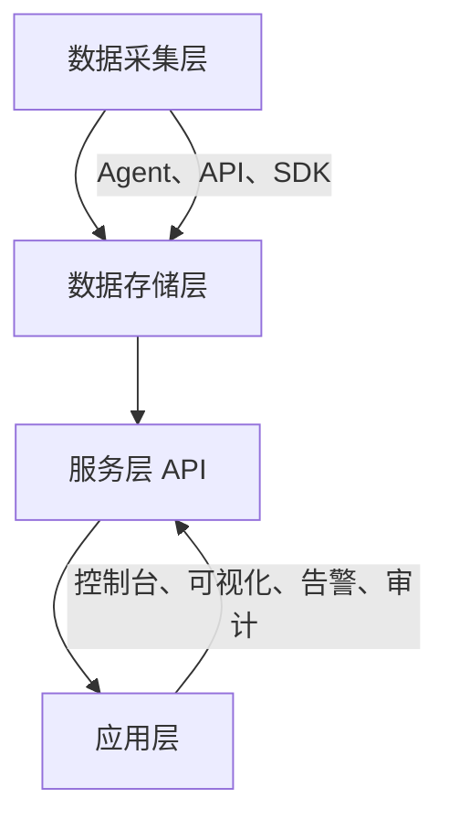

# chat

## 是什么？

## 一、CMDB 是什么？

一句话：
👉 **CMDB 是企业 IT 基础设施的“数字化地图”和“资产脑图”。**

它用来 **记录、管理、维护企业内部所有 IT 资源及其关系**，包括：

* 服务器、网络设备、数据库、中间件、应用系统
* 虚拟机、容器、云资源（如 ECS、RDS、VPC）
* 各系统之间的依赖关系（比如应用依赖数据库、部署在哪台机器上）

💡 举个例子：
你公司线上某个接口超时，你想排查——
有了 CMDB，只要点几下：

> 这个接口 → 属于哪个应用 → 部署在哪台服务器 → 那台服务器属于哪个机房 → 最近有没有变更。

CMDB 就像一个 **全景式的 IT 资源知识图谱**。

---

## 二、CMDB 的核心目标

| 目标            | 说明                              |
| ------------- | ------------------------------- |
| **资产可视化**     | 知道公司有哪些资源、数量、状态、归属。             |
| **关系可追溯**     | 清楚地知道“应用—服务器—数据库”之间的关系。         |
| **变更可追踪**     | 谁改动了什么、什么时候改的。                  |
| **数据支撑运维自动化** | 自动化部署、监控、报警、发布等系统都要依赖 CMDB 的数据。 |
| **风险控制与合规**   | 支撑配置审计、合规检查、安全扫描。               |

---

## 三、CMDB 的核心概念

| 概念                            | 含义                                      |
| ----------------------------- | --------------------------------------- |
| **CI（Configuration Item）配置项** | CMDB 的最小单元，比如服务器、应用、数据库、交换机等。           |
| **属性（Attribute）**             | 每个配置项的字段，如 IP、CPU、负责人、环境（生产/测试）等。       |
| **关系（Relationship）**          | 配置项之间的依赖关系，如“应用部署在服务器上”、“数据库被应用使用”。     |
| **模型（Model）**                 | 对某类配置项的结构定义，比如“应用类模型”包含应用名、负责人、Git 地址等。 |
| **版本与变更（Change & Version）**   | 记录配置项的变化历史。                             |

可以理解为：

> CMDB = CI 实例的集合 + 各实例间关系 + 历史变更 + 权限体系。

---

## 四、CMDB 的典型架构



### 各层说明：

| 层         | 说明                                     |
| --------- | -------------------------------------- |
| **数据采集层** | 从各种来源采集信息：云平台 API、Agent、Ansible、监控系统等。 |
| **数据存储层** | 保存配置项、关系、变更记录（常见用图数据库或关系型数据库）。         |
| **服务层**   | 提供标准 API，供其他系统查询、更新、同步。                |
| **应用层**   | CMDB 可视化界面、运维工具集、审计与分析系统。              |

---

## 五、CMDB 的典型功能模块

| 模块            | 说明                |
| ------------- | ----------------- |
| **模型管理**      | 定义配置项类型、属性、关系。    |
| **配置项管理**     | 查看、新增、修改、删除 CI。   |
| **关系管理**      | 定义并可视化配置项之间的依赖关系。 |
| **自动发现**      | 自动扫描云资源、主机、容器等。   |
| **变更记录与审计**   | 记录历史版本、修改记录、操作者。  |
| **权限与角色管理**   | 不同部门、人员访问不同资源。    |
| **可视化展示**     | 拓扑图、依赖图、仪表盘。      |
| **接口服务（API）** | 给其他系统调用，如监控、发布系统。 |

---

## 六、CMDB 的典型数据模型举例

### 示例：某公司的 CMDB 结构

```
业务线（Business Line）
  └── 系统（System）
        ├── 应用（App）
        │     ├── 服务（Service）
        │     │     └── 实例（Instance）
        │     │           └── 主机（Host）
        │     │                 └── 网络设备（Switch）
        └── 数据库（DB）
```

### 举例：

* “用户中心服务”部署在“10.0.0.1”服务器上；
* 该服务器属于“生产环境”，位于“北京机房”；
* 这个应用依赖“mysql-01”数据库；
* 负责人是“张三”。

在 CMDB 里能一键追踪整个链路。

---

## 七、CMDB 的应用场景

| 场景         | 作用                     |
| ---------- | ---------------------- |
| **监控系统集成** | 自动关联主机和服务，监控报警时可反查责任人。 |
| **自动化发布**  | 根据 CMDB 信息自动拉取部署节点、环境。 |
| **变更审计**   | 审核发布范围、自动检测变更影响面。      |
| **容量规划**   | 分析各业务资源使用情况，避免浪费。      |
| **应急排障**   | 出问题时能迅速知道受影响的服务和机器。    |
| **安全合规**   | 识别未备案机器、未加固系统。         |

---

## 八、CMDB 的常见实现方式

| 类型      | 特点          | 代表方案                                        |
| ------- | ----------- | ------------------------------------------- |
| **自研型** | 灵活度高，但建设成本大 | 腾讯 CMDB、阿里 CMDB、华为 AOC CMDB                 |
| **开源型** | 成本低，可二次开发   | iTop、open-cmdb、OneCMDB、NetBox               |
| **商业型** | 成熟、带支持服务    | ServiceNow CMDB、BMC Helix、Micro Focus UCMDB |

---

## 九、CMDB 的建设难点（关键！）

1. **数据质量问题**

   * 各系统数据来源不一致、格式不统一、实时性差。
2. **模型混乱**

   * 没有统一的模型定义，导致后续扩展困难。
3. **维护成本高**

   * 没有自动化同步，手工更新容易过期。
4. **落地价值不明显**

   * 如果其他系统（发布、监控）没接入，CMDB 就沦为“资产表”。
5. **组织治理问题**

   * 谁来维护？运维？业务线？责任不清导致数据腐化。

👉 **一句话总结难点：不是技术问题，而是管理问题。**

---

## 十、现代 CMDB 的发展趋势

| 趋势                | 说明                         |
| ----------------- | -------------------------- |
| **从静态到动态**        | 自动化采集、实时同步，不再靠人工录入。        |
| **从表结构到图模型**      | 使用图数据库（如 Neo4j）来存储复杂关系。    |
| **从孤岛到中台**        | 成为监控、发布、告警、容量、合规等系统的统一数据源。 |
| **从“资产库”到“知识图谱”** | 引入 AI/ML，自动分析依赖和风险。        |

---

## 十一、一个简单的例子帮助你理解

比如一个系统出问题了：

```
报警信息：支付服务超时。
```

有 CMDB 后的排查流程：

1. 一键查询 → 支付服务依赖哪个数据库。
2. 看到数据库 mysql-pay-01 最近有变更。
3. 点进去 → 发现 DBA 下午 3 点修改了索引。
4. 责任人自动通知到相关群。
5. 一分钟内锁定原因。

没 CMDB 的话：

> 只能靠记忆 + 问人 + 查文档 + 登录机器 = 半天过去了。

---

## 十二、总结一句话：

> CMDB 是企业 IT 运维体系的“底层真相数据库”，
> 它让所有自动化、可视化、智能化的运维能力都有了根。

# 参考资料

https://github.com/opendevops-cn/codo-cmdb

* any list
{:toc}