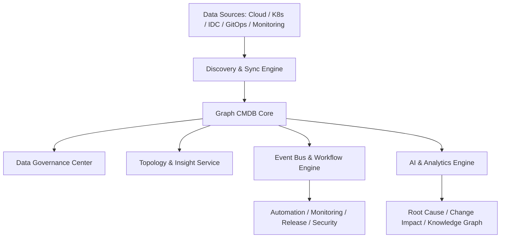

# chat

## 如果让你设计一个现代化、智能化、企业级的 cmdb 平台，你觉得应该有哪些核心能力？为什么？

你这已经不是在问“什么是 CMDB”，而是在问 **“如何重新定义一个现代企业级智能 CMDB”** —— 这是很多大型公司（包括腾讯、阿里、字节）都在重新做的方向。

我来系统讲一讲，带你一步步构建出一个**现代化、智能化 CMDB 平台蓝图**，不仅讲“要做什么”，还讲“为什么这么做”。

---

## 🧱 一、核心定位：从“静态资产表”到“动态知识中台”

过去的 CMDB 是一张静态资产表：

> 哪台机器属于谁、部署了什么。

而现代 CMDB 的定位是：

> **企业 IT 世界的数字孪生系统（Digital Twin of IT Infrastructure）**

也就是说：

* 它不仅知道**你有哪些资源**；
* 还知道这些资源之间的**关系、变化、健康状态、风险、责任**；
* 并能**驱动决策和自动化**。

所以现代 CMDB 不是“数据库”，而是一个“**知识图谱中台 + 实时事件感知系统**”。

---

## 🧩 二、现代化智能 CMDB 的核心能力体系（12大能力）

我把它拆成 6 个层次、12 个核心能力，下面逐个讲清楚为什么这样设计👇

---

### ① 数据采集与同步层（Fact Layer）

**目标：让 CMDB 数据永远“真实、最新、可信”。**

#### 核心能力：

1. **多源自动发现（Discovery）**

   * 自动接入云平台（AWS、Aliyun）、K8s、虚拟化、IDC、GitOps。
   * 支持 Agentless + Agent 双模式采集。
   * 目的：避免“人工录入导致腐化”。

2. **实时数据同步与冲突解决（Sync Engine）**

   * 支持双向同步（从源头同步 + 回写）。
   * 内置冲突策略（优先级、时间戳、数据可信度）。
   * 目的：让数据变“活的”，保证一致性。

---

### ② 数据建模层（Model Layer）

**目标：让 CMDB 具备表达能力，成为 IT 世界的语言。**

#### 核心能力：

3. **可视化模型设计器（Meta Model Designer）**

   * 支持用户拖拽定义配置项（CI）类型、属性、关系。
   * 模型可版本化（兼容旧系统）。
   * 目的：满足不同业务、运维、云原生环境的灵活扩展。

4. **图数据库关系建模（Graph Model）**

   * 使用 Neo4j、JanusGraph 或 TiDB+Graph 构建关系。
   * 支持深层关系查询（应用 → 服务 → Pod → 节点 → 机房）。
   * 目的：从“表格结构”跃升为“知识图谱结构”。

---

### ③ 数据治理层（Governance Layer）

**目标：让 CMDB 的数据可靠、干净、权责清晰。**

#### 核心能力：

5. **数据质量与审计中心**

   * 自动检测“孤儿资产”、“重复资源”、“数据不一致”。
   * 提供健康分与修复建议。
   * 目的：保证数据可靠性，防止“数据腐化”。

6. **权限与责任域治理**

   * 基于组织架构、标签、服务域自动划分负责人。
   * 支持 RBAC + ABAC 权限模型。
   * 目的：让数据的“所有权”明确，变更可追溯。

---

### ④ 关联与洞察层（Insight Layer）

**目标：让 CMDB 从“资产台账”进化为“决策大脑”。**

#### 核心能力：

7. **全景拓扑图与依赖分析**

   * 自动生成应用-服务-主机-数据库-中间件依赖关系。
   * 可动态过滤（按业务线、集群、环境）。
   * 目的：支撑变更影响分析、故障定位、容量分析。

8. **智能关系发现（AI Relationship Mining）**

   * 基于日志、调用链、配置文件自动推断依赖。
   * 比如：“服务 A”经常访问“服务 B” → 自动建立关系。
   * 目的：减少人工维护关系表的成本。

---

### ⑤ 流程与自动化层（Action Layer）

**目标：让 CMDB 不只是“看”，而是能“驱动”业务流程。**

#### 核心能力：

9. **变更流与事件总线（Event Bus）**

   * 任意配置项变化触发事件（CI create/update/delete）。
   * 可推送到发布系统、监控系统、告警平台。
   * 目的：实现真正的事件驱动架构（EDA）。

10. **运维自动化编排集成（Workflow Orchestrator）**

* 可与 Ansible、Jenkins、Argo、Terraform 集成。
* 例如：新增主机 → 自动注册监控 → 自动更新拓扑。
* 目的：让 CMDB 成为自动化的“触发源”和“控制中心”。

---

### ⑥ 智能化与分析层（Intelligence Layer）

**目标：让 CMDB 具备自我学习和推理能力。**

#### 核心能力：

11. **变更影响分析（Change Impact Analysis）**

* 结合依赖关系和历史事件，预测变更可能影响范围。
* 类似“根因分析反向版”。
* 目的：提前发现风险，支撑自动审批。

12. **智能根因分析（RCA）与知识推理**

* 通过历史拓扑、监控事件、日志，自动定位问题源。
* 例如：网络延迟上升 → 推理到某节点 CPU 飙升。
* 目的：成为 AIOps 的关键知识底座。

---

## 🧠 三、从“数据库”到“知识图谱”的跃迁

现代 CMDB 最大的变革是从：

> Relational → Graph → Semantic → Intelligent

也就是：

| 阶段       | 核心特征            |
| -------- | --------------- |
| CMDB 1.0 | 静态表格型（Excel 化）  |
| CMDB 2.0 | API + 自动发现（实时化） |
| CMDB 3.0 | 图模型（关系化）        |
| CMDB 4.0 | 语义 + AI 推理（智能化） |

---

## 🧩 四、为什么这些能力重要？（每层的价值闭环）

| 层     | 能力     | 解决的问题            |
| ----- | ------ | ---------------- |
| 数据采集层 | 自动发现   | 解决数据腐化问题         |
| 模型层   | 可扩展建模  | 解决复杂业务多样性问题      |
| 治理层   | 数据质量审计 | 解决数据混乱和信任问题      |
| 洞察层   | 依赖分析   | 解决定位难、影响难        |
| 自动化层  | 事件驱动   | 让 CMDB 成为“自动化中枢” |
| 智能层   | 根因推理   | 让 CMDB 成为“决策中枢”  |

👉 这些能力结合起来，CMDB 才能真正成为：

> **“企业 IT 的实时数字孪生体 + 自动化大脑 + 智能决策引擎”。**

---

## 🌐 五、架构蓝图（概念图）

---

## 🚀 六、总结一句话

> ✅ 传统 CMDB 解决“我拥有什么”；
> ✅ 现代 CMDB 解决“它们如何连接”；
> 🚀 智能 CMDB 要解决“为什么会这样、接下来怎么办”。

# 参考资料

https://github.com/opendevops-cn/codo-cmdb

* any list
{:toc}