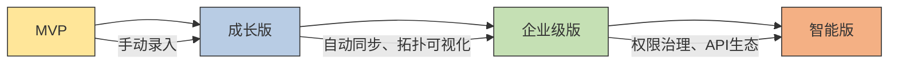

# chat

## 如果我们要从零开始实现一个 cmdb 平台，从 mvp->企业级功能，你觉得特性实现的优先级应该是如何的？给出理由

你这个问题已经进入 **产品设计与系统演化的战略层面** ——
不是“怎么做一个 CMDB”，而是“**怎么一步步从 0 到 1 再到 100 打造企业级 CMDB**”。

我们来系统拆解成三层思路：

1. **核心逻辑：MVP → 成长 → 企业级 → 智能化**
2. **每阶段的特性优先级**
3. **每个阶段“为什么这样排”**

---

## 🧭 一、总体路线图：从 MVP 到 企业级 CMDB 的成长曲线

可以想象成 4 个阶段，每个阶段都有清晰目标：

| 阶段 | 名称          | 核心目标       | 核心关键词 |
| -- | ----------- | ---------- | ----- |
| ①  | **MVP 可用版** | 让资产有迹可循    | “有数据” |
| ②  | **成长版**     | 让关系清晰可视    | “能关联” |
| ③  | **企业级版**    | 让数据可靠可治理   | “可信赖” |
| ④  | **智能版**     | 让系统自动化、智能化 | “能推理” |

---

## 🧱 二、阶段一：MVP（0 → 1）

> ✅ 目标：最小可用，验证价值，快速落地。

### 🎯 核心诉求：

* “让大家知道公司里到底有哪些资源”
* “能通过统一平台查看和搜索”

### 🔧 必做特性（优先级：核心）

| 优先级 | 功能                      | 理由                       |
| --- | ----------------------- | ------------------------ |
| ⭐⭐⭐ | **配置项模型定义（CI Model）**   | 没模型无法录入数据，是最核心的数据结构。     |
| ⭐⭐⭐ | **配置项管理（增删改查）**         | MVP 关键闭环：可以录入主机、应用、数据库等。 |
| ⭐⭐  | **基础关系定义**（应用→主机）       | 至少能看出“服务部署在哪”。           |
| ⭐⭐  | **简单搜索与列表过滤**           | 数据多了必须能方便查找。             |
| ⭐   | **手工导入导出（Excel / CSV）** | 初期数据通常来自表格。              |

### 🧩 可选（低优先级）

* 权限系统（MVP 阶段可共享）
* 审计日志（先不做，等变更多了再加）
* API 接口（后端接口可先内部使用）

### 🕐 输出目标：

✅ 能展示所有主机、应用、数据库；
✅ 能看到基本关系；
✅ 团队内部能统一使用。

---

## 🚀 三、阶段二：成长版（1 → 10）

> ✅ 目标：形成“关系视图”与“数据闭环”，支撑自动化系统。

### 🎯 核心诉求：

* “关系清晰、自动更新”
* “别再靠人工录入”

### 🔧 核心特性（优先级：高 → 中）

| 优先级 | 功能                        | 理由                            |
| --- | ------------------------- | ----------------------------- |
| ⭐⭐⭐ | **自动发现（Discovery）**       | 从云、K8s、虚拟化、Agent 获取资源，降低维护成本。 |
| ⭐⭐⭐ | **关系拓扑可视化（Topology）**     | 用图形方式展示依赖，支撑变更和排障。            |
| ⭐⭐  | **RESTful / GraphQL API** | 开放能力，其他系统可读写 CMDB。            |
| ⭐⭐  | **数据同步机制（Sync Engine）**   | 保证 CMDB 与事实源一致。               |
| ⭐   | **变更历史 / 审计日志**           | 能追溯谁改了什么。                     |

### 🧩 可选

* 标签系统（方便按业务/环境组织）
* 简单权限模型（按业务线隔离）

### 🕐 输出目标：

✅ 数据自动同步；
✅ 拓扑关系自动生成；
✅ 能支撑监控、发布系统调用。

---

## 🏗 四、阶段三：企业级版（10 → 100）

> ✅ 目标：数据可信、安全、稳定、可扩展。

### 🎯 核心诉求：

* “多团队共用 + 高可用 + 可治理”
* “数据可信、流程可控”

### 🔧 核心特性（优先级：高 → 中）

| 优先级 | 功能                        | 理由               |
| --- | ------------------------- | ---------------- |
| ⭐⭐⭐ | **权限体系（RBAC / ABAC）**     | 企业安全红线，不同部门必须隔离。 |
| ⭐⭐⭐ | **数据质量治理（DQ Engine）**     | 自动检测孤儿资产、脏数据。    |
| ⭐⭐  | **版本与变更审计**               | 支撑合规和安全审计。       |
| ⭐⭐  | **可扩展模型（Model Designer）** | 支持不同业务线自定义配置项。   |
| ⭐   | **高可用部署（分布式架构）**          | 企业级可靠性需求。        |
| ⭐   | **告警 / 发布系统集成**           | 实现生态闭环。          |

### 🧩 可选

* CMDB API 网关 + Access Control
* LDAP / SSO 集成
* Schema Migration（模型演进）

### 🕐 输出目标：

✅ 多团队安全协作；
✅ 数据准确可信；
✅ 企业内系统全面接入。

---

## 🤖 五、阶段四：智能版（100 → ∞）

> ✅ 目标：让 CMDB 从“信息中台”进化为“智能中枢”。

### 🎯 核心诉求：

* “自动分析依赖与风险”
* “自动推理根因”

### 🔧 核心特性（优先级：高 → 中）

| 优先级 | 功能                                 | 理由                     |
| --- | ---------------------------------- | ---------------------- |
| ⭐⭐⭐ | **事件总线（Event Bus）**                | 一切配置变更能触发外部动作，成为自动化核心。 |
| ⭐⭐  | **智能关系挖掘（AI Relationship Mining）** | 从日志/调用链自动推断依赖关系。       |
| ⭐⭐  | **变更影响分析（Change Impact）**          | 推测变更波及范围，提前预警。         |
| ⭐   | **根因分析（RCA）**                      | 故障时自动定位潜在问题节点。         |
| ⭐   | **知识图谱 / 推理引擎**                    | 支撑 AIOps 与专家系统。        |

### 🧩 可选

* CMDB 事件流与监控系统联动
* 业务健康评分模型

### 🕐 输出目标：

✅ CMDB 成为智能运维中枢；
✅ 支撑 AIOps 根因推理；
✅ 数据驱动决策。

---

## 📊 六、四阶段能力演化图（简化版）

---

## 🧠 七、为什么这样排序？（核心逻辑）

| 阶段  | 优先目标  | 理由                        |
| --- | ----- | ------------------------- |
| MVP | “可用”  | 没有数据=没意义。先让大家能看到资源。       |
| 成长  | “可靠”  | 靠人工维护的 CMDB 无法长久，自动化是生命线。 |
| 企业级 | “可信”  | 数据必须准确、安全、规范，否则没人敢用。      |
| 智能  | “可思考” | 当数据质量足够高，才能上升到推理层。        |

---

## 🔁 八、建议的落地节奏（时间参考）

| 阶段  | 时间周期     | 关键里程碑         |
| --- | -------- | ------------- |
| MVP | 1-2 个月   | 基础数据入库、可查询    |
| 成长  | 3-5 个月   | 自动同步+拓扑图上线    |
| 企业级 | 6-9 个月   | 权限治理+数据质量闭环   |
| 智能  | 9-12+ 个月 | 事件驱动+AIOps 集成 |

---

## 🧩 九、一句话总结

> ✅ **MVP 阶段要“快”**（能用、能看）；
> ✅ **成长阶段要“稳”**（自动化、拓扑清晰）；
> ✅ **企业阶段要“信”**（权限、数据质量）；
> ✅ **智能阶段要“慧”**（推理、预测、驱动）。

---

如果你愿意，我可以帮你进一步：

* 生成一个「CMDB 从 0 到 企业级」的 **路线图甘特图（含时间轴和关键节点）**
* 或者生成一个 **优先级矩阵表（RICE/价值-复杂度）**，帮你定量决策先做哪些特性

# 参考资料

https://github.com/opendevops-cn/codo-cmdb

* any list
{:toc}