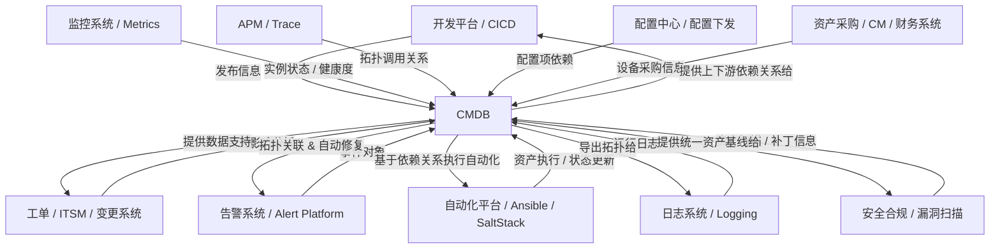

# chat

## 没有一个系统的是孤立的，cmdb 系统在一个企业中，对应的上下游服务有哪些，关系是什么？

非常好的问题，这其实触及了 CMDB 的“生态位”本质 —— 它在企业 IT 架构中并不是一个独立系统，而是 **整个数字化运营体系的“中枢神经”**。我们可以从 **上下游依赖关系、数据流、责任边界** 三个角度系统梳理。

---

## 🧭 一、CMDB 的核心定位

一句话概括：

> CMDB 是企业 IT 系统的“统一事实源”（Single Source of Truth）。

它不是直接创造业务价值的系统，而是**支撑所有运营、监控、变更、交付、运维自动化、治理、安全合规**的底座。

---

## 🧩 二、上下游关系图（全景视角）

---

## 🧮 三、上下游系统功能关系（系统视角）

| 系统             | 与 CMDB 的关系 | 典型交互数据         | CMDB 提供的价值          |
| -------------- | ---------- | -------------- | ------------------- |
| **CI/CD 发布平台** | 上游         | 应用、版本、环境、部署目标  | 确定“发布到哪里”，提供环境/实例绑定 |
| **监控系统**       | 下游（双向）     | 主机IP、服务实例、健康状态 | 将监控指标与CI绑定，实现健康度展示  |
| **日志系统**       | 下游         | 服务日志、实例ID      | 日志与配置项关联，便于根因分析     |
| **APM/Trace**  | 下游         | 应用调用链          | 动态拓扑发现、依赖可视化        |
| **配置中心**       | 双向         | 应用配置项、配置版本     | 配置与实例、环境的关联关系       |
| **工单/ITSM**    | 下游         | 变更单、审批记录       | 自动填充影响范围、审批策略       |
| **告警系统**       | 下游         | 告警事件、告警对象      | 告警自动定位到具体资产或应用      |
| **安全系统**       | 上游         | 主机漏洞、软件版本      | 结合资产基线实现漏洞风险评估      |
| **自动化执行系统**    | 下游         | 执行结果、操作记录      | 基于CI依赖拓扑执行批量操作      |
| **采购/财务系统**    | 上游         | 采购单、资产编号       | 建立从“财务资产”到“运行实例”的映射 |

---

## 🧠 四、CMDB 数据流与主权边界

| 数据类型              | 来源系统          | 数据主权归属   | CMDB 的角色  |
| ----------------- | ------------- | -------- | --------- |
| **基础资产（物理机、虚拟机）** | 资产管理 / 云平台API | 云平台      | 同步登记      |
| **中间件 / 服务实例**    | 自动发现 / 发布系统   | CMDB     | 建模和关联     |
| **业务系统 / 应用**     | CICD / 手工录入   | 开发部门     | 建模        |
| **依赖拓扑关系**        | Trace / 人工维护  | CMDB     | 聚合并统一管理   |
| **监控 / 状态数据**     | 监控系统          | 监控系统     | 引用/展示     |
| **变更 / 发布记录**     | ITSM / 发布平台   | CMDB（部分） | 存档历史，便于追溯 |

---

## 🧩 五、类比理解：CMDB = 企业 IT 的「数字孪生系统」

你可以把它类比成：

* **监控系统** → 眼睛 👁️
* **告警系统** → 神经反应 ⚡
* **自动化系统** → 手臂 💪
* **CMDB** → 大脑 🧠
  它知道每个部件的结构、依赖关系、健康状态，才能做出**智能决策（例如根因定位、变更影响分析、自动修复）**。

---

## 🧱 六、总结：CMDB 在生态中的“地基角色”

| 层级         | 系统类别            | 核心作用       | 与 CMDB 关系   |
| ---------- | --------------- | ---------- | ----------- |
| 🧱 **基础层** | 资产、网络、云资源       | 提供原始数据源    | CMDB 同步数据   |
| 🧩 **中间层** | 配置中心、监控、发布、日志   | 提供动态运行状态   | CMDB 聚合上下文  |
| 🧠 **中枢层** | CMDB、ITSM、AIOps | 管理关系和决策    | CMDB 是事实基座  |
| 🚀 **应用层** | 自动化运维、智能根因、成本分析 | 消费 CMDB 数据 | CMDB 赋能上层系统 |

# 参考资料

* any list
{:toc}