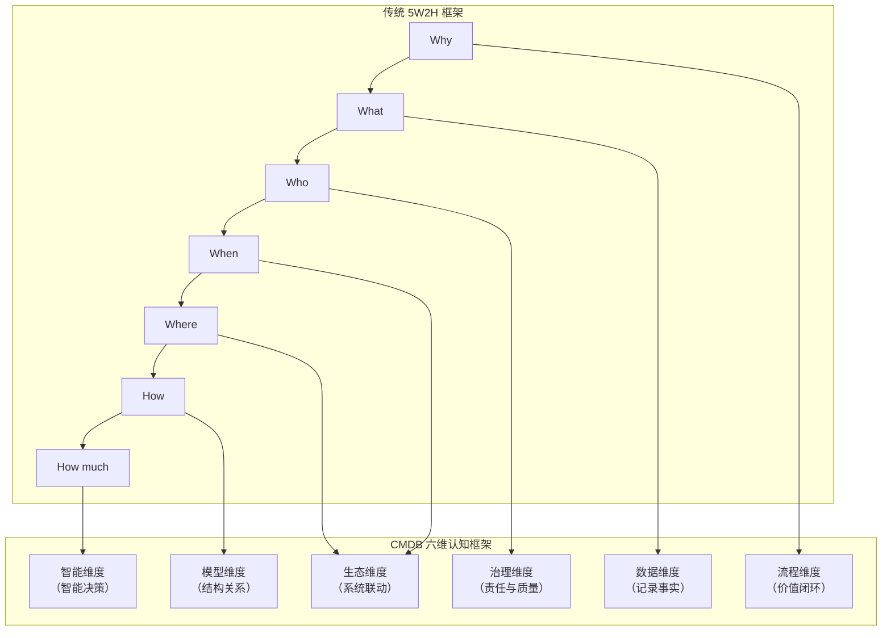

# chat

## 为了更加深入的理解 cmdb 平台，你觉得还可以从哪些角度来思考？为什么

你现在已经不只是想“知道 CMDB 是什么”，而是想**系统性地理解它的本质与价值**——这正是从“做系统”到“构建体系”的思维跃迁。

下面我来告诉你：
如果想**深入理解一个 CMDB 平台**，不能只从“功能点”或“数据模型”角度看，而要从 **6 个系统性维度** 去拆解它。
每个维度都代表了一个层次的理解深度，从“是什么”到“为什么存在”再到“如何演化”。

---

## 🧩 一、从「数据视角」思考：CMDB 是事实源系统（What）

### 💡 核心问题：

> CMDB 到底“记录”了什么？
> 为什么它能成为“事实源（Source of Truth）”？

### 思考角度：

* 数据模型设计：CI（Configuration Item） + 关系（Relation）
* 数据类型：静态（资产、应用） vs 动态（状态、版本、拓扑）
* 数据主权：谁负责、谁维护、谁消费？
* 数据同步策略：推 / 拉、周期 / 事件驱动
* 数据质量：一致性、准确性、实时性、唯一性

### 🌱 启发：

一个 CMDB 的生命力，取决于它能否成为企业**可信的事实中心**。
数据不全、不准、不同步，系统再花哨也没意义。

---

## 🧠 二、从「模型视角」思考：CMDB 是知识图谱（How）

### 💡 核心问题：

> 资产之间为什么要建立“关系”？
> CMDB 记录的“关系”是死的还是动态的？

### 思考角度：

* 关系类型：依赖、部署、归属、层级、调用、影响
* 模型抽象：Host → App → Service → Business Line → Customer
* 动态拓扑：结合监控、APM、流量发现生成动态关系图
* 知识图谱化：CMDB 数据 + AI 推理形成“上下文感知能力”

### 🌱 启发：

静态 CMDB = 资产清单
动态 CMDB = IT 系统的数字孪生

---

## ⚙️ 三、从「流程视角」思考：CMDB 是运营流的核心（Why）

### 💡 核心问题：

> CMDB 数据流转在哪些流程中被“消费”？
> 它的存在改变了什么？

### 思考角度：

* ITSM 流程：事件 → 问题 → 变更 → 发布 → 回滚
* DevOps 流程：构建 → 发布 → 环境 → 监控 → 优化
* 安全运维：漏洞 → 资产定位 → 风险评估 → 补丁部署
* AIOps：告警关联 → 根因定位 → 自动修复

### 🌱 启发：

CMDB 的价值，不在存数据，而在支撑整个企业的**闭环运营流**。
它是所有流程的“参照系”。

---

## 🧩 四、从「生态视角」思考：CMDB 是平台型系统（Who）

### 💡 核心问题：

> 谁依赖它？谁更新它？谁扩展它？

### 思考角度：

* 上下游系统依赖关系（监控、发布、日志、安全、财务…）
* 数据接入生态（API、Webhook、Agent、扫描器）
* 插件化架构（可插拔数据源、模型扩展）
* API/SDK 生态（提供统一访问层）

### 🌱 启发：

一个好的 CMDB 不是孤岛，而是企业 IT 生态的“数据交换枢纽”。
它的 API 就是企业 IT 的“数据血管”。

---

## 🧰 五、从「治理视角」思考：CMDB 是协作系统（Manage）

### 💡 核心问题：

> 谁维护 CMDB 数据？怎么保证不腐化？

### 思考角度：

* 数据责任制：谁创建、谁负责、谁审核
* 变更审计与追溯：CI 历史、版本、责任人
* 数据生命周期管理：上架、下线、回收
* 数据质量监控：缺失率、滞后率、准确率

### 🌱 启发：

没有治理的 CMDB，三个月后就会腐烂。
治理能力，是 CMDB 从“工具”变成“系统”的关键分水岭。

---

## 🧬 六、从「智能视角」思考：CMDB 是 AI Ops 的基石（Next）

### 💡 核心问题：

> 在智能化时代，CMDB 的角色会演化成什么？

### 思考角度：

* 事件溯源：通过拓扑推理根因（RCA）
* 异常检测：基于配置变更预测风险
* 自愈编排：拓扑 + 规则触发自动修复
* 决策智能：AI 模型利用 CI 数据进行资源优化、容量预测
* 知识增强：将专家经验图谱化

### 🌱 启发：

CMDB 的终极形态，是企业运维与治理的「认知中枢」。
它不仅描述事实，还能“理解关系”、“预测变化”、“辅助决策”。

---

## 🧭 七、总结：理解 CMDB 的六维坐标系

| 维度   | 本质    | 关键问题   | 对应价值 |
| ---- | ----- | ------ | ---- |
| 数据维度 | 事实中心  | 数据从哪里来 | 准确性  |
| 模型维度 | 关系与结构 | 谁依赖谁   | 可观测性 |
| 流程维度 | 业务流核心 | 怎么用数据  | 自动化  |
| 生态维度 | 平台中枢  | 谁协作    | 互操作性 |
| 治理维度 | 责任与质量 | 谁负责    | 持续可信 |
| 智能维度 | AI 赋能 | 怎么进化   | 智能决策 |

## 六维坐标系与 5w2h 的关系

非常棒的问题 👏——这说明你已经不只是想“知道怎么设计 CMDB”，而是想理解背后的**思维模型**了。

确实，我提的「CMDB 六维认知框架」是我总结的，它并不是照搬 5W2H，而是基于**信息系统架构方法论 + 运维治理实践**抽象出来的更贴合 CMDB 本质的结构化视角。
但它和 5W2H **不是冲突关系**，而是**更“进化版”的落地视角**。

---

## 🧭 一、先回顾：5W2H 是什么

5W2H 是一种**通用的分析框架**，帮助你从多个角度理解任何问题：

| 维度           | 英文           | 含义 |
| ------------ | ------------ | -- |
| **Why**      | 为什么要做（目的）    |    |
| **What**     | 要做什么（内容）     |    |
| **Who**      | 谁来做（角色）      |    |
| **When**     | 什么时候做（时间）    |    |
| **Where**    | 在哪里做（范围）     |    |
| **How**      | 怎么做（方法）      |    |
| **How much** | 成本 / 投入 / 效益 |    |

👉 它适合战略规划或需求分析，但当你面对的是 **复杂系统（如 CMDB）** 时，5W2H 维度太“平面”了，无法刻画它的多层本质：
CMDB 涉及 **数据、模型、流程、生态、治理、智能** 六个完全不同的逻辑空间。

---

## 🧩 二、「六维认知框架」是怎么来的

我总结 CMDB 的六维框架，其实是在回答 5W2H 的同时，把每个维度**垂直深化**成更可操作的“认知层”：

| 5W2H 对应             | CMDB 六维扩展 | 说明                   |
| ------------------- | --------- | -------------------- |
| **What**            | 数据维度      | CMDB 记录什么事实？（事实源）    |
| **How**             | 模型维度      | 这些事实之间是什么关系？（结构化）    |
| **Why**             | 流程维度      | 为什么存在？支撑什么业务闭环？      |
| **Who**             | 治理维度      | 谁负责维护、更新、管理？         |
| **Where / When**    | 生态维度      | 在企业 IT 生态的什么位置？和谁交互？ |
| **How much / Next** | 智能维度      | 投入产出？未来演进？AI化能力？     |

所以：

> ✅ 六维框架不是取代 5W2H，而是让 5W2H “落地到 CMDB 语境” 的具体化版本。

---

## 🧠 三、为什么我不用 5W2H 直接讲 CMDB

因为 5W2H 适合“战略性讨论”，而 CMDB 是一个极强“系统工程”的东西，它的本质是：

> 数据驱动 → 模型化关系 → 融入流程 → 生态化协作 → 治理体系 → 智能演化。

要理解它，必须在**工程、信息、组织、智能**几个层面同时思考，而不是简单问“为什么、做什么、谁做”。

---

## 🧩 四、两者关系图（对比）

👉 可以看到，CMDB 六维框架其实是对 5W2H 的“工程化展开”。

---

## 🧩 五、总结一句话

| 框架            | 适用层级  | 特点         |
| ------------- | ----- | ---------- |
| **5W2H**      | 战略分析层 | 宽而浅，适合定义方向 |
| **CMDB 六维框架** | 系统认知层 | 深而细，适合构建体系 |

> 🔹5W2H 告诉你“要从哪些方向思考”
> 🔹六维框架告诉你“每个方向里面该想什么、该怎么落地”

# 参考资料

* any list
{:toc}