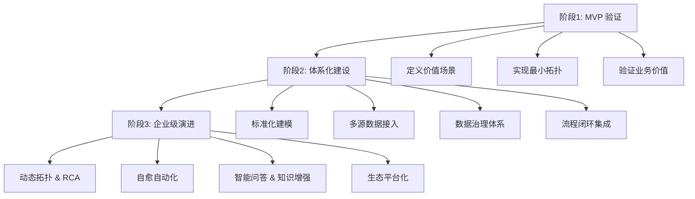

# chat

## 假设现在开始让你从零搭建 cmdb 平台，你会如何启动+资源评估+落地执行？给出理由

非常好的问题——这已经不是“怎么写个系统”的问题，而是“如何系统性落地一个企业级平台”的问题。

你的这个问题，考察的其实是一个架构师/负责人在面对「从 0 到 1」平台建设时的完整战略思维与落地执行能力。

我给你一个结构化、能直接落地的回答，分为 **三个阶段 + 七个关键决策点**，每一步都讲清楚「做什么、为什么、风险点」。

---

## 🧭 一、总体路线：三阶段战略路径

| 阶段               | 目标               | 关键词  | 输出            |
| ---------------- | ---------------- | ---- | ------------- |
| **阶段1：启动与MVP验证** | 明确价值假设，搭出最小闭环    | 快速试错 | 一个能跑的“CMDB内核” |
| **阶段2：体系化建设**    | 建模 + 数据治理 + 流程对接 | 可持续  | 稳定的数据流与模型体系   |
| **阶段3：企业级演进**    | 平台化 + 智能化 + 生态联动 | 赋能生态 | 成为运营中枢        |

---

## 🧩 二、阶段一：启动与 MVP 验证

### 🎯 目标：

> 找到 CMDB 在企业内最核心、最能体现价值的切入点，构建最小可用版本。

### 🚀 启动流程：

1. **确定价值定位（Why）**

   * 明确它要解决的具体痛点（例如：资源管理混乱、拓扑关系缺失、告警定位慢）。
   * 输出文档：《CMDB 建设愿景与业务痛点白皮书》

2. **定义 MVP 范围（What）**

   * 选定一个典型业务线或系统（如线上支付服务）
   * 建立三类最核心 CI：

     * 主机（Host）
     * 应用（App）
     * 服务关系（Dependency）
   * 确立最小拓扑闭环（App ↔ Host ↔ Service）

3. **实现关键功能（How）**

   * 数据采集：同步云平台 / CM 系统的主机信息
   * 模型设计：轻量级关系图（Neo4j / JanusGraph / MySQL + E-R）
   * 基础接口：提供 REST / GraphQL API 查询能力
   * UI：简单的可视化拓扑与资产搜索

4. **快速集成一个下游系统**

   * 例如监控平台：告警触发 → 通过 CMDB 拓扑找到上层业务负责人
   * 用这个场景验证 CMDB 的价值（“谁最早发现故障 / 定位更快？”）

### 💰 资源评估：

| 类别 | 建议配置   | 说明                      |
| -- | ------ | ----------------------- |
| 人力 | 3~5人小组 | 1架构、1前端、1后端、1DevOps、1PM |
| 周期 | 4~6周   | 打造可演示版本                 |
| 硬件 | 单节点部署  | 可用容器化方案                 |
| 成本 | <10万   | 低成本验证阶段                 |

### ⚠️ 风险点：

* 不要企图一口气做完所有模型
* MVP 要能展示“价值闭环”，哪怕是很小的
* 数据源要“可信”，不可信的数据宁缺勿滥

---

## 🧩 三、阶段二：体系化建设（可持续运营）

### 🎯 目标：

> 从“能跑”走向“能长期活下去”，建立模型标准与数据治理体系。

### 🏗️ 核心动作：

1. **标准化模型体系**

   * 定义 CI 分类：物理层、虚拟层、中间件层、应用层、业务层
   * 建立关系类型标准：部署于 / 调用 / 依赖 / 归属
   * 建立可扩展建模框架（支持自定义字段和关系）

2. **构建数据接入通道**

   * 云平台 / CM / Kubernetes / 发布系统 / GitLab CI
   * 构建统一接入框架（Webhook + API Pull）
   * 建立“变更事件 → 数据更新”的异步管道（Kafka / MQ）

3. **建立数据质量体系**

   * 质量指标：完整率、准确率、时效性
   * 报表：资产漂移率、数据更新延迟、孤儿节点率
   * 引入责任归属机制（每类 CI 都有 Owner）

4. **融入企业流程**

   * 接入 ITSM / 发布系统
   * 实现“变更前拓扑评估”、“变更后自动验证”
   * 告警系统通过 CMDB 反查业务影响范围

5. **沉淀内部平台**

   * 自研 SDK / OpenAPI
   * 内部“CMDB 数据服务”层，为上层系统（监控、工单、自动化）提供统一数据源

### 💰 资源评估：

| 类别 | 建议配置          | 说明                  |
| -- | ------------- | ------------------- |
| 人力 | 6~10人团队       | 增加数据治理、测试、UI设计      |
| 周期 | 3~6个月         | 完整企业级版本             |
| 技术 | 分布式数据库、缓存、图存储 | Neo4j、Elastic、Redis |
| 成本 | 50~100万       | 进入平台建设期             |

### ⚠️ 风险点：

* 数据一致性和实时性是最大挑战
* 与其他系统的接口频繁变更
* 数据治理容易流于形式（必须有 Owner 机制）

---

## 🧩 四、阶段三：企业级智能化演进

### 🎯 目标：

> 让 CMDB 成为企业“智能运营大脑”的基础。

### 🔮 核心方向：

1. **动态拓扑发现**

   * 结合 APM、Trace、流量分析自动构建应用依赖图

2. **根因分析 (RCA)**

   * 基于拓扑 + 告警事件进行影响范围分析与根因定位

3. **自愈编排**

   * 拓扑驱动自动修复工作流（比如发现实例异常自动触发重启）

4. **AI 数据增强**

   * 使用 NLP / LLM 识别工单、日志与资产的语义关系
   * 建立“智能问答层”——运维人员直接问：“某个服务依赖谁？”即可回答

5. **平台生态化**

   * 对外开放 API / SDK / Webhook
   * 支持插件式数据源接入、模型扩展、权限管理
   * 形成企业内“数据中台”的一部分

### 💰 资源评估：

| 类别 | 建议配置                | 说明                  |
| -- | ------------------- | ------------------- |
| 人力 | 10~20人              | 专业架构、算法、数据团队        |
| 周期 | 6~12个月              | 智能化阶段               |
| 技术 | 知识图谱 / LLM / 流式数据管道 | Graph + Kafka + LLM |
| 成本 | 100~300万            | 企业级长期投入             |

---

## 🧩 五、执行落地路径图（全局概览）

---

## 🧠 六、关键思维总结

| 阶段      | 战略核心 | 本质         |
| ------- | ---- | ---------- |
| **启动期** | 价值导向 | “先证明存在价值”  |
| **建设期** | 数据导向 | “让数据可信可用”  |
| **演进期** | 智能导向 | “让数据产生决策力” |

---

如果你愿意，我可以帮你把这个路线图扩展成一个完整的 **《CMDB 从 0 到 1 建设蓝图》**（含阶段目标、关键里程碑、团队配置、架构示意和落地路径），
它可以直接作为企业内部立项或方案汇报文档使用。
要我帮你整理成那种格式吗？

# 参考资料

* any list
{:toc}