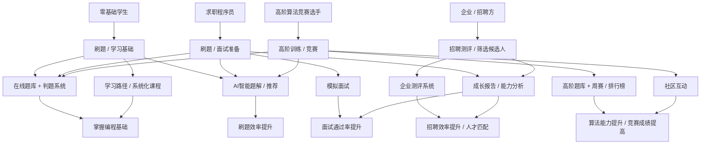

# chat

## 流程图

明白，我们可以把用户故事和功能映射整理成一个 **流程图**，展示 **用户类型 → 行为 → 功能模块 → 核心价值 → 成果/反馈** 的完整闭环。下面我给你设计一个结构化流程图示意（可用于研发和产品团队理解全流程）。

---

## **一、流程图设计思路**

**流程层次**：

1. **用户类型**

   * 零基础学生 / 求职程序员 / 高阶竞赛选手 / 企业HR

2. **用户行为/目标**

   * 例如刷题、学习、模拟面试、测评

3. **平台功能模块**

   * 在线题库、AI题解、学习路径、模拟面试、排行榜、社区、能力报告

4. **核心价值**

   * 提升学习效率、系统化成长、面试成功率、竞赛能力、招聘效率

5. **成果/反馈**

   * 学习进度、能力报告、排行榜排名、面试通过、社区互动

---

## **二、Mermaid 流程图示例**

---

## **三、流程图解读**

1. **用户类型**明确了目标群体
2. **用户行为**对应核心使用场景
3. **功能模块**映射用户行为，形成闭环
4. **核心价值**直接体现用户获得的收益
5. **成果/反馈**可以作为KPI指标和迭代优化依据

---

💡 **总结**：

* 这个流程图把 **用户故事 → 功能 → 价值** 全部串联
* 可以直接用于 **产品设计讨论、研发优先级确认、运营策略规划**
* 支持不同阶段（MVP、企业级、Pro成长、生态阶段）功能扩展

* any list
{:toc}