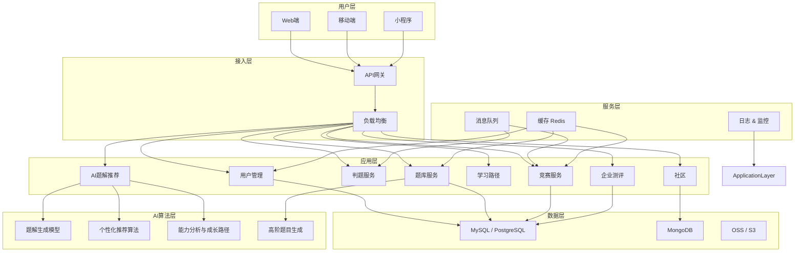

# chat

## 技术落地之架构设计

架构设计是把 **功能需求、用户故事和流程图** 转化为 **技术实现方案**，确保系统 **可扩展、可维护、高可用、性能稳定**，同时支撑未来的迭代和生态发展。

下面我帮你梳理一个针对类似力扣平台的完整架构设计方案。

---

# **1. 架构设计目标**

1. **高可用、高性能**

   * 支撑大量在线用户刷题、AI计算、排行榜更新
2. **可扩展**

   * 支持题库、用户量、企业测评、竞赛活动的快速扩容
3. **安全可靠**

   * 用户数据、企业数据保密，防止作弊和攻击
4. **技术可迭代**

   * 支持AI题解升级、个性化推荐、社区和UGC扩展

---

# **2. 架构总体分层**

```
用户层 → 接入层 → 应用层 → 服务层 → 数据层 → AI & 算法层
```

---

## **2.1 用户层（前端）**

* **目标**：提供友好、易用、跨端的用户体验
* **组成**：

  * Web端（PC、移动浏览器）
  * 移动端（iOS/Android App、小程序）
  * 交互功能：刷题、学习路径、AI题解、竞赛、社区、模拟面试

---

## **2.2 接入层（API 网关 & 负载均衡）**

* **目标**：统一接入、路由、限流、防护
* **功能**：

  * API网关（Nginx / Kong）
  * 用户认证和权限控制（OAuth2 / JWT）
  * 请求路由、负载均衡、限流、监控

---

## **2.3 应用层（后端服务）**

* **目标**：业务逻辑处理，支撑多模块功能
* **核心微服务**：

  1. **用户管理服务**：用户注册、登录、权限管理
  2. **题库服务**：题目管理、分类、分级
  3. **判题服务**：代码编译、执行、评分
  4. **AI题解服务**：生成题解、推荐题目、分析弱点
  5. **学习路径服务**：课程管理、进度追踪
  6. **竞赛服务**：周赛/双周赛、排行榜更新
  7. **社区服务**：问答、题解分享、点赞/评论
  8. **企业测评服务**：企业专属题库、测评生成、能力报告

---

## **2.4 服务层（中台 & 公共服务）**

* **目标**：提供共享能力，减少重复开发
* **组件**：

  * 消息队列（Kafka / RabbitMQ）：异步任务、题库更新、排行榜计算
  * 缓存（Redis / Memcached）：热题缓存、排行榜缓存、用户进度
  * 日志和监控（ELK / Prometheus + Grafana）

---

## **2.5 数据层**

* **目标**：持久化存储题库、用户数据、竞赛数据、日志
* **组成**：

  * **关系型数据库**（MySQL / PostgreSQL）：用户、题库、竞赛、企业测评
  * **NoSQL**（MongoDB / DynamoDB）：社区UGC内容、AI推荐缓存
  * **对象存储**（OSS / S3）：题目附件、用户提交代码、日志文件

---

## **2.6 AI & 算法层**

* **目标**：提供智能化能力，提升用户学习效率
* **组件**：

  * AI题解生成模型（NLP / CodeGen）
  * 个性化推荐算法（协同过滤 + 知识图谱）
  * 用户能力分析与成长路径优化算法
  * 高阶题目生成与难度调控模型

---

## **3. 架构示意图（Mermaid）**



---

## **4. 架构设计亮点**

1. **微服务化**：功能独立、可扩展、可单独迭代
2. **AI赋能**：题解生成、个性化推荐、能力分析、题目生成
3. **缓存与异步**：提升刷题和排行榜性能
4. **多端同步**：Web + 移动端 + 小程序数据统一
5. **数据安全与可靠**：用户数据和企业数据隔离，支持备份与灾备
6. **可扩展生态**：支持UGC、教育机构合作、企业测评

---

💡 **总结**：

* 架构设计确保 **高性能、高可用、可扩展**
* 支撑从 **MVP → 企业级 → Pro → 生态阶段** 的逐步迭代
* 与用户故事、功能优先级和价值主张紧密关联


* any list
{:toc}