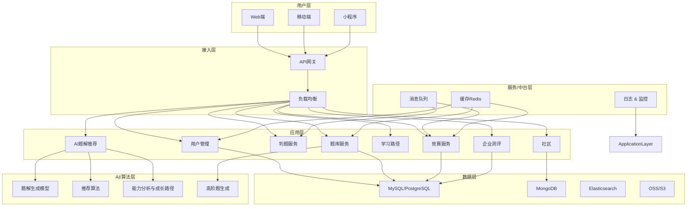

# chat

## 系统分层

明白，我们进入 **系统分层设计**，这是在架构设计和技术选型基础上，把整个系统按照 **逻辑功能和职责** 划分成独立层级，确保 **高内聚、低耦合、可扩展性强**。

针对类似力扣的平台，我帮你梳理一个详细的分层方案。

---

# **1. 系统分层总览**

通常分为 **5层**：

```
用户层 → 接入层 → 应用层 → 服务/中台层 → 数据层 → AI/算法层
```

---

## **2. 系统分层详细说明**

### **2.1 用户层（Presentation Layer）**

* **职责**：直接与用户交互，展示信息和收集用户输入
* **功能**：

  * Web端（PC、移动浏览器）
  * 移动端（iOS/Android App、小程序）
  * 用户操作：刷题、学习路径、竞赛、社区、模拟面试
  * 界面交互、数据可视化、实时反馈

---

### **2.2 接入层（API Gateway / Load Balancer Layer）**

* **职责**：统一入口、路由请求、身份验证、负载均衡
* **功能**：

  * API网关：请求转发、限流、认证、日志收集
  * 负载均衡：Nginx、K8s Ingress
  * 防护：WAF、DDoS防护

---

### **2.3 应用层（Application Layer）**

* **职责**：业务逻辑处理
* **核心模块**：

  1. **用户管理服务**：注册/登录、权限、账号管理
  2. **题库服务**：题目管理、分类、难度、题目检索
  3. **判题服务**：代码编译、执行、评分
  4. **学习路径服务**：课程管理、进度追踪
  5. **AI题解/推荐服务**：智能题解、个性化题目推荐
  6. **竞赛服务**：周赛、双周赛、排行榜
  7. **社区服务**：问答、题解分享、评论
  8. **企业测评服务**：企业专属题库、测评生成、能力报告

---

### **2.4 服务/中台层（Service/Shared Layer）**

* **职责**：提供系统通用服务，支持应用层功能
* **核心服务**：

  * **消息队列**：RabbitMQ/Kafka，处理异步任务（判题、排行榜计算、通知）
  * **缓存**：Redis/Memcached，提升访问速度（热题缓存、排行榜缓存）
  * **日志与监控**：ELK/Prometheus+Grafana
  * **限流与熔断**：保证系统高并发下稳定运行

---

### **2.5 数据层（Data Layer）**

* **职责**：持久化存储各类数据
* **组成**：

  * **关系型数据库**（MySQL/PostgreSQL）：用户信息、题库、竞赛数据、企业测评数据
  * **NoSQL**（MongoDB）：社区UGC、AI题解缓存
  * **搜索引擎**（Elasticsearch）：题库/社区内容搜索
  * **对象存储**（OSS/S3）：用户提交代码、题目附件、日志文件

---

### **2.6 AI/算法层（AI & Algorithm Layer）**

* **职责**：提供智能化功能，辅助用户学习和平台运营
* **核心功能**：

  * AI题解生成（NLP/CodeGen模型）
  * 个性化题目推荐（协同过滤 + 知识图谱）
  * 用户能力分析与学习路径优化
  * 高阶题目生成与难度控制

---

## **3. 系统分层图（Mermaid）**



---

## **4. 系统分层设计亮点**

1. **清晰职责划分**：每层只关注自己职能，降低耦合
2. **支持高并发与高可用**：消息队列 + 缓存 + API网关
3. **可扩展AI能力**：AI/算法层独立部署，可迭代升级
4. **多端统一接口**：保证Web/移动/小程序一致体验
5. **数据安全与可靠**：数据层分级存储，日志和监控全链路追踪

---

💡 **总结**：

* 系统分层确保平台 **稳定、可扩展、易迭代**
* 与 **功能模块、用户故事、流程图** 对齐
* 支撑从 **MVP → 企业 → Pro → 生态阶段** 的功能迭代

* any list
{:toc}