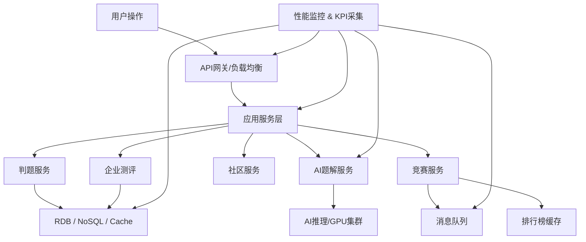

# chat

## 性能评估

性能评估是在架构设计和技术选型完成后，对系统在 **高并发、海量数据、AI计算等场景** 下的性能能力进行预估、测试和优化方案设计。

针对类似力扣的算法平台，我帮你梳理一个完整的性能评估方案。

---

# **1. 性能评估目标**

1. **响应速度**

   * 保证刷题、提交、判题、AI题解等核心功能在可接受时间内完成
2. **系统吞吐量**

   * 支撑高并发用户同时刷题和参加竞赛
3. **稳定性与可用性**

   * 系统在高负载下不崩溃，保持业务连续性
4. **扩展性**

   * 系统能根据用户增长快速扩容

---

# **2. 关键性能指标 (KPI)**

| 指标           | 目标           | 测试方法         |
| ------------ | ------------ | ------------ |
| **响应时间**     | <2秒（刷题、提交判题） | 压力测试、真实用户监控  |
| **吞吐量**      | ≥5000并发用户    | 压力测试工具模拟高并发  |
| **AI题解生成时间** | <3秒/题        | 单题AI生成性能测试   |
| **排行榜更新延迟**  | <1分钟         | 异步任务延迟监控     |
| **系统可用性**    | 99.9%        | SLA监控、容灾演练   |
| **数据一致性**    | 100%         | 数据完整性测试、事务验证 |

---

# **3. 性能评估对象**

1. **用户操作流程**

   * 用户登录 / 注册
   * 刷题、提交代码、查看题解
   * 查看排行榜、竞赛报名
   * 查看学习路径和进度

2. **后台服务**

   * 判题服务（高并发编译和执行）
   * AI题解和推荐服务
   * 排行榜更新
   * 企业测评生成

3. **数据层压力**

   * 高频查询：题库、排行榜
   * 高频写入：提交记录、竞赛成绩
   * AI模型请求和缓存压力

---

# **4. 性能测试方法**

| 测试类型              | 说明                 | 工具                                      |
| ----------------- | ------------------ | --------------------------------------- |
| 压力测试（Stress Test） | 超过设计负载，观察系统行为      | JMeter / Locust / Gatling               |
| 负载测试（Load Test）   | 模拟正常高峰并发，测响应时间和吞吐量 | JMeter / Locust                         |
| 并发测试              | 多用户同时刷题、提交         | Locust / k6                             |
| AI推理性能测试          | 测试AI题解生成延迟         | Python Profiling / TorchServe Benchmark |
| 数据库性能测试           | 高频读写压力             | Sysbench / pgbench / MongoBench         |
| 监控和指标采集           | 实时收集系统指标           | Prometheus + Grafana                    |

---

# **5. 性能优化方向**

1. **应用层优化**

   * 异步处理任务（题目判题、排行榜更新）
   * API网关限流与熔断
   * 服务拆分和微服务扩容

2. **数据层优化**

   * Redis缓存热点题目、排行榜
   * 数据库读写分离、索引优化、分库分表
   * Elasticsearch优化搜索性能

3. **AI层优化**

   * GPU加速推理
   * 模型量化 / 缓存常用题解
   * 异步AI任务处理

4. **网络与中间件优化**

   * CDN加速静态资源
   * 负载均衡策略优化
   * 消息队列高可用配置

5. **监控和告警**

   * 实时监控关键指标
   * 异常流量和延迟触发告警
   * 自动扩容策略

---

# **6. 性能评估示意图（Mermaid）**

---

💡 **总结**：

* 性能评估贯穿 **前端用户操作 → 后端服务 → 数据层 → AI层**
* 重点指标：**响应时间、吞吐量、可用性、扩展性**
* 优化手段包括：**异步处理、缓存、负载均衡、微服务拆分、GPU加速**
* 性能评估与监控结合，可持续保证平台稳定性和用户体验

* any list
{:toc}