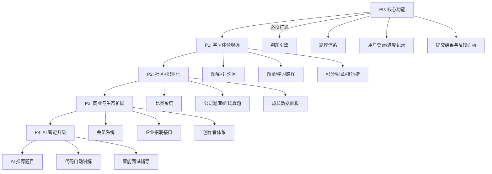

# chat

## 让你从零模拟实现力扣平台，功能重要优先级排个序，为什么？

非常好的问题👏，这个问题实际上就是在问：

> 如果要从零打造一个“力扣（LeetCode）式平台”，哪些功能最关键？哪些功能可以后做？为什么？

这个问题的本质是 **“从用户价值 → 平台留存 → 商业化” 的优先级取舍问题**。

---

## 🧩 一、从“用户生命周期”出发的思路

想清楚优先级，得先理解用户的阶段：

1. **初期用户（入门者）**：需要快速上手，获得即时成就感。
2. **成长期用户（进阶者）**：需要系统的学习路线与多样题目。
3. **留存用户（核心玩家）**：需要竞争、社交、职业导向。

所以平台初期的目标不是“功能多”，而是：

> **先建立用户学习闭环，再扩展社区和生态闭环。**

---

## 🧭 二、功能优先级总览（从“必须”到“锦上添花”）

| 优先级                | 功能模块                 | 目的/价值            | 为什么重要                 |
| ------------------ | -------------------- | ---------------- | --------------------- |
| 🥇 **P0（核心生存级）**   | **在线判题系统（OJ）**       | 用户能提交代码并获得反馈     | 没有评测，就不是刷题平台；是所有体验的根基 |
|                    | **题库管理与难度体系**        | 管理题目、支持分类与难度     | 没有体系，用户无法有序学习         |
|                    | **用户账号系统**           | 记录解题进度与成绩        | 让用户产生“成长积累感”          |
|                    | **提交记录与反馈面板**        | 展示执行结果、耗时、内存、正确率 | 即时反馈=核心成就感来源          |
| 🥈 **P1（成长体验级）**   | **题解与讨论区**           | 提升学习深度与社交互动      | 形成社区氛围，促进留存           |
|                    | **题单/学习路径功能**        | 结构化引导刷题路线        | 给用户方向，减少流失            |
|                    | **排行榜/积分/勋章系统**      | 形成竞争激励机制         | 强化用户粘性与持续动力           |
| 🥉 **P2（社区与职业化）**  | **比赛系统（周赛/双周赛）**     | 高级用户留存与活跃度核心     | 提升粘性与品牌影响力            |
|                    | **公司题库/面试真题专区**      | 与职业挂钩            | 直接提升商业与用户付费意愿         |
|                    | **个人主页与成长数据分析**      | 展示成就与历史          | 满足“展示型动机”             |
| 🪙 **P3（商业与生态扩展）** | **会员体系 / 付费题库**      | 平台变现             | 基于已有活跃用户做增值服务         |
|                    | **在线面试 / 招聘合作模块**    | 企业端接入            | 打通职业闭环，构建人才市场         |
|                    | **创作者体系（题解作者 / 教师）** | 内容供给持续化          | 让平台内容自增长              |
| 🧠 **P4（智能与体验升级）** | **AI 辅导 / 个性化推荐系统**  | 智能引导用户提升         | 提升差异化竞争力与效率           |
|                    | **代码质量分析 / 自动讲解**    | 智能教学             | 加强学习体验与平台专业度          |

---

## 💡 三、为什么这个顺序最合理（逻辑解释）

### ✅ 第一阶段（P0）：**打造“可用的闭环”**

目标：让用户第一次访问时，就能完成一次完整的“解题体验”

> 「看到题 → 写代码 → 提交 → 得反馈 → 获得成就感」

必须先把这条路径打通。
否则用户连核心动机都无法满足。

👉 对标功能：

* 判题引擎（JudgeServer）
* 题库管理（题干 + 示例 + 用例）
* 用户账号系统 + 记录表
* 提交结果页面

没有这些，就谈不上“力扣”，只能叫“算法博客”。

---

### ✅ 第二阶段（P1）：**强化“留存与学习体验”**

目标：让用户**愿意回来继续刷**。

> 人不是因为喜欢算法留下来的，而是因为看到自己“在变强”。

这一阶段要解决两个痛点：

1. **方向性问题**：我下一题该刷什么？（→ 题单）
2. **成就感问题**：我为什么要坚持？（→ 排行榜 + 积分）

再加上题解与讨论区，让用户之间形成互动，从而把“孤独刷题”变成“群体成长”。

---

### ✅ 第三阶段（P2）：**社区 + 职业闭环**

目标：让平台“有生命力”。
当有了一批持续刷题的用户，平台要：

* 用比赛和公司题库提高黏性；
* 用面试真题吸引求职用户；
* 用成长记录塑造品牌粘性。

这时 LeetCode 从“学习工具”变成“职业跳板”。

---

### ✅ 第四阶段（P3）：**商业变现与生态扩展**

有了稳定用户后，才有付费转化空间：

* 会员题库、面试套餐、课程训练营
* 企业合作招聘
* 广告与品牌联名活动

这些是商业层面的“飞轮加速器”，但都必须建立在用户稳定留存之后。

---

### ✅ 第五阶段（P4）：**AI 智能化与差异化竞争**

最后阶段是差异化竞争：

* 用 AI 推荐算法帮助用户更快进步；
* 用智能讲解、代码优化建议打造“个性化学习体验”。

此时平台不只是题库，更像「编程学习教练」。

---

## 📊 四、优先级可视化图（Mermaid）

---

## 🧠 五、总结一句话

> **构建 LeetCode 平台的优先顺序 = 先做体验闭环，再做社交留存，然后拓展职业生态与商业变现，最后用 AI 强化差异化。**

换句话说：

* 没有评测系统 → 没法玩
* 没有激励体系 → 不想玩
* 没有职业导向 → 不知道玩来干嘛
* 没有 AI 辅导 → 玩不出差异化

* any list
{:toc}