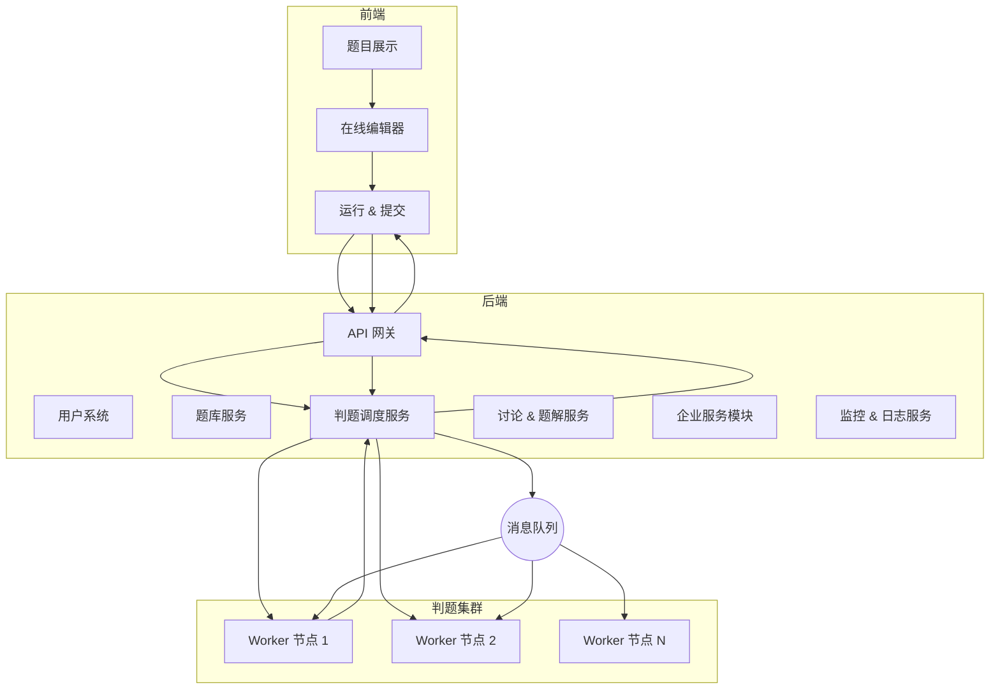

# chat

## 企业级阶段（Enterprise Level）

如果 **MVP 阶段** 的目标是 “能跑通核心闭环、让用户体验到价值”，

那么 **企业级阶段（Enterprise Level）** 的目标就是：

> ✅ 支撑**大规模并发用户**、
> ✅ 提供**系统稳定性与安全性**、
> ✅ 支撑**多角色、多租户商业模式**、
> ✅ 具备**持续运营和增长能力**。

---

## 🏢 一、LeetCode 企业级阶段的总体目标

| 目标方向     | 描述                     |
| -------- | ---------------------- |
| **规模化**  | 支撑百万级日活、并发判题任务、分布式执行环境 |
| **安全性**  | 沙箱隔离、代码审查、防注入防攻击       |
| **可观测性** | 全链路监控、性能分析、错误追踪        |
| **商业化**  | 支持企业题库、招聘测评、会员体系       |
| **生态化**  | 打造用户、企业、学校多角色的生态系统     |

---

## 🧱 二、企业级阶段核心能力分层（按体系分层）

---

### **1️⃣ 技术基础层：稳定、可扩展、可观测**

这是企业级平台的「地基」。

#### ✅ **高并发与分布式判题架构**

* 判题服务分布式部署（多语言判题节点）
* 任务队列（Kafka / RabbitMQ / Redis Stream）
* 异步执行 + 结果回调机制
* 自动水平扩容（K8s + Docker）

> 💬 价值：支撑高并发提交、企业测评批量任务不宕机。

#### ✅ **沙箱与安全执行环境**

* 独立容器执行（namespace 隔离、资源限额）
* 安全策略（限制 syscalls、文件访问）
* 支持多语言运行镜像（Java、C++、Python、Go）
* 防止恶意代码攻击 / 无限循环检测

> 💬 价值：企业级安全保障，避免用户代码破坏系统。

#### ✅ **日志与可观测性**

* 统一日志（ELK / Loki）
* Prometheus + Grafana 性能监控
* Trace 链路追踪（Jaeger / OpenTelemetry）
* 判题耗时分布、错误率可视化

> 💬 价值：企业运维、问题定位、性能瓶颈分析。

---

### **2️⃣ 应用层：用户体验与功能闭环**

#### ✅ **题库体系完善**

* 分类、标签、难度、来源（企业真题、竞赛题）
* 多版本题目（面试版 / 竞赛版）
* 题目版本历史（版本回溯、审核流程）
* 权限控制（公开题 / 私有题）

> 💬 价值：支撑商业合作题库、培训、测评题。

#### ✅ **多语言执行环境**

* 全面支持主流语言（Java、Python、C++、Go、JS、SQL）
* 每种语言独立镜像 + 版本管理
* 语言运行参数可配置（timeout、memory）

> 💬 价值：面向不同背景用户的多语言生态。

#### ✅ **用户成长体系**

* 等级 / 勋章 / 连续打卡 / 积分
* 排行榜（全站、公司、学校）
* 每日挑战 / 周赛活动

> 💬 价值：提升粘性、打造“游戏化”学习体验。

---

### **3️⃣ 运营层：社区与生态建设**

#### ✅ **社区互动与知识生态**

* 题解系统（支持 Markdown、代码高亮）
* 点赞 / 收藏 / 评论 / 讨论
* 内容审核机制（AI 审核 + 管理员审核）
* 热门题目 / 热门讨论推荐算法

> 💬 价值：用户留存、UGC 内容沉淀。

#### ✅ **学习路径与课程系统**

* 学习路线图（初级 → 高级 → 专项）
* 系列课程（算法、SQL、系统设计）
* 视频讲解 + 题目联动
* 自动记录学习进度

> 💬 价值：从“刷题平台”升级为“学习生态”。

---

### **4️⃣ 商业层：企业服务与变现能力**

#### ✅ **企业测评与招聘系统**

* 企业可自定义题库 / 测试套题
* 邀请候选人远程笔试 / 实时监控
* 自动报告（代码质量、用时、正确率）
* 支持批量判题、统计分析

> 💬 价值：直接变现路径（LeetCode For Business 模式）。

#### ✅ **B2B / B2C 商业模式**

* 企业订阅（招聘 / 测评）
* 用户订阅（会员题库、进阶课程）
* 专项测评（模拟面试、AI 面试官）
* 题目 API / SaaS 出口

> 💬 价值：形成可持续营收模式。

---

### **5️⃣ 管理与运维层：平台可持续性**

#### ✅ **多角色权限与运营后台**

* 用户 / 管理员 / 出题人 / 企业管理员
* 审核流（题目、题解、讨论）
* 权限粒度控制（RBAC）
* 后台监控（用户量、提交量、资源占用）

#### ✅ **版本与灰度发布体系**

* 蓝绿发布 / 灰度发布
* 判题节点滚动升级
* 题库数据版本控制

---

## 🧩 三、企业级架构能力演进路线

| 阶段                  | 核心目标       | 关键特征          |
| ------------------- | ---------- | ------------- |
| **MVP**             | 跑通核心体验     | 单节点执行、基础题库    |
| **Pro（成长期）**        | 规模化 + 可用性  | 分布式判题、监控、缓存   |
| **Enterprise（企业级）** | 安全、可扩展、商业化 | 沙箱隔离、多租户、企业测评 |

---

## ⚙️ 四、技术架构建议（企业级）

---

## 🧭 五、企业级成功指标（KPI）

| 维度    | 目标            | 意义       |
| ----- | ------------- | -------- |
| 系统稳定性 | 平均可用率 > 99.9% | 可支撑大规模并发 |
| 判题性能  | 平均延迟 < 1s     | 用户体验流畅   |
| 用户留存  | 7日留存率 > 30%   | 内容与粘性验证  |
| 商业变现  | 企业付费客户数 / 订阅率 | 模型验证     |
| 社区活跃度 | 日讨论量 / 题解数    | 内容生态成熟   |

* any list
{:toc}