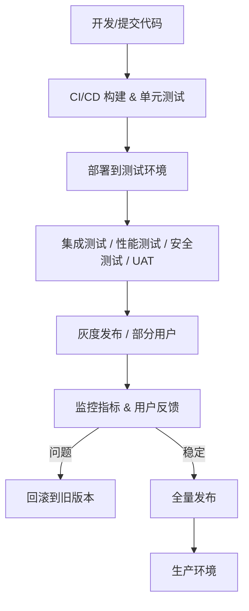

# chat

## 平台的部署上线、版本管理、发布策略、灰度发布

我们进入 **平台上线与运维策略**阶段。

这部分主要涉及如何让类似力扣的平台 **安全、稳定、可控地发布上线**，并支持版本迭代和灰度策略。

下面我给你做一个系统化的介绍。

---

# **1️⃣ 平台部署上线（Deployment）**

## **部署目标**

* 保证平台 **高可用、可扩展、快速恢复**
* 支撑 **MVP → 企业 → Pro → 生态阶段** 的持续迭代

## **部署架构**

1. **容器化部署**

   * 使用 **Docker** 封装服务
   * 每个微服务独立容器化部署，保证环境一致性

2. **容器编排**

   * 使用 **Kubernetes**（K8s）管理容器集群
   * 自动调度、扩容、滚动升级

3. **多环境分层**

   * **开发环境（Dev）**：本地或共享测试环境
   * **测试环境（Test/Staging）**：与生产一致，用于集成、性能和安全测试
   * **生产环境（Prod）**：对外正式服务

4. **基础设施**

   * 云服务或自建服务器
   * 负载均衡（Nginx / K8s Ingress）
   * 缓存层（Redis）、消息队列（Kafka / RabbitMQ）
   * 数据库（MySQL/PostgreSQL、MongoDB）、对象存储（OSS/S3）

---

# **2️⃣ 版本管理（Version Control）**

## **目标**

* 保证代码有序迭代
* 支撑多分支开发、快速回滚

## **管理策略**

1. **代码管理**

   * Git（GitHub/GitLab/Bitbucket）
   * 分支策略：

     * `main/master`：生产稳定版本
     * `develop`：开发整合分支
     * `feature/*`：功能开发
     * `hotfix/*`：线上紧急修复

2. **版本号规范**

   * 使用 **语义化版本（Semantic Versioning）**：`MAJOR.MINOR.PATCH`

     * `MAJOR`：大改动，不兼容旧接口
     * `MINOR`：增加新功能，向下兼容
     * `PATCH`：Bug修复，向下兼容

3. **自动化构建**

   * CI/CD 集成 Git，触发构建与单元测试
   * 保证每次提交都能生成可部署版本

---

# **3️⃣ 发布策略（Release Strategy）**

## **目标**

* 降低发布风险
* 保证业务连续性

## **常用策略**

1. **蓝绿发布（Blue-Green Deployment）**

   * 两套环境同时存在：`Blue`（当前生产）、`Green`（新版本）
   * 切换流量时新版本上线，不影响现有用户
   * 可快速回滚

2. **滚动发布（Rolling Deployment）**

   * 逐步替换旧版本实例
   * 保证部分实例仍在服务
   * 避免整体停机

3. **灰度发布（Canary Release）**

   * 先对部分用户开放新版本
   * 收集数据和反馈
   * 验证稳定后再全量发布
   * 支撑 **A/B测试、功能验证、风险控制**

---

# **4️⃣ 灰度发布（Canary / Incremental Release）**

## **流程**

1. 选择部分用户或用户群（如 VIP 用户、内测用户）
2. 部署新版本服务实例，部分流量路由到新版本
3. 监控关键指标：

   * 响应时间、错误率、用户行为数据
   * 业务指标（如题目提交成功率、排行榜更新延迟）
4. 问题处理：

   * 出现异常 → 停止灰度、回滚
   * 数据正常 → 扩大灰度范围，最终全量发布

## **优势**

* 降低新版本风险
* 支撑快速迭代
* 可结合 **自动化监控和告警** 实现安全上线

---

# **5️⃣ 上线与运维流程示意（Mermaid）**

---

# **6️⃣ 上线与版本管理最佳实践**

1. **自动化为核心**

   * CI/CD + 单元/集成测试 + 性能监控
2. **灰度+滚动组合**

   * 灰度控制风险
   * 滚动发布保证不中断服务
3. **版本可追溯**

   * Git提交记录 + 版本号 + 发布日志
4. **监控告警全覆盖**

   * 响应时间、错误率、系统资源、用户行为指标
5. **快速回滚机制**

   * 每次发布都可以快速回滚，保证用户体验

---

💡 **总结**

* **部署上线**：容器化 + K8s + 多环境
* **版本管理**：Git分支策略 + 语义化版本
* **发布策略**：蓝绿、滚动、灰度组合
* **灰度发布**：低风险验证新功能 + 自动监控指标
* **运维闭环**：监控 → 问题 → 回滚 → 全量发布

* any list
{:toc}