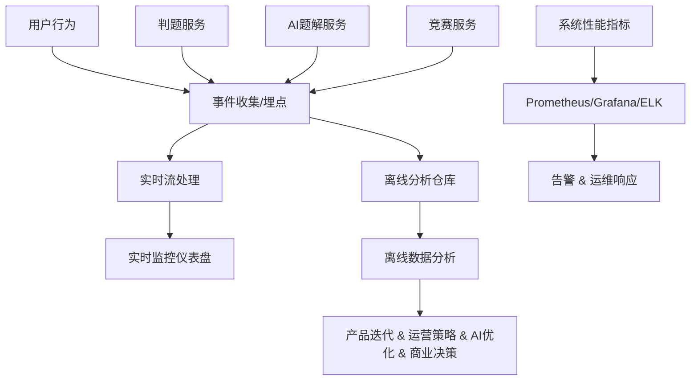

# chat

## 数据监控与分析（Data Monitoring & Analytics）

好的，我们来详细拆解 **数据监控与分析** 在类似力扣平台的角色、方法和实践。它是平台 **运营、产品优化和商业决策** 的核心支撑，也是平台长期可持续发展的关键能力。

---

# **9️⃣ 数据监控与分析（Data Monitoring & Analytics）**

| 维度       | 目标       | 核心内容                     | 数据价值               |
| -------- | -------- | ------------------------ | ------------------ |
| **核心目标** | 实时掌握产品状态 | 监控用户行为、题库完成率、AI推荐效果、系统性能 | 数据驱动产品迭代、运营优化和商业决策 |

---

## **1️⃣ 监控维度**

### **(1) 用户行为监控**

* **目的**：了解用户使用习惯和活跃度，为运营和产品优化提供依据
* **关键指标**

  * DAU/MAU（每日/月活跃用户数）
  * 留存率（次日、7日、30日留存）
  * 用户刷题行为：题目完成数、答题正确率、题型偏好
  * AI题解使用率、推荐点击率
  * 竞赛参与度：报名人数、完成率、排名分布
* **工具**：

  * Google Analytics / Mixpanel / Amplitude
  * 自建埋点 + 数据仓库（ClickHouse、Hive、Snowflake）

---

### **(2) 题库完成率监控**

* **目的**：衡量用户学习进度和题库利用率
* **关键指标**

  * 题目覆盖率：用户完成题目数 / 总题目数
  * 难度分布完成率：简单/中等/困难题完成情况
  * 专题/章节完成率：针对学习路径或专项训练模块
* **应用场景**

  * 指导题库更新和优化
  * 为AI推荐提供数据基础

---

### **(3) AI推荐效果监控**

* **目的**：衡量AI题解和个性化推荐的准确性和用户价值
* **关键指标**

  * 推荐点击率（CTR）
  * 推荐题目完成率
  * AI题解生成成功率和平均延迟
  * 用户对推荐内容的满意度（反馈、点赞、评论）
* **应用场景**

  * 优化AI模型、算法参数
  * 定制化学习路径调整

---

### **(4) 系统性能监控**

* **目的**：保障平台稳定运行
* **关键指标**

  * 响应时间（API、前端页面、AI题解）
  * 系统吞吐量（并发用户数、提交量）
  * 错误率（HTTP 5xx/4xx、判题失败率）
  * 资源使用率（CPU、内存、磁盘、网络）
  * 队列长度和延迟（消息队列、任务队列）
* **工具**：

  * Prometheus + Grafana
  * ELK Stack（Elasticsearch, Logstash, Kibana）
  * APM工具（NewRelic, SkyWalking）

---

## **2️⃣ 数据分析方法**

1. **实时分析**

   * 实时监控用户行为和系统性能
   * 快速发现异常，如AI服务延迟、用户提交失败

2. **离线分析**

   * 聚合用户行为数据，分析留存、活跃和题库完成率
   * 支撑业务策略和产品迭代

3. **数据可视化**

   * 仪表盘（Dashboard）展示关键指标
   * 图表化展示趋势和异常，如留存曲线、题库完成率热力图

4. **高级分析**

   * 用户分群分析（K-means, RFM模型）
   * AI推荐效果评估（A/B测试、CTR/完成率）
   * 预测分析（学习路径优化、付费转化预测）

---

## **3️⃣ 数据驱动价值**

| 场景       | 数据作用                       |
| -------- | -------------------------- |
| **产品迭代** | 用户行为和题库完成率指导题目优化、功能改进      |
| **运营优化** | 用户分层和活跃数据指导推送策略、活动设计       |
| **AI优化** | 推荐题目和AI题解的点击率、完成率指导算法调优    |
| **商业决策** | 付费转化率、活跃度、社区活跃度数据支撑会员和企业策略 |
| **风险控制** | 系统性能和错误监控预防宕机、判题失败、延迟      |

---

## **4️⃣ 数据监控体系结构示意**

---

## **5️⃣ 数据监控与分析实践建议**

1. **全链路埋点**

   * 前端、后端、AI服务、竞赛活动、社区行为全覆盖
2. **实时+离线结合**

   * 实时监控关键业务指标，离线分析支撑产品策略
3. **仪表盘可视化**

   * 不同角色定制化（产品、运营、运维、管理层）
4. **数据驱动闭环**

   * 数据采集 → 指标分析 → 决策优化 → 再次采集
5. **异常告警机制**

   * 系统性能、用户行为异常、AI生成失败等触发告警
6. **持续迭代**

   * 指标与KPI随着阶段（MVP → 企业 → Pro → 生态）迭代

---

💡 **总结**

* **数据监控与分析** 是平台的“神经系统”，实时感知用户和系统状态
* 关键目标：**掌握用户行为、题库完成率、AI推荐效果、系统性能**
* 核心价值：**指导产品迭代、运营优化、AI模型调优和商业决策**
* 实践方法：**全链路埋点 → 实时监控 → 离线分析 → 仪表盘可视化 → 数据驱动闭环**

* any list
{:toc}