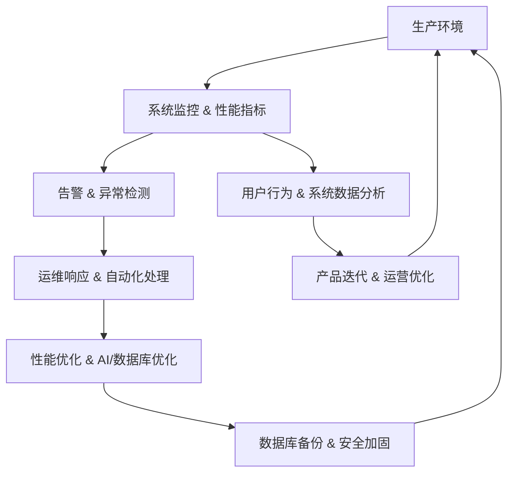

# chat

## 持续运维与优化（Continuous Operations & Optimization）

好的，我们来系统地展开 **持续运维与优化** 在类似力扣平台中的作用、方法和实践。

这个阶段是平台 **长期稳定运行、支持迭代和持续增长** 的核心保障。

---

# **🔟 持续运维与优化（Continuous Operations & Optimization）**

| 维度       | 目标          | 核心内容                  | 数据价值              |
| -------- | ----------- | --------------------- | ----------------- |
| **核心目标** | 保持系统稳定、支持迭代 | 运维、告警、性能优化、数据库备份、安全加固 | 支撑长期增长、用户粘性和业务连续性 |

---

## **1️⃣ 系统运维（Operations）**

### **目标**

* 确保平台 **高可用、可扩展、可维护**
* 支撑日常业务和版本迭代

### **策略**

1. **基础设施运维**

   * 云服务或自建服务器监控
   * 容器编排（K8s）管理服务实例
   * 自动扩容与负载均衡

2. **服务健康管理**

   * 服务心跳监控
   * 自动重启失败服务
   * 容器/微服务状态可视化

3. **配置管理**

   * 使用 ConfigMap、环境变量、Secrets 管理敏感信息
   * 配置变更自动化，减少人为错误

---

## **2️⃣ 告警与事件响应（Alert & Incident Management）**

### **目标**

* 快速发现异常，减少业务中断时间

### **策略**

1. **告警指标**

   * 系统性能：CPU、内存、磁盘、网络
   * 服务可用性：API响应时间、错误率、判题失败率
   * 数据异常：提交数异常、排行榜延迟、AI失败率

2. **告警流程**

   * 阈值告警 + 异常趋势告警
   * 自动通知（邮件、Slack、微信）
   * 自动化处理（重启服务、切换流量）

3. **事件响应**

   * SRE（Site Reliability Engineering）团队快速排查
   * 事件记录和复盘，总结改进

---

## **3️⃣ 性能优化（Performance Optimization）**

### **目标**

* 支撑高并发刷题、竞赛、AI生成题解
* 降低延迟，提升用户体验

### **策略**

1. **前端优化**

   * 静态资源缓存 + CDN加速
   * 懒加载题目、分页加载列表
2. **后端优化**

   * 微服务拆分、异步任务处理
   * API限流、熔断、队列异步处理
3. **数据库优化**

   * 分库分表、读写分离、索引优化
   * 高频查询缓存（Redis、Memcached）
4. **AI服务优化**

   * GPU推理优化、批量任务处理
   * 模型缓存与量化

---

## **4️⃣ 数据库备份与恢复（Backup & Recovery）**

### **目标**

* 防止数据丢失，保证业务连续性

### **策略**

1. **定期备份**

   * 全量备份：每日/每周
   * 增量备份：实时或每小时
2. **多地域存储**

   * 云端多副本或异地备份
3. **恢复演练**

   * 定期演练数据恢复
   * 验证备份有效性和恢复时间

---

## **5️⃣ 安全加固（Security Hardening）**

### **目标**

* 防止系统漏洞和数据泄露
* 保证平台和用户数据安全

### **策略**

1. **访问控制**

   * 用户权限管理、最小权限原则
   * API鉴权和权限验证
2. **网络安全**

   * 防火墙、WAF（Web Application Firewall）
   * HTTPS/SSL加密
3. **漏洞管理**

   * 定期扫描代码和依赖库漏洞
   * 安全补丁自动更新
4. **数据安全**

   * 数据加密存储、传输加密
   * 敏感数据脱敏

---

## **6️⃣ 运维自动化与工具**

* **CI/CD**：Jenkins/GitLab CI，自动构建、测试和部署
* **监控告警**：Prometheus + Grafana + ELK Stack
* **任务调度**：Airflow/K8s CronJob
* **配置与秘密管理**：Ansible, Terraform, Vault
* **容器与微服务管理**：Kubernetes, Helm

---

## **7️⃣ 持续优化闭环**

### **说明**

* **监控告警** → **快速响应** → **性能优化** → **数据安全与备份**
* **用户与系统数据分析** → **产品迭代与运营优化**
* 构成闭环，支撑长期平台稳定和增长

---

💡 **总结**

* **持续运维与优化** 是平台长期稳定运行的“生命线”
* 核心模块：**运维、告警、性能优化、数据库备份、安全加固**
* 目标不仅是保证业务连续性，更是 **支撑迭代、提升用户体验、维持用户粘性**
* 与 **数据监控、性能评估、发布策略** 等环节结合，形成完整的 **运维闭环**

* any list
{:toc}