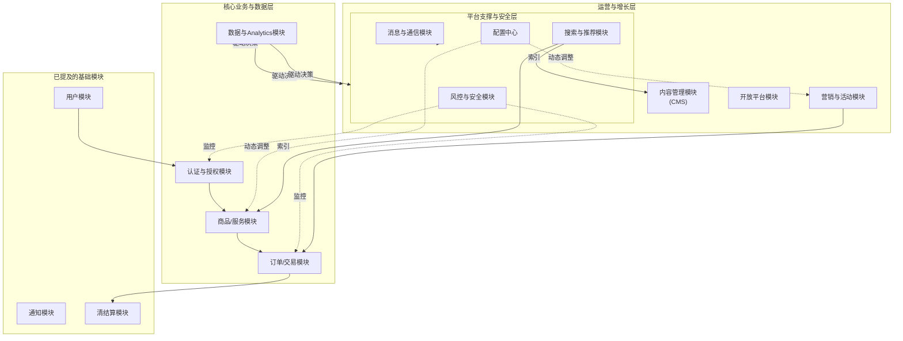

# chat

## 你觉得一个平台 最核心的，除了用户模块，通知模块 短信，邮件，I’m 之类的， 清结算模块。还有那些核心的模块

用户、通知、清结算确实是任何平台级产品的基石。

除此之外，还有以下几个**极其核心**的模块，它们共同构成了一个完整、健壮、可扩展的平台。

我将这些模块分为三大类：**核心业务与数据层**、**平台支撑与安全层**、**运营与增长层**。

### 一、 核心业务与数据层

这类模块直接处理平台的核心价值和数据资产。

1.  **认证与授权模块**
    *   **认证：** 用户是谁？除了基础的账号密码，现在通常集成社交登录（微信、微博、Google）、OAuth 2.0、单点登录（SSO）、生物识别等。
    *   **授权：** 用户能做什么？这是一个精细化的权限控制系统，管理着用户、角色、资源之间的访问规则。没有它，平台毫无安全边界。

2.  **商品/服务/内容模块**
    *   这是平台**价值的具体承载物**。对于电商是商品/SKU，对于SaaS是服务套餐，对于内容平台是文章/视频。
    *   核心功能包括：创建、编辑、上下架、分类、标签、搜索索引、库存管理（如果是实物）等。

3.  **订单/交易模块**
    *   记录了价值交换的全过程。它是清结算模块的前置依赖。
    *   核心功能包括：订单生成、状态流转（待支付、已支付、履约中、完成、取消）、订单详情、退款申请等。一个设计良好的状态机是此模块的关键。

4.  **数据与 analytics 模块**
    *   **数据采集：** 埋点系统，收集用户行为数据。
    *   **数据处理与存储：** 数据仓库、数据湖。
    *   **数据分析与可视化：** BI工具、报表系统。这个模块是所有业务决策的“眼睛”，用于衡量产品健康度、用户行为、转化漏斗等。

---

### 二、 平台支撑与安全层

这类模块保障平台的稳定、可靠和安全。

5.  **风控与安全模块**
    *   **业务风控：** 防刷、防薅羊毛、反欺诈、识别恶意行为。
    *   **安全防护：** 防SQL注入、XSS攻击、CSRF攻击、数据加密、DDoS防护等。这是平台的“免疫系统”。

6.  **配置中心**
    *   用于动态管理应用程序的配置参数，而无需重新部署代码。例如，开关功能、调整费率、修改活动规则等。它极大地提高了运维效率和灵活性。

7.  **搜索与推荐模块**
    *   **搜索：** 不仅仅是简单的数据库查询，而是涉及倒排索引、分词、相关性排序的复杂系统（如基于Elasticsearch）。
    *   **推荐：** 根据用户画像和行为数据，个性化地展示内容/商品，是提升用户体验和转化的关键。

8.  **消息与实时通信模块**
    *   你提到了“通知模块”（偏向于系统对用户的单向通知），这里是更通用的**双向通信**。例如平台内的即时消息、聊天、客服系统、实时协作等。通常需要处理长连接、消息推送、群组管理等。

---

### 三、 运营与增长层

这类模块帮助平台更好地运营用户和实现增长。

9.  **营销与活动模块**
    *   用于创建和管理营销活动，如优惠券、折扣、满减、秒杀、团购等。它需要与订单、清结算模块紧密配合，进行复杂的优惠计算。

10. **客服与工单模块**
    *   用户遇到问题时的求助通道。一个完整的工单系统包括工单创建、分配、流转、升级、结算和用户满意度评价。

11. **内容管理模块**
    *   用于管理那些不直接由用户生成，但又非常重要的内容，比如首页Banner、公告、帮助中心文档、运营文章等。它是一个面向运营人员的后台系统。

12. **合作伙伴/开放平台模块**
    *   如果平台希望建立生态，允许第三方开发者基于你的平台开发应用，那么你需要提供API网关、SDK、文档和开发者门户。

### 总结与关系

这些模块并非孤立存在，而是相互关联，形成一个有机整体。

下图清晰地展示了这些核心模块在一个典型平台架构中的位置与相互关系：

**最后，一个更高层次的“核心模块”是：**

*   **统一的API网关：** 作为所有客户端请求的唯一入口，负责负载均衡、认证、限流、监控等横切关注点。
*   **监控与告警系统：** 涵盖基础设施监控、应用性能监控和业务指标监控，确保平台可用性。

具体需要优先建设哪些模块，取决于你的**业务类型**。例如：
*   **电商平台：** 商品、订单、营销、清结算、风控是重中之重。
*   **社交平台：** 用户关系、内容、feed流、消息、推荐是核心。
*   **SaaS平台：** 多租户架构、授权、服务配置、计费（Billing）模块尤为关键。

# 参考资料

* any list
{:toc}