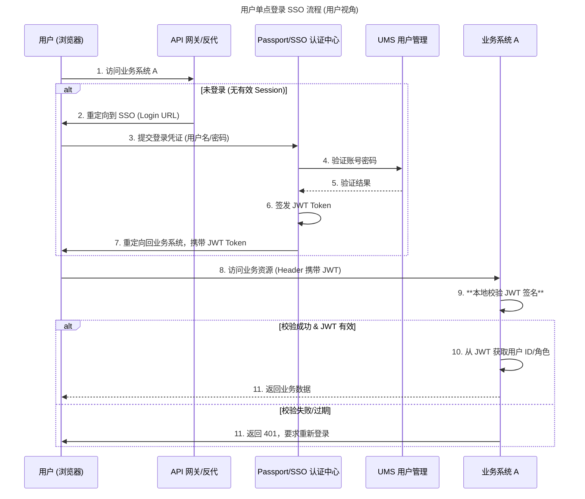
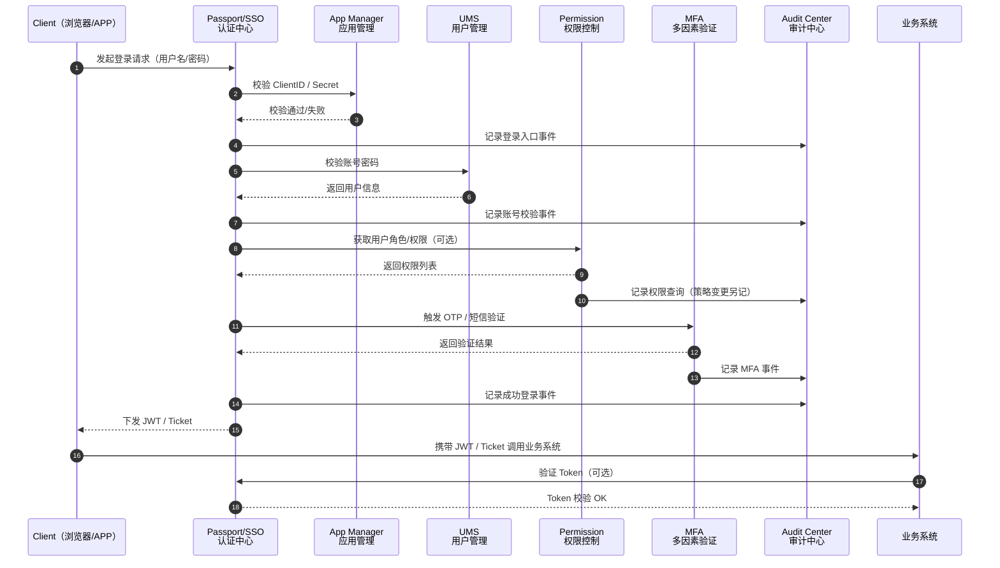
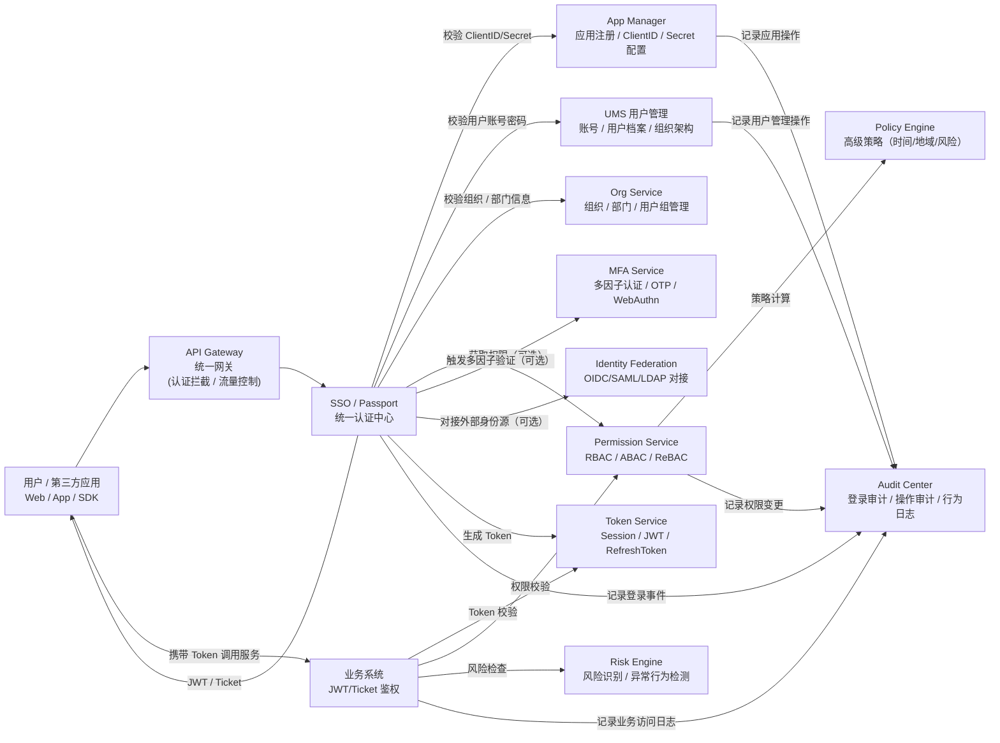

# 流程

### 1 用户视角登录流程图（全部系统）

这个流程图展示了用户从浏览器发起登录到最终在业务系统中访问资源的全过程，体现了 `Passport/SSO`、`UMS`、`Permission` 以及最终的**无状态鉴权**机制。



-----

### 2\. SSO 依赖的子系统拓扑图（架构视角）

这个拓扑图明确展示了 `Passport/SSO` 作为认证层，对其底层数据和配置管理子系统的依赖关系。




# 完整结构拓扑



# 补全
-----

### 第一优先级：必须补充的“地基”

这些是系统上线运行不可或缺的模块。

#### 1\. 审计中心 (Audit / Log Service)

**为什么需要：** 目前你的架构中，如果有人删库了，或者某个账号深夜异常登录，你可能无法快速追溯。

  * **补充内容：**
      * **操作日志：** 记录管理员在 `ums` 和 `permission` 里的所有增删改查（如：谁把张三的权限改了）。
      * **登录日志：** 记录 `passport/sso` 的所有登录行为（IP、设备、时间、成功/失败原因）。
      * **鉴权日志：** 记录 `permission` 的判定结果（谁访问了什么接口，是被 Allow 还是 Deny）。

#### 2\. 应用管理 (App Manager / Client Registry)

**为什么需要：** `sso` 和 `passport` 发放令牌时，必须知道是发给“谁”的。如果你的公司有 20 个内部系统要接入 SSO，你不能把 ClientID 和 Secret 硬编码在数据库里。

  * **补充内容：**
      * **应用注册：** 管理接入方（Relying Party）的生命周期。
      * **配置管理：** 每个应用的回调地址（Redirect URI）、令牌有效期、所需的 Scope（权限范围）、签名公钥/私钥管理。

-----

### 第二优先级：解决“数据孤岛”和“效率”

当接入系统变多，或者组织架构变复杂时，你需要这些。

#### 3\. 同步/分发中心 (Provisioning / Sync Engine)

**为什么需要：** `ums` 是主数据，但下游业务系统（如 OA、Jira、GitLab）也需要账号数据。目前你可能需要人工去各个系统建号，或者写死脚本。

  * **补充内容：**
      * **下游推送 (Push):** 当 `ums` 新增员工时，自动调下游 API 创建账号（SCIM 协议或自定义 Connector）。
      * **上游拉取 (Pull):** 如果你们用钉钉/飞书做源头，需要定时把组织架构拉回 `ums`。

#### 4\. 审批工作流 (Workflow / Request Center)

**为什么需要：** `permission` 模块现在可能只有管理员能操作。业务人员想申请某个系统的权限，现在可能要靠“发邮件”或“吼一声”，缺乏流程管控。

  * **补充内容：**
      * **自助申请：** 普通用户登录后，发起“申请 A 系统管理员权限”的工单。
      * **审批流：** 对接 `ums` 中的 Leader 信息，自动流转给上级审批。

-----

### 第三优先级：增强“安全”和“体验”

#### 5\. 风控与安全策略 (Risk & Security Policy)

**为什么需要：** `passport` 仅仅验证密码是不够的。

  * **补充内容：**
      * **MFA (多因素认证)：** 如果你没把 MFA 做在 passport 里，建议单独抽离。
      * **策略引擎：** 定义规则，例如“连续输错 5 次密码锁定账号”、“禁止非公司 IP 段登录”。

-----

### 架构映射：新旧对比

为了帮你理清关系，我们将你现有的模块与建议补充的模块进行融合：

| 你的模块 | 标准定位 | **建议拆分/扩充/新增的子系统** |
| :--- | :--- | :--- |
| **ums** | IDM (Identity) | **+ 同步中心 (Sync)**：负责与钉钉/AD/业务系统的数据同步。<br>**+ 审批中心 (Workflow)**：处理入职、权限申请流程。 |
| **passport** | AuthN (Auth) | **+ MFA 服务**：独立处理短信/OTP验证。<br>**+ 风控组件**：识别撞库、异地登录。 |
| **sso** | Federation | **+ 应用管理 (App Mgr)**：管理 ClientID/Secret 和回调白名单。<br>**+ 会话管理 (Session)**：统一踢人下线的能力。 |
| **permission** | AuthZ (Auth) | **+ 策略引擎 (Policy Engine)**：如果是复杂场景，从代码逻辑中抽离出规则。<br>**+ 审计中心 (Audit)**：这是全新的，记录上述所有模块的流水。 |

### 总结建议

如果你资源有限，建议按照以下顺序开发：

1.  **应用管理 (App Manager)**：为了配合 SSO 标准协议（OIDC/OAuth2），这个是硬性要求。
2.  **审计日志 (Audit)**：为了出事能甩锅（划掉）能追责，这个性价比极高。
3.  **同步服务**：如果系统超过 5 个，手动维护账号会崩溃，此时再做同步。


这是一个非常敏锐的问题。如果依赖关系理不顺，IAM 平台很容易变成一个“大泥球”（Big Ball of Mud），导致启动困难、循环依赖，甚至每次修改代码都要动所有服务。

你提到的\*\*“不能每个子系统都写一遍登录”**是架构设计的核心原则。为了解决这个问题，我们需要引入**“令牌信任机制”**和**“分层架构”\*\*。

以下是建议的子系统依赖拓扑图和交互逻辑：

### 1\. 核心原则：分层与单向依赖

我们可以将系统分为三层，**依赖关系只能从上往下，绝对禁止跨层反向调用（如下层调用上层）**。

-----

### 2\. 具体依赖关系详解

#### 第一层：基础公共层（最底层，不依赖任何人）

这些是基础设施，所有其他系统都依赖它们，但它们**绝不依赖**其他业务系统。

  * **审计中心 (Audit)**
      * **职责**：只管收日志，写入存储（ES/DB）。
      * **依赖**：无（只依赖数据库/中间件）。
      * **被谁依赖**：所有人。所有系统产生的日志都抛给它（建议通过 MQ 异步解耦，或者 HTTP 直调）。
  * **应用管理 (App Manager)**
      * **职责**：存储 ClientID、Secret、公钥。
      * **依赖**：无。
      * **被谁依赖**：`Passport`（验证应用合法性）、`Permission`（查询应用列表）。

#### 第二层：数据与逻辑层（核心业务）

这是你的 `ums` 和 `permission` 所在的位置。

  * **UMS (User Management)**
      * **职责**：管理用户、部门数据。
      * **依赖**：`Audit`。
      * **关于登录**：**它不处理登录！** 它只是一个“资源服务器（Resource Server）”。
          * 当有人调用 `GET /users/123` 时，它只负责校验 HTTP Header 里的 Token 签名是否合法（通常使用 JWT 公钥校验，**不需要**回调 Passport）。
  * **Permission (权限控制)**
      * **职责**：管理角色、权限点、策略。
      * **依赖**：`Audit`，`UMS`（弱依赖）。
      * **难点 - UMS 与 Permission 的循环依赖**：
          * *场景 A*：Permission 需要知道用户的名字（依赖 UMS）。
          * *场景 B*：UMS 删除用户时需要清空权限（依赖 Permission）。
          * **解决方案**：建议通过 **RPC (如 Dubbo/gRPC)** 获取数据，或者通过 **MQ (消息队列)** 进行数据同步（例如 UMS 发出 `UserDeleted` 消息，Permission 监听到后清理数据），避免代码级强耦合。

#### 第三层：网关与认证层（最上层，流量入口）

这是 `Passport` 和 `SSO` 的位置，它们是依赖关系的集大成者。

  * **Passport / SSO**
      * **职责**：处理登录、发放 Token、验证票据。
      * **依赖**：
          * 依赖 `UMS`：验证用户名密码是否正确（`CheckPassword(uid, pwd)`）。
          * 依赖 `Permission`：在发放 Token 时，可能需要把用户的 Role/Permission 塞进 Token 里（`GetUserRoles(uid)`）。
          * 依赖 `App Manager`：验证发起登录的 App 是否合法。
          * 依赖 `Audit`：记录登录日志。
      * **地位**：它是唯一的“写登录逻辑”的地方。

-----

### 3\. 这里的“登录”到底怎么复用？

为了回答你“不能每个子系统写一遍登录”的问题，我们需要区分\*\*“用户登录”**和**“服务间鉴权”\*\*。

#### 场景一：用户操作（Token 传递）

当用户登录 `Passport` 成功后，拿到一个 **JWT (JSON Web Token)**。

1.  用户请求 `UMS` 修改资料：`POST /api/ums/user/update`，Header 带上 `Authorization: Bearer <JWT>`。
2.  `UMS` **不需要**去调用登录接口，也不需要查数据库验证 Session。
3.  `UMS` 只需要用**公钥**解密 JWT：
      * 签名对吗？（对，说明是 Passport 发的）
      * 过期了吗？（没，说明有效）
      * UserId 是多少？（从 JWT Payload 里直接拿）
4.  **结论**：`UMS` 和 `Permission` 不需要写登录逻辑，只需要写一个 **JWT 拦截器 (Interceptor/Filter)** 即可。

#### 场景二：服务间调用（内部信任）

当 `Passport` 需要去 `UMS` 查密码时，这是服务器内部对话。

  * **方案**：使用 **Client Credentials 模式** 或 **内部专用的 Secret**。
  * `Passport` 调用 `UMS` 时，带上一个内部的 System Token，或者走内网白名单，UMS 直接放行。

-----

### 4\. 总结：请求流向图

```text
用户 (Browser)
   |
   | (1. 账号密码)
   v
[ Passport / SSO ] ----(2. 查密码)----> [ UMS ]
   |                  ----(3. 查应用)----> [ App Manager ]
   |                  ----(4. 查权限)----> [ Permission ](可选)
   | <生成 JWT>
   v
用户拿到了 JWT
   |
   | (5. 携带 JWT 请求业务)
   v
[ 网关 Gateway ] (可选，统一鉴权)
   |
   +-----> [ UMS ] (校验 JWT -> 执行业务) ----(Log)----> [ Audit ]
   |
   +-----> [ Permission ] (校验 JWT -> 执行业务) ----(Log)----> [ Audit ]
```


# 后续 ROAD-MAP

如果你已经有了 **UMS / Passport / Permission / SSO** 这四大核心 IAM 子系统，那么要把「一个完整的企业级 IAM（Identity & Access Management）」补全起来，通常还需要以下子系统。

下面我按 **必选 → 强烈推荐 → 可选增强** 的方式给出完整子系统清单（同时我会告诉你每个子系统的职责，避免重复造轮子）。

---

# 一、必补全的三大核心子系统（强烈推荐）

这些是任何企业级 IAM 都必不可少的，你最终会一定需要它们：

## 1. **App Manager / Client Management（应用管理）**

你已经隐约提到它，但应该正式拆出来做成独立子系统。

负责：

* 注册应用（ClientID / Secret）
* 应用授权模式（web、server、mobile、public client）
* 回调地址管理
* Token 生命周期策略
* 第三方应用权限模型
* 应用之间的 SSO 配置

这部分直接决定 IAM 能否“变成平台、生态化”。

---

## 2. **Audit / Log Center（审计中心）**

你的 Permission/UMS/Passport 未来都必须产生日志，这必须有独立平台。

负责：

* 登录审计（成功/失败/MFA）
* 用户管理操作审计
* 权限变更审计
* 应用访问审计
* 风险行为记录（异常地理位置、异常设备）
* 审计查询平台（可视化、检索）

这是大型平台“合规性”的必须模块。

---

## 3. **MFA / Security Center（多因子、安全中心）**

如果你计划做真正的 IAM 平台，MFA 必须独立拆分。

负责：

* OTP（TOTP/HOTP）
* SMS/Email 验证
* 绑定设备（Authenticator）
* 风险感知策略（高风险登录 → 强制二次验证）
* WebAuthn（指纹/FaceID）

你前面已经在流程图中使用它，建议正式独立化。

---

# 二、第二层推荐补充：企业级 IAM 需要的增强子系统

## 4. **Session / Token Service（STS 会话服务）**

负责集中管理 Token、Session、SSO 会话：

* JWT / Ticket 统一生成
* Token Blacklist / Token Revocation
* Refresh Token
* 统一 Session Store（Redis 等）
* 单点注销（Single Logout）

你的 SSO 现在应该是把所有逻辑塞在一起了，建议拆分 token 服务。

---

## 5. **Org & Group Service（组织 / 用户分组）**

UMS 有用户，但没组织会非常难管理大型企业。

功能：

* 组织架构树（部门、团队、项目组）
* 用户分组（标签化、人群包）
* 组织与权限的继承关系

Permission 只管权限，不要把组织塞进去。

---

## 6. **API Gateway / API 权限网关（可选但非常有价值）**

你的 Permission 能做 RBAC/ABAC，但没有“网关”来自动拦截权限，价值有限。

一个 API 权限网关通常负责：

* 为所有业务服务提供统一鉴权
* 按资源/操作实时拦截
* 动态策略，从 Permission 拉策略执行
* 支持 mock / test 模式
* 日志自动回流审计

如果你走微服务体系，这几乎必做。

---

# 三、第三层：增强安全能力（更偏向成熟 IAM）

## 7. **Risk Engine（风控引擎）**

监听登录与访问行为，自动评分，用于动态安全策略。

例如：

* 异常设备
* 异常地理位置
* 高频登录失败
* 高风险操作触发 MFA

可与 MFA、SSO 联动。

---

## 8. **Policy Engine（ABAC / ReBAC）**

如果 Permission 是 RBAC，那建议未来扩展一个 policy 引擎。

策略示例：

* “仅允许同部门访问其下属数据”
* “工作时间外不能访问管理后台”
* “设备可信度 < 70 不允许交易操作”

这会让你的 Permission 能力从 RBAC 升级到企业级 ABAC。

---

## 9. **Access Portal（统一访问门户）**

所有应用统一入口，类似：

* Azure Portal
* Okta Dashboard

包括：

* 用户自助应用列表
* SSO 快捷入口
* 密码修改 / 个人中心

帮助你构建生态化体验。

---

# 四、第四层：生态适配与外部接入能力

## 10. **Identity Federation（身份联邦）**

支持对接外部身份源：

* GitHub / Google / Microsoft / WeChat
* OIDC / OAuth2
* SAML
* 企业 LDAP / AD

连接外部系统时必不可少。

---

## 11. **Credential Service（凭证中心）**

统一管理：

* 密码
* 密钥
* 证书
* SSH key
* 应用 secrets

属于安全能力扩展。

---

## 12. **Provisioning / SCIM（自动化用户同步）**

向其他系统自动同步用户/权限。

例如：

* 用户入职 → 自动创建账号
* 离职 → 自动回收权限
* SCIM 2.0 标准支持

大型企业必须做。

---

# 五、如果你要构建“生态级 IAM 平台”，建议最小化必备模块

你已有：

* UMS（用户）
* Passport / SSO（认证）
* Permission（授权）

建议你接下来按优先顺序构建：

## 第一优先（必须补全）

1. **App Manager（应用管理）**
2. **Audit Center（审计）**
3. **MFA / Security Center（安全中心）**

## 第二优先（大型生态必备）

4. **Session/Token Service**
5. **Org & Group Service**
6. **API Gateway / 权限网关**

## 第三优先（高级能力）

7. **Risk Engine**
8. **Policy Engine（ABAC）**
9. **Identity Federation（OIDC/SAML/LDAP）**


* any list
{:toc}