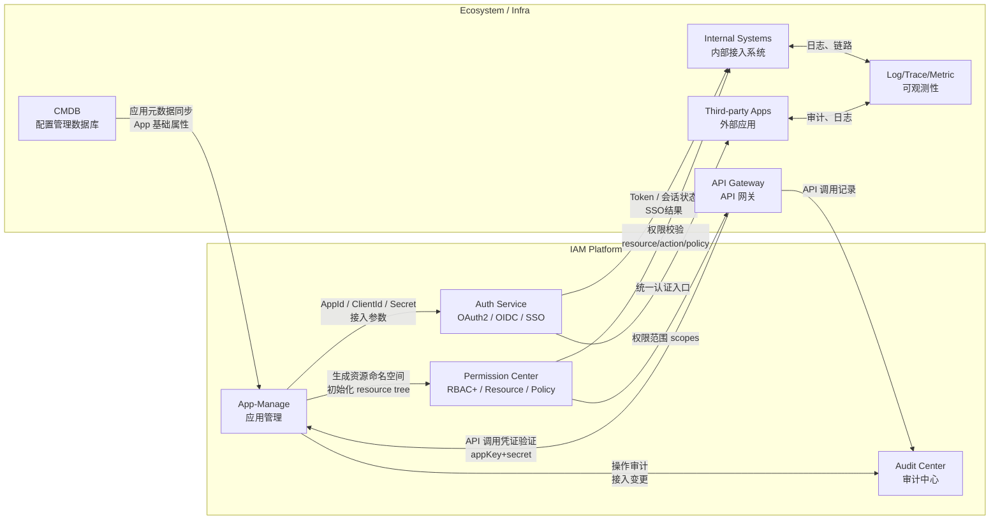
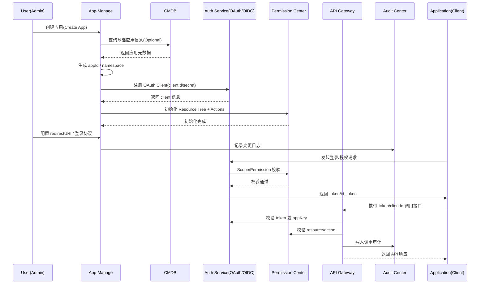

# 企业级 IAM 平台中的 App-Manage 其他系统的关系拓扑图（mermaid）+调用关系流程图

下面提供两部分内容，均为 **可直接使用的 mermaid 图**：

1. **企业级 IAM 平台中 App-Manage 与其他系统的关系拓扑图（系统视角）**
2. **App 注册 → 接入 → 使用 的调用关系流程图（时序图）**

整体设计对标大型企业 IAM 架构（Okta/AzureAD/阿里内部体系）。

---

# 一、企业级 IAM 平台 — App-Manage 与其他系统关系拓扑图（mermaid）

此图展示 App-Manage 在企业数字基础设施中的**核心地位与左右协同关系**。



---

# 二、App 生命周期调用关系（从创建到调用 API）

本图涵盖：
**App 创建 → OAuth 注册 → 权限初始化 → 接入 → 调用网关/API → 审计全链路**



---

# 三、图解说明（便于你在文档或设计中使用）

## （1）App-Manage 是企业内部所有系统的“注册中心”

它负责：

* App 的唯一身份（appId）
* OAuth client（clientId/secret）
* 权限 namespace 根节点
* 审计主键

所有系统必须在这里注册才能使用 IAM。

---

## （2）App-Manage 与 CMDB 的关系

CMDB 不提供 token、接入、权限信息。
仅提供：

* 应用基础元数据
* 部门、负责人、环境信息

IAM 再基于此建立“接入模型”。

---

## （3）App-Manage 驱动权限中心构建资源体系

每一个应用对应一个独立命名空间：

```
appId  
    ├── module  
    │     ├── resource  
    │     ├── action  
    │     └── data-scope
```

应用创建后自动初始化，避免权限命名混乱。

---

## （4）API 网关与 App-Manage 深度绑定

API Gateway 是 App 身份认证的最终落地点：

* 验证 clientId/secret
* 验证 scope
* 输出审计/调用链路

这个部分是 IAM × API Gateway 打通的关键价值。

---

## （5）审计中心贯穿全流程

App-Manage 的每一次变更、每一次调用都会落入审计中心，用于：

* 风险监控
* 追溯
* 调用链分析（与 Trace/Metric 配合）


* any list
{:toc}