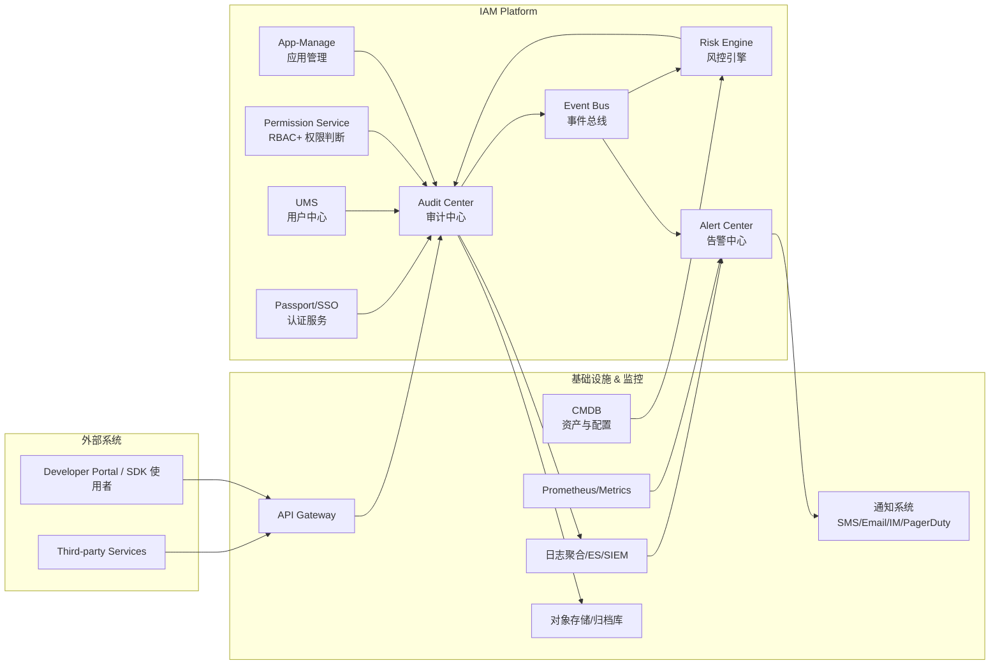
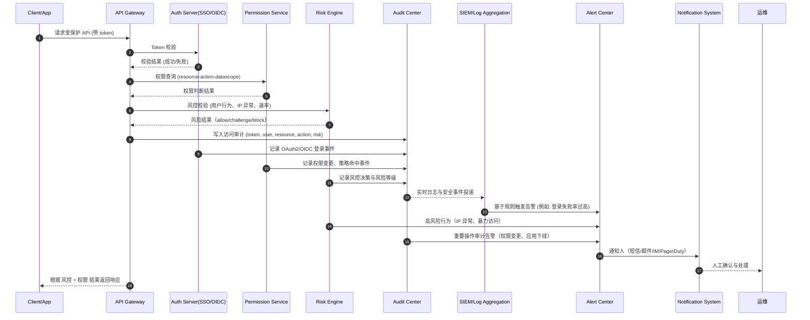

# 企业级 IAM 平台中的 审计中心 其他系统的关系拓扑图（mermaid）+调用关系流程图。可以包含风控、告警体系

下面为你提供 **企业级 IAM 平台中的“审计中心（Audit-Center）”与其他系统的关系拓扑图（Mermaid）+ 调用关系流程图（Mermaid）**。

图中包含风控、告警体系、IAM 核心模块、基础设施与外部系统，结构完整、可直接用于技术文档。

---

# 一、关系拓扑图（Audit-Center 中心化审计架构）

**拓扑说明（核心职责链条）**

* **Audit Center = IAM 全链路事实记录源（Source of Truth for Activities）**

  * 管理面审计：用户/管理员对应用、角色、权限、凭证等的所有操作。
  * 运行面审计：API Gateway、SSO、权限判断、风控决策等产生的实时访问记录。
* **上游发送事件者**：SSO、Perm、UMS、App-Manage、风控、API-Gateway。
* **下游消费者**：SIEM（安全审计）、日志系统、风控引擎（用于二次风险推断）、告警中心（实时告警）、审计归档系统。

---

# 二、审计中心调用关系流程图

以下序列图模拟 **用户通过业务系统访问受保护资源 → IAM 认证授权 → 审计 → 风控 → 告警** 的完整链路。

---

# 三、核心体系结构要点（整理自大厂 IAM、合规、风控体系最佳实践）

## 1. Audit Center 的数据模型要包含

* request_id / trace_id
* subject（用户、client_id）
* action（登录、访问、修改、审批、授权、风控判定）
* resource（资源标识）
* outcome（成功/失败/拒绝）
* risk_score / risk_reason
* ip、ua、location
* 请求耗时、权限策略版本
* 原始上下文（原文请求体/部分字段脱敏）

## 2. 为什么风控必须消费审计事件

* 行为基线模型（行为画像）依赖审计日志
* 异常行为检测：IP 切换、token 重放、速率超标
* 风控决策闭环：审计用于训练与评估策略

## 3. 为什么告警中心必须连接审计中心

* 权限变更、角色变更、敏感操作是一类高风险事件
* OIDC/OAuth 登录失败过高 → 异常
* API Gateway 拒绝大量访问 → 潜在攻击
* 风控 Block 率升高 → 业务流量异常

## 4. 审计中心如何存储数据（强烈推荐分层）

* **热数据**（7~30天）：ES/SIEM（用于实时检索）
* **冷数据**（≥6个月）：对象存储（OSS/S3）
* **合规归档**：WORM / 数据签名（不可篡改）

## 5. 事件规范（企业 IAM 通用 schema）

* 采用 CloudEvents 格式
* 事件总线（Kafka）用于：

  * 权限策略更新
  * 凭证旋转
  * 风控策略下发
  * 应用注册变更
  * 登录/授权事件广播

* any list
{:toc}