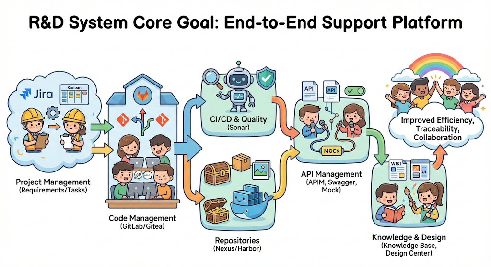

## 2. 研发体系（Dev）整体设计



### 2.1 核心目标

研发体系旨在构建一个全链路的研发支持平台，覆盖 **代码管理 → 构建/质量 → 仓库管理 → API管理 → 知识管理 → 项目管理** 的全流程，提高研发效率、可追溯性和协作体验。

### 2.2 子系统及功能

| 子系统                             | 功能描述                            | 核心交互/集成点                                           |
| ------------------------------- | ------------------------------- | -------------------------------------------------- |
| **GitLab / Gitea（代码库）**         | 提供版本控制、分支管理、代码审查、CI/CD 触发点      | 与 CI/CD、Sonar、Nexus/Harbor、APIM 集成，支持 webhook 自动触发 |
| **Sonar（代码质量）**                 | 静态代码分析、质量指标监控、技术债务评估            | 与 GitLab/Gitea 集成，PR 提交自动扫描，生成质量报告                 |
| **Nexus（包仓库）**                  | 存储 Maven/Gradle/npm 等包文件，统一依赖管理 | 与 CI/CD 集成，构建产物自动上传；支持安全扫描                         |
| **Harbor（镜像仓库）**                | 存储和管理容器镜像，支持镜像版本管理和安全扫描         | 与 CI/CD、Kubernetes 集成；支持镜像自动拉取和发布                  |
| **Swagger / Knife4j（API 文档平台）** | API 文档展示、接口调试、SDK 生成            | 与 APIM 集成，自动同步 API 定义；支持前后端对接                      |
| **APIM（API 生命周期管理）**            | API 注册、版本管理、审批发布、权限控制           | 与 Swagger/Knife4j、Mock 平台、CI/CD 流程集成               |
| **Mock 平台**                     | 提供接口模拟服务，支持前端/测试独立开发            | 与 Swagger/Knife4j、APIM 集成，可基于 API 定义自动生成 Mock 数据   |
| **研发知识库（语雀 / Wiki）**            | 文档协作、研发规范、架构设计、问题沉淀             | 与项目管理平台、设计中心集成，支持知识搜索与引用                           |
| **设计中心（原型 / UI）**               | 原型设计、UI 组件库、交互规范                | 与研发知识库、前端开发集成，支持自动导出设计规范                           |
| **项目管理平台（需求/任务/迭代）**            | 需求管理、任务分配、迭代计划、看板管理             | 与 GitLab/Gitea、CI/CD、研发知识库集成，实现全流程追踪               |

---

### 2.3 子系统间交互示意

```
需求/任务 → 项目管理平台 → GitLab/Gitea
                 │
                 ▼
           CI/CD 流程
                 │
     ┌───────────┴───────────┐
     ▼                       ▼
Sonar 质量分析           Nexus/Harbor 构建产物管理
     │                       │
     ▼                       ▼
APIM ← Swagger/Knife4j → Mock 平台
                 │
                 ▼
            前端/测试使用
                 │
                 ▼
研发知识库 ←→ 设计中心
```

* **重点流程**：

  * 开发提测流程：开发在 GitLab/Gitea 提交 → Sonar 分析 → 构建产物上传 Nexus/Harbor → APIM 发布 API → 前端/测试使用 Mock → 迭代反馈至项目管理平台。
  * 文档流程：设计中心原型/组件 → 输出规范 → 存入研发知识库 → 项目管理平台任务引用 → 开发使用。

---

### 2.4 现代化设计要点

1. **可视化**：看板、仪表盘、质量分析报告、构建状态、API 调用统计。
2. **统一入口**：提供研发门户，将 Git、文档、设计、API、任务集中访问。
3. **自动化**：

   * 代码提交 → 自动触发质量扫描、构建、包/镜像发布。
   * API 定义 → 自动生成 Mock 和文档。
4. **权限与审计**：统一身份认证（SSO/Passport），不同角色可访问不同模块。
5. **协作体验**：文档、设计和任务打通，实现“知识即工作流”的理念。

---

如果你愿意，我可以帮你画一张 **MVE 研发体系可视化 Landpage 交互原型**，把这些子系统的交互关系、数据流和功能入口可视化，并带现代化科技感的 UI 设计风格。

你希望我直接画这个原型吗？


* any list
{:toc}