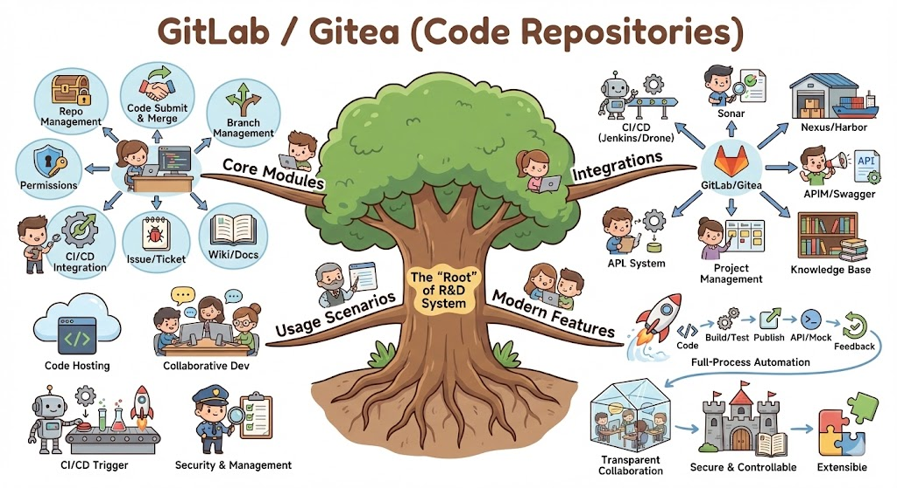

## 🟧 GitLab / Gitea（代码库）详细介绍

### 1. 定位

GitLab 和 Gitea 是企业研发体系中的 **核心版本控制平台**，提供源代码管理、分支管理、协作开发和 CI/CD 触发入口。
它们是研发体系的“根”，其他系统如 CI/CD、包仓库、质量扫描、API管理都围绕它展开。

* **GitLab**：功能全面，支持内置 CI/CD、项目管理、Issue、Wiki、代码审查、权限管理等，适合中大型团队。
* **Gitea**：轻量化、开源，易于部署，适合小型团队或追求低运维成本的场景。

---

### 2. 核心功能模块

| 模块                 | 功能说明                                      | 典型使用场景                                 |
| ------------------ | ----------------------------------------- | -------------------------------------- |
| **仓库管理**           | Git 仓库创建、访问控制、分支策略管理                      | 控制代码版本、分支策略（如保护分支）                     |
| **代码提交与合并**        | 提交历史管理、合并请求（Merge Request / Pull Request） | 代码协作、评审、变更追踪                           |
| **分支管理**           | 支持主分支、开发分支、功能分支、热修复分支等                    | 支持 GitFlow、Trunk Based Development 等流程 |
| **权限控制**           | 用户/组/项目权限分配，支持细粒度访问控制                     | 安全访问管理，限制敏感代码操作                        |
| **CI/CD 集成**       | GitLab 内置 CI/CD，Gitea 可配合 Jenkins/Drone 等 | 自动化构建、测试、部署                            |
| **Web IDE / 在线编辑** | 提供在线编辑、浏览仓库文件                             | 快速修改小问题，协作演示                           |
| **Issue / Ticket** | 任务管理、Bug 跟踪、需求记录                          | 与项目管理平台或 Jira 对接                       |
| **Wiki / 文档**      | 项目内文档管理                                   | 存储设计文档、使用指南                            |
| **审计与日志**          | 操作记录、变更日志、Webhook 触发记录                    | 代码安全与合规追踪                              |

---

### 3. 企业研发中的使用场景

1. **代码托管**

   * 所有业务代码、微服务、工具脚本统一托管。
   * 支持多语言项目和多仓库管理。

2. **协作开发**

   * 开发人员基于分支开发功能，提交合并请求，进行代码审查。
   * 审查通过后自动合并主分支。

3. **CI/CD 自动化触发**

   * 每次提交触发自动化构建 → 测试 → 静态代码分析 → 发布包/镜像。
   * 通过 webhook 触发 Sonar、Nexus、Harbor、APIM 等下游系统。

4. **权限与安全管理**

   * 不同团队和角色有不同的访问权限。
   * 支持审核、审计日志记录和敏感操作提醒。

5. **项目管理和知识协同**

   * 通过 Issue 记录需求、任务和 Bug，支持迭代计划。
   * Wiki 存储开发文档、使用规范和最佳实践。

---

### 4. 与其他研发体系组件的集成

| 集成对象                                   | 集成方式                  | 作用               |
| -------------------------------------- | --------------------- | ---------------- |
| **CI/CD（Jenkins / GitLab CI / Drone）** | Webhook、GitLab Runner | 自动化构建、测试、部署      |
| **Sonar**                              | Merge Request Hook    | 提交代码自动触发质量分析     |
| **Nexus / Harbor**                     | CI/CD 上传              | 构建产物和镜像发布管理      |
| **APIM / Swagger**                     | Webhook / API         | API 定义、版本管理触发    |
| **项目管理平台**                             | API / Webhook         | Issue 与任务同步、迭代追踪 |
| **研发知识库**                              | Git 仓库引用 / Webhook    | 文档管理、知识沉淀        |

---

### 5. 现代化研发体系中的特点

1. **全流程自动化**
   代码提交 → 自动触发构建/测试/扫描 → 发布包/镜像 → API 发布/Mock → 反馈到项目管理平台。

2. **协作透明**
   代码审查、合并请求、Issue 状态全透明，研发可追踪。

3. **安全可控**
   权限控制、分支策略、操作审计保证代码安全。

4. **可扩展**
   可通过插件/集成扩展功能，如自动生成 API 文档、触发 Mock 平台。

* any list
{:toc}