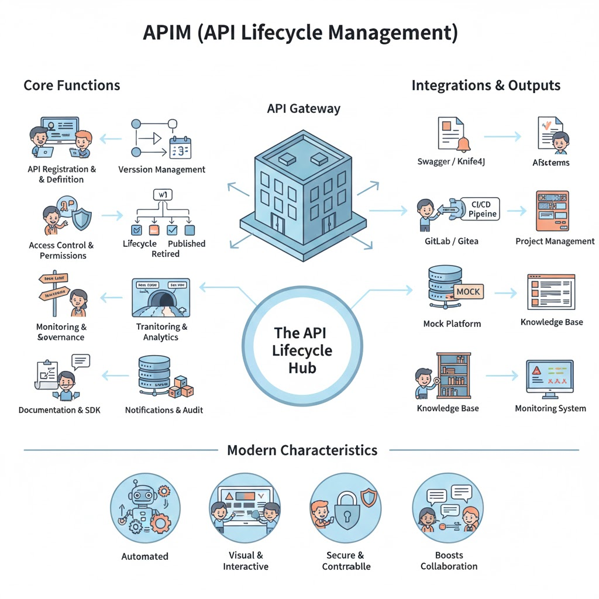

## APIM（API 生命周期管理）详细介绍

### 1. 定位

APIM（API Management，API 生命周期管理平台）是企业研发体系中的 **API 全生命周期管理中枢**，负责管理 API 的注册、发布、版本控制、权限、安全、监控和治理。

* **核心价值**：

  * 将接口从开发到测试再到发布形成闭环管理。
  * 支持统一的 API 规范、访问控制和监控，保证企业接口治理可控。
  * 提升 API 的复用性、安全性和可观测性。

* **适用场景**：

  * 多微服务企业架构，需要统一管理服务接口。
  * 对外提供开放 API，需要授权、流量控制和安全管理。
  * 内部服务治理和 API 质量管控。

---

### 2. 核心功能模块

| 模块             | 功能说明                                              | 使用场景               |
| -------------- | ------------------------------------------------- | ------------------ |
| **API 注册与定义**  | API 创建、定义路径、请求/响应参数、协议类型（REST、GraphQL、gRPC）       | 新服务或接口上线前注册 API    |
| **版本管理**       | 支持 API 多版本管理、版本兼容策略                               | API 升级、回滚、维护历史版本   |
| **生命周期管理**     | Draft → Review → Published → Deprecated → Retired | 管理 API 从设计到退役的完整流程 |
| **权限与访问控制**    | 用户/角色/团队访问权限、OAuth2/Key/Token 等                   | 对内/对外接口授权、权限控制     |
| **流量管理**       | 限流、熔断、重试、负载均衡                                     | 保证 API 服务稳定性和安全性   |
| **监控与分析**      | 接口调用量、响应时间、错误率、健康状况                               | 提供 API 使用统计和性能监控   |
| **安全治理**       | API 防火墙、签名验证、敏感数据脱敏                               | 防止恶意调用和数据泄露        |
| **文档与 SDK 集成** | 自动同步 Swagger/Knife4j 文档，生成 SDK                    | 支持前端/第三方快速对接       |
| **Mock 服务**    | 提供 API Mock 功能                                    | 前端/测试可并行开发，不依赖真实后端 |
| **通知与审计**      | 生命周期变更、发布通知、操作日志                                  | 支持审计、合规和团队协作       |

---

### 3. 企业研发中的使用场景

1. **内部 API 治理**

   * 将所有微服务接口统一注册到 APIM，管理版本、权限和调用策略。
   * 保证团队间接口调用标准化。

2. **API 对外开放**

   * 企业向合作方或第三方开放 API 时，通过 APIM 控制授权、限流、访问日志。
   * 统一发布门户，便于合作方快速使用。

3. **开发与测试支持**

   * Mock API 提供给前端和测试并行开发。
   * 自动生成 SDK 和文档，减少重复工作。

4. **监控与优化**

   * 实时统计接口调用情况，发现性能瓶颈或异常。
   * 支持质量门控制，避免劣质 API 发布。

5. **生命周期管控**

   * API 从设计到退役有明确流程，保证企业接口健康与可维护性。
   * 版本管理支持兼容旧系统调用。

---

### 4. 与其他研发体系组件的集成

| 集成对象                                   | 集成方式                     | 作用                    |
| -------------------------------------- | ------------------------ | --------------------- |
| **Swagger / Knife4j**                  | API 定义同步                 | 文档自动导入，保证接口定义一致       |
| **GitLab / Gitea**                     | CI/CD Pipeline / Webhook | 开发提交触发 API 发布或版本更新    |
| **Mock 平台**                            | 自动生成 Mock                | 提供前端/测试并行开发支持         |
| **CI/CD（Jenkins / GitLab CI / Drone）** | 构建触发                     | 构建完成后自动更新 API 注册或发布状态 |
| **项目管理平台**                             | API 发布任务关联               | API 生命周期状态与迭代任务同步     |
| **研发知识库**                              | 文档引用                     | API 设计规范、使用指南沉淀到知识库   |
| **监控系统**                               | 日志采集/指标采集                | API 调用统计、性能监控和异常告警    |

---

### 5. 现代化研发体系中的特点

1. **全生命周期管理**

   * 从 API 设计、开发、测试、发布到退役，形成闭环管理。
   * 生命周期状态透明，支持团队协作和审计。

2. **自动化与标准化**

   * 文档、Mock、SDK 自动生成。
   * 与 CI/CD 流程联动，实现 API 发布自动化。

3. **安全可控**

   * 支持权限控制、访问限制、限流、审计，保障内部和对外接口安全。

4. **可观测性**

   * 提供调用统计、响应时间、错误率等指标。
   * 支持性能优化和质量追踪。

5. **团队协作增强**

   * 与项目管理、研发知识库、文档平台紧密结合。
   * API 状态可追踪，减少沟通成本和重复开发。

* any list
{:toc}