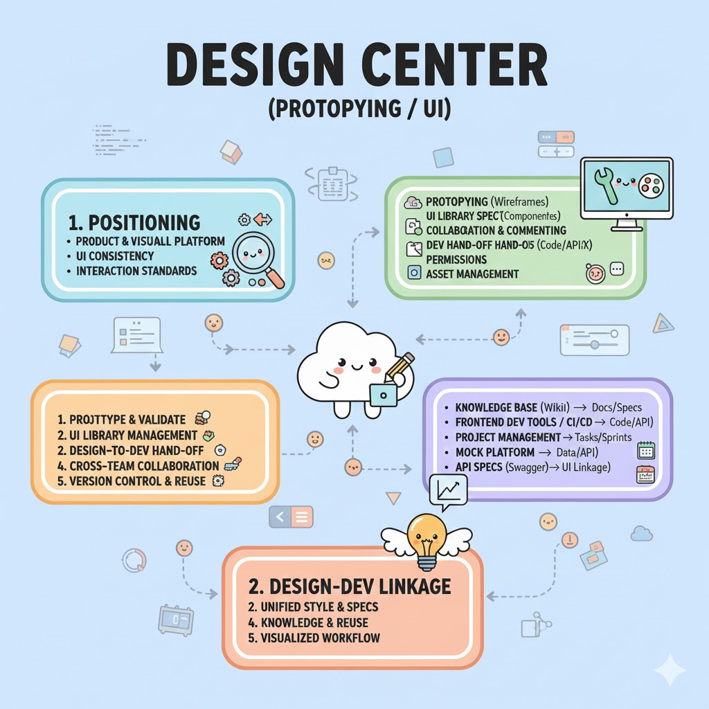

## 设计中心（原型 / UI）详细介绍

### 1. 定位

设计中心是企业研发体系中的 **产品与视觉设计协作平台**，主要负责 **原型设计、UI 组件管理、交互规范制定**。它是前端开发和产品研发的设计源头，确保界面风格统一、交互标准化，并支持设计输出直接与开发对接。

* **核心价值**：

  * 统一企业 UI 风格和交互规范。
  * 支持前端开发快速引用设计规范和组件。
  * 提高产品研发协作效率，减少前后端反复沟通。

* **适用场景**：

  * 产品原型设计和迭代。
  * UI 组件库管理和规范输出。
  * 多团队协作和设计输出落地。

* **常用工具**：

  * **Figma / Sketch / Adobe XD**：设计与原型工具。
  * **蓝湖 / Zeplin / Ant Design Pro 设计中心**：用于设计交付和前端对接。
  * **企业内部设计中心**：自研或定制化设计协作平台。

---

### 2. 核心功能模块

| 模块           | 功能说明                        | 使用场景                |
| ------------ | --------------------------- | ------------------- |
| **原型设计**     | 支持低/中/高保真原型绘制               | 产品设计阶段验证功能流程、交互逻辑   |
| **UI 组件库管理** | 统一企业视觉风格、颜色、图标、按钮、表单等组件     | 前端开发直接复用组件，保证 UI 统一 |
| **设计规范输出**   | 生成交互规范文档、样式指南               | 前端开发快速对接，减少设计与开发差异  |
| **协作与评论**    | 多人协作设计、评论和版本追踪              | 跨团队沟通设计细节，减少沟通成本    |
| **版本管理**     | 设计稿历史记录、迭代版本管理              | 保留设计演进轨迹，支持回滚或复用    |
| **开发交付**     | 导出 CSS、JSON、SVG、代码片段或对接前端框架 | 设计稿直接可落地，提高开发效率     |
| **权限管理**     | 用户/团队访问控制                   | 控制敏感设计稿和组件库访问权限     |
| **设计与项目关联**  | 与任务、迭代和文档绑定                 | 保证设计与开发流程同步         |
| **资产管理**     | 图标、图片、字体等资源管理               | 保证设计素材统一管理和复用       |

---

### 3. 企业研发中的使用场景

1. **原型设计与验证**

   * 产品经理绘制功能原型，团队评审交互流程。
   * 提前发现用户体验或交互问题。

2. **UI 组件库管理**

   * 维护统一组件库，前端可直接复用组件，提高开发效率。
   * 支持响应式设计、多主题管理。

3. **设计交付给开发**

   * 将设计稿输出为可用代码片段或规范文档，减少前端实现偏差。

4. **跨团队协作**

   * 设计师、产品、前端、测试在设计中心协作，实时评论和修订设计。
   * 支持任务或迭代关联，保证设计与项目进度同步。

5. **版本控制与复用**

   * 保留设计稿历史版本，支持复用或快速回滚。
   * 组件库版本化支持多产品线统一风格。

---

### 4. 与其他研发体系组件的集成

| 集成对象                         | 集成方式         | 作用                        |
| ---------------------------- | ------------ | ------------------------- |
| **研发知识库（语雀 / Wiki）**         | 文档/规范引用      | 设计规范、UI 指南沉淀到知识库，形成标准化资料  |
| **前端开发工具 / CI/CD**           | 代码片段或 API 导出 | 设计稿可直接转换为前端可用样式或组件，提高落地效率 |
| **项目管理平台**                   | 任务/迭代关联      | 原型、设计稿和开发任务绑定，实现流程闭环      |
| **Mock 平台**                  | 原型输出或接口示例    | 根据设计原型生成前端 Mock 数据或接口展示   |
| **Swagger / Knife4j / APIM** | UI 与接口联动     | 根据接口数据生成交互界面或动态组件         |

---

### 5. 现代化研发体系中的特点

1. **设计与开发联动**

   * 原型和 UI 组件直接可落地，减少前端实现偏差。

2. **统一风格与规范**

   * 企业统一视觉风格、交互规范和组件库，保证产品一致性。

3. **协作高效**

   * 多角色协作，支持评论、迭代和版本追踪。

4. **知识沉淀与复用**

   * 设计规范、组件库、原型模板可复用，支持跨项目和团队。

5. **可视化管理**

   * 设计中心可与项目管理、Mock 平台、知识库联动，形成完整研发可视化流程。

* any list
{:toc}