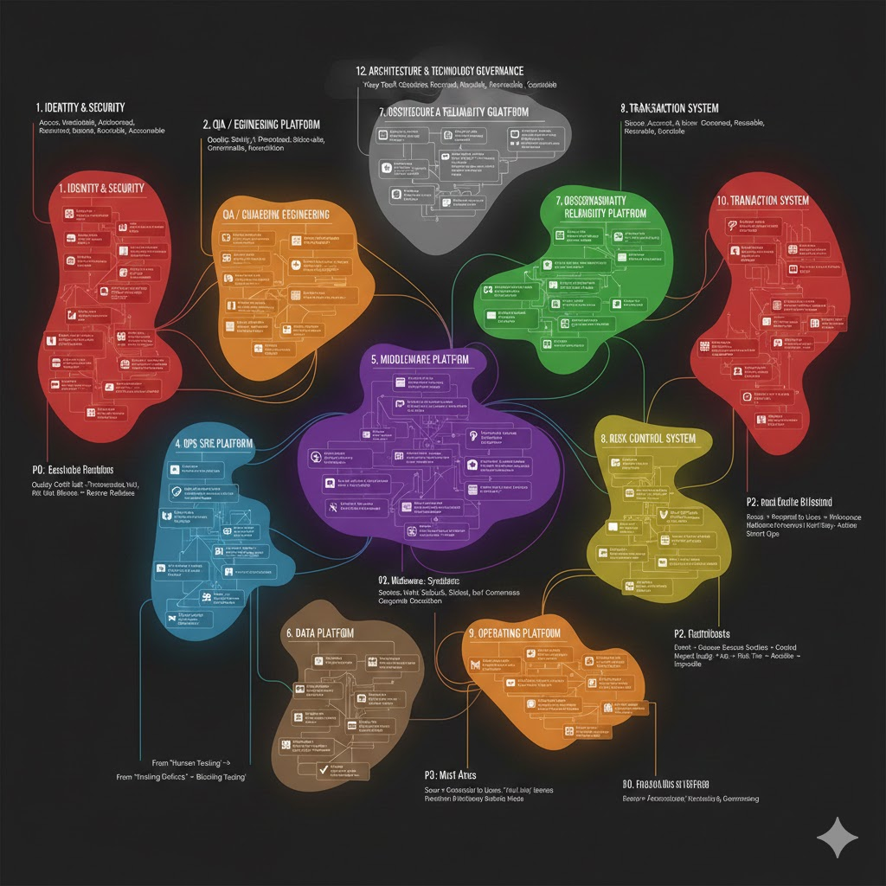

# 系统全景图

按照优先级罗列出对应的系统全景图



```
业务 & 平台能力
├── 1. 研发体系（Dev）
├── 2. 测试体系（QA）
├── 3. 运维体系（Ops）
├── 4. 中间件体系
├── 5. 数据体系
├── 6. 监控与可观测性
├── 7. 风控体系
├── 8. 交易体系
├── 9. 运营体系
├── 10. 身份与安全体系

横向治理 & 战略能力
├── 11. 架构与技术治理
├── 12. 平台治理 / 开发者生态
├── 13. 成本与资源治理（FinOps）
├── 14. 合规与风险治理（GRC）
```

# 🟥 1. 身份与安全体系（Identity & Security）

> 目标：任何人 / 系统 / 服务的任何访问，都可识别、可授权、可审计、可追责

```
P0（身份访问）
├── UMS（用户中心）
├── Passport（认证 / Token）
├── SSO
├── IAM 权限中心（RBAC / ABAC）

P1（身份治理）
├── 身份治理 IGA
├── 审计系统
├── 跳板机 / 堡垒机

P2（数据 & 风险）
├── 数据脱敏平台
├── 安全平台（风控 / 入侵检测）
├── 访问风控 / 风险引擎

P3（零信任 & 密钥）
├── Zero Trust 平台
├── HSM / KMS
├── Secrets 管理
```

# 🟧 2. 研发体系（Dev / Engineering Platform）

> 目标：让研发活动“可协作、可规范、可复用、可规模化”

```
P0（研发基础）
├── 代码库（GitLab / Gitea）
├── 项目管理（需求 / 任务 / 迭代）
├── 包仓库（Nexus）
├── 镜像仓库（Harbor）

P1（质量规范）
├── 代码质量（Sonar）
├── API 文档（Swagger / Knife4j）
├── Mock 平台

P2（工程协同）
├── API 生命周期管理（APIM）
├── 研发知识库（Wiki）
├── 设计中心（原型 / UI）
├── CI / 构建平台

P3（工程资产化）
├── 工程模板 / 脚手架
├── 代码资产复用
├── 研发效能度量
```


# 🟩 3. 测试体系（QA / Quality Engineering）

> 目标：让质量前移、让缺陷止于发布之前

```
P0（测试基础）
├── 测试平台
├── 测试用例管理
├── 测试环境管理

P1（自动化）
├── 自动化测试（API / UI / E2E）
├── 测试数据平台
├── Mock / 虚拟服务

P2（规模化）
├── 性能 / 全链路压测
├── 缺陷管理 & 质量分析
├── 测试左移 / 右移

P3（质量工程）
├── 灰度实验 / A/B 测试
├── 质量度量 & 门禁
├── 测试资产复用
```

从“人来测” → “系统持续测”

从“发现缺陷” → “阻断风险”


# 🟦 4. 运维体系（Ops / SRE Platform）

> 目标：让系统“可发布、可回滚、可治理、可恢复”

```
P0（基础运维）
├── CMDB
├── 容器平台（K8s）
├── 发布平台
├── 配置中心

P1（稳定运行）
├── 服务治理（Service Mesh / Dubbo / SpringCloud）
├── 作业调度（XXLJob）
├── 运维工具集

P2（事件驱动）
├── 事件中心（告警 / 事件 / 变更）
├── 灰度平台（Feature Flag）
├── 变更管理平台

P3（可靠性工程）
├── 自动化运维 / 自愈
├── 容量 & 成本管理
├── 运维审计 / 合规
```

# 🟪 5. 中间件体系（Middleware Platform）

> 目标：为业务系统提供统一、稳定、高可用、可治理的基础运行能力

```
P0（运行基础）
├── 网关（Kong / APISIX）
├── 配置中心（Nacos）
├── RPC 平台（Dubbo）
├── 数据存储（MySQL / PostgreSQL / Mongo）

P1（解耦与性能）
├── MQ（Kafka / RabbitMQ）
├── 缓存平台（Redis / Memcached）
├── 搜索（Elasticsearch）
├── 文件存储（MinIO）

P2（治理与稳定）
├── 缓存失效监控 & 一致性
├── 任务调度（Airflow / XXLJob）
├── 中间件监控与告警

P3（平台化）
├── 中间件统一管控台
├── 多租户 / 资源隔离
├── 成本 & 容量管理
```

中间件体系的本质不是“技术选型”，而是“运行能力抽象”：

# 🟫 6. 数据体系（Data Platform）

> 目标：让数据从“可采集”→“可信”→“可复用”→“可决策”

```
P0（数据基础）
├── 数据采集 / 埋点体系
├── 数据中台（数据湖 / 数据仓库）
├── ETL / ELT 平台（Airflow）

P1（数据可信）
├── 元数据平台（Data Catalog）
├── 指标平台
├── 数据质量平台（DQ）

P2（数据服务）
├── 数据 API 平台
├── 报表平台（BI）
├── 数据可视化平台

P3（数据资产化）
├── 数据资产管理
├── 数据权限与安全治理
├── 特征平台（Feature Store）
```

# 🟩 7. 监控体系（Observability / Reliability Platform）

> 目标：看到异常” → “定位问题” → “持续可靠性治理

```
P0（可观测基础）
├── Metrics（Prometheus）
├── Logging（ELK / Loki）
├── Tracing（Jaeger / Zipkin）
├── Error Tracking（Sentry）

P1（定位与响应）
├── 秒级大盘（Grafana）
├── 告警平台
├── 事件中心（Incident）

P2（可靠性治理）
├── SLA / SLO 评估平台
├── StatusPage
├── 变更 / 发布关联分析

P3（智能化）
├── RCA 根因分析系统
├── 拓扑感知 / 依赖图
├── 智能异常检测（AIOps）
```

看见信号 → 定位问题 → 控制影响 → 复盘改进 → 可靠性提升

# 🟨 8. 风控体系（Risk Control System）

> 目标：在不明显伤害体验的前提下，降低系统性风险、业务欺诈与合规风险

```
P0（基础防线）
├── 黑白名单
├── 规则引擎
├── 反作弊 / 限流 / 防刷

P1（实时识别）
├── 事件追踪
├── 行为识别
├── 设备指纹

P2（业务风控）
├── 交易风控
├── 内容风控
├── 风险评分 & 决策中心

P3（进化与合规）
├── 策略编排引擎
├── 风控模型平台
├── 风控审计 / 复盘
```

事件进来 → 特征抽取 → 规则/模型判断 → 风险分级 → 动作执行 → 可回溯

# 🟧 9. 运营体系

> 原则：看得见用户 + 能回应用户” → 再“能影响用户行为” → 最后“精细化、智能化运营

```
P0（必须）
├── 用户反馈平台
├── 客服 / 工单系统
├── 消息 / 通知中心

P1（基础运营）
├── 内容管理平台（CMS）
├── 用户画像 & 标签平台
├── 活动平台

P2（增长驱动）
├── 用户增长平台
├── 数据分析 / 运营分析
├── A/B 测试平台

P3（成熟体系）
├── CRM
├── 用户社区
├── 运营自动化编排
```

感知用户 → 理解用户 → 影响用户 → 验证效果 → 再优化

# 🟥 10. 交易体系（Transaction System）

> 目标：安全、准确、可追溯、可扩展地完成资金与价值交换

```
P0（交易内核）
├── 订单体系
├── 支付接入层
├── 账户体系（资金 / 冻结 / 积分）
├── 交易 & 账务流水

P1（规模化）
├── 清结算系统
├── 对账系统
├── 出款 / 代付
├── 费率体系

P2（风控 & 商户）
├── 商户管理平台
├── 商户风控 / 商户账单
├── 交易风控系统

P3（金融级）
├── 账单系统（Billing）
├── 财务 / 会计接口
├── 资金审计 & 监控
```


# 11. 架构与技术治理（Architecture & Technology Governance）

> 目标：“关键技术决策有记录、可复用、可演进、不失控”

```
P0（决策可控）
├── ADR 架构决策记录
├── 技术选型白/黑名单
├── 架构评审机制

P1（一致性）
├── 微服务拆分规范
├── API 设计治理
├── 架构蓝图 / 系统地图

P2（复杂度治理）
├── 技术债管理
├── 架构复杂度指标
├── 一致性扫描

P3（平台化）
├── 架构资产库
├── 技术雷达
├── 架构度量反馈
```


# 12. 平台治理 / 开发者生态（Platform Governance & Developer Ecosystem）

> 目标：“对内像产品，对外像平台；可发现、可使用、可计量、可演进”

```
P0（可用）
├── 开发者门户
├── 平台接入与授权
├── API / 服务目录

P1（可规范）
├── 接入规范与最佳实践
├── SDK / Client 管理
├── 平台支持 / 服务台

P2（可度量）
├── 使用度量 / 可观测性
├── 成本归因 / 内部计费
├── 资产复用分析

P3（可演进）
├── 平台能力市场
├── 版本与弃用治理
├── DevEx 反馈与共建
```

# 13. 成本与资源治理（FinOps / Cost & Resource Governance）

> 目标：谁在用、用多少、值不值，都说得清

```
P0（可见 / 可归因）
├── 成本可视化平台
├── 成本归因模型
├── 资源标签治理

P1（可控 / 可优化）
├── 浪费识别
├── 弹性与容量管理
├── 预算与告警

P2（可预测 / 可约束）
├── 成本预测
├── 配额与策略
├── 内部计费

P3（驱动决策）
├── 架构成本评估
├── 优化建议引擎
├── 成本与业务价值关联
```

# 14. 合规与风险治理（GRC：Governance, Risk & Compliance）

> 目标：合规可证明，风险可识别，责任可追溯

```
P0（制度与责任）
├── 合规框架 / 制度库
├── 资产与责任台账
├── 权责与内控模型

P1（风险识别）
├── 风险识别与分级
├── 风险台账
├── 第三方风险管理

P2（控制与审计）
├── 内控措施库
├── 审计与证据管理
├── 违规与事件响应

P3（持续治理）
├── 合规自动化
├── 风险持续监控
├── 合规成熟度评估
```

* any list
{:toc}