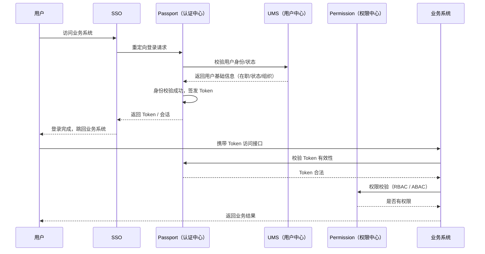
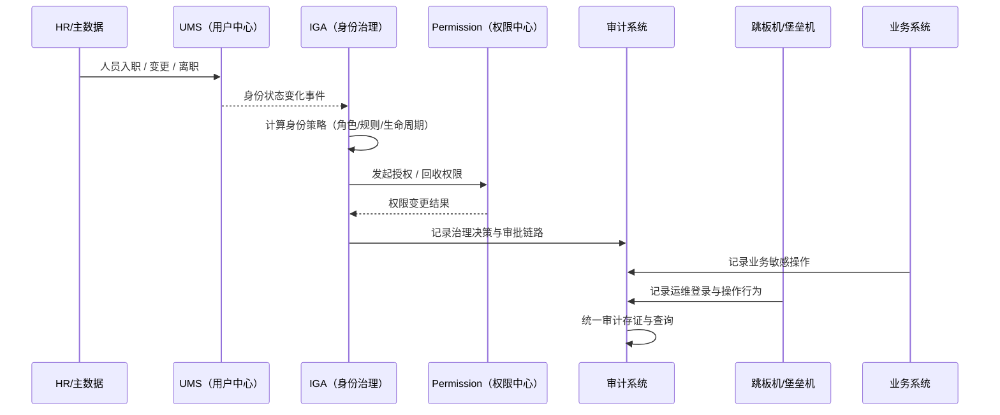

# 时序图

## P0｜身份访问（Identity Access）

> 关注点：
> **人 → 能不能进 → 进来之后能干什么**

## P1｜身份治理（Identity Governance）

> **这些身份和权限，是怎么来的、该不该存在、能不能解释**

# 关系

很多团队一开始，其实只关心一件事：
**“人能不能进系统。”**

账号能不能登录，
Token 发不发得出来，
接口是不是被拦住了。

这就是**身份访问（Identity Access）**。

它解决的是一个非常当下的问题：

> **现在这一刻，放不放行。**

---

身份访问的世界里，
时间是“即时”的。

你点登录，
系统就得给答案。
对就是对，
错就是错，
不能模糊。

所以这一层的系统通常都很“硬”：

* SSO
* Passport
* 权限校验
* Token、Session

它们不太关心历史，
也不擅长解释，
它们只负责判断。

---

但系统跑久了，
问题会慢慢变味。

你开始被问一些
**不是“现在”的问题**：

* 这个权限当初怎么来的？
* 为什么他调过这个接口？
* 离职那天是不是都回收了？
* 有没有人长期拿着不该有的权限？

这时候你才发现，
**身份访问回答不了这些。**

---

于是就有了**身份治理（Identity Governance）**。

身份治理不着急给结论，
它更在意过程。

它关心的是：

* 身份从哪来
* 权限怎么给
* 规则是不是合理
* 有没有该收却没收的东西

换句话说，
它问的是：

> **这件事，
> 当初为什么这么定？
> 现在还站得住吗？**

---

如果说身份访问像一道闸机，
那身份治理更像账本。

闸机只负责开或关，
账本要记清楚来龙去脉。

你不能指望闸机
帮你解释三个月前的一次放行，
但你一定希望账本里能翻得到。

---

现实里最常见的问题是：
**这两件事混在了一起。**

访问系统被塞进太多治理逻辑，
结果登录越来越慢；
治理系统想在线拦请求，
结果谁都不敢让它挡流量。

最后两边都很别扭。

---

真正舒服的状态反而很简单：

* 身份访问：
  **在线、快速、确定**
* 身份治理：
  **离线、持续、可追溯**

一个负责“此刻”，
一个负责“长期”。

* any list
{:toc}